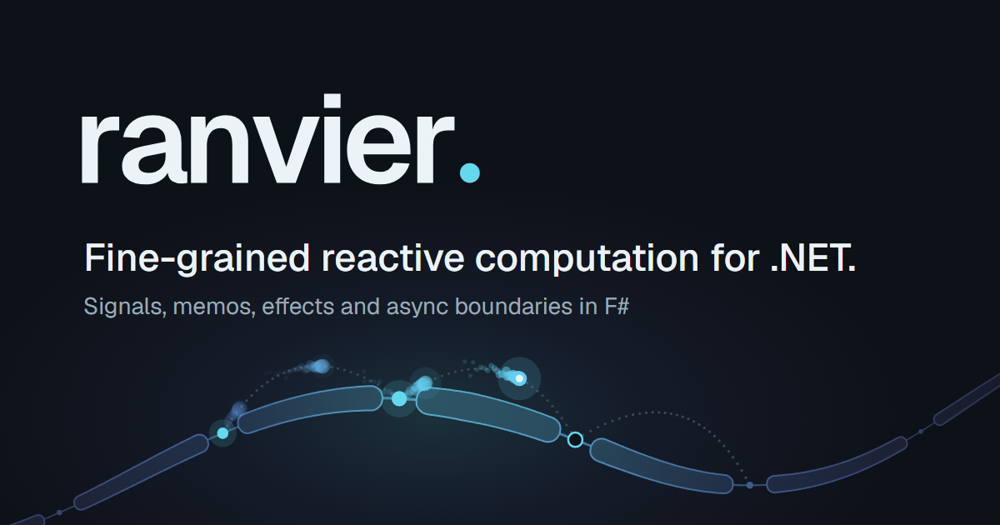

<p align="center">
  
</p>

<p align="center">
  <a href="https://shayanhabibi.github.io/Ranvier/">Documentation</a>
  &middot;
  <a href="https://shayanhabibi.github.io/Ranvier/benchmarks/">Benchmarks</a>
  &middot;
  <a href="LICENSE">MIT License</a>
</p>

> The nodes of Ranvier are the short gaps in the myelin sheath along a nerve fibre, named after the
> French anatomist Louis-Antoine Ranvier. A signal jumps from node to node and is regenerated at each
> one, instead of flowing along every point of the fibre.

> **Preview.** Ranvier is pre-release. Its APIs may change before the first release. Install the preview from NuGet as
> [`Ranvier`](https://www.nuget.org/packages/Ranvier), or [`Ranvier.CSharp`](https://www.nuget.org/packages/Ranvier.CSharp) from C#.
> The Elmish-style MVU bridge ships separately as [`Ranvier.Elmish`](https://www.nuget.org/packages/Ranvier.Elmish).

## Overview

Ranvier builds a graph of signals (settable sources), memos (derived values, recomputed on read once something they read has changed) and effects (side effects the scheduler runs after a change). Async sources carry an explicit Pending state, and boundaries decide where a pending or failed read stops.

From F#, through `Ranvier`:

```fsharp
open Ranvier

use graph = new Graph ()

graph.Run (fun () ->
    let count = createSignal 1
    let doubled = createMemo (fun _ -> count.Value * 2)
    createEffect (fun () -> printfn "doubled = %d" doubled.Value)
    count.Value <- 5)
```

From C#, through `Ranvier.CSharp`:

```csharp
using Ranvier;
using Ranvier.CSharp;
using static Ranvier.CSharp.Reactive;

using var graph = new Graph();

graph.Run(() =>
{
    var count = Signal(1);
    var doubled = Memo(() => count.Value * 2);
    Effect(() => Console.WriteLine($"doubled = {doubled.Value}"));
    count.Value = 5;
});
```

Read the full documentation at **https://shayanhabibi.github.io/Ranvier/**.

## Origin

Ranvier began as experiments in a repository called [Partas.Signals](https://github.com/shayanhabibi/Partas.Signals).

## Build CLI

Every repository task runs through `build.fsx`, a [Partas.Build](https://github.com/shayanhabibi/partas.build)
script, so the tasks are typed, composable and discoverable:

```shell
dotnet fsi build.fsx -- --help
```

| Command | What it does |
|---------|--------------|
| `build` | Restores and builds the source projects |
| `test` | Cleans, then runs the F# (Expecto) and C# (xUnit) suites (`--skip-tests` to skip them) |
| `format` | Formats every source file with Fantomas (`--dry-format` checks instead) |
| `compile` | Compiles the Fable projects to JavaScript (`--watch` to stay resident) |
| `publish` | Builds, tests, packs and pushes to NuGet (`--api-key`, or the `NUGET_API_KEY` env var) |
| `bump` | Bumps the version of a project |
| `docs` | Builds the Nacara site from `docs/docs.fsproj` (`--watch` to serve it) |

Global flags: `--quick` skips restores and cleaning,
`--format` formats before building, `--dry-format` checks formatting before building,
`-c` picks the configuration (default `Release`).

## Layout

```
build.fsx                      the build CLI
src/Ranvier/                   the library
src/Ranvier.CSharp/            the C# façade
src/Ranvier.Elmish/            the MVU bridge (Mvu)
tests/Ranvier.Tests/           the Expecto suite
tests/Ranvier.CSharp.Tests/    the xUnit suite, written in C#
docs/docs.fsproj               the Nacara site (net10.0)
docs/content/                  the pages
```

### Adding a project

The build CLI addresses the repository through `Partas.TypeProvider.BuildHelper`,
so projects are discovered at compile time: anything under `src/` is a source
project, anything under `tests/` is a test project. Add the project to the
solution and it is picked up by `build`, `test`
and `pack`
on the next run.

### Adding a step

A step is a stage of a command. A stage that needs a flag binds it in an
`input { }` block, which is also what puts the flag into `--help`:

```fsharp
let myStep = input {
    let! quick = Options.quick
    return stage "my step" {
        when' (not quick)
        run "dotnet ..."
    }
}
```

Add it to any `command "..." { }` block. Because the condition lives in the
stage, the command carries no flags of its own, and adding the stage to a
second command registers `--quick` there too.

## License

[MIT](LICENSE). Copyright (c) 2026 Shayan Habibi.
