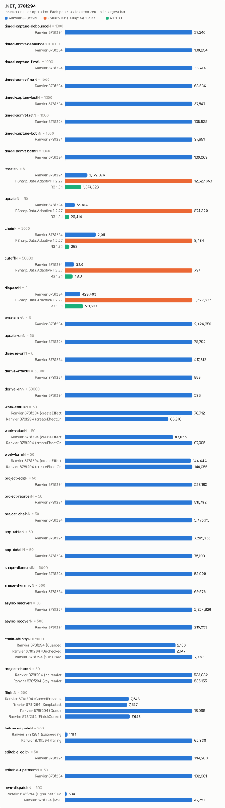
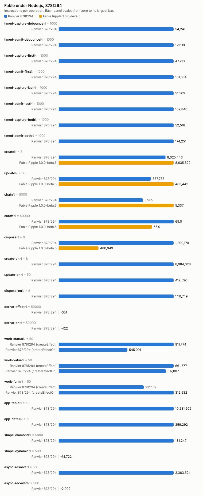

# Counter bench, 878f294

- Date: 2026-10-04 01:24:28Z
- Machine: AMD64 Family 26 Model 68 Stepping 0, AuthenticAMD, 24 logical processors, Microsoft Windows 10.0.26200, .NET 10.0.12
- Instructions: per-context-switch PMC counters (InstructionRetired, TotalCycles, BranchMispredictions)
- Library counters: from a separate RanvierCounters build (--counters-worker)
- Versions: .NET 10.0.12, FSharp.Data.Adaptive 1.2.27, R3 1.3.1, Ranvier 878f294
- Worker environment: DOTNET_TieredCompilation=0 DOTNET_TieredPGO=0 DOTNET_ReadyToRun=0 DOTNET_gcServer=0
- RanvierTrace: false
- Every figure is (m(2N) - m(N)) / N. Processor counters are the median over runs.
- Instruction counts differing by under 5 % are within run-to-run noise. Compare only reports taken at the same --scale.

## Engine differences

- R3 pushes each write straight to its subscribers, without batching or glitch-free ordering. Its chain is `Select` operators holding no cached value.
- FSharp.Data.Adaptive dispose removes the callback subscriptions only. The `AVal.map2` nodes stay in the weak output sets of their `cval`s until collected.

## timed-capture-debounce: capture a changed input in 64 timed nodes (N = 1000)

| Engine | instr/op | cycles/op | br-miss/op | intervals N/2N | bytes/op | objects/op | counters/op |
| --- | ---: | ---: | ---: | ---: | ---: | ---: | --- |
| Ranvier 878f294 | 37,545.85 | 13,732.32 | 2.90 | 2/2 | 0 | 0 | MemoRecomputes 64, Flushes 1 |

## timed-admit-debounce: capture and admit in 64 timed nodes (N = 1000)

| Engine | instr/op | cycles/op | br-miss/op | intervals N/2N | bytes/op | objects/op | counters/op |
| --- | ---: | ---: | ---: | ---: | ---: | ---: | --- |
| Ranvier 878f294 | 108,254.02 | 37,809.16 | 4.74 | 2/2 | 1,536 | 0 | MemoRecomputes 64, EffectRuns 64, Flushes 65 |

## timed-capture-first: capture a changed input in 64 timed nodes (N = 1000)

| Engine | instr/op | cycles/op | br-miss/op | intervals N/2N | bytes/op | objects/op | counters/op |
| --- | ---: | ---: | ---: | ---: | ---: | ---: | --- |
| Ranvier 878f294 | 33,743.87 | 10,973.85 | 1.90 | 3/4 | 0 | 0 | MemoRecomputes 64, Flushes 1 |

## timed-admit-first: capture and admit in 64 timed nodes (N = 1000)

| Engine | instr/op | cycles/op | br-miss/op | intervals N/2N | bytes/op | objects/op | counters/op |
| --- | ---: | ---: | ---: | ---: | ---: | ---: | --- |
| Ranvier 878f294 | 68,535.59 | 23,142.26 | 3.48 | 1/1 | 0 | 0 | MemoRecomputes 64, EffectRuns 64, Flushes 1 |

## timed-capture-last: capture a changed input in 64 timed nodes (N = 1000)

| Engine | instr/op | cycles/op | br-miss/op | intervals N/2N | bytes/op | objects/op | counters/op |
| --- | ---: | ---: | ---: | ---: | ---: | ---: | --- |
| Ranvier 878f294 | 37,547.36 | 12,791.44 | 2.76 | 2/2 | 0 | 0 | MemoRecomputes 64, Flushes 1 |

## timed-admit-last: capture and admit in 64 timed nodes (N = 1000)

| Engine | instr/op | cycles/op | br-miss/op | intervals N/2N | bytes/op | objects/op | counters/op |
| --- | ---: | ---: | ---: | ---: | ---: | ---: | --- |
| Ranvier 878f294 | 108,537.85 | 37,611.40 | 5.37 | 3/3 | 1,536 | 0 | MemoRecomputes 64, EffectRuns 64, Flushes 65 |

## timed-capture-both: capture a changed input in 64 timed nodes (N = 1000)

| Engine | instr/op | cycles/op | br-miss/op | intervals N/2N | bytes/op | objects/op | counters/op |
| --- | ---: | ---: | ---: | ---: | ---: | ---: | --- |
| Ranvier 878f294 | 37,650.90 | 13,710.59 | 2.57 | 1/1 | 0 | 0 | MemoRecomputes 64, Flushes 1 |

## timed-admit-both: capture and admit in 64 timed nodes (N = 1000)

| Engine | instr/op | cycles/op | br-miss/op | intervals N/2N | bytes/op | objects/op | counters/op |
| --- | ---: | ---: | ---: | ---: | ---: | ---: | --- |
| Ranvier 878f294 | 109,069.37 | 38,251.66 | 5.15 | 3/7 | 1,536 | 0 | MemoRecomputes 64, EffectRuns 64, Flushes 65 |

## create: one root of 1000 rows (N = 8)

| Engine | instr/op | cycles/op | br-miss/op | intervals N/2N | bytes/op | objects/op | counters/op |
| --- | ---: | ---: | ---: | ---: | ---: | ---: | --- |
| Ranvier 878f294 | 2,179,026.12 | 839,904.75 | 1,164.38 | 4/2 | 594,504 | 2,002 | SignalsCreated 1,001, EffectsCreated 1,000, OwnersCreated 1, EdgesAdded 2,000, ObserverInserts 2,000, EffectRuns 1,000, Flushes 1,000 |
| FSharp.Data.Adaptive 1.2.27 | 12,527,653 | 6,367,011.75 | 8,277 | 12/8 | 2,413,717 | n/a | n/a |
| R3 1.3.1 | 1,574,525.50 | 872,529.25 | 511.12 | 1/2 | 584,160 | n/a | n/a |

## update: write every 10th of 1000 rows (N = 50)

| Engine | instr/op | cycles/op | br-miss/op | intervals N/2N | bytes/op | objects/op | counters/op |
| --- | ---: | ---: | ---: | ---: | ---: | ---: | --- |
| Ranvier 878f294 | 65,413.62 | 20,349.14 | 3.16 | 2/1 | 0 | 0 | EffectRuns 100, Flushes 100 |
| FSharp.Data.Adaptive 1.2.27 | 874,320.48 | 371,434.14 | 436.70 | 2/3 | 63,200 | n/a | n/a |
| R3 1.3.1 | 26,413.98 | 12,533.86 | 1.84 | 1/1 | 0 | n/a | n/a |

## chain: write the source of 4 memos, read the tail (N = 5000)

| Engine | instr/op | cycles/op | br-miss/op | intervals N/2N | bytes/op | objects/op | counters/op |
| --- | ---: | ---: | ---: | ---: | ---: | ---: | --- |
| Ranvier 878f294 | 2,051.05 | 791.26 | 1.10 | 2/1 | 0 | 0 | MemoRecomputes 4 |
| FSharp.Data.Adaptive 1.2.27 | 8,483.84 | 2,995.07 | 1.37 | 5/1 | 472 | n/a | n/a |
| R3 1.3.1 | 268.11 | 166.95 | 0.03 | 1/3 | 0 | n/a | n/a |

## cutoff: write an equal value to an observed source (N = 50000)

| Engine | instr/op | cycles/op | br-miss/op | intervals N/2N | bytes/op | objects/op | counters/op |
| --- | ---: | ---: | ---: | ---: | ---: | ---: | --- |
| Ranvier 878f294 | 52.60 | 18.48 | 0.01 | 1/2 | 0 | 0 | 0 |
| FSharp.Data.Adaptive 1.2.27 | 736.76 | 404.56 | 0.29 | 1/2 | 352 | n/a | n/a |
| R3 1.3.1 | 43.03 | 24.83 | 0.00 | 1/3 | 0 | n/a | n/a |

## dispose: dispose one root of 1000 rows (N = 8)

| Engine | instr/op | cycles/op | br-miss/op | intervals N/2N | bytes/op | objects/op | counters/op |
| --- | ---: | ---: | ---: | ---: | ---: | ---: | --- |
| Ranvier 878f294 | 429,403 | 166,491 | 5.38 | 1/3 | 56 | 0 | EdgesRemoved 2,000, ObserverRemoves 2,000 |
| FSharp.Data.Adaptive 1.2.27 | 3,622,637.12 | 2,807,479.25 | 3,293.50 | 5/5 | 0 | n/a | n/a |
| R3 1.3.1 | 511,627 | 402,666.62 | 513.50 | 1/1 | 0 | n/a | n/a |

## create-on: one root of 1000 createEffectOn rows (N = 8)

| Engine | instr/op | cycles/op | br-miss/op | intervals N/2N | bytes/op | objects/op | counters/op |
| --- | ---: | ---: | ---: | ---: | ---: | ---: | --- |
| Ranvier 878f294 | 2,426,350 | 853,536.50 | 1,081.62 | 1/2 | 506,648 | 2,002 | SignalsCreated 1,001, EffectsCreated 1,000, OwnersCreated 1, EdgesAdded 2,000, ObserverInserts 2,000, EffectRuns 1,000, Flushes 1,000 |

## update-on: write every 10th of 1000 createEffectOn rows (N = 50)

| Engine | instr/op | cycles/op | br-miss/op | intervals N/2N | bytes/op | objects/op | counters/op |
| --- | ---: | ---: | ---: | ---: | ---: | ---: | --- |
| Ranvier 878f294 | 78,791.50 | 21,558.78 | 0.34 | 1/2 | 0 | 0 | EffectRuns 100, Flushes 100 |

## dispose-on: dispose one root of 1000 createEffectOn rows (N = 8)

| Engine | instr/op | cycles/op | br-miss/op | intervals N/2N | bytes/op | objects/op | counters/op |
| --- | ---: | ---: | ---: | ---: | ---: | ---: | --- |
| Ranvier 878f294 | 417,811.75 | 169,918.62 | 61.75 | 3/2 | 56 | 0 | EdgesRemoved 2,000, ObserverRemoves 2,000 |

## derive-effect: write a new value whose derived value is unchanged, Effect (N = 50000)

| Engine | instr/op | cycles/op | br-miss/op | intervals N/2N | bytes/op | objects/op | counters/op |
| --- | ---: | ---: | ---: | ---: | ---: | ---: | --- |
| Ranvier 878f294 | 595.26 | 184.68 | 0.02 | 1/2 | 0 | 0 | EffectRuns 1, Flushes 1 |

## derive-on: write a new value whose derived value is unchanged, createEffectOn (N = 50000)

| Engine | instr/op | cycles/op | br-miss/op | intervals N/2N | bytes/op | objects/op | counters/op |
| --- | ---: | ---: | ---: | ---: | ---: | ---: | --- |
| Ranvier 878f294 | 593.08 | 156.08 | 0.00 | 1/2 | 0 | 0 | EffectRuns 1, Flushes 1 |

## work-status: write every 10th of 1000 rows; the act formats a label, 1 write in 10 changes it (N = 50)

| Engine | instr/op | cycles/op | br-miss/op | intervals N/2N | bytes/op | objects/op | counters/op |
| --- | ---: | ---: | ---: | ---: | ---: | ---: | --- |
| Ranvier 878f294 (createEffect) | 78,711.72 | 23,290.82 | 4.26 | 1/2 | 3,980 | 0 | EffectRuns 100, Flushes 100 |
| Ranvier 878f294 (createEffectOn) | 63,910.28 | 19,698.36 | 3.04 | 1/2 | 398.40 | 0 | EffectRuns 100, Flushes 100 |

## work-value: write every 10th of 1000 rows; the act formats a label, every write changes it (N = 50)

| Engine | instr/op | cycles/op | br-miss/op | intervals N/2N | bytes/op | objects/op | counters/op |
| --- | ---: | ---: | ---: | ---: | ---: | ---: | --- |
| Ranvier 878f294 (createEffect) | 83,054.52 | 24,812.42 | 7.30 | 1/1 | 6,467.20 | 0 | EffectRuns 100, Flushes 100 |
| Ranvier 878f294 (createEffectOn) | 97,994.64 | 30,896.30 | 6.56 | 1/1 | 6,467.20 | 0 | EffectRuns 100, Flushes 100 |

## work-form: write one field of each of 125 8-field forms; validity feeds a signal and an effect (N = 50)

| Engine | instr/op | cycles/op | br-miss/op | intervals N/2N | bytes/op | objects/op | counters/op |
| --- | ---: | ---: | ---: | ---: | ---: | ---: | --- |
| Ranvier 878f294 (createEffect) | 144,443.88 | 42,697.98 | 15.28 | 2/2 | 0 | 0 | EffectRuns 126.02, Flushes 125 |
| Ranvier 878f294 (createEffectOn) | 146,055.40 | 35,024.52 | 12.80 | 3/1 | 0 | 0 | EffectRuns 126.02, Flushes 125 |

## project-edit: change one row of a 1000-row projection (N = 50)

| Engine | instr/op | cycles/op | br-miss/op | intervals N/2N | bytes/op | objects/op | counters/op |
| --- | ---: | ---: | ---: | ---: | ---: | ---: | --- |
| Ranvier 878f294 | 532,194.62 | 186,042.36 | 22.42 | 2/1 | 160 | 0 | MemoRecomputes 1, EffectRuns 1, Flushes 1 |

## project-reorder: reverse a 1000-row projection (N = 50)

| Engine | instr/op | cycles/op | br-miss/op | intervals N/2N | bytes/op | objects/op | counters/op |
| --- | ---: | ---: | ---: | ---: | ---: | ---: | --- |
| Ranvier 878f294 | 511,781.82 | 172,062.26 | 28.92 | 2/3 | 4,184 | 0 | Flushes 1 |

## project-chain: change one row of a 1000-row filter, sortBy, map chain (N = 50)

| Engine | instr/op | cycles/op | br-miss/op | intervals N/2N | bytes/op | objects/op | counters/op |
| --- | ---: | ---: | ---: | ---: | ---: | ---: | --- |
| Ranvier 878f294 | 3,475,114.58 | 887,372.60 | 340.68 | 3/5 | 204,904 | 0 | MemoRecomputes 6, EffectRuns 2, Flushes 1 |

## app-table: alternate a filter query and a sort direction over 1000 rows (N = 50)

| Engine | instr/op | cycles/op | br-miss/op | intervals N/2N | bytes/op | objects/op | counters/op |
| --- | ---: | ---: | ---: | ---: | ---: | ---: | --- |
| Ranvier 878f294 | 7,285,356.42 | 2,438,101.72 | 1,605.96 | 2/21 | 420,840.80 | 240 | SignalsCreated 120, MemosCreated 120, EdgesAdded 760.50, EdgesRemoved 760.50, ObserverInserts 760.50, ObserverRemoves 760.50, MemoRecomputes 980, EffectRuns 1, Flushes 1 |

## app-detail: move the selection over 1000 rows; the detail rebuilds 20 memo and effect pairs (N = 50)

| Engine | instr/op | cycles/op | br-miss/op | intervals N/2N | bytes/op | objects/op | counters/op |
| --- | ---: | ---: | ---: | ---: | ---: | ---: | --- |
| Ranvier 878f294 | 75,100.50 | 27,722.48 | 51.70 | 3/2 | 12,960 | 40 | MemosCreated 20, EffectsCreated 20, EdgesAdded 41, EdgesRemoved 41, ObserverInserts 41, ObserverRemoves 41, MemoRecomputes 21, EffectRuns 24, Flushes 1 |

## shape-diamond: write a source read by 100 memos joined by one (N = 5000)

| Engine | instr/op | cycles/op | br-miss/op | intervals N/2N | bytes/op | objects/op | counters/op |
| --- | ---: | ---: | ---: | ---: | ---: | ---: | --- |
| Ranvier 878f294 | 53,999.44 | 18,120.71 | 2.44 | 1/9 | 0 | 0 | MemoRecomputes 101, EffectRuns 1, Flushes 1 |

## shape-dynamic: alternate a branch flip and a write of every active source of 100 effects (N = 500)

| Engine | instr/op | cycles/op | br-miss/op | intervals N/2N | bytes/op | objects/op | counters/op |
| --- | ---: | ---: | ---: | ---: | ---: | ---: | --- |
| Ranvier 878f294 | 69,575.86 | 19,729.81 | 2.91 | 1/2 | 0 | 0 | EdgesAdded 50, EdgesRemoved 50, ObserverInserts 50, ObserverRemoves 50, EffectRuns 100, Flushes 50.50 |

## async-resolve: reload 10 suspense widgets of 10 sources, then settle each (N = 50)

| Engine | instr/op | cycles/op | br-miss/op | intervals N/2N | bytes/op | objects/op | counters/op |
| --- | ---: | ---: | ---: | ---: | ---: | ---: | --- |
| Ranvier 878f294 | 2,524,625.56 | 1,014,911.16 | 1,637.52 | 1/9 | 71,008 | 0 | EdgesAdded 190, EdgesRemoved 190, ObserverInserts 190, ObserverRemoves 190, EffectRuns 20, Flushes 101 |

## async-recover: fail one source of one error-boundary widget, then settle a replacement (N = 500)

| Engine | instr/op | cycles/op | br-miss/op | intervals N/2N | bytes/op | objects/op | counters/op |
| --- | ---: | ---: | ---: | ---: | ---: | ---: | --- |
| Ranvier 878f294 | 210,052.85 | 182,257.93 | 132.90 | 4/2 | 180,422.29 | 0 | EdgesAdded 20, EdgesRemoved 20, ObserverInserts 20, ObserverRemoves 20, EffectRuns 4, Flushes 4 |

## chain-affinity: write the source of 4 memos, read the tail, per thread affinity (N = 5000)

| Engine | instr/op | cycles/op | br-miss/op | intervals N/2N | bytes/op | objects/op | counters/op |
| --- | ---: | ---: | ---: | ---: | ---: | ---: | --- |
| Ranvier 878f294 (Guarded) | 2,152.97 | 821.37 | 1.30 | 1/5 | 0 | 0 | MemoRecomputes 4 |
| Ranvier 878f294 (Unchecked) | 2,146.87 | 803.28 | 1.00 | 1/1 | 0 | 0 | MemoRecomputes 4 |
| Ranvier 878f294 (Serialised) | 2,486.59 | 943.54 | 1.27 | 1/2 | 0 | 0 | MemoRecomputes 4 |

## project-churn: replace the last key of a 1000-row projection (N = 50)

| Engine | instr/op | cycles/op | br-miss/op | intervals N/2N | bytes/op | objects/op | counters/op |
| --- | ---: | ---: | ---: | ---: | ---: | ---: | --- |
| Ranvier 878f294 (no reader) | 533,881.88 | 173,394.42 | 20.58 | 1/3 | 4,648 | 2 | SignalsCreated 1, MemosCreated 1, EffectRuns 1, Flushes 1 |
| Ranvier 878f294 (key reader) | 535,154.56 | 180,315.76 | 19.98 | 2/1 | 5,048 | 2 | SignalsCreated 1, MemosCreated 1, EffectRuns 2, Flushes 1 |

## flight: write an async memo's trigger twice, then settle every flight the writes started (N = 500)

| Engine | instr/op | cycles/op | br-miss/op | intervals N/2N | bytes/op | objects/op | counters/op |
| --- | ---: | ---: | ---: | ---: | ---: | ---: | --- |
| Ranvier 878f294 (CancelPrevious) | 7,542.93 | 3,586.24 | 1.27 | 1/1 | 1,720 | 0 | 0 |
| Ranvier 878f294 (KeepLatest) | 7,336.92 | 2,267.40 | 2.05 | 1/1 | 1,672 | 0 | 0 |
| Ranvier 878f294 (Queue) | 15,068.12 | 6,058.66 | 8.84 | 1/1 | 3,184 | 0 | 0 |
| Ranvier 878f294 (FinishCurrent) | 7,652.44 | 2,217.11 | 1.67 | 3/2 | 1,744 | 0 | 0 |

## fail-recompute: re-run a memo and its one reader, then read the reader's failure origin (N = 500)

| Engine | instr/op | cycles/op | br-miss/op | intervals N/2N | bytes/op | objects/op | counters/op |
| --- | ---: | ---: | ---: | ---: | ---: | ---: | --- |
| Ranvier 878f294 (succeeding) | 1,114.45 | 519.41 | 0.20 | 1/1 | 0 | 0 | MemoRecomputes 2 |
| Ranvier 878f294 (failing) | 62,837.70 | 21,757.01 | 27.91 | 2/2 | 1,576 | 0 | MemoRecomputes 2 |

## editable-edit: edit every 10th of 1000 editables (N = 50)

| Engine | instr/op | cycles/op | br-miss/op | intervals N/2N | bytes/op | objects/op | counters/op |
| --- | ---: | ---: | ---: | ---: | ---: | ---: | --- |
| Ranvier 878f294 | 144,200.12 | 45,190.74 | -2.12 | 2/1 | 0 | 0 | MemoRecomputes 100, EffectRuns 100, Flushes 100 |

## editable-upstream: write the seed source of every 10th of 1000 editables (N = 50)

| Engine | instr/op | cycles/op | br-miss/op | intervals N/2N | bytes/op | objects/op | counters/op |
| --- | ---: | ---: | ---: | ---: | ---: | ---: | --- |
| Ranvier 878f294 | 192,961.16 | 65,137.32 | 4.60 | 1/3 | 2,400 | 0 | MemoRecomputes 200, EffectRuns 100, Flushes 100 |

## mvu-dispatch: change one field of a 64-field model, one reader per field (N = 500)

| Engine | instr/op | cycles/op | br-miss/op | intervals N/2N | bytes/op | objects/op | counters/op |
| --- | ---: | ---: | ---: | ---: | ---: | ---: | --- |
| Ranvier 878f294 (signal per field) | 603.84 | 145.24 | -0.16 | 1/1 | 0 | 0 | EffectRuns 1, Flushes 1 |
| Ranvier 878f294 (Mvu) | 47,751.27 | 15,541.04 | 5.67 | 1/1 | 400 | 0 | MemoRecomputes 64, EffectRuns 1, Flushes 1 |

## Calibration, 5 run(s)

Allocations and library counters identical in every run.

| Scenario | Engine | Source | Median/op | Min/op | Max/op | Spread |
| --- | --- | --- | ---: | ---: | ---: | ---: |
| timed-capture-debounce | Ranvier | InstructionRetired | 37,545.85 | 37,478.24 | 37,645.91 | 0.45 % |
| timed-capture-debounce | Ranvier | TotalCycles | 13,732.32 | 12,338.58 | 17,255.28 | 39.85 % |
| timed-capture-debounce | Ranvier | BranchMispredictions | 2.90 | 1.29 | 24.43 | 1,787.87 % |
| timed-admit-debounce | Ranvier | InstructionRetired | 108,254.02 | 108,164.19 | 108,460.89 | 0.27 % |
| timed-admit-debounce | Ranvier | TotalCycles | 37,809.16 | 36,221.86 | 40,474.84 | 11.74 % |
| timed-admit-debounce | Ranvier | BranchMispredictions | 4.74 | 1.54 | 5.42 | 250.49 % |
| timed-capture-first | Ranvier | InstructionRetired | 33,743.87 | 33,703.17 | 33,760.35 | 0.17 % |
| timed-capture-first | Ranvier | TotalCycles | 10,973.85 | 10,479.66 | 11,118.21 | 6.09 % |
| timed-capture-first | Ranvier | BranchMispredictions | 1.90 | 1.87 | 2.17 | 16.19 % |
| timed-admit-first | Ranvier | InstructionRetired | 68,535.59 | 68,518.67 | 68,548.56 | 0.04 % |
| timed-admit-first | Ranvier | TotalCycles | 23,142.26 | 20,593.13 | 25,750.16 | 25.04 % |
| timed-admit-first | Ranvier | BranchMispredictions | 3.48 | 3.12 | 4.02 | 29.06 % |
| timed-capture-last | Ranvier | InstructionRetired | 37,547.36 | 37,518.24 | 37,577.86 | 0.16 % |
| timed-capture-last | Ranvier | TotalCycles | 12,791.44 | 12,715.67 | 14,263.42 | 12.17 % |
| timed-capture-last | Ranvier | BranchMispredictions | 2.76 | -6.50 | 17.06 | -362.41 % |
| timed-admit-last | Ranvier | InstructionRetired | 108,537.85 | 108,430.04 | 108,608.32 | 0.16 % |
| timed-admit-last | Ranvier | TotalCycles | 37,611.40 | 37,326.68 | 41,339.25 | 10.75 % |
| timed-admit-last | Ranvier | BranchMispredictions | 5.37 | 2.68 | 6.15 | 129.45 % |
| timed-capture-both | Ranvier | InstructionRetired | 37,650.90 | 37,646.30 | 37,700.19 | 0.14 % |
| timed-capture-both | Ranvier | TotalCycles | 13,710.59 | 13,181.45 | 14,015.58 | 6.33 % |
| timed-capture-both | Ranvier | BranchMispredictions | 2.57 | -12.01 | 22.59 | -288.10 % |
| timed-admit-both | Ranvier | InstructionRetired | 109,069.37 | 109,053.24 | 109,140.64 | 0.08 % |
| timed-admit-both | Ranvier | TotalCycles | 38,251.66 | 36,677.39 | 67,374.34 | 83.69 % |
| timed-admit-both | Ranvier | BranchMispredictions | 5.15 | 4.28 | 10.21 | 138.45 % |
| create | Ranvier | InstructionRetired | 2,179,026.12 | 2,175,837.62 | 2,182,707.62 | 0.32 % |
| create | Ranvier | TotalCycles | 839,904.75 | 655,488.50 | 1,336,941.62 | 103.96 % |
| create | Ranvier | BranchMispredictions | 1,164.38 | 1,041.12 | 1,228.88 | 18.03 % |
| create | FSharp.Data.Adaptive | InstructionRetired | 12,527,653 | 12,423,438 | 12,595,148.38 | 1.38 % |
| create | FSharp.Data.Adaptive | TotalCycles | 6,367,011.75 | 5,967,135.38 | 6,964,942.62 | 16.72 % |
| create | FSharp.Data.Adaptive | BranchMispredictions | 8,277 | 7,141.12 | 8,873.25 | 24.26 % |
| create | R3 | InstructionRetired | 1,574,525.50 | 1,573,727.38 | 1,579,689 | 0.38 % |
| create | R3 | TotalCycles | 872,529.25 | 671,543.25 | 1,075,073.88 | 60.09 % |
| create | R3 | BranchMispredictions | 511.12 | 442 | 558.62 | 26.39 % |
| update | Ranvier | InstructionRetired | 65,413.62 | 65,200.26 | 65,815.28 | 0.94 % |
| update | Ranvier | TotalCycles | 20,349.14 | 10,844.56 | 34,124 | 214.66 % |
| update | Ranvier | BranchMispredictions | 3.16 | -10.68 | 12.08 | -213.11 % |
| update | FSharp.Data.Adaptive | InstructionRetired | 874,320.48 | 873,106.68 | 882,998.60 | 1.13 % |
| update | FSharp.Data.Adaptive | TotalCycles | 371,434.14 | 357,925.56 | 383,620.28 | 7.18 % |
| update | FSharp.Data.Adaptive | BranchMispredictions | 436.70 | 382.74 | 475.76 | 24.30 % |
| update | R3 | InstructionRetired | 26,413.98 | 26,317.52 | 26,529.08 | 0.80 % |
| update | R3 | TotalCycles | 12,533.86 | 9,215.42 | 17,551.72 | 90.46 % |
| update | R3 | BranchMispredictions | 1.84 | -3.58 | 6.30 | -275.98 % |
| chain | Ranvier | InstructionRetired | 2,051.05 | 2,048.72 | 2,053.36 | 0.23 % |
| chain | Ranvier | TotalCycles | 791.26 | 650.63 | 820.59 | 26.12 % |
| chain | Ranvier | BranchMispredictions | 1.10 | 1.01 | 2.81 | 179.28 % |
| chain | FSharp.Data.Adaptive | InstructionRetired | 8,483.84 | 8,419.34 | 8,489.11 | 0.83 % |
| chain | FSharp.Data.Adaptive | TotalCycles | 2,995.07 | 2,751.20 | 3,302.96 | 20.06 % |
| chain | FSharp.Data.Adaptive | BranchMispredictions | 1.37 | 1.25 | 1.70 | 36.26 % |
| chain | R3 | InstructionRetired | 268.11 | 266.80 | 275.02 | 3.08 % |
| chain | R3 | TotalCycles | 166.95 | 129.67 | 210.19 | 62.09 % |
| chain | R3 | BranchMispredictions | 0.03 | 0 | 0.13 | n/a |
| cutoff | Ranvier | InstructionRetired | 52.60 | 51.95 | 54.15 | 4.24 % |
| cutoff | Ranvier | TotalCycles | 18.48 | 16.90 | 25.82 | 52.79 % |
| cutoff | Ranvier | BranchMispredictions | 0.01 | -0.00 | 0.03 | -1,000.72 % |
| cutoff | FSharp.Data.Adaptive | InstructionRetired | 736.76 | 735.45 | 740.00 | 0.62 % |
| cutoff | FSharp.Data.Adaptive | TotalCycles | 404.56 | 366.43 | 475.30 | 29.71 % |
| cutoff | FSharp.Data.Adaptive | BranchMispredictions | 0.29 | 0.26 | 0.30 | 17.86 % |
| cutoff | R3 | InstructionRetired | 43.03 | 42.94 | 43.56 | 1.44 % |
| cutoff | R3 | TotalCycles | 24.83 | 23.30 | 34.38 | 47.54 % |
| cutoff | R3 | BranchMispredictions | 0.00 | -0.01 | 0.00 | -173.11 % |
| dispose | Ranvier | InstructionRetired | 429,403 | 425,724.12 | 430,549.38 | 1.13 % |
| dispose | Ranvier | TotalCycles | 166,491 | -10,561.38 | 305,078.25 | -2,988.62 % |
| dispose | Ranvier | BranchMispredictions | 5.38 | -32.88 | 40.12 | -222.05 % |
| dispose | FSharp.Data.Adaptive | InstructionRetired | 3,622,637.12 | 3,601,289.88 | 3,639,706.50 | 1.07 % |
| dispose | FSharp.Data.Adaptive | TotalCycles | 2,807,479.25 | 2,503,940.88 | 3,106,851.38 | 24.08 % |
| dispose | FSharp.Data.Adaptive | BranchMispredictions | 3,293.50 | 2,866.25 | 3,389.25 | 18.25 % |
| dispose | R3 | InstructionRetired | 511,627 | 468,471.88 | 512,629.75 | 9.43 % |
| dispose | R3 | TotalCycles | 402,666.62 | 16,717 | 448,445.25 | 2,582.57 % |
| dispose | R3 | BranchMispredictions | 513.50 | 1.88 | 559.38 | 29,733.33 % |
| create-on | Ranvier | InstructionRetired | 2,426,350 | 2,421,791.38 | 2,453,826.25 | 1.32 % |
| create-on | Ranvier | TotalCycles | 853,536.50 | 607,867.25 | 970,665.62 | 59.68 % |
| create-on | Ranvier | BranchMispredictions | 1,081.62 | 1,028.62 | 1,143.25 | 11.14 % |
| update-on | Ranvier | InstructionRetired | 78,791.50 | 78,501.92 | 81,887.88 | 4.31 % |
| update-on | Ranvier | TotalCycles | 21,558.78 | 19,929.72 | 45,680.26 | 129.21 % |
| update-on | Ranvier | BranchMispredictions | 0.34 | -7.02 | 13.96 | -298.86 % |
| dispose-on | Ranvier | InstructionRetired | 417,811.75 | 416,409 | 420,760.62 | 1.05 % |
| dispose-on | Ranvier | TotalCycles | 169,918.62 | -13,960.25 | 191,760.12 | -1,473.62 % |
| dispose-on | Ranvier | BranchMispredictions | 61.75 | 6.75 | 128 | 1,796.30 % |
| derive-effect | Ranvier | InstructionRetired | 595.26 | 594.66 | 595.62 | 0.16 % |
| derive-effect | Ranvier | TotalCycles | 184.68 | 180.29 | 205.03 | 13.72 % |
| derive-effect | Ranvier | BranchMispredictions | 0.02 | -0.00 | 0.02 | -1,651.52 % |
| derive-on | Ranvier | InstructionRetired | 593.08 | 592.86 | 624.94 | 5.41 % |
| derive-on | Ranvier | TotalCycles | 156.08 | 66.15 | 176.15 | 166.28 % |
| derive-on | Ranvier | BranchMispredictions | 0.00 | -0.01 | 0.01 | -237.01 % |
| work-status | Ranvier (createEffect) | InstructionRetired | 78,711.72 | 78,660.30 | 78,844.74 | 0.23 % |
| work-status | Ranvier (createEffect) | TotalCycles | 23,290.82 | 19,615.10 | 33,356.12 | 70.05 % |
| work-status | Ranvier (createEffect) | BranchMispredictions | 4.26 | 1.26 | 13.58 | 977.78 % |
| work-status | Ranvier (createEffectOn) | InstructionRetired | 63,910.28 | 63,780.66 | 66,982.66 | 5.02 % |
| work-status | Ranvier (createEffectOn) | TotalCycles | 19,698.36 | 10,945.76 | 23,180.52 | 111.78 % |
| work-status | Ranvier (createEffectOn) | BranchMispredictions | 3.04 | -1.68 | 10.86 | -746.43 % |
| work-value | Ranvier (createEffect) | InstructionRetired | 83,054.52 | 83,037.10 | 83,150.72 | 0.14 % |
| work-value | Ranvier (createEffect) | TotalCycles | 24,812.42 | 21,742.80 | 51,283.32 | 135.86 % |
| work-value | Ranvier (createEffect) | BranchMispredictions | 7.30 | 4.64 | 8.40 | 81.03 % |
| work-value | Ranvier (createEffectOn) | InstructionRetired | 97,994.64 | 97,752.42 | 100,953.24 | 3.27 % |
| work-value | Ranvier (createEffectOn) | TotalCycles | 30,896.30 | 28,300.74 | 51,589.68 | 82.29 % |
| work-value | Ranvier (createEffectOn) | BranchMispredictions | 6.56 | 4.38 | 9.52 | 117.35 % |
| work-form | Ranvier (createEffect) | InstructionRetired | 144,443.88 | 143,902.96 | 144,530.96 | 0.44 % |
| work-form | Ranvier (createEffect) | TotalCycles | 42,697.98 | 10,020.18 | 57,360.76 | 472.45 % |
| work-form | Ranvier (createEffect) | BranchMispredictions | 15.28 | 1.90 | 23.42 | 1,132.63 % |
| work-form | Ranvier (createEffectOn) | InstructionRetired | 146,055.40 | 145,658.22 | 150,751.72 | 3.50 % |
| work-form | Ranvier (createEffectOn) | TotalCycles | 35,024.52 | 30,730.02 | 48,370.44 | 57.40 % |
| work-form | Ranvier (createEffectOn) | BranchMispredictions | 12.80 | 4.96 | 34.66 | 598.79 % |
| project-edit | Ranvier | InstructionRetired | 532,194.62 | 531,803.62 | 533,382.44 | 0.30 % |
| project-edit | Ranvier | TotalCycles | 186,042.36 | 115,145.08 | 427,462.34 | 271.24 % |
| project-edit | Ranvier | BranchMispredictions | 22.42 | 11.68 | 94.02 | 704.97 % |
| project-reorder | Ranvier | InstructionRetired | 511,781.82 | 511,564.66 | 512,796.64 | 0.24 % |
| project-reorder | Ranvier | TotalCycles | 172,062.26 | 167,334.02 | 241,928 | 44.58 % |
| project-reorder | Ranvier | BranchMispredictions | 28.92 | 9.06 | 33 | 264.24 % |
| project-chain | Ranvier | InstructionRetired | 3,475,114.58 | 3,473,019.68 | 3,484,818.32 | 0.34 % |
| project-chain | Ranvier | TotalCycles | 887,372.60 | 746,949.28 | 912,403.90 | 22.15 % |
| project-chain | Ranvier | BranchMispredictions | 340.68 | 175.52 | 447.58 | 155.00 % |
| app-table | Ranvier | InstructionRetired | 7,285,356.42 | 7,281,197.68 | 7,289,970.22 | 0.12 % |
| app-table | Ranvier | TotalCycles | 2,438,101.72 | 2,209,299.62 | 3,028,396.04 | 37.07 % |
| app-table | Ranvier | BranchMispredictions | 1,605.96 | 1,356.94 | 1,955.10 | 44.08 % |
| app-detail | Ranvier | InstructionRetired | 75,100.50 | 75,003.56 | 75,786.14 | 1.04 % |
| app-detail | Ranvier | TotalCycles | 27,722.48 | 9,575.80 | 38,753.46 | 304.70 % |
| app-detail | Ranvier | BranchMispredictions | 51.70 | 23.56 | 71.04 | 201.53 % |
| shape-diamond | Ranvier | InstructionRetired | 53,999.44 | 53,943.63 | 54,158.66 | 0.40 % |
| shape-diamond | Ranvier | TotalCycles | 18,120.71 | 17,339.78 | 18,244.74 | 5.22 % |
| shape-diamond | Ranvier | BranchMispredictions | 2.44 | 2.20 | 4.29 | 95.31 % |
| shape-dynamic | Ranvier | InstructionRetired | 69,575.86 | 69,512.26 | 69,722.18 | 0.30 % |
| shape-dynamic | Ranvier | TotalCycles | 19,729.81 | 18,304.41 | 25,439.87 | 38.98 % |
| shape-dynamic | Ranvier | BranchMispredictions | 2.91 | 1.01 | 4.93 | 386.96 % |
| async-resolve | Ranvier | InstructionRetired | 2,524,625.56 | 2,523,286.38 | 2,526,500.68 | 0.13 % |
| async-resolve | Ranvier | TotalCycles | 1,014,911.16 | 966,224.46 | 1,155,997.98 | 19.64 % |
| async-resolve | Ranvier | BranchMispredictions | 1,637.52 | 1,414.88 | 1,871.46 | 32.27 % |
| async-recover | Ranvier | InstructionRetired | 210,052.85 | 208,456.63 | 211,304.53 | 1.37 % |
| async-recover | Ranvier | TotalCycles | 182,257.93 | 174,739.24 | 196,593.07 | 12.51 % |
| async-recover | Ranvier | BranchMispredictions | 132.90 | 132.02 | 139.13 | 5.39 % |
| chain-affinity | Ranvier (Guarded) | InstructionRetired | 2,152.97 | 2,141.78 | 2,155.43 | 0.64 % |
| chain-affinity | Ranvier (Guarded) | TotalCycles | 821.37 | 734.81 | 867.53 | 18.06 % |
| chain-affinity | Ranvier (Guarded) | BranchMispredictions | 1.30 | 1.11 | 1.55 | 39.32 % |
| chain-affinity | Ranvier (Unchecked) | InstructionRetired | 2,146.87 | 2,146.29 | 2,150.17 | 0.18 % |
| chain-affinity | Ranvier (Unchecked) | TotalCycles | 803.28 | 288.62 | 827.68 | 186.77 % |
| chain-affinity | Ranvier (Unchecked) | BranchMispredictions | 1.00 | 0.10 | 1.23 | 1,092.44 % |
| chain-affinity | Ranvier (Serialised) | InstructionRetired | 2,486.59 | 2,481.83 | 2,493.75 | 0.48 % |
| chain-affinity | Ranvier (Serialised) | TotalCycles | 943.54 | 758.79 | 1,291.79 | 70.24 % |
| chain-affinity | Ranvier (Serialised) | BranchMispredictions | 1.27 | 0.96 | 1.58 | 65.22 % |
| project-churn | Ranvier (no reader) | InstructionRetired | 533,881.88 | 532,830.76 | 534,008.96 | 0.22 % |
| project-churn | Ranvier (no reader) | TotalCycles | 173,394.42 | 143,631.54 | 194,033.84 | 35.09 % |
| project-churn | Ranvier (no reader) | BranchMispredictions | 20.58 | -19.74 | 42.84 | -317.02 % |
| project-churn | Ranvier (key reader) | InstructionRetired | 535,154.56 | 534,880.92 | 535,786.60 | 0.17 % |
| project-churn | Ranvier (key reader) | TotalCycles | 180,315.76 | 176,259.08 | 236,085.12 | 33.94 % |
| project-churn | Ranvier (key reader) | BranchMispredictions | 19.98 | -13.64 | 31.66 | -332.11 % |
| flight | Ranvier (CancelPrevious) | InstructionRetired | 7,542.93 | 7,540.95 | 7,556.74 | 0.21 % |
| flight | Ranvier (CancelPrevious) | TotalCycles | 3,586.24 | 2,420.40 | 4,716.45 | 94.86 % |
| flight | Ranvier (CancelPrevious) | BranchMispredictions | 1.27 | 1.16 | 2.13 | 82.82 % |
| flight | Ranvier (KeepLatest) | InstructionRetired | 7,336.92 | 7,290.56 | 7,349.82 | 0.81 % |
| flight | Ranvier (KeepLatest) | TotalCycles | 2,267.40 | 865.55 | 2,739.12 | 216.46 % |
| flight | Ranvier (KeepLatest) | BranchMispredictions | 2.05 | 0.89 | 2.49 | 179.95 % |
| flight | Ranvier (Queue) | InstructionRetired | 15,068.12 | 14,978.97 | 15,120.61 | 0.95 % |
| flight | Ranvier (Queue) | TotalCycles | 6,058.66 | 5,457.92 | 6,879.14 | 26.04 % |
| flight | Ranvier (Queue) | BranchMispredictions | 8.84 | 6.58 | 10.55 | 60.40 % |
| flight | Ranvier (FinishCurrent) | InstructionRetired | 7,652.44 | 7,640.11 | 7,675.55 | 0.46 % |
| flight | Ranvier (FinishCurrent) | TotalCycles | 2,217.11 | 1,560.76 | 2,517.70 | 61.31 % |
| flight | Ranvier (FinishCurrent) | BranchMispredictions | 1.67 | 0.48 | 2.43 | 405.83 % |
| fail-recompute | Ranvier (succeeding) | InstructionRetired | 1,114.45 | 1,109.34 | 1,121.00 | 1.05 % |
| fail-recompute | Ranvier (succeeding) | TotalCycles | 519.41 | 470.11 | 629.91 | 33.99 % |
| fail-recompute | Ranvier (succeeding) | BranchMispredictions | 0.20 | -0.35 | 1.12 | -418.86 % |
| fail-recompute | Ranvier (failing) | InstructionRetired | 62,837.70 | 62,765.60 | 62,890.34 | 0.20 % |
| fail-recompute | Ranvier (failing) | TotalCycles | 21,757.01 | 15,051.52 | 24,797.25 | 64.75 % |
| fail-recompute | Ranvier (failing) | BranchMispredictions | 27.91 | 19.83 | 34.70 | 74.98 % |
| editable-edit | Ranvier | InstructionRetired | 144,200.12 | 143,287.22 | 144,213.26 | 0.65 % |
| editable-edit | Ranvier | TotalCycles | 45,190.74 | 29,704.26 | 76,564.26 | 157.76 % |
| editable-edit | Ranvier | BranchMispredictions | -2.12 | -19.34 | 9.28 | -147.98 % |
| editable-upstream | Ranvier | InstructionRetired | 192,961.16 | 192,850.18 | 193,897.58 | 0.54 % |
| editable-upstream | Ranvier | TotalCycles | 65,137.32 | 57,350.82 | 67,190.86 | 17.16 % |
| editable-upstream | Ranvier | BranchMispredictions | 4.60 | 0.18 | 15.58 | 8,555.56 % |
| mvu-dispatch | Ranvier (signal per field) | InstructionRetired | 603.84 | 587.63 | 607.54 | 3.39 % |
| mvu-dispatch | Ranvier (signal per field) | TotalCycles | 145.24 | 72.02 | 394.45 | 447.68 % |
| mvu-dispatch | Ranvier (signal per field) | BranchMispredictions | -0.16 | -0.49 | 0.38 | -179.01 % |
| mvu-dispatch | Ranvier (Mvu) | InstructionRetired | 47,751.27 | 47,723.36 | 47,793.44 | 0.15 % |
| mvu-dispatch | Ranvier (Mvu) | TotalCycles | 15,541.04 | 15,087.47 | 16,803.94 | 11.38 % |
| mvu-dispatch | Ranvier (Mvu) | BranchMispredictions | 5.67 | 4.61 | 6.43 | 39.69 % |

# Fable under Node.js v26.7.0

- Versions: Fable.Ripple 1.0.0-beta.5, Node.js v26.7.0, Ranvier 878f294, fable-library-js 5.18.0
- node flags: --expose-gc --single-threaded
- Instructions: per-context-switch PMC counters (InstructionRetired, TotalCycles, BranchMispredictions); main: the main thread, all: every thread of the process
- bytes/op: growth of the new, old and large-object heap spaces; median of 5 processes. bytes range: minimum..maximum, 0 when every process agreed.
- heapUsed/op: growth of `process.memoryUsage().heapUsed`, which adds the code and trusted spaces.
- Every figure is (m(2N) - m(N)) / N. A figure followed by a bracketed range differed between processes.

## timed-capture-debounce: capture a changed input in 64 timed nodes (N = 1000)

| Engine | instr/op main | instr/op all | cycles/op main | cycles/op all | br-miss/op main | br-miss/op all | bytes/op | bytes range | heapUsed/op | objects/op | counters/op |
| --- | ---: | ---: | ---: | ---: | ---: | ---: | ---: | ---: | ---: | ---: | --- |
| Ranvier 878f294 | 54,240.50 (54,088.15..54,283.93) | 54,240.50 (54,088.15..54,283.93) | 10,897.19 (7,518.60..13,006.32) | 10,897.19 (7,518.60..13,006.32) | 1.80 (-1.92..2.60) | 1.80 (-1.92..2.60) | -2.40 | 0 | -14.86 | 0 | MemoRecomputes 64, Flushes 1 |

## timed-admit-debounce: capture and admit in 64 timed nodes (N = 1000)

| Engine | instr/op main | instr/op all | cycles/op main | cycles/op all | br-miss/op main | br-miss/op all | bytes/op | bytes range | heapUsed/op | objects/op | counters/op |
| --- | ---: | ---: | ---: | ---: | ---: | ---: | ---: | ---: | ---: | ---: | --- |
| Ranvier 878f294 | 171,118.50 (171,019.21..171,142.55) | 171,137.13 (171,038.85..171,162.40) | 34,340.96 (33,063.61..42,075.61) | 34,461.76 (33,232.41..42,198.32) | 7.39 (5.10..9.23) | 8.33 (5.80..9.94) | -575.50 (GC in region) | -576.56..-575.50 | -575.50 (-576.56..-575.50) | 0 | MemoRecomputes 64, EffectRuns 64, Flushes 65 |

## timed-capture-first: capture a changed input in 64 timed nodes (N = 1000)

| Engine | instr/op main | instr/op all | cycles/op main | cycles/op all | br-miss/op main | br-miss/op all | bytes/op | bytes range | heapUsed/op | objects/op | counters/op |
| --- | ---: | ---: | ---: | ---: | ---: | ---: | ---: | ---: | ---: | ---: | --- |
| Ranvier 878f294 | 47,710.23 (47,464.53..47,723.10) | 47,710.23 (47,464.53..47,723.10) | 8,646.32 (4,698.24..9,163.86) | 8,646.32 (4,698.24..9,163.86) | 2.04 (1.80..2.95) | 2.04 (1.80..2.95) | -0.13 | 0 | -0.23 | 0 | MemoRecomputes 64, Flushes 1 |

## timed-admit-first: capture and admit in 64 timed nodes (N = 1000)

| Engine | instr/op main | instr/op all | cycles/op main | cycles/op all | br-miss/op main | br-miss/op all | bytes/op | bytes range | heapUsed/op | objects/op | counters/op |
| --- | ---: | ---: | ---: | ---: | ---: | ---: | ---: | ---: | ---: | ---: | --- |
| Ranvier 878f294 | 101,654.11 (101,616.58..101,670.70) | 101,654.11 (101,616.58..101,670.70) | 22,048.48 (21,275.16..24,775.05) | 22,048.48 (21,275.16..24,775.05) | 3.42 (2.33..5.65) | 3.42 (2.33..5.65) | 0 | 0 | 0 | 0 | MemoRecomputes 64, EffectRuns 64, Flushes 1 |

## timed-capture-last: capture a changed input in 64 timed nodes (N = 1000)

| Engine | instr/op main | instr/op all | cycles/op main | cycles/op all | br-miss/op main | br-miss/op all | bytes/op | bytes range | heapUsed/op | objects/op | counters/op |
| --- | ---: | ---: | ---: | ---: | ---: | ---: | ---: | ---: | ---: | ---: | --- |
| Ranvier 878f294 | 51,569.22 (51,557.33..51,580.00) | 51,569.22 (51,557.33..51,580.00) | 11,221.16 (10,835.64..12,533.83) | 11,221.16 (10,835.64..12,533.83) | 2.30 (1.89..2.81) | 2.30 (1.89..2.81) | 0.35 | 0 | 9.79 | 0 | MemoRecomputes 64, Flushes 1 |

## timed-admit-last: capture and admit in 64 timed nodes (N = 1000)

| Engine | instr/op main | instr/op all | cycles/op main | cycles/op all | br-miss/op main | br-miss/op all | bytes/op | bytes range | heapUsed/op | objects/op | counters/op |
| --- | ---: | ---: | ---: | ---: | ---: | ---: | ---: | ---: | ---: | ---: | --- |
| Ranvier 878f294 | 169,840.16 (169,744.67..169,885.85) | 169,840.16 (169,744.67..169,885.85) | 32,918.87 (32,617.76..34,309.93) | 32,918.87 (32,617.76..34,309.93) | 4.67 (3.98..7.36) | 4.67 (3.98..7.36) | 3,584.67 | 0 | 3,584.67 | 0 | MemoRecomputes 64, EffectRuns 64, Flushes 65 |

## timed-capture-both: capture a changed input in 64 timed nodes (N = 1000)

| Engine | instr/op main | instr/op all | cycles/op main | cycles/op all | br-miss/op main | br-miss/op all | bytes/op | bytes range | heapUsed/op | objects/op | counters/op |
| --- | ---: | ---: | ---: | ---: | ---: | ---: | ---: | ---: | ---: | ---: | --- |
| Ranvier 878f294 | 52,517.92 (52,512.38..52,743.96) | 52,517.92 (52,512.38..52,743.96) | 10,305.82 (9,341.34..11,570.83) | 10,305.82 (9,341.34..11,570.83) | 2.75 (1.71..3.93) | 2.75 (1.71..3.93) | 0 | 0 | 0 | 0 | MemoRecomputes 64, Flushes 1 |

## timed-admit-both: capture and admit in 64 timed nodes (N = 1000)

| Engine | instr/op main | instr/op all | cycles/op main | cycles/op all | br-miss/op main | br-miss/op all | bytes/op | bytes range | heapUsed/op | objects/op | counters/op |
| --- | ---: | ---: | ---: | ---: | ---: | ---: | ---: | ---: | ---: | ---: | --- |
| Ranvier 878f294 | 174,251.17 (173,838.08..174,324.67) | 174,251.17 (173,838.08..174,324.67) | 34,168.93 (27,355.40..43,295.18) | 34,168.93 (27,355.40..43,295.18) | 4.59 (1.58..5.10) | 4.59 (1.58..5.10) | 3,584.62 | 0 | 3,586.12 | 0 | MemoRecomputes 64, EffectRuns 64, Flushes 65 |

## create: one root of 1000 rows (N = 8)

| Engine | instr/op main | instr/op all | cycles/op main | cycles/op all | br-miss/op main | br-miss/op all | bytes/op | bytes range | heapUsed/op | objects/op | counters/op |
| --- | ---: | ---: | ---: | ---: | ---: | ---: | ---: | ---: | ---: | ---: | --- |
| Ranvier 878f294 | 8,025,446 (7,999,793.62..8,053,172.25) | 8,025,446 (7,999,793.62..8,053,172.25) | 4,321,068.25 (3,414,930.25..4,465,929.38) | 4,321,068.25 (3,414,930.25..4,465,929.38) | 32,406.12 (31,285.50..33,141) | 32,406.12 (31,285.50..33,141) | 1,140,421 | 0 | 1,145,951 | 2,002 | SignalsCreated 1,001, EffectsCreated 1,000, OwnersCreated 1, EdgesAdded 2,000, ObserverInserts 2,000, EffectRuns 1,000, Flushes 1,000 |
| Fable.Ripple 1.0.0-beta.5 | 8,635,322.25 (8,618,134.25..8,666,299.12) | 8,635,322.25 (8,618,134.25..8,666,299.12) | 5,588,898.62 (4,962,546.50..5,933,916.25) | 5,588,898.62 (4,962,546.50..5,933,916.25) | 70,713 (68,611.25..72,511.75) | 70,713 (68,611.25..72,511.75) | 1,363,754 | 0 | 1,370,425 (1,370,417..1,370,425) | n/a | n/a |

## update: write every 10th of 1000 rows (N = 50)

| Engine | instr/op main | instr/op all | cycles/op main | cycles/op all | br-miss/op main | br-miss/op all | bytes/op | bytes range | heapUsed/op | objects/op | counters/op |
| --- | ---: | ---: | ---: | ---: | ---: | ---: | ---: | ---: | ---: | ---: | --- |
| Ranvier 878f294 | 387,787.92 (386,076.16..388,706.02) | 387,787.92 (386,076.16..388,706.02) | 61,361.68 (46,413.84..71,992.98) | 61,361.68 (46,413.84..71,992.98) | -93.08 (-117.76..-65.54) | -93.08 (-117.76..-65.54) | 8,812.48 | 0 | 8,702.08 | 0 | EffectRuns 100, Flushes 100 |
| Fable.Ripple 1.0.0-beta.5 | 483,441.86 (475,391.10..483,630.14) | 483,441.86 (475,391.10..483,630.14) | 81,924.44 (66,659.40..103,788.56) | 81,924.44 (66,659.40..103,788.56) | -46.08 (-73.60..-17.94) | -46.08 (-73.60..-17.94) | 24,019.52 | 0 | 24,188.80 | n/a | n/a |

## chain: write the source of 4 memos, read the tail (N = 5000)

| Engine | instr/op main | instr/op all | cycles/op main | cycles/op all | br-miss/op main | br-miss/op all | bytes/op | bytes range | heapUsed/op | objects/op | counters/op |
| --- | ---: | ---: | ---: | ---: | ---: | ---: | ---: | ---: | ---: | ---: | --- |
| Ranvier 878f294 | 3,909.49 (3,907.59..3,911.85) | 3,909.49 (3,907.59..3,911.85) | 692.74 (633.74..726.89) | 692.74 (633.74..726.89) | 0.00 (-0.13..0.42) | 0.00 (-0.13..0.42) | 0 | 0 | 0 | 0 | MemoRecomputes 4 |
| Fable.Ripple 1.0.0-beta.5 | 5,337.12 (5,335.14..5,344.55) | 5,337.12 (5,335.14..5,344.55) | 803.21 (725.28..958.66) | 803.21 (725.28..958.66) | 0.04 (-0.07..0.96) | 0.04 (-0.07..0.96) | 0 | 0 | 0 | n/a | n/a |

## cutoff: write an equal value to an observed source (N = 50000)

| Engine | instr/op main | instr/op all | cycles/op main | cycles/op all | br-miss/op main | br-miss/op all | bytes/op | bytes range | heapUsed/op | objects/op | counters/op |
| --- | ---: | ---: | ---: | ---: | ---: | ---: | ---: | ---: | ---: | ---: | --- |
| Ranvier 878f294 | 69.01 (68.22..70.10) | 69.01 (68.22..70.10) | 12.11 (1.63..19.99) | 12.11 (1.63..19.99) | -0.01 (-0.02..0.00) | -0.01 (-0.02..0.00) | 0 | 0 | 0 | 0 | 0 |
| Fable.Ripple 1.0.0-beta.5 | 55.99 (55.85..56.34) | 55.99 (55.85..56.34) | 7.45 (6.14..10.33) | 7.45 (6.14..10.33) | 0.00 (-0.01..0.00) | 0.00 (-0.01..0.00) | 0 | 0 | 0.03 | n/a | n/a |

## dispose: dispose one root of 1000 rows (N = 8)

| Engine | instr/op main | instr/op all | cycles/op main | cycles/op all | br-miss/op main | br-miss/op all | bytes/op | bytes range | heapUsed/op | objects/op | counters/op |
| --- | ---: | ---: | ---: | ---: | ---: | ---: | ---: | ---: | ---: | ---: | --- |
| Ranvier 878f294 | 1,390,179.25 (1,342,021.62..1,745,826.38) | 1,390,179.25 (1,342,021.62..1,745,826.38) | 989,109.50 (771,439.88..1,126,306.50) | 989,109.50 (771,439.88..1,126,306.50) | 438.25 (336.88..712.75) | 438.25 (336.88..712.75) | 29,230 | 0 | 29,119 | 0 | EdgesRemoved 2,000, ObserverRemoves 2,000 |
| Fable.Ripple 1.0.0-beta.5 | 480,949.38 (480,165.62..483,317.88) | 480,949.38 (480,165.62..483,317.88) | 381,885.38 (123,295..437,843.25) | 381,885.38 (123,295..437,843.25) | 39.62 (17.12..72.12) | 39.62 (17.12..72.12) | 28,734 | 0 | 28,734 | n/a | n/a |

## create-on: one root of 1000 createEffectOn rows (N = 8)

| Engine | instr/op main | instr/op all | cycles/op main | cycles/op all | br-miss/op main | br-miss/op all | bytes/op | bytes range | heapUsed/op | objects/op | counters/op |
| --- | ---: | ---: | ---: | ---: | ---: | ---: | ---: | ---: | ---: | ---: | --- |
| Ranvier 878f294 | 8,084,028.12 (8,076,280..8,110,053.88) | 8,084,028.12 (8,076,280..8,110,053.88) | 3,583,697 (2,982,646.25..4,814,203.62) | 3,583,697 (2,982,646.25..4,814,203.62) | 19,489 (17,348.12..20,702.50) | 19,489 (17,348.12..20,702.50) | 1,026,520 | 0 | 1,030,238 | 2,002 | SignalsCreated 1,001, EffectsCreated 1,000, OwnersCreated 1, EdgesAdded 2,000, ObserverInserts 2,000, EffectRuns 1,000, Flushes 1,000 |

## update-on: write every 10th of 1000 createEffectOn rows (N = 50)

| Engine | instr/op main | instr/op all | cycles/op main | cycles/op all | br-miss/op main | br-miss/op all | bytes/op | bytes range | heapUsed/op | objects/op | counters/op |
| --- | ---: | ---: | ---: | ---: | ---: | ---: | ---: | ---: | ---: | ---: | --- |
| Ranvier 878f294 | 412,596.46 (412,435.92..413,428.62) | 412,596.46 (412,435.92..413,428.62) | 119,084.70 (103,359.64..187,001) | 119,084.70 (103,359.64..187,001) | 152.60 (142.06..189.92) | 152.60 (142.06..189.92) | 8,787.68 | 0 | 8,822.72 | 0 | EffectRuns 100, Flushes 100 |

## dispose-on: dispose one root of 1000 createEffectOn rows (N = 8)

| Engine | instr/op main | instr/op all | cycles/op main | cycles/op all | br-miss/op main | br-miss/op all | bytes/op | bytes range | heapUsed/op | objects/op | counters/op |
| --- | ---: | ---: | ---: | ---: | ---: | ---: | ---: | ---: | ---: | ---: | --- |
| Ranvier 878f294 | 1,111,748.88 (982,844.50..1,153,064.12) | 1,111,748.88 (982,844.50..1,153,064.12) | 907,750.12 (541,346..1,150,990.38) | 907,750.12 (541,346..1,150,990.38) | 813.38 (653..931.38) | 813.38 (653..931.38) | 29,232 | 0 | 29,232 | 0 | EdgesRemoved 2,000, ObserverRemoves 2,000 |

## derive-effect: write a new value whose derived value is unchanged, Effect (N = 50000)

| Engine | instr/op main | instr/op all | cycles/op main | cycles/op all | br-miss/op main | br-miss/op all | bytes/op | bytes range | heapUsed/op | objects/op | counters/op |
| --- | ---: | ---: | ---: | ---: | ---: | ---: | ---: | ---: | ---: | ---: | --- |
| Ranvier 878f294 | -351.10 (-355.94..-338.26) | -351.10 (-355.94..-338.26) | -612.44 (-867.49..-572.37) | -612.44 (-867.49..-572.37) | -7.63 (-7.70..-7.54) | -7.63 (-7.70..-7.54) | -0.05 | 0 | -0.68 | 0 | EffectRuns 1, Flushes 1 |

## derive-on: write a new value whose derived value is unchanged, createEffectOn (N = 50000)

| Engine | instr/op main | instr/op all | cycles/op main | cycles/op all | br-miss/op main | br-miss/op all | bytes/op | bytes range | heapUsed/op | objects/op | counters/op |
| --- | ---: | ---: | ---: | ---: | ---: | ---: | ---: | ---: | ---: | ---: | --- |
| Ranvier 878f294 | -422.22 (-427.30..-421.48) | -422.22 (-427.30..-421.48) | -621.10 (-757.65..-583.82) | -621.10 (-757.65..-583.82) | -7.22 (-7.36..-7.13) | -7.22 (-7.36..-7.13) | -0.04 | 0 | -0.67 | 0 | EffectRuns 1, Flushes 1 |

## work-status: write every 10th of 1000 rows; the act formats a label, 1 write in 10 changes it (N = 50)

| Engine | instr/op main | instr/op all | cycles/op main | cycles/op all | br-miss/op main | br-miss/op all | bytes/op | bytes range | heapUsed/op | objects/op | counters/op |
| --- | ---: | ---: | ---: | ---: | ---: | ---: | ---: | ---: | ---: | ---: | --- |
| Ranvier 878f294 (createEffect) | 911,774.12 (907,720.62..921,179.38) | 911,774.12 (907,720.62..921,179.38) | 471,188.16 (372,482.38..569,687.40) | 471,188.16 (372,482.38..569,687.40) | 3,108.52 (2,976.96..3,469.78) | 3,108.52 (2,976.96..3,469.78) | 34,337.92 | 0 | 34,708.32 | 0 | EffectRuns 100, Flushes 100 |
| Ranvier 878f294 (createEffectOn) | 545,090.86 (544,100.72..545,261.76) | 545,090.86 (544,100.72..545,261.76) | 165,727.84 (138,849.38..216,281.64) | 165,727.84 (138,849.38..216,281.64) | 459.30 (451.98..663.24) | 459.30 (451.98..663.24) | 10,972.16 | 0 | 11,180.48 | 0 | EffectRuns 100, Flushes 100 |

## work-value: write every 10th of 1000 rows; the act formats a label, every write changes it (N = 50)

| Engine | instr/op main | instr/op all | cycles/op main | cycles/op all | br-miss/op main | br-miss/op all | bytes/op | bytes range | heapUsed/op | objects/op | counters/op |
| --- | ---: | ---: | ---: | ---: | ---: | ---: | ---: | ---: | ---: | ---: | --- |
| Ranvier 878f294 (createEffect) | 661,576.96 (661,009.12..670,912.88) | 661,576.96 (661,009.12..670,912.88) | 254,755.68 (196,647.90..363,253.96) | 254,755.68 (196,647.90..363,253.96) | 599.42 (574.16..654.80) | 599.42 (574.16..654.80) | 33,171.68 | 0 | 33,403.68 | 0 | EffectRuns 100, Flushes 100 |
| Ranvier 878f294 (createEffectOn) | 617,087.26 (616,610.34..617,240.28) | 617,087.26 (616,610.34..617,240.28) | 187,322.08 (156,860.20..278,894) | 187,322.08 (156,860.20..278,894) | 42.84 (29.54..127.50) | 42.84 (29.54..127.50) | 33,034.08 | 0 | 33,256.16 | 0 | EffectRuns 100, Flushes 100 |

## work-form: write one field of each of 125 8-field forms; validity feeds a signal and an effect (N = 50)

| Engine | instr/op main | instr/op all | cycles/op main | cycles/op all | br-miss/op main | br-miss/op all | bytes/op | bytes range | heapUsed/op | objects/op | counters/op |
| --- | ---: | ---: | ---: | ---: | ---: | ---: | ---: | ---: | ---: | ---: | --- |
| Ranvier 878f294 (createEffect) | 231,158.56 (229,272.66..234,304.30) | 231,158.56 (229,272.66..234,304.30) | 83,870.98 (31,549.88..168,968.72) | 83,870.98 (31,549.88..168,968.72) | 47.62 (-101.10..67.32) | 47.62 (-101.10..67.32) | -2.56 | 0 | 236.96 | 0 | EffectRuns 126.02, Flushes 125 |
| Ranvier 878f294 (createEffectOn) | 312,531.80 (312,332.80..313,750.92) | 312,531.80 (312,332.80..313,750.92) | 74,016.12 (42,006.38..107,401.76) | 74,016.12 (42,006.38..107,401.76) | 42.02 (33.52..57.54) | 42.02 (33.52..57.54) | 0 | 0 | 0 | 0 | EffectRuns 126.02, Flushes 125 |

## app-table: alternate a filter query and a sort direction over 1000 rows (N = 50)

| Engine | instr/op main | instr/op all | cycles/op main | cycles/op all | br-miss/op main | br-miss/op all | bytes/op | bytes range | heapUsed/op | objects/op | counters/op |
| --- | ---: | ---: | ---: | ---: | ---: | ---: | ---: | ---: | ---: | ---: | --- |
| Ranvier 878f294 | 10,231,601.68 (10,166,411.24..10,293,606.34) | 10,668,658.20 (10,598,682.54..10,747,319.66) | 3,097,854.20 (2,284,434.90..7,127,114.22) | 3,328,581.32 (2,530,797.78..7,399,014.90) | 6,002.20 (5,434.14..11,278.46) | 6,512.26 (5,964.16..11,880.54) | 360,056.48 (GC in region) | 0 | 359,515.36 | 240 | SignalsCreated 120, MemosCreated 120, EdgesAdded 760.50, EdgesRemoved 760.50, ObserverInserts 760.50, ObserverRemoves 760.50, MemoRecomputes 980, EffectRuns 1, Flushes 1 |

## app-detail: move the selection over 1000 rows; the detail rebuilds 20 memo and effect pairs (N = 50)

| Engine | instr/op main | instr/op all | cycles/op main | cycles/op all | br-miss/op main | br-miss/op all | bytes/op | bytes range | heapUsed/op | objects/op | counters/op |
| --- | ---: | ---: | ---: | ---: | ---: | ---: | ---: | ---: | ---: | ---: | --- |
| Ranvier 878f294 | 259,292.50 (-2,644,855.40..277,827.10) | 259,292.50 (-2,644,855.40..277,827.10) | 3,406.24 (-1,519,537.38..35,888.38) | 3,406.24 (-1,519,537.38..35,888.38) | -514.24 (-8,965.30..-220.54) | -514.24 (-8,965.30..-220.54) | 31,933.44 | 0 | 31,912 | 40 | MemosCreated 20, EffectsCreated 20, EdgesAdded 41, EdgesRemoved 41, ObserverInserts 41, ObserverRemoves 41, MemoRecomputes 21, EffectRuns 24, Flushes 1 |

## shape-diamond: write a source read by 100 memos joined by one (N = 5000)

| Engine | instr/op main | instr/op all | cycles/op main | cycles/op all | br-miss/op main | br-miss/op all | bytes/op | bytes range | heapUsed/op | objects/op | counters/op |
| --- | ---: | ---: | ---: | ---: | ---: | ---: | ---: | ---: | ---: | ---: | --- |
| Ranvier 878f294 | 131,247.09 (131,156.27..131,586.73) | 131,247.09 (131,156.27..131,586.73) | 21,977.77 (20,519.40..27,063.62) | 21,977.77 (20,519.40..27,063.62) | -30.08 (-30.44..-26.41) | -30.08 (-30.44..-26.41) | -0.01 | 0 | -3.62 | 0 | MemoRecomputes 101, EffectRuns 1, Flushes 1 |

## shape-dynamic: alternate a branch flip and a write of every active source of 100 effects (N = 500)

| Engine | instr/op main | instr/op all | cycles/op main | cycles/op all | br-miss/op main | br-miss/op all | bytes/op | bytes range | heapUsed/op | objects/op | counters/op |
| --- | ---: | ---: | ---: | ---: | ---: | ---: | ---: | ---: | ---: | ---: | --- |
| Ranvier 878f294 | -14,722.24 (-16,156.50..-12,636.88) | -14,722.24 (-16,156.50..-12,636.88) | -63,408.25 (-104,564.77..-38,813.31) | -63,408.25 (-104,564.77..-38,813.31) | -824.32 (-842.11..-801.56) | -824.32 (-842.11..-801.56) | 3,193.02 | 0 | 3,114.16 | 0 | EdgesAdded 50, EdgesRemoved 50, ObserverInserts 50, ObserverRemoves 50, EffectRuns 100, Flushes 50.50 |

## async-resolve: reload 10 suspense widgets of 10 sources, then settle each (N = 50)

| Engine | instr/op main | instr/op all | cycles/op main | cycles/op all | br-miss/op main | br-miss/op all | bytes/op | bytes range | heapUsed/op | objects/op | counters/op |
| --- | ---: | ---: | ---: | ---: | ---: | ---: | ---: | ---: | ---: | ---: | --- |
| Ranvier 878f294 | 3,363,523.58 (3,359,925.44..3,391,360.80) | 3,363,523.58 (3,359,925.44..3,391,360.80) | 1,673,182.10 (1,580,357.90..1,745,511.74) | 1,673,182.10 (1,580,357.90..1,745,511.74) | 10,359.18 (10,175.08..10,643.28) | 10,359.18 (10,175.08..10,643.28) | 172,144.16 | 0 | 172,781.92 (172,778.40..172,784.64) | 0 | EdgesAdded 190, EdgesRemoved 190, ObserverInserts 190, ObserverRemoves 190, EffectRuns 20, Flushes 101 |

## async-recover: fail one source of one error-boundary widget, then settle a replacement (N = 500)

| Engine | instr/op main | instr/op all | cycles/op main | cycles/op all | br-miss/op main | br-miss/op all | bytes/op | bytes range | heapUsed/op | objects/op | counters/op |
| --- | ---: | ---: | ---: | ---: | ---: | ---: | ---: | ---: | ---: | ---: | --- |
| Ranvier 878f294 | -2,092.46 (-3,231.86..-74.52) | -2,092.46 (-3,231.86..-74.52) | -43,569.63 (-46,090.93..-23,852.67) | -43,569.63 (-46,090.93..-23,852.67) | -804.23 (-830.95..-767.91) | -804.23 (-830.95..-767.91) | 6,605.02 | 0 | 6,550.38 (6,550.38..6,550.66) | 0 | EdgesAdded 20, EdgesRemoved 20, ObserverInserts 20, ObserverRemoves 20, EffectRuns 4, Flushes 4 |

# Appendix: instructions per operation

The instr/op medians from the tables above; Node.js bars are main-thread figures. Each panel has its own scale.

## .NET

## Fable under Node.js

