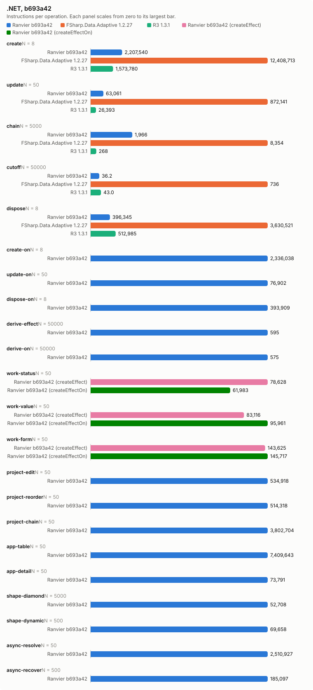
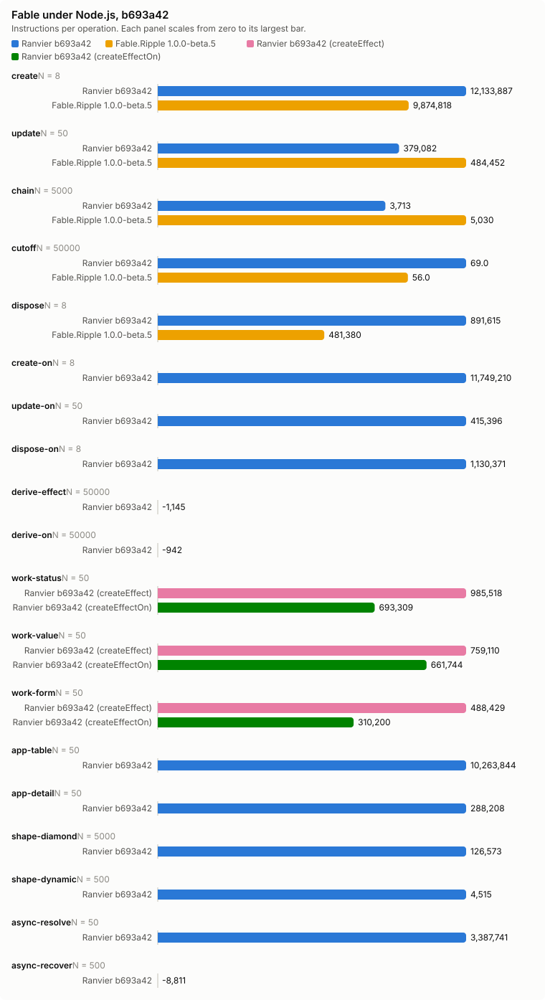

# Counter bench, b693a42

- Date: 2026-09-30 09:14:55Z
- Machine: AMD64 Family 26 Model 68 Stepping 0, AuthenticAMD, 24 logical processors, Microsoft Windows 10.0.26200, .NET 10.0.12
- Instructions: per-context-switch PMC counters (InstructionRetired, TotalCycles, BranchMispredictions)
- Library counters: from a separate RanvierCounters build (--counters-worker)
- Versions: .NET 10.0.12, FSharp.Data.Adaptive 1.2.27, R3 1.3.1, Ranvier b693a42
- Worker environment: DOTNET_TieredCompilation=0 DOTNET_TieredPGO=0 DOTNET_ReadyToRun=0 DOTNET_gcServer=0
- RanvierTrace: false
- Every figure is (m(2N) - m(N)) / N. Processor counters are the median over runs.
- Instruction counts differing by under 5 % are within run-to-run noise. Compare only reports taken at the same --scale.

## Engine differences

- R3 pushes each write straight to its subscribers, without batching or glitch-free ordering. Its chain is `Select` operators holding no cached value.
- FSharp.Data.Adaptive dispose removes the callback subscriptions only. The `AVal.map2` nodes stay in the weak output sets of their `cval`s until collected.

## create: one root of 1000 rows (N = 8)

| Engine | instr/op | cycles/op | br-miss/op | intervals N/2N | bytes/op | objects/op | counters/op |
| --- | ---: | ---: | ---: | ---: | ---: | ---: | --- |
| Ranvier b693a42 | 2,207,540.38 | 959,221.50 | 958.25 | 3/2 | 594,504 | 2,002 | SignalsCreated 1,001, EffectsCreated 1,000, OwnersCreated 1, EdgesAdded 2,000, ObserverInserts 2,000, EffectRuns 1,000, Flushes 1,000 |
| FSharp.Data.Adaptive 1.2.27 | 12,408,713.25 | 6,240,144 | 7,586.12 | 1/2 | 2,413,717 | n/a | n/a |
| R3 1.3.1 | 1,573,780.12 | 913,485 | 500.75 | 1/3 | 584,160 | n/a | n/a |

## update: write every 10th of 1000 rows (N = 50)

| Engine | instr/op | cycles/op | br-miss/op | intervals N/2N | bytes/op | objects/op | counters/op |
| --- | ---: | ---: | ---: | ---: | ---: | ---: | --- |
| Ranvier b693a42 | 63,060.86 | 21,146.42 | 1.18 | 1/1 | 0 | 0 | EffectRuns 100, Flushes 100 |
| FSharp.Data.Adaptive 1.2.27 | 872,141.08 | 363,700.04 | 416 | 1/4 | 63,200 | n/a | n/a |
| R3 1.3.1 | 26,393 | 12,294.26 | 0.74 | 1/1 | 0 | n/a | n/a |

## chain: write the source of 4 memos, read the tail (N = 5000)

| Engine | instr/op | cycles/op | br-miss/op | intervals N/2N | bytes/op | objects/op | counters/op |
| --- | ---: | ---: | ---: | ---: | ---: | ---: | --- |
| Ranvier b693a42 | 1,966.08 | 778.99 | 0.99 | 2/1 | 0 | 0 | MemoRecomputes 4 |
| FSharp.Data.Adaptive 1.2.27 | 8,354.34 | 2,953.14 | 1.33 | 3/1 | 472 | n/a | n/a |
| R3 1.3.1 | 267.58 | 149.10 | -0.01 | 1/2 | 0 | n/a | n/a |

## cutoff: write an equal value to an observed source (N = 50000)

| Engine | instr/op | cycles/op | br-miss/op | intervals N/2N | bytes/op | objects/op | counters/op |
| --- | ---: | ---: | ---: | ---: | ---: | ---: | --- |
| Ranvier b693a42 | 36.17 | 12.12 | 0.00 | 1/1 | 0 | 0 | 0 |
| FSharp.Data.Adaptive 1.2.27 | 736.10 | 377.78 | 0.29 | 2/2 | 352 | n/a | n/a |
| R3 1.3.1 | 43.00 | 24.15 | -0.00 | 1/1 | 0 | n/a | n/a |

## dispose: dispose one root of 1000 rows (N = 8)

| Engine | instr/op | cycles/op | br-miss/op | intervals N/2N | bytes/op | objects/op | counters/op |
| --- | ---: | ---: | ---: | ---: | ---: | ---: | --- |
| Ranvier b693a42 | 396,345.12 | 196,361.50 | 29 | 1/1 | 56 | 0 | EdgesRemoved 2,000, ObserverRemoves 2,000 |
| FSharp.Data.Adaptive 1.2.27 | 3,630,520.75 | 2,763,872 | 3,252 | 4/2 | 0 | n/a | n/a |
| R3 1.3.1 | 512,985 | 362,860.62 | 545 | 1/2 | 0 | n/a | n/a |

## create-on: one root of 1000 createEffectOn rows (N = 8)

| Engine | instr/op | cycles/op | br-miss/op | intervals N/2N | bytes/op | objects/op | counters/op |
| --- | ---: | ---: | ---: | ---: | ---: | ---: | --- |
| Ranvier b693a42 | 2,336,038.12 | 923,302.62 | 981.75 | 1/3 | 506,648 | 2,002 | SignalsCreated 1,001, EffectsCreated 1,000, OwnersCreated 1, EdgesAdded 2,000, ObserverInserts 2,000, EffectRuns 1,000, Flushes 1,000 |

## update-on: write every 10th of 1000 createEffectOn rows (N = 50)

| Engine | instr/op | cycles/op | br-miss/op | intervals N/2N | bytes/op | objects/op | counters/op |
| --- | ---: | ---: | ---: | ---: | ---: | ---: | --- |
| Ranvier b693a42 | 76,902.36 | 22,046.72 | 0 | 1/1 | 0 | 0 | EffectRuns 100, Flushes 100 |

## dispose-on: dispose one root of 1000 createEffectOn rows (N = 8)

| Engine | instr/op | cycles/op | br-miss/op | intervals N/2N | bytes/op | objects/op | counters/op |
| --- | ---: | ---: | ---: | ---: | ---: | ---: | --- |
| Ranvier b693a42 | 393,908.75 | 67,278.50 | -6.62 | 1/1 | 56 | 0 | EdgesRemoved 2,000, ObserverRemoves 2,000 |

## derive-effect: write a new value whose derived value is unchanged, Effect (N = 50000)

| Engine | instr/op | cycles/op | br-miss/op | intervals N/2N | bytes/op | objects/op | counters/op |
| --- | ---: | ---: | ---: | ---: | ---: | ---: | --- |
| Ranvier b693a42 | 595.24 | 194.51 | 0.00 | 2/1 | 0 | 0 | EffectRuns 1, Flushes 1 |

## derive-on: write a new value whose derived value is unchanged, createEffectOn (N = 50000)

| Engine | instr/op | cycles/op | br-miss/op | intervals N/2N | bytes/op | objects/op | counters/op |
| --- | ---: | ---: | ---: | ---: | ---: | ---: | --- |
| Ranvier b693a42 | 575.24 | 174.04 | 0.01 | 1/2 | 0 | 0 | EffectRuns 1, Flushes 1 |

## work-status: write every 10th of 1000 rows; the act formats a label, 1 write in 10 changes it (N = 50)

| Engine | instr/op | cycles/op | br-miss/op | intervals N/2N | bytes/op | objects/op | counters/op |
| --- | ---: | ---: | ---: | ---: | ---: | ---: | --- |
| Ranvier b693a42 (createEffect) | 78,628.48 | 27,694.24 | 2.16 | 1/1 | 3,980 | 0 | EffectRuns 100, Flushes 100 |
| Ranvier b693a42 (createEffectOn) | 61,983.30 | 15,876.02 | 1.16 | 1/1 | 398.40 | 0 | EffectRuns 100, Flushes 100 |

## work-value: write every 10th of 1000 rows; the act formats a label, every write changes it (N = 50)

| Engine | instr/op | cycles/op | br-miss/op | intervals N/2N | bytes/op | objects/op | counters/op |
| --- | ---: | ---: | ---: | ---: | ---: | ---: | --- |
| Ranvier b693a42 (createEffect) | 83,115.58 | 32,885.78 | 8.60 | 1/3 | 6,467.20 | 0 | EffectRuns 100, Flushes 100 |
| Ranvier b693a42 (createEffectOn) | 95,961.02 | 41,170.86 | 12.12 | 1/1 | 6,467.20 | 0 | EffectRuns 100, Flushes 100 |

## work-form: write one field of each of 125 8-field forms; validity feeds a signal and an effect (N = 50)

| Engine | instr/op | cycles/op | br-miss/op | intervals N/2N | bytes/op | objects/op | counters/op |
| --- | ---: | ---: | ---: | ---: | ---: | ---: | --- |
| Ranvier b693a42 (createEffect) | 143,624.80 | 37,804.36 | 17.50 | 2/1 | 0 | 0 | EffectRuns 126.02, Flushes 125 |
| Ranvier b693a42 (createEffectOn) | 145,716.92 | 36,270.86 | 12.22 | 1/1 | 0 | 0 | EffectRuns 126.02, Flushes 125 |

## project-edit: change one row of a 1000-row projection (N = 50)

| Engine | instr/op | cycles/op | br-miss/op | intervals N/2N | bytes/op | objects/op | counters/op |
| --- | ---: | ---: | ---: | ---: | ---: | ---: | --- |
| Ranvier b693a42 | 534,918.38 | 169,541.96 | 12.38 | 2/2 | 104 | 0 | MemoRecomputes 1, EffectRuns 1, Flushes 1 |

## project-reorder: reverse a 1000-row projection (N = 50)

| Engine | instr/op | cycles/op | br-miss/op | intervals N/2N | bytes/op | objects/op | counters/op |
| --- | ---: | ---: | ---: | ---: | ---: | ---: | --- |
| Ranvier b693a42 | 514,317.84 | 176,835.86 | 5.10 | 2/1 | 4,128 | 0 | Flushes 1 |

## project-chain: change one row of a 1000-row filter, sortBy, map chain (N = 50)

| Engine | instr/op | cycles/op | br-miss/op | intervals N/2N | bytes/op | objects/op | counters/op |
| --- | ---: | ---: | ---: | ---: | ---: | ---: | --- |
| Ranvier b693a42 | 3,802,704.32 | 978,512.14 | 306.98 | 3/3 | 206,736 | 0 | MemoRecomputes 6, EffectRuns 2, Flushes 1 |

## app-table: alternate a filter query and a sort direction over 1000 rows (N = 50)

| Engine | instr/op | cycles/op | br-miss/op | intervals N/2N | bytes/op | objects/op | counters/op |
| --- | ---: | ---: | ---: | ---: | ---: | ---: | --- |
| Ranvier b693a42 | 7,409,643.22 | 2,194,129.64 | 1,214.10 | 8/3 | 421,688.80 | 240 | SignalsCreated 120, MemosCreated 120, EdgesAdded 760.50, EdgesRemoved 760.50, ObserverInserts 760.50, ObserverRemoves 760.50, MemoRecomputes 980, EffectRuns 1, Flushes 1 |

## app-detail: move the selection over 1000 rows; the detail rebuilds 20 memo and effect pairs (N = 50)

| Engine | instr/op | cycles/op | br-miss/op | intervals N/2N | bytes/op | objects/op | counters/op |
| --- | ---: | ---: | ---: | ---: | ---: | ---: | --- |
| Ranvier b693a42 | 73,791.10 | 30,472.78 | 42.98 | 1/1 | 13,120 | 40 | MemosCreated 20, EffectsCreated 20, EdgesAdded 41, EdgesRemoved 41, ObserverInserts 41, ObserverRemoves 41, MemoRecomputes 21, EffectRuns 24, Flushes 1 |

## shape-diamond: write a source read by 100 memos joined by one (N = 5000)

| Engine | instr/op | cycles/op | br-miss/op | intervals N/2N | bytes/op | objects/op | counters/op |
| --- | ---: | ---: | ---: | ---: | ---: | ---: | --- |
| Ranvier b693a42 | 52,707.81 | 17,239.34 | 2.46 | 1/6 | 0 | 0 | MemoRecomputes 101, EffectRuns 1, Flushes 1 |

## shape-dynamic: alternate a branch flip and a write of every active source of 100 effects (N = 500)

| Engine | instr/op | cycles/op | br-miss/op | intervals N/2N | bytes/op | objects/op | counters/op |
| --- | ---: | ---: | ---: | ---: | ---: | ---: | --- |
| Ranvier b693a42 | 69,658.05 | 20,199.53 | 2.96 | 1/2 | 0 | 0 | EdgesAdded 50, EdgesRemoved 50, ObserverInserts 50, ObserverRemoves 50, EffectRuns 100, Flushes 50.50 |

## async-resolve: reload 10 suspense widgets of 10 sources, then settle each (N = 50)

| Engine | instr/op | cycles/op | br-miss/op | intervals N/2N | bytes/op | objects/op | counters/op |
| --- | ---: | ---: | ---: | ---: | ---: | ---: | --- |
| Ranvier b693a42 | 2,510,926.72 | 902,087.86 | 1,387.34 | 1/3 | 70,048 | 0 | EdgesAdded 190, EdgesRemoved 190, ObserverInserts 190, ObserverRemoves 190, EffectRuns 20, Flushes 101 |

## async-recover: fail one source of one error-boundary widget, then settle a replacement (N = 500)

| Engine | instr/op | cycles/op | br-miss/op | intervals N/2N | bytes/op | objects/op | counters/op |
| --- | ---: | ---: | ---: | ---: | ---: | ---: | --- |
| Ranvier b693a42 | 185,096.56 | 150,522.57 | 115.16 | 1/3 | 131,182.29 | 0 | EdgesAdded 20, EdgesRemoved 20, ObserverInserts 20, ObserverRemoves 20, EffectRuns 4, Flushes 4 |

## Calibration, 5 run(s)

Allocations and library counters identical in every run.

| Scenario | Engine | Source | Median/op | Min/op | Max/op | Spread |
| --- | --- | --- | ---: | ---: | ---: | ---: |
| create | Ranvier | InstructionRetired | 2,207,540.38 | 2,206,308.12 | 2,216,147.75 | 0.45 % |
| create | Ranvier | TotalCycles | 959,221.50 | 947,122.75 | 1,016,978.50 | 7.38 % |
| create | Ranvier | BranchMispredictions | 958.25 | 773.62 | 1,056.38 | 36.55 % |
| create | FSharp.Data.Adaptive | InstructionRetired | 12,408,713.25 | 12,372,187.50 | 12,435,294.25 | 0.51 % |
| create | FSharp.Data.Adaptive | TotalCycles | 6,240,144 | 5,856,937.38 | 6,699,056.88 | 14.38 % |
| create | FSharp.Data.Adaptive | BranchMispredictions | 7,586.12 | 7,071.88 | 7,959.50 | 12.55 % |
| create | R3 | InstructionRetired | 1,573,780.12 | 1,571,911.38 | 1,575,489.12 | 0.23 % |
| create | R3 | TotalCycles | 913,485 | 771,740.38 | 983,860.88 | 27.49 % |
| create | R3 | BranchMispredictions | 500.75 | 442.50 | 722.50 | 63.28 % |
| update | Ranvier | InstructionRetired | 63,060.86 | 63,040.58 | 63,105.72 | 0.10 % |
| update | Ranvier | TotalCycles | 21,146.42 | 16,770.78 | 29,698.72 | 77.09 % |
| update | Ranvier | BranchMispredictions | 1.18 | -0.56 | 2.08 | -471.43 % |
| update | FSharp.Data.Adaptive | InstructionRetired | 872,141.08 | 871,942.82 | 874,780.24 | 0.33 % |
| update | FSharp.Data.Adaptive | TotalCycles | 363,700.04 | 351,870.80 | 394,328.24 | 12.07 % |
| update | FSharp.Data.Adaptive | BranchMispredictions | 416 | 388.70 | 511.76 | 31.66 % |
| update | R3 | InstructionRetired | 26,393 | 26,230.26 | 26,475.08 | 0.93 % |
| update | R3 | TotalCycles | 12,294.26 | 10,330.46 | 14,868.36 | 43.93 % |
| update | R3 | BranchMispredictions | 0.74 | -4.54 | 2.52 | -155.51 % |
| chain | Ranvier | InstructionRetired | 1,966.08 | 1,965.71 | 1,974.74 | 0.46 % |
| chain | Ranvier | TotalCycles | 778.99 | 725.35 | 1,101.59 | 51.87 % |
| chain | Ranvier | BranchMispredictions | 0.99 | 0.03 | 1.22 | 3,653.70 % |
| chain | FSharp.Data.Adaptive | InstructionRetired | 8,354.34 | 8,339.82 | 8,367.59 | 0.33 % |
| chain | FSharp.Data.Adaptive | TotalCycles | 2,953.14 | 2,829.42 | 3,046.36 | 7.67 % |
| chain | FSharp.Data.Adaptive | BranchMispredictions | 1.33 | 1.14 | 1.54 | 35.14 % |
| chain | R3 | InstructionRetired | 267.58 | 266.18 | 271.00 | 1.81 % |
| chain | R3 | TotalCycles | 149.10 | 136.48 | 181.41 | 32.92 % |
| chain | R3 | BranchMispredictions | -0.01 | -0.03 | 0.05 | -256.76 % |
| cutoff | Ranvier | InstructionRetired | 36.17 | 35.97 | 39.19 | 8.95 % |
| cutoff | Ranvier | TotalCycles | 12.12 | 7.46 | 52.48 | 603.83 % |
| cutoff | Ranvier | BranchMispredictions | 0.00 | -0.00 | 0.05 | -2,053.96 % |
| cutoff | FSharp.Data.Adaptive | InstructionRetired | 736.10 | 735.99 | 736.63 | 0.09 % |
| cutoff | FSharp.Data.Adaptive | TotalCycles | 377.78 | 364.99 | 425.22 | 16.50 % |
| cutoff | FSharp.Data.Adaptive | BranchMispredictions | 0.29 | 0.27 | 0.30 | 8.71 % |
| cutoff | R3 | InstructionRetired | 43.00 | 42.91 | 43.12 | 0.49 % |
| cutoff | R3 | TotalCycles | 24.15 | 22.88 | 25.01 | 9.34 % |
| cutoff | R3 | BranchMispredictions | -0.00 | -0.00 | 0.00 | -261.15 % |
| dispose | Ranvier | InstructionRetired | 396,345.12 | 395,591 | 400,628.50 | 1.27 % |
| dispose | Ranvier | TotalCycles | 196,361.50 | 125,145.12 | 310,373.75 | 148.01 % |
| dispose | Ranvier | BranchMispredictions | 29 | -4.75 | 70.25 | -1,578.95 % |
| dispose | FSharp.Data.Adaptive | InstructionRetired | 3,630,520.75 | 3,620,632.62 | 3,634,908 | 0.39 % |
| dispose | FSharp.Data.Adaptive | TotalCycles | 2,763,872 | 2,750,816.88 | 3,017,962.75 | 9.71 % |
| dispose | FSharp.Data.Adaptive | BranchMispredictions | 3,252 | 2,672.12 | 3,471.75 | 29.92 % |
| dispose | R3 | InstructionRetired | 512,985 | 510,274.38 | 518,094.88 | 1.53 % |
| dispose | R3 | TotalCycles | 362,860.62 | 338,331.88 | 404,359.75 | 19.52 % |
| dispose | R3 | BranchMispredictions | 545 | 478 | 693.62 | 45.11 % |
| create-on | Ranvier | InstructionRetired | 2,336,038.12 | 2,335,351.50 | 2,341,316.12 | 0.26 % |
| create-on | Ranvier | TotalCycles | 923,302.62 | 720,887.12 | 1,196,002.75 | 65.91 % |
| create-on | Ranvier | BranchMispredictions | 981.75 | 847.12 | 1,001.38 | 18.21 % |
| update-on | Ranvier | InstructionRetired | 76,902.36 | 76,663.62 | 77,488.86 | 1.08 % |
| update-on | Ranvier | TotalCycles | 22,046.72 | 5,929.72 | 25,906.04 | 336.88 % |
| update-on | Ranvier | BranchMispredictions | 0 | -12.70 | 12.04 | -194.80 % |
| dispose-on | Ranvier | InstructionRetired | 393,908.75 | 393,409 | 394,482.62 | 0.27 % |
| dispose-on | Ranvier | TotalCycles | 67,278.50 | 26,706.62 | 101,603.25 | 280.44 % |
| dispose-on | Ranvier | BranchMispredictions | -6.62 | -39.38 | 37.12 | -194.29 % |
| derive-effect | Ranvier | InstructionRetired | 595.24 | 594.93 | 595.94 | 0.17 % |
| derive-effect | Ranvier | TotalCycles | 194.51 | 193.21 | 195.17 | 1.02 % |
| derive-effect | Ranvier | BranchMispredictions | 0.00 | -0.00 | 0.01 | -434.43 % |
| derive-on | Ranvier | InstructionRetired | 575.24 | 573.88 | 575.28 | 0.24 % |
| derive-on | Ranvier | TotalCycles | 174.04 | 170.18 | 189.95 | 11.62 % |
| derive-on | Ranvier | BranchMispredictions | 0.01 | -0.02 | 0.01 | -179.00 % |
| work-status | Ranvier (createEffect) | InstructionRetired | 78,628.48 | 78,487.78 | 79,326.86 | 1.07 % |
| work-status | Ranvier (createEffect) | TotalCycles | 27,694.24 | 24,364.34 | 33,611.84 | 37.96 % |
| work-status | Ranvier (createEffect) | BranchMispredictions | 2.16 | -3.12 | 15.36 | -592.31 % |
| work-status | Ranvier (createEffectOn) | InstructionRetired | 61,983.30 | 61,832.48 | 62,078.28 | 0.40 % |
| work-status | Ranvier (createEffectOn) | TotalCycles | 15,876.02 | 12,721.68 | 19,873.74 | 56.22 % |
| work-status | Ranvier (createEffectOn) | BranchMispredictions | 1.16 | -1.84 | 3.26 | -277.17 % |
| work-value | Ranvier (createEffect) | InstructionRetired | 83,115.58 | 82,989.24 | 83,247.68 | 0.31 % |
| work-value | Ranvier (createEffect) | TotalCycles | 32,885.78 | 25,426.18 | 42,661.70 | 67.79 % |
| work-value | Ranvier (createEffect) | BranchMispredictions | 8.60 | 2.04 | 13.06 | 540.20 % |
| work-value | Ranvier (createEffectOn) | InstructionRetired | 95,961.02 | 95,890.80 | 96,440.12 | 0.57 % |
| work-value | Ranvier (createEffectOn) | TotalCycles | 41,170.86 | 31,343.94 | 68,015.98 | 117.00 % |
| work-value | Ranvier (createEffectOn) | BranchMispredictions | 12.12 | 3.32 | 14.44 | 334.94 % |
| work-form | Ranvier (createEffect) | InstructionRetired | 143,624.80 | 143,456.96 | 144,588.54 | 0.79 % |
| work-form | Ranvier (createEffect) | TotalCycles | 37,804.36 | 27,687.78 | 44,825.72 | 61.90 % |
| work-form | Ranvier (createEffect) | BranchMispredictions | 17.50 | -4 | 26.32 | -758.00 % |
| work-form | Ranvier (createEffectOn) | InstructionRetired | 145,716.92 | 143,849.76 | 151,340.84 | 5.21 % |
| work-form | Ranvier (createEffectOn) | TotalCycles | 36,270.86 | 32,385.16 | 104,739.92 | 223.42 % |
| work-form | Ranvier (createEffectOn) | BranchMispredictions | 12.22 | 7.22 | 95.12 | 1,217.45 % |
| project-edit | Ranvier | InstructionRetired | 534,918.38 | 534,623 | 535,081.74 | 0.09 % |
| project-edit | Ranvier | TotalCycles | 169,541.96 | 133,103.86 | 177,758.40 | 33.55 % |
| project-edit | Ranvier | BranchMispredictions | 12.38 | -4.66 | 22.34 | -579.40 % |
| project-reorder | Ranvier | InstructionRetired | 514,317.84 | 514,136.16 | 515,085.82 | 0.18 % |
| project-reorder | Ranvier | TotalCycles | 176,835.86 | 157,670.80 | 210,035.10 | 33.21 % |
| project-reorder | Ranvier | BranchMispredictions | 5.10 | -16.58 | 29.76 | -279.49 % |
| project-chain | Ranvier | InstructionRetired | 3,802,704.32 | 3,667,924.58 | 3,803,812.66 | 3.70 % |
| project-chain | Ranvier | TotalCycles | 978,512.14 | 912,335.96 | 1,013,273.18 | 11.06 % |
| project-chain | Ranvier | BranchMispredictions | 306.98 | 290.14 | 398.26 | 37.26 % |
| app-table | Ranvier | InstructionRetired | 7,409,643.22 | 7,181,749.72 | 7,413,924.42 | 3.23 % |
| app-table | Ranvier | TotalCycles | 2,194,129.64 | 2,030,721.10 | 2,373,246.34 | 16.87 % |
| app-table | Ranvier | BranchMispredictions | 1,214.10 | 1,089 | 1,321.10 | 21.31 % |
| app-detail | Ranvier | InstructionRetired | 73,791.10 | 73,611.10 | 74,993.56 | 1.88 % |
| app-detail | Ranvier | TotalCycles | 30,472.78 | 21,638.80 | 32,419.72 | 49.82 % |
| app-detail | Ranvier | BranchMispredictions | 42.98 | 22.38 | 62.44 | 179.00 % |
| shape-diamond | Ranvier | InstructionRetired | 52,707.81 | 52,686.82 | 52,716.91 | 0.06 % |
| shape-diamond | Ranvier | TotalCycles | 17,239.34 | 16,798.10 | 18,227.87 | 8.51 % |
| shape-diamond | Ranvier | BranchMispredictions | 2.46 | 2.18 | 3.24 | 48.73 % |
| shape-dynamic | Ranvier | InstructionRetired | 69,658.05 | 69,643.25 | 69,761.87 | 0.17 % |
| shape-dynamic | Ranvier | TotalCycles | 20,199.53 | 19,965.50 | 21,565.32 | 8.01 % |
| shape-dynamic | Ranvier | BranchMispredictions | 2.96 | 2.08 | 4.70 | 126.06 % |
| async-resolve | Ranvier | InstructionRetired | 2,510,926.72 | 2,509,926.32 | 2,512,540.88 | 0.10 % |
| async-resolve | Ranvier | TotalCycles | 902,087.86 | 866,322.32 | 975,081.34 | 12.55 % |
| async-resolve | Ranvier | BranchMispredictions | 1,387.34 | 1,282.90 | 1,452.36 | 13.21 % |
| async-recover | Ranvier | InstructionRetired | 185,096.56 | 185,007.64 | 185,196.14 | 0.10 % |
| async-recover | Ranvier | TotalCycles | 150,522.57 | 145,605.18 | 151,366.61 | 3.96 % |
| async-recover | Ranvier | BranchMispredictions | 115.16 | 101.65 | 124.36 | 22.34 % |

# Fable under Node.js v26.7.0

- Versions: Fable.Ripple 1.0.0-beta.5, Node.js v26.7.0, Ranvier b693a42, fable-library-js 5.18.0
- node flags: --expose-gc --single-threaded
- Instructions: per-context-switch PMC counters (InstructionRetired, TotalCycles, BranchMispredictions); main: the main thread, all: every thread of the process
- bytes/op: growth of the new, old and large-object heap spaces; median of 5 processes. bytes range: minimum..maximum, 0 when every process agreed.
- heapUsed/op: growth of `process.memoryUsage().heapUsed`, which adds the code and trusted spaces.
- Every figure is (m(2N) - m(N)) / N. A figure followed by a bracketed range differed between processes.

## create: one root of 1000 rows (N = 8)

| Engine | instr/op main | instr/op all | cycles/op main | cycles/op all | br-miss/op main | br-miss/op all | bytes/op | bytes range | heapUsed/op | objects/op | counters/op |
| --- | ---: | ---: | ---: | ---: | ---: | ---: | ---: | ---: | ---: | ---: | --- |
| Ranvier b693a42 | 12,133,887.12 (12,093,065.75..12,164,110.12) | 12,133,887.12 (12,093,065.75..12,164,110.12) | 4,497,862 (4,324,898.50..4,837,446.88) | 4,497,862 (4,324,898.50..4,837,446.88) | 26,024.25 (25,308.38..26,773) | 26,024.25 (25,308.38..26,773) | 1,137,663 | 0 | 1,139,563 | 2,002 | SignalsCreated 1,001, EffectsCreated 1,000, OwnersCreated 1, EdgesAdded 2,000, ObserverInserts 2,000, EffectRuns 1,000, Flushes 1,000 |
| Fable.Ripple 1.0.0-beta.5 | 9,874,817.88 (9,827,327.38..9,894,574.62) | 9,874,817.88 (9,827,327.38..9,894,574.62) | 5,827,597.62 (5,558,283.75..5,875,050.25) | 5,827,597.62 (5,558,283.75..5,875,050.25) | 66,861.62 (65,603.12..68,367.25) | 66,861.62 (65,603.12..68,367.25) | 1,346,356 | 0 | 1,353,033 | n/a | n/a |

## update: write every 10th of 1000 rows (N = 50)

| Engine | instr/op main | instr/op all | cycles/op main | cycles/op all | br-miss/op main | br-miss/op all | bytes/op | bytes range | heapUsed/op | objects/op | counters/op |
| --- | ---: | ---: | ---: | ---: | ---: | ---: | ---: | ---: | ---: | ---: | --- |
| Ranvier b693a42 | 379,082.34 (378,710.84..380,331.72) | 379,082.34 (378,710.84..380,331.72) | 52,765.98 (30,229.30..107,596.06) | 52,765.98 (30,229.30..107,596.06) | -81.56 (-108.12..13.54) | -81.56 (-108.12..13.54) | 8,807.36 | 0 | 8,543.36 | 0 | EffectRuns 100, Flushes 100 |
| Fable.Ripple 1.0.0-beta.5 | 484,452.18 (484,178.34..485,510.88) | 484,452.18 (484,178.34..485,510.88) | 89,230.50 (652.16..132,582.74) | 89,230.50 (652.16..132,582.74) | -49.76 (-225.94..-25.58) | -49.76 (-225.94..-25.58) | 24,021.12 | 0 | 24,001.60 | n/a | n/a |

## chain: write the source of 4 memos, read the tail (N = 5000)

| Engine | instr/op main | instr/op all | cycles/op main | cycles/op all | br-miss/op main | br-miss/op all | bytes/op | bytes range | heapUsed/op | objects/op | counters/op |
| --- | ---: | ---: | ---: | ---: | ---: | ---: | ---: | ---: | ---: | ---: | --- |
| Ranvier b693a42 | 3,713.10 (3,712.24..3,714.45) | 3,713.10 (3,712.24..3,714.45) | 683.71 (582.47..792.70) | 683.71 (582.47..792.70) | 0.04 (0.01..0.07) | 0.04 (0.01..0.07) | 0.07 | 0 | 1.92 (1.91..1.92) | 0 | MemoRecomputes 4 |
| Fable.Ripple 1.0.0-beta.5 | 5,030.07 (5,028.55..5,031.30) | 5,030.07 (5,028.55..5,031.30) | 734.50 (680.55..1,033.64) | 734.50 (680.55..1,033.64) | 0.02 (-0.78..0.82) | 0.02 (-0.78..0.82) | 0 | 0 | 0 | n/a | n/a |

## cutoff: write an equal value to an observed source (N = 50000)

| Engine | instr/op main | instr/op all | cycles/op main | cycles/op all | br-miss/op main | br-miss/op all | bytes/op | bytes range | heapUsed/op | objects/op | counters/op |
| --- | ---: | ---: | ---: | ---: | ---: | ---: | ---: | ---: | ---: | ---: | --- |
| Ranvier b693a42 | 69.01 (68.78..69.21) | 69.01 (68.78..69.21) | 9.96 (9.16..18.50) | 9.96 (9.16..18.50) | -0.00 (-0.01..0.01) | -0.00 (-0.01..0.01) | 0 | 0 | 0 | 0 | 0 |
| Fable.Ripple 1.0.0-beta.5 | 55.98 (-166.72..56.15) | 55.98 (-166.72..56.15) | 6.40 (-135.18..9.21) | 6.40 (-135.18..9.21) | -0.00 (-0.62..0.00) | -0.00 (-0.62..0.00) | 0 | 0 | 0.03 | n/a | n/a |

## dispose: dispose one root of 1000 rows (N = 8)

| Engine | instr/op main | instr/op all | cycles/op main | cycles/op all | br-miss/op main | br-miss/op all | bytes/op | bytes range | heapUsed/op | objects/op | counters/op |
| --- | ---: | ---: | ---: | ---: | ---: | ---: | ---: | ---: | ---: | ---: | --- |
| Ranvier b693a42 | 891,615 (879,936.50..1,138,410.88) | 891,615 (879,936.50..1,138,410.88) | 798,215.38 (715,840.75..966,508.75) | 798,215.38 (715,840.75..966,508.75) | 1,209.25 (925.38..1,346) | 1,209.25 (925.38..1,346) | 29,234 | 0 | 29,328 | 0 | EdgesRemoved 2,000, ObserverRemoves 2,000 |
| Fable.Ripple 1.0.0-beta.5 | 481,380 (479,963.88..483,844.12) | 481,380 (479,963.88..483,844.12) | 294,071.12 (159,082.62..314,489.88) | 294,071.12 (159,082.62..314,489.88) | 64.88 (32.88..137.62) | 64.88 (32.88..137.62) | 28,672 | 0 | 28,672 | n/a | n/a |

## create-on: one root of 1000 createEffectOn rows (N = 8)

| Engine | instr/op main | instr/op all | cycles/op main | cycles/op all | br-miss/op main | br-miss/op all | bytes/op | bytes range | heapUsed/op | objects/op | counters/op |
| --- | ---: | ---: | ---: | ---: | ---: | ---: | ---: | ---: | ---: | ---: | --- |
| Ranvier b693a42 | 11,749,210.25 (11,711,392.50..11,768,791) | 11,749,210.25 (11,711,392.50..11,768,791) | 5,284,009.12 (4,768,691.38..5,820,138.25) | 5,284,009.12 (4,768,691.38..5,820,138.25) | 37,816.25 (37,535.88..38,596.75) | 37,816.25 (37,535.88..38,596.75) | 1,023,016 | 0 | 1,027,713 | 2,002 | SignalsCreated 1,001, EffectsCreated 1,000, OwnersCreated 1, EdgesAdded 2,000, ObserverInserts 2,000, EffectRuns 1,000, Flushes 1,000 |

## update-on: write every 10th of 1000 createEffectOn rows (N = 50)

| Engine | instr/op main | instr/op all | cycles/op main | cycles/op all | br-miss/op main | br-miss/op all | bytes/op | bytes range | heapUsed/op | objects/op | counters/op |
| --- | ---: | ---: | ---: | ---: | ---: | ---: | ---: | ---: | ---: | ---: | --- |
| Ranvier b693a42 | 415,396.24 (414,854.96..422,586.74) | 415,396.24 (414,854.96..422,586.74) | 89,327.88 (47,421.28..140,906.46) | 89,327.88 (47,421.28..140,906.46) | 155.06 (120.92..240.54) | 155.06 (120.92..240.54) | 8,790.40 | 0 | 9,014.24 | 0 | EffectRuns 100, Flushes 100 |

## dispose-on: dispose one root of 1000 createEffectOn rows (N = 8)

| Engine | instr/op main | instr/op all | cycles/op main | cycles/op all | br-miss/op main | br-miss/op all | bytes/op | bytes range | heapUsed/op | objects/op | counters/op |
| --- | ---: | ---: | ---: | ---: | ---: | ---: | ---: | ---: | ---: | ---: | --- |
| Ranvier b693a42 | 1,130,370.75 (1,005,544.88..1,133,617.62) | 1,130,370.75 (1,005,544.88..1,133,617.62) | 840,285.62 (510,411.38..912,203.12) | 840,285.62 (510,411.38..912,203.12) | 809.38 (620.88..898.12) | 809.38 (620.88..898.12) | 29,232 | 0 | 29,232 | 0 | EdgesRemoved 2,000, ObserverRemoves 2,000 |

## derive-effect: write a new value whose derived value is unchanged, Effect (N = 50000)

| Engine | instr/op main | instr/op all | cycles/op main | cycles/op all | br-miss/op main | br-miss/op all | bytes/op | bytes range | heapUsed/op | objects/op | counters/op |
| --- | ---: | ---: | ---: | ---: | ---: | ---: | ---: | ---: | ---: | ---: | --- |
| Ranvier b693a42 | -1,144.71 (-1,155.31..-1,141.25) | -1,144.71 (-1,155.31..-1,141.25) | -900.92 (-953.18..-876.48) | -900.92 (-953.18..-876.48) | -10.59 (-10.66..-10.49) | -10.59 (-10.66..-10.49) | -0.03 | 0 | -1.02 | 0 | EffectRuns 1, Flushes 1 |

## derive-on: write a new value whose derived value is unchanged, createEffectOn (N = 50000)

| Engine | instr/op main | instr/op all | cycles/op main | cycles/op all | br-miss/op main | br-miss/op all | bytes/op | bytes range | heapUsed/op | objects/op | counters/op |
| --- | ---: | ---: | ---: | ---: | ---: | ---: | ---: | ---: | ---: | ---: | --- |
| Ranvier b693a42 | -942.23 (-945.49..-941.90) | -942.23 (-945.49..-941.90) | -841.64 (-875.81..-793.39) | -841.64 (-875.81..-793.39) | -9.80 (-9.91..-9.70) | -9.80 (-9.91..-9.70) | -0.01 | 0 | -0.81 | 0 | EffectRuns 1, Flushes 1 |

## work-status: write every 10th of 1000 rows; the act formats a label, 1 write in 10 changes it (N = 50)

| Engine | instr/op main | instr/op all | cycles/op main | cycles/op all | br-miss/op main | br-miss/op all | bytes/op | bytes range | heapUsed/op | objects/op | counters/op |
| --- | ---: | ---: | ---: | ---: | ---: | ---: | ---: | ---: | ---: | ---: | --- |
| Ranvier b693a42 (createEffect) | 985,518.46 (983,032.10..995,476.80) | 985,518.46 (983,032.10..995,476.80) | 444,651.20 (434,305.70..453,558.90) | 444,651.20 (434,305.70..453,558.90) | 3,402.14 (3,233.70..3,463.72) | 3,402.14 (3,233.70..3,463.72) | 34,318.88 | 0 | 34,508.48 | 0 | EffectRuns 100, Flushes 100 |
| Ranvier b693a42 (createEffectOn) | 693,308.70 (692,314.36..693,641.78) | 693,308.70 (692,314.36..693,641.78) | 255,168.58 (159,520.10..268,136.98) | 255,168.58 (159,520.10..268,136.98) | 1,641.02 (1,414.48..1,669.92) | 1,641.02 (1,414.48..1,669.92) | 10,964.16 | 0 | 11,075.52 | 0 | EffectRuns 100, Flushes 100 |

## work-value: write every 10th of 1000 rows; the act formats a label, every write changes it (N = 50)

| Engine | instr/op main | instr/op all | cycles/op main | cycles/op all | br-miss/op main | br-miss/op all | bytes/op | bytes range | heapUsed/op | objects/op | counters/op |
| --- | ---: | ---: | ---: | ---: | ---: | ---: | ---: | ---: | ---: | ---: | --- |
| Ranvier b693a42 (createEffect) | 759,110.02 (758,572.76..760,934.58) | 759,110.02 (758,572.76..760,934.58) | 255,170.74 (231,021.62..268,092.30) | 255,170.74 (231,021.62..268,092.30) | 1,494.72 (1,475.84..1,633.64) | 1,494.72 (1,475.84..1,633.64) | 33,146.08 | 0 | 33,225.44 | 0 | EffectRuns 100, Flushes 100 |
| Ranvier b693a42 (createEffectOn) | 661,743.62 (-1,737,319..663,053.64) | 661,743.62 (-1,737,319..663,053.64) | 134,173.64 (-963,189.82..149,000.82) | 134,173.64 (-963,189.82..149,000.82) | 111.98 (-6,931.04..152.84) | 111.98 (-6,931.04..152.84) | 33,029.12 | 0 | 33,116 | 0 | EffectRuns 100, Flushes 100 |

## work-form: write one field of each of 125 8-field forms; validity feeds a signal and an effect (N = 50)

| Engine | instr/op main | instr/op all | cycles/op main | cycles/op all | br-miss/op main | br-miss/op all | bytes/op | bytes range | heapUsed/op | objects/op | counters/op |
| --- | ---: | ---: | ---: | ---: | ---: | ---: | ---: | ---: | ---: | ---: | --- |
| Ranvier b693a42 (createEffect) | 488,428.54 (487,675.88..488,847.34) | 488,428.54 (487,675.88..488,847.34) | 239,498.16 (234,135.78..258,493.92) | 239,498.16 (234,135.78..258,493.92) | 3,156.94 (3,042.28..3,250.46) | 3,156.94 (3,042.28..3,250.46) | -11.52 | 0 | 265.92 (265.92..266.24) | 0 | EffectRuns 126.02, Flushes 125 |
| Ranvier b693a42 (createEffectOn) | 310,199.94 (183,575.42..310,430.64) | 310,199.94 (183,575.42..310,430.64) | 48,939.44 (-38,415.96..65,612) | 48,939.44 (-38,415.96..65,612) | 32.94 (-461.76..38.76) | 32.94 (-461.76..38.76) | 0 | 0 | 0 | 0 | EffectRuns 126.02, Flushes 125 |

## app-table: alternate a filter query and a sort direction over 1000 rows (N = 50)

| Engine | instr/op main | instr/op all | cycles/op main | cycles/op all | br-miss/op main | br-miss/op all | bytes/op | bytes range | heapUsed/op | objects/op | counters/op |
| --- | ---: | ---: | ---: | ---: | ---: | ---: | ---: | ---: | ---: | ---: | --- |
| Ranvier b693a42 | 10,263,844.26 (10,223,932.08..10,295,471.48) | 10,739,662.18 (10,698,768.66..10,770,999.96) | 3,092,005.14 (2,765,769.98..3,480,902.76) | 3,316,998.04 (2,976,136.68..3,692,708.62) | 5,541.66 (5,473.94..7,116.36) | 6,028.38 (5,992.40..7,660.72) | 364,189.60 (GC in region) | 0 | 363,609.44 (363,605.92..363,609.44) | 240 | SignalsCreated 120, MemosCreated 120, EdgesAdded 760.50, EdgesRemoved 760.50, ObserverInserts 760.50, ObserverRemoves 760.50, MemoRecomputes 980, EffectRuns 1, Flushes 1 |

## app-detail: move the selection over 1000 rows; the detail rebuilds 20 memo and effect pairs (N = 50)

| Engine | instr/op main | instr/op all | cycles/op main | cycles/op all | br-miss/op main | br-miss/op all | bytes/op | bytes range | heapUsed/op | objects/op | counters/op |
| --- | ---: | ---: | ---: | ---: | ---: | ---: | ---: | ---: | ---: | ---: | --- |
| Ranvier b693a42 | 288,208.34 (287,761.22..289,512.90) | 288,208.34 (287,761.22..289,512.90) | 44,815.44 (22,516.82..59,815.66) | 44,815.44 (22,516.82..59,815.66) | 21.50 (-52.34..34.18) | 21.50 (-52.34..34.18) | 32,086.40 | 0 | 32,066.72 | 40 | MemosCreated 20, EffectsCreated 20, EdgesAdded 41, EdgesRemoved 41, ObserverInserts 41, ObserverRemoves 41, MemoRecomputes 21, EffectRuns 24, Flushes 1 |

## shape-diamond: write a source read by 100 memos joined by one (N = 5000)

| Engine | instr/op main | instr/op all | cycles/op main | cycles/op all | br-miss/op main | br-miss/op all | bytes/op | bytes range | heapUsed/op | objects/op | counters/op |
| --- | ---: | ---: | ---: | ---: | ---: | ---: | ---: | ---: | ---: | ---: | --- |
| Ranvier b693a42 | 126,573.11 (126,542.10..127,163.73) | 126,573.11 (126,542.10..127,163.73) | 18,495.76 (17,813.51..18,987.87) | 18,495.76 (17,813.51..18,987.87) | -32.30 (-33.71..-31.06) | -32.30 (-33.71..-31.06) | -0.01 | 0 | -3.62 | 0 | MemoRecomputes 101, EffectRuns 1, Flushes 1 |

## shape-dynamic: alternate a branch flip and a write of every active source of 100 effects (N = 500)

| Engine | instr/op main | instr/op all | cycles/op main | cycles/op all | br-miss/op main | br-miss/op all | bytes/op | bytes range | heapUsed/op | objects/op | counters/op |
| --- | ---: | ---: | ---: | ---: | ---: | ---: | ---: | ---: | ---: | ---: | --- |
| Ranvier b693a42 | 4,515.09 (3,557.56..4,774.74) | 4,515.09 (3,557.56..4,774.74) | -58,256.15 (-61,854.87..-58,067.79) | -58,256.15 (-61,854.87..-58,067.79) | -955.26 (-973.84..-952.90) | -955.26 (-973.84..-952.90) | 3,187.58 | 0 | 3,088.90 | 0 | EdgesAdded 50, EdgesRemoved 50, ObserverInserts 50, ObserverRemoves 50, EffectRuns 100, Flushes 50.50 |

## async-resolve: reload 10 suspense widgets of 10 sources, then settle each (N = 50)

| Engine | instr/op main | instr/op all | cycles/op main | cycles/op all | br-miss/op main | br-miss/op all | bytes/op | bytes range | heapUsed/op | objects/op | counters/op |
| --- | ---: | ---: | ---: | ---: | ---: | ---: | ---: | ---: | ---: | ---: | --- |
| Ranvier b693a42 | 3,387,741.38 (3,379,375.44..3,403,914.12) | 3,387,741.38 (3,379,375.44..3,403,914.12) | 1,455,366.48 (1,425,308.28..1,468,172.76) | 1,455,366.48 (1,425,308.28..1,468,172.76) | 10,265.44 (10,223.46..10,334.62) | 10,265.44 (10,223.46..10,334.62) | 171,246.24 | 0 | 171,884 (171,880.48..171,884) | 0 | EdgesAdded 190, EdgesRemoved 190, ObserverInserts 190, ObserverRemoves 190, EffectRuns 20, Flushes 101 |

## async-recover: fail one source of one error-boundary widget, then settle a replacement (N = 500)

| Engine | instr/op main | instr/op all | cycles/op main | cycles/op all | br-miss/op main | br-miss/op all | bytes/op | bytes range | heapUsed/op | objects/op | counters/op |
| --- | ---: | ---: | ---: | ---: | ---: | ---: | ---: | ---: | ---: | ---: | --- |
| Ranvier b693a42 | -8,811.14 (-10,292.65..-7,115.73) | -8,811.14 (-10,292.65..-7,115.73) | -45,072.52 (-53,285.42..-36,526.01) | -45,072.52 (-53,285.42..-36,526.01) | -821.70 (-846.12..-820.17) | -821.70 (-846.12..-820.17) | 6,506.37 | 0 | 6,443.82 | 0 | EdgesAdded 20, EdgesRemoved 20, ObserverInserts 20, ObserverRemoves 20, EffectRuns 4, Flushes 4 |

# Appendix: instructions per operation

The instr/op medians from the tables above; Node.js bars are main-thread figures. Each panel has its own scale.

## .NET

## Fable under Node.js

