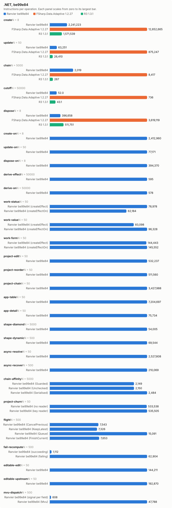
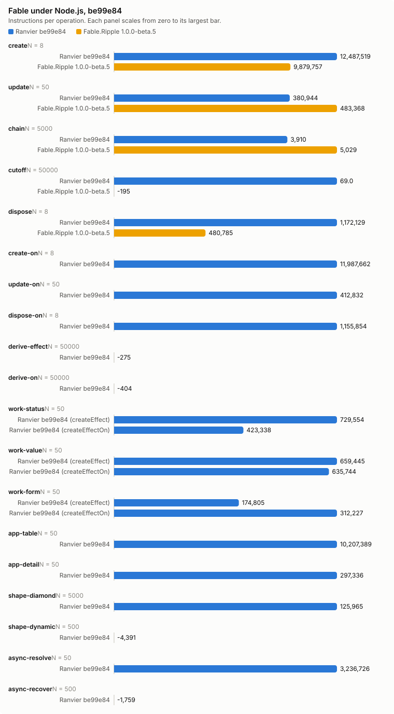

# Counter bench, be99e84

- Date: 2026-10-03 05:59:55Z
- Machine: AMD64 Family 26 Model 68 Stepping 0, AuthenticAMD, 24 logical processors, Microsoft Windows 10.0.26200, .NET 10.0.12
- Instructions: per-context-switch PMC counters (InstructionRetired, TotalCycles, BranchMispredictions)
- Library counters: from a separate RanvierCounters build (--counters-worker)
- Versions: .NET 10.0.12, FSharp.Data.Adaptive 1.2.27, R3 1.3.1, Ranvier be99e84
- Worker environment: DOTNET_TieredCompilation=0 DOTNET_TieredPGO=0 DOTNET_ReadyToRun=0 DOTNET_gcServer=0
- RanvierTrace: false
- Every figure is (m(2N) - m(N)) / N. Processor counters are the median over runs.
- Instruction counts differing by under 5 % are within run-to-run noise. Compare only reports taken at the same --scale.

## Engine differences

- R3 pushes each write straight to its subscribers, without batching or glitch-free ordering. Its chain is `Select` operators holding no cached value.
- FSharp.Data.Adaptive dispose removes the callback subscriptions only. The `AVal.map2` nodes stay in the weak output sets of their `cval`s until collected.

## create: one root of 1000 rows (N = 8)

| Engine | instr/op | cycles/op | br-miss/op | intervals N/2N | bytes/op | objects/op | counters/op |
| --- | ---: | ---: | ---: | ---: | ---: | ---: | --- |
| Ranvier be99e84 | 2,241,222.88 | 885,876.25 | 941.12 | 3/1 | 594,504 | 2,002 | SignalsCreated 1,001, EffectsCreated 1,000, OwnersCreated 1, EdgesAdded 2,000, ObserverInserts 2,000, EffectRuns 1,000, Flushes 1,000 |
| FSharp.Data.Adaptive 1.2.27 | 12,652,665 | 6,537,314.38 | 7,977.50 | 2/3 | 2,413,717 | n/a | n/a |
| R3 1.3.1 | 1,571,538.88 | 833,026.88 | 460.12 | 5/3 | 584,160 | n/a | n/a |

## update: write every 10th of 1000 rows (N = 50)

| Engine | instr/op | cycles/op | br-miss/op | intervals N/2N | bytes/op | objects/op | counters/op |
| --- | ---: | ---: | ---: | ---: | ---: | ---: | --- |
| Ranvier be99e84 | 63,250.86 | 20,041.98 | 6.24 | 1/1 | 0 | 0 | EffectRuns 100, Flushes 100 |
| FSharp.Data.Adaptive 1.2.27 | 875,246.82 | 382,993.82 | 486.08 | 2/3 | 63,200 | n/a | n/a |
| R3 1.3.1 | 26,410.14 | 15,154.02 | 1.52 | 1/2 | 0 | n/a | n/a |

## chain: write the source of 4 memos, read the tail (N = 5000)

| Engine | instr/op | cycles/op | br-miss/op | intervals N/2N | bytes/op | objects/op | counters/op |
| --- | ---: | ---: | ---: | ---: | ---: | ---: | --- |
| Ranvier be99e84 | 2,019.12 | 809.74 | 1.06 | 1/1 | 0 | 0 | MemoRecomputes 4 |
| FSharp.Data.Adaptive 1.2.27 | 8,417.45 | 3,003.74 | 1.29 | 1/2 | 472 | n/a | n/a |
| R3 1.3.1 | 266.92 | 138.51 | -0.01 | 1/1 | 0 | n/a | n/a |

## cutoff: write an equal value to an observed source (N = 50000)

| Engine | instr/op | cycles/op | br-miss/op | intervals N/2N | bytes/op | objects/op | counters/op |
| --- | ---: | ---: | ---: | ---: | ---: | ---: | --- |
| Ranvier be99e84 | 52.01 | 17.85 | -0.00 | 4/1 | 0 | 0 | 0 |
| FSharp.Data.Adaptive 1.2.27 | 735.83 | 407.10 | 0.28 | 2/2 | 352 | n/a | n/a |
| R3 1.3.1 | 43.08 | 24.63 | 0.00 | 1/1 | 0 | n/a | n/a |

## dispose: dispose one root of 1000 rows (N = 8)

| Engine | instr/op | cycles/op | br-miss/op | intervals N/2N | bytes/op | objects/op | counters/op |
| --- | ---: | ---: | ---: | ---: | ---: | ---: | --- |
| Ranvier be99e84 | 396,657.62 | 249,487 | 37.38 | 1/1 | 56 | 0 | EdgesRemoved 2,000, ObserverRemoves 2,000 |
| FSharp.Data.Adaptive 1.2.27 | 3,619,118.88 | 2,817,309.50 | 3,283 | 5/5 | 0 | n/a | n/a |
| R3 1.3.1 | 511,751.38 | 449,194.25 | 527.38 | 1/1 | 0 | n/a | n/a |

## create-on: one root of 1000 createEffectOn rows (N = 8)

| Engine | instr/op | cycles/op | br-miss/op | intervals N/2N | bytes/op | objects/op | counters/op |
| --- | ---: | ---: | ---: | ---: | ---: | ---: | --- |
| Ranvier be99e84 | 2,412,960.38 | 807,741.75 | 938.38 | 1/2 | 506,648 | 2,002 | SignalsCreated 1,001, EffectsCreated 1,000, OwnersCreated 1, EdgesAdded 2,000, ObserverInserts 2,000, EffectRuns 1,000, Flushes 1,000 |

## update-on: write every 10th of 1000 createEffectOn rows (N = 50)

| Engine | instr/op | cycles/op | br-miss/op | intervals N/2N | bytes/op | objects/op | counters/op |
| --- | ---: | ---: | ---: | ---: | ---: | ---: | --- |
| Ranvier be99e84 | 77,170.74 | 21,489.32 | 0.44 | 1/1 | 0 | 0 | EffectRuns 100, Flushes 100 |

## dispose-on: dispose one root of 1000 createEffectOn rows (N = 8)

| Engine | instr/op | cycles/op | br-miss/op | intervals N/2N | bytes/op | objects/op | counters/op |
| --- | ---: | ---: | ---: | ---: | ---: | ---: | --- |
| Ranvier be99e84 | 394,370.50 | 132,517.75 | 5.88 | 1/1 | 56 | 0 | EdgesRemoved 2,000, ObserverRemoves 2,000 |

## derive-effect: write a new value whose derived value is unchanged, Effect (N = 50000)

| Engine | instr/op | cycles/op | br-miss/op | intervals N/2N | bytes/op | objects/op | counters/op |
| --- | ---: | ---: | ---: | ---: | ---: | ---: | --- |
| Ranvier be99e84 | 595.08 | 188.57 | 0.00 | 1/1 | 0 | 0 | EffectRuns 1, Flushes 1 |

## derive-on: write a new value whose derived value is unchanged, createEffectOn (N = 50000)

| Engine | instr/op | cycles/op | br-miss/op | intervals N/2N | bytes/op | objects/op | counters/op |
| --- | ---: | ---: | ---: | ---: | ---: | ---: | --- |
| Ranvier be99e84 | 578.26 | 190.59 | 0.01 | 2/2 | 0 | 0 | EffectRuns 1, Flushes 1 |

## work-status: write every 10th of 1000 rows; the act formats a label, 1 write in 10 changes it (N = 50)

| Engine | instr/op | cycles/op | br-miss/op | intervals N/2N | bytes/op | objects/op | counters/op |
| --- | ---: | ---: | ---: | ---: | ---: | ---: | --- |
| Ranvier be99e84 (createEffect) | 78,977.88 | 26,199.90 | 11.88 | 1/4 | 3,980 | 0 | EffectRuns 100, Flushes 100 |
| Ranvier be99e84 (createEffectOn) | 62,183.98 | 19,109.50 | -1.08 | 3/1 | 398.40 | 0 | EffectRuns 100, Flushes 100 |

## work-value: write every 10th of 1000 rows; the act formats a label, every write changes it (N = 50)

| Engine | instr/op | cycles/op | br-miss/op | intervals N/2N | bytes/op | objects/op | counters/op |
| --- | ---: | ---: | ---: | ---: | ---: | ---: | --- |
| Ranvier be99e84 (createEffect) | 83,097.76 | 28,435.40 | 6.80 | 1/1 | 6,467.20 | 0 | EffectRuns 100, Flushes 100 |
| Ranvier be99e84 (createEffectOn) | 96,327.90 | 39,568.68 | 9.40 | 2/1 | 6,467.20 | 0 | EffectRuns 100, Flushes 100 |

## work-form: write one field of each of 125 8-field forms; validity feeds a signal and an effect (N = 50)

| Engine | instr/op | cycles/op | br-miss/op | intervals N/2N | bytes/op | objects/op | counters/op |
| --- | ---: | ---: | ---: | ---: | ---: | ---: | --- |
| Ranvier be99e84 (createEffect) | 144,443.44 | 36,925.48 | 16.04 | 1/1 | 0 | 0 | EffectRuns 126.02, Flushes 125 |
| Ranvier be99e84 (createEffectOn) | 145,551.88 | 33,834.12 | 11.60 | 1/1 | 0 | 0 | EffectRuns 126.02, Flushes 125 |

## project-edit: change one row of a 1000-row projection (N = 50)

| Engine | instr/op | cycles/op | br-miss/op | intervals N/2N | bytes/op | objects/op | counters/op |
| --- | ---: | ---: | ---: | ---: | ---: | ---: | --- |
| Ranvier be99e84 | 532,236.66 | 173,872.64 | 33.74 | 2/3 | 160 | 0 | MemoRecomputes 1, EffectRuns 1, Flushes 1 |

## project-reorder: reverse a 1000-row projection (N = 50)

| Engine | instr/op | cycles/op | br-miss/op | intervals N/2N | bytes/op | objects/op | counters/op |
| --- | ---: | ---: | ---: | ---: | ---: | ---: | --- |
| Ranvier be99e84 | 511,560.16 | 173,541.36 | 7.98 | 1/3 | 4,184 | 0 | Flushes 1 |

## project-chain: change one row of a 1000-row filter, sortBy, map chain (N = 50)

| Engine | instr/op | cycles/op | br-miss/op | intervals N/2N | bytes/op | objects/op | counters/op |
| --- | ---: | ---: | ---: | ---: | ---: | ---: | --- |
| Ranvier be99e84 | 3,427,988.42 | 899,728.26 | 357.40 | 7/4 | 204,904 | 0 | MemoRecomputes 6, EffectRuns 2, Flushes 1 |

## app-table: alternate a filter query and a sort direction over 1000 rows (N = 50)

| Engine | instr/op | cycles/op | br-miss/op | intervals N/2N | bytes/op | objects/op | counters/op |
| --- | ---: | ---: | ---: | ---: | ---: | ---: | --- |
| Ranvier be99e84 | 7,204,697.36 | 2,251,209.92 | 1,480.44 | 7/5 | 420,840.80 | 240 | SignalsCreated 120, MemosCreated 120, EdgesAdded 760.50, EdgesRemoved 760.50, ObserverInserts 760.50, ObserverRemoves 760.50, MemoRecomputes 980, EffectRuns 1, Flushes 1 |

## app-detail: move the selection over 1000 rows; the detail rebuilds 20 memo and effect pairs (N = 50)

| Engine | instr/op | cycles/op | br-miss/op | intervals N/2N | bytes/op | objects/op | counters/op |
| --- | ---: | ---: | ---: | ---: | ---: | ---: | --- |
| Ranvier be99e84 | 75,734.12 | 28,520.54 | 40.14 | 2/2 | 12,960 | 40 | MemosCreated 20, EffectsCreated 20, EdgesAdded 41, EdgesRemoved 41, ObserverInserts 41, ObserverRemoves 41, MemoRecomputes 21, EffectRuns 24, Flushes 1 |

## shape-diamond: write a source read by 100 memos joined by one (N = 5000)

| Engine | instr/op | cycles/op | br-miss/op | intervals N/2N | bytes/op | objects/op | counters/op |
| --- | ---: | ---: | ---: | ---: | ---: | ---: | --- |
| Ranvier be99e84 | 54,005.08 | 17,967.95 | 2.15 | 5/10 | 0 | 0 | MemoRecomputes 101, EffectRuns 1, Flushes 1 |

## shape-dynamic: alternate a branch flip and a write of every active source of 100 effects (N = 500)

| Engine | instr/op | cycles/op | br-miss/op | intervals N/2N | bytes/op | objects/op | counters/op |
| --- | ---: | ---: | ---: | ---: | ---: | ---: | --- |
| Ranvier be99e84 | 69,543.57 | 19,986.99 | 2.01 | 5/1 | 0 | 0 | EdgesAdded 50, EdgesRemoved 50, ObserverInserts 50, ObserverRemoves 50, EffectRuns 100, Flushes 50.50 |

## async-resolve: reload 10 suspense widgets of 10 sources, then settle each (N = 50)

| Engine | instr/op | cycles/op | br-miss/op | intervals N/2N | bytes/op | objects/op | counters/op |
| --- | ---: | ---: | ---: | ---: | ---: | ---: | --- |
| Ranvier be99e84 | 2,527,807.54 | 922,278.54 | 1,496.74 | 5/8 | 71,008 | 0 | EdgesAdded 190, EdgesRemoved 190, ObserverInserts 190, ObserverRemoves 190, EffectRuns 20, Flushes 101 |

## async-recover: fail one source of one error-boundary widget, then settle a replacement (N = 500)

| Engine | instr/op | cycles/op | br-miss/op | intervals N/2N | bytes/op | objects/op | counters/op |
| --- | ---: | ---: | ---: | ---: | ---: | ---: | --- |
| Ranvier be99e84 | 210,069.50 | 197,146.12 | 157.31 | 2/6 | 180,422.29 | 0 | EdgesAdded 20, EdgesRemoved 20, ObserverInserts 20, ObserverRemoves 20, EffectRuns 4, Flushes 4 |

## chain-affinity: write the source of 4 memos, read the tail, per thread affinity (N = 5000)

| Engine | instr/op | cycles/op | br-miss/op | intervals N/2N | bytes/op | objects/op | counters/op |
| --- | ---: | ---: | ---: | ---: | ---: | ---: | --- |
| Ranvier be99e84 (Guarded) | 2,148.86 | 730.77 | 1.03 | 1/1 | 0 | 0 | MemoRecomputes 4 |
| Ranvier be99e84 (Unchecked) | 2,149.64 | 786.63 | 1.06 | 3/2 | 0 | 0 | MemoRecomputes 4 |
| Ranvier be99e84 (Serialised) | 2,483.76 | 981.41 | 0.98 | 1/1 | 0 | 0 | MemoRecomputes 4 |

## project-churn: replace the last key of a 1000-row projection (N = 50)

| Engine | instr/op | cycles/op | br-miss/op | intervals N/2N | bytes/op | objects/op | counters/op |
| --- | ---: | ---: | ---: | ---: | ---: | ---: | --- |
| Ranvier be99e84 (no reader) | 533,537.76 | 211,428.30 | 14.08 | 2/8 | 4,648 | 2 | SignalsCreated 1, MemosCreated 1, EffectRuns 1, Flushes 1 |
| Ranvier be99e84 (key reader) | 535,505.22 | 194,450.84 | 18 | 2/2 | 5,048 | 2 | SignalsCreated 1, MemosCreated 1, EffectRuns 2, Flushes 1 |

## flight: write an async memo's trigger twice, then settle every flight the writes started (N = 500)

| Engine | instr/op | cycles/op | br-miss/op | intervals N/2N | bytes/op | objects/op | counters/op |
| --- | ---: | ---: | ---: | ---: | ---: | ---: | --- |
| Ranvier be99e84 (CancelPrevious) | 7,542.57 | 2,873.85 | 0.78 | 1/1 | 1,720 | 0 | 0 |
| Ranvier be99e84 (KeepLatest) | 7,325.51 | 2,680.79 | 0.81 | 1/1 | 1,672 | 0 | 0 |
| Ranvier be99e84 (Queue) | 15,091.25 | 7,568.09 | 19.40 | 1/5 | 3,184 | 0 | 0 |
| Ranvier be99e84 (FinishCurrent) | 7,652.87 | 2,662.69 | 2.81 | 1/1 | 1,744 | 0 | 0 |

## fail-recompute: re-run a memo and its one reader, then read the reader's failure origin (N = 500)

| Engine | instr/op | cycles/op | br-miss/op | intervals N/2N | bytes/op | objects/op | counters/op |
| --- | ---: | ---: | ---: | ---: | ---: | ---: | --- |
| Ranvier be99e84 (succeeding) | 1,111.82 | 493.84 | 0.10 | 1/1 | 0 | 0 | MemoRecomputes 2 |
| Ranvier be99e84 (failing) | 62,904.09 | 23,131.48 | 33.95 | 2/1 | 1,576 | 0 | MemoRecomputes 2 |

## editable-edit: edit every 10th of 1000 editables (N = 50)

| Engine | instr/op | cycles/op | br-miss/op | intervals N/2N | bytes/op | objects/op | counters/op |
| --- | ---: | ---: | ---: | ---: | ---: | ---: | --- |
| Ranvier be99e84 | 144,211.10 | 60,979.98 | 14.58 | 1/2 | 0 | 0 | MemoRecomputes 100, EffectRuns 100, Flushes 100 |

## editable-upstream: write the seed source of every 10th of 1000 editables (N = 50)

| Engine | instr/op | cycles/op | br-miss/op | intervals N/2N | bytes/op | objects/op | counters/op |
| --- | ---: | ---: | ---: | ---: | ---: | ---: | --- |
| Ranvier be99e84 | 192,870.18 | 67,269.94 | 22.60 | 1/1 | 2,400 | 0 | MemoRecomputes 200, EffectRuns 100, Flushes 100 |

## mvu-dispatch: change one field of a 64-field model, one reader per field (N = 500)

| Engine | instr/op | cycles/op | br-miss/op | intervals N/2N | bytes/op | objects/op | counters/op |
| --- | ---: | ---: | ---: | ---: | ---: | ---: | --- |
| Ranvier be99e84 (signal per field) | 608.39 | 280.07 | -0.03 | 2/1 | 0 | 0 | EffectRuns 1, Flushes 1 |
| Ranvier be99e84 (Mvu) | 47,788.13 | 16,286.32 | 5.23 | 2/3 | 400 | 0 | MemoRecomputes 64, EffectRuns 1, Flushes 1 |

## Calibration, 5 run(s)

Allocations and library counters identical in every run.

| Scenario | Engine | Source | Median/op | Min/op | Max/op | Spread |
| --- | --- | --- | ---: | ---: | ---: | ---: |
| create | Ranvier | InstructionRetired | 2,241,222.88 | 2,188,595.75 | 2,270,788.12 | 3.76 % |
| create | Ranvier | TotalCycles | 885,876.25 | 735,810 | 958,222.25 | 30.23 % |
| create | Ranvier | BranchMispredictions | 941.12 | -505.25 | 1,091.25 | -315.98 % |
| create | FSharp.Data.Adaptive | InstructionRetired | 12,652,665 | 12,400,902.75 | 12,748,601.12 | 2.80 % |
| create | FSharp.Data.Adaptive | TotalCycles | 6,537,314.38 | 6,195,516 | 7,025,086 | 13.39 % |
| create | FSharp.Data.Adaptive | BranchMispredictions | 7,977.50 | 6,838.12 | 9,123.38 | 33.42 % |
| create | R3 | InstructionRetired | 1,571,538.88 | 1,570,730.25 | 1,577,062.12 | 0.40 % |
| create | R3 | TotalCycles | 833,026.88 | 564,874.62 | 1,029,798.12 | 82.31 % |
| create | R3 | BranchMispredictions | 460.12 | 342.50 | 679.50 | 98.39 % |
| update | Ranvier | InstructionRetired | 63,250.86 | 62,559.30 | 66,139.92 | 5.72 % |
| update | Ranvier | TotalCycles | 20,041.98 | 7,469.82 | 32,571.88 | 336.05 % |
| update | Ranvier | BranchMispredictions | 6.24 | -12.06 | 8.66 | -171.81 % |
| update | FSharp.Data.Adaptive | InstructionRetired | 875,246.82 | 871,963.88 | 878,069.40 | 0.70 % |
| update | FSharp.Data.Adaptive | TotalCycles | 382,993.82 | 311,981.74 | 401,644.62 | 28.74 % |
| update | FSharp.Data.Adaptive | BranchMispredictions | 486.08 | 387.46 | 520.16 | 34.25 % |
| update | R3 | InstructionRetired | 26,410.14 | 26,279.40 | 26,526.06 | 0.94 % |
| update | R3 | TotalCycles | 15,154.02 | 10,548.36 | 16,299.48 | 54.52 % |
| update | R3 | BranchMispredictions | 1.52 | -4.62 | 11.42 | -347.19 % |
| chain | Ranvier | InstructionRetired | 2,019.12 | 2,016.07 | 2,020.98 | 0.24 % |
| chain | Ranvier | TotalCycles | 809.74 | 209.90 | 1,327.33 | 532.35 % |
| chain | Ranvier | BranchMispredictions | 1.06 | 0.73 | 1.34 | 83.14 % |
| chain | FSharp.Data.Adaptive | InstructionRetired | 8,417.45 | 8,338.34 | 8,614.29 | 3.31 % |
| chain | FSharp.Data.Adaptive | TotalCycles | 3,003.74 | 2,171.81 | 3,136.48 | 44.42 % |
| chain | FSharp.Data.Adaptive | BranchMispredictions | 1.29 | 0.83 | 1.47 | 77.75 % |
| chain | R3 | InstructionRetired | 266.92 | 261.86 | 268.30 | 2.46 % |
| chain | R3 | TotalCycles | 138.51 | 119.32 | 150.97 | 26.53 % |
| chain | R3 | BranchMispredictions | -0.01 | -0.06 | 0.03 | -152.10 % |
| cutoff | Ranvier | InstructionRetired | 52.01 | 51.71 | 52.06 | 0.69 % |
| cutoff | Ranvier | TotalCycles | 17.85 | 16.17 | 18.99 | 17.46 % |
| cutoff | Ranvier | BranchMispredictions | -0.00 | -0.01 | 0.00 | -119.41 % |
| cutoff | FSharp.Data.Adaptive | InstructionRetired | 735.83 | 728.52 | 744.66 | 2.21 % |
| cutoff | FSharp.Data.Adaptive | TotalCycles | 407.10 | 351.74 | 497.46 | 41.43 % |
| cutoff | FSharp.Data.Adaptive | BranchMispredictions | 0.28 | 0.24 | 0.42 | 77.04 % |
| cutoff | R3 | InstructionRetired | 43.08 | 42.40 | 43.64 | 2.91 % |
| cutoff | R3 | TotalCycles | 24.63 | 20.02 | 32.25 | 61.10 % |
| cutoff | R3 | BranchMispredictions | 0.00 | -0.01 | 0.02 | -231.33 % |
| dispose | Ranvier | InstructionRetired | 396,657.62 | 395,994.75 | 397,433.50 | 0.36 % |
| dispose | Ranvier | TotalCycles | 249,487 | 126,341.50 | 294,904.75 | 133.42 % |
| dispose | Ranvier | BranchMispredictions | 37.38 | -18.25 | 49 | -368.49 % |
| dispose | FSharp.Data.Adaptive | InstructionRetired | 3,619,118.88 | 3,606,632 | 3,630,998.12 | 0.68 % |
| dispose | FSharp.Data.Adaptive | TotalCycles | 2,817,309.50 | 2,142,015.25 | 3,194,487.38 | 49.13 % |
| dispose | FSharp.Data.Adaptive | BranchMispredictions | 3,283 | 3,058 | 3,799 | 24.23 % |
| dispose | R3 | InstructionRetired | 511,751.38 | 507,592.12 | 513,619.38 | 1.19 % |
| dispose | R3 | TotalCycles | 449,194.25 | 321,232.62 | 483,849.62 | 50.62 % |
| dispose | R3 | BranchMispredictions | 527.38 | 373 | 570.75 | 53.02 % |
| create-on | Ranvier | InstructionRetired | 2,412,960.38 | 2,407,614.88 | 2,473,178 | 2.72 % |
| create-on | Ranvier | TotalCycles | 807,741.75 | 679,400.50 | 876,495.62 | 29.01 % |
| create-on | Ranvier | BranchMispredictions | 938.38 | 611 | 1,059 | 73.32 % |
| update-on | Ranvier | InstructionRetired | 77,170.74 | 76,961.28 | 86,717.70 | 12.68 % |
| update-on | Ranvier | TotalCycles | 21,489.32 | 15,887.74 | 51,742.92 | 225.68 % |
| update-on | Ranvier | BranchMispredictions | 0.44 | -3.02 | 14.96 | -595.36 % |
| dispose-on | Ranvier | InstructionRetired | 394,370.50 | 391,623.88 | 396,242.38 | 1.18 % |
| dispose-on | Ranvier | TotalCycles | 132,517.75 | 92,006.38 | 297,140.62 | 222.96 % |
| dispose-on | Ranvier | BranchMispredictions | 5.88 | -43.50 | 49.75 | -214.37 % |
| derive-effect | Ranvier | InstructionRetired | 595.08 | 594.69 | 626.94 | 5.42 % |
| derive-effect | Ranvier | TotalCycles | 188.57 | 116.10 | 199.84 | 72.13 % |
| derive-effect | Ranvier | BranchMispredictions | 0.00 | -0.00 | 0.01 | -632.03 % |
| derive-on | Ranvier | InstructionRetired | 578.26 | 576.97 | 673.19 | 16.68 % |
| derive-on | Ranvier | TotalCycles | 190.59 | 124.81 | 252.30 | 102.14 % |
| derive-on | Ranvier | BranchMispredictions | 0.01 | 0.01 | 0.05 | 689.74 % |
| work-status | Ranvier (createEffect) | InstructionRetired | 78,977.88 | 78,564.24 | 82,654 | 5.21 % |
| work-status | Ranvier (createEffect) | TotalCycles | 26,199.90 | 15,476.96 | 60,648.50 | 291.86 % |
| work-status | Ranvier (createEffect) | BranchMispredictions | 11.88 | -2.08 | 36.32 | -1,846.15 % |
| work-status | Ranvier (createEffectOn) | InstructionRetired | 62,183.98 | 62,164.76 | 71,805.86 | 15.51 % |
| work-status | Ranvier (createEffectOn) | TotalCycles | 19,109.50 | 16,765.38 | 35,204.76 | 109.98 % |
| work-status | Ranvier (createEffectOn) | BranchMispredictions | -1.08 | -4.26 | 0.58 | -113.62 % |
| work-value | Ranvier (createEffect) | InstructionRetired | 83,097.76 | 83,039.22 | 86,295.88 | 3.92 % |
| work-value | Ranvier (createEffect) | TotalCycles | 28,435.40 | 13,569.76 | 38,570.76 | 184.24 % |
| work-value | Ranvier (createEffect) | BranchMispredictions | 6.80 | 1.84 | 10.50 | 470.65 % |
| work-value | Ranvier (createEffectOn) | InstructionRetired | 96,327.90 | 96,152.86 | 105,680.28 | 9.91 % |
| work-value | Ranvier (createEffectOn) | TotalCycles | 39,568.68 | 35,429.82 | 66,293.38 | 87.11 % |
| work-value | Ranvier (createEffectOn) | BranchMispredictions | 9.40 | 7.10 | 15.68 | 120.85 % |
| work-form | Ranvier (createEffect) | InstructionRetired | 144,443.44 | 144,244.54 | 148,728.26 | 3.11 % |
| work-form | Ranvier (createEffect) | TotalCycles | 36,925.48 | 34,928.24 | 72,927.28 | 108.79 % |
| work-form | Ranvier (createEffect) | BranchMispredictions | 16.04 | 8.58 | 19.78 | 130.54 % |
| work-form | Ranvier (createEffectOn) | InstructionRetired | 145,551.88 | 143,601.96 | 146,125.16 | 1.76 % |
| work-form | Ranvier (createEffectOn) | TotalCycles | 33,834.12 | 25,390.84 | 69,543.58 | 173.89 % |
| work-form | Ranvier (createEffectOn) | BranchMispredictions | 11.60 | 6.60 | 16.06 | 143.33 % |
| project-edit | Ranvier | InstructionRetired | 532,236.66 | 531,709.66 | 541,066 | 1.76 % |
| project-edit | Ranvier | TotalCycles | 173,872.64 | 74,537.64 | 375,699.92 | 404.04 % |
| project-edit | Ranvier | BranchMispredictions | 33.74 | -2.08 | 97.34 | -4,779.81 % |
| project-reorder | Ranvier | InstructionRetired | 511,560.16 | 491,345.26 | 515,019.78 | 4.82 % |
| project-reorder | Ranvier | TotalCycles | 173,541.36 | 76,168.80 | 335,471.96 | 340.43 % |
| project-reorder | Ranvier | BranchMispredictions | 7.98 | -31.66 | 55.86 | -276.44 % |
| project-chain | Ranvier | InstructionRetired | 3,427,988.42 | 3,427,480.54 | 3,428,576.42 | 0.03 % |
| project-chain | Ranvier | TotalCycles | 899,728.26 | 865,744.60 | 1,066,987.96 | 23.25 % |
| project-chain | Ranvier | BranchMispredictions | 357.40 | 319.60 | 567.76 | 77.65 % |
| app-table | Ranvier | InstructionRetired | 7,204,697.36 | 7,200,263.78 | 7,235,630.10 | 0.49 % |
| app-table | Ranvier | TotalCycles | 2,251,209.92 | 2,197,425.40 | 2,594,732.72 | 18.08 % |
| app-table | Ranvier | BranchMispredictions | 1,480.44 | 1,333.96 | 2,473.16 | 85.40 % |
| app-detail | Ranvier | InstructionRetired | 75,734.12 | 75,282.80 | 77,687.28 | 3.19 % |
| app-detail | Ranvier | TotalCycles | 28,520.54 | 8,388.66 | 47,743.28 | 469.14 % |
| app-detail | Ranvier | BranchMispredictions | 40.14 | 17.94 | 79.26 | 341.81 % |
| shape-diamond | Ranvier | InstructionRetired | 54,005.08 | 53,985.98 | 54,349.38 | 0.67 % |
| shape-diamond | Ranvier | TotalCycles | 17,967.95 | 17,028.56 | 21,207.95 | 24.54 % |
| shape-diamond | Ranvier | BranchMispredictions | 2.15 | 1.03 | 5.86 | 468.52 % |
| shape-dynamic | Ranvier | InstructionRetired | 69,543.57 | 69,533.86 | 72,767.11 | 4.65 % |
| shape-dynamic | Ranvier | TotalCycles | 19,986.99 | 15,179.31 | 22,183.30 | 46.14 % |
| shape-dynamic | Ranvier | BranchMispredictions | 2.01 | 0.72 | 4.35 | 502.22 % |
| async-resolve | Ranvier | InstructionRetired | 2,527,807.54 | 2,526,581.18 | 2,532,426.84 | 0.23 % |
| async-resolve | Ranvier | TotalCycles | 922,278.54 | 826,684.12 | 1,255,846.88 | 51.91 % |
| async-resolve | Ranvier | BranchMispredictions | 1,496.74 | 1,474.24 | 2,114.66 | 43.44 % |
| async-recover | Ranvier | InstructionRetired | 210,069.50 | 209,453.95 | 210,414.66 | 0.46 % |
| async-recover | Ranvier | TotalCycles | 197,146.12 | 192,777.46 | 215,503.80 | 11.79 % |
| async-recover | Ranvier | BranchMispredictions | 157.31 | 148.36 | 216.68 | 46.04 % |
| chain-affinity | Ranvier (Guarded) | InstructionRetired | 2,148.86 | 2,147.26 | 2,152.95 | 0.27 % |
| chain-affinity | Ranvier (Guarded) | TotalCycles | 730.77 | 549.06 | 1,662.96 | 202.87 % |
| chain-affinity | Ranvier (Guarded) | BranchMispredictions | 1.03 | 0.93 | 1.36 | 46.64 % |
| chain-affinity | Ranvier (Unchecked) | InstructionRetired | 2,149.64 | 2,145.14 | 2,151.25 | 0.29 % |
| chain-affinity | Ranvier (Unchecked) | TotalCycles | 786.63 | 735.64 | 1,910.98 | 159.77 % |
| chain-affinity | Ranvier (Unchecked) | BranchMispredictions | 1.06 | 0.94 | 1.13 | 19.42 % |
| chain-affinity | Ranvier (Serialised) | InstructionRetired | 2,483.76 | 2,472.84 | 2,485.44 | 0.51 % |
| chain-affinity | Ranvier (Serialised) | TotalCycles | 981.41 | 729.91 | 1,412.27 | 93.48 % |
| chain-affinity | Ranvier (Serialised) | BranchMispredictions | 0.98 | 0.54 | 1.27 | 133.32 % |
| project-churn | Ranvier (no reader) | InstructionRetired | 533,537.76 | 532,520.48 | 534,217.60 | 0.32 % |
| project-churn | Ranvier (no reader) | TotalCycles | 211,428.30 | 139,636.96 | 364,677.18 | 161.16 % |
| project-churn | Ranvier (no reader) | BranchMispredictions | 14.08 | -21.78 | 75.84 | -448.21 % |
| project-churn | Ranvier (key reader) | InstructionRetired | 535,505.22 | 529,820.86 | 536,399.88 | 1.24 % |
| project-churn | Ranvier (key reader) | TotalCycles | 194,450.84 | 114,999.06 | 222,501.36 | 93.48 % |
| project-churn | Ranvier (key reader) | BranchMispredictions | 18 | -41.10 | 40.76 | -199.17 % |
| flight | Ranvier (CancelPrevious) | InstructionRetired | 7,542.57 | 7,523.20 | 7,884.47 | 4.80 % |
| flight | Ranvier (CancelPrevious) | TotalCycles | 2,873.85 | 1,179.32 | 8,296.91 | 603.53 % |
| flight | Ranvier (CancelPrevious) | BranchMispredictions | 0.78 | -0.46 | 6.58 | -1,543.86 % |
| flight | Ranvier (KeepLatest) | InstructionRetired | 7,325.51 | 7,322.26 | 7,337.00 | 0.20 % |
| flight | Ranvier (KeepLatest) | TotalCycles | 2,680.79 | 2,204.01 | 2,870.24 | 30.23 % |
| flight | Ranvier (KeepLatest) | BranchMispredictions | 0.81 | -1.41 | 3.16 | -324.08 % |
| flight | Ranvier (Queue) | InstructionRetired | 15,091.25 | 14,928.37 | 15,380.34 | 3.03 % |
| flight | Ranvier (Queue) | TotalCycles | 7,568.09 | 3,231.44 | 15,600.14 | 382.76 % |
| flight | Ranvier (Queue) | BranchMispredictions | 19.40 | 10.30 | 22.02 | 113.77 % |
| flight | Ranvier (FinishCurrent) | InstructionRetired | 7,652.87 | 7,618.57 | 7,755.90 | 1.80 % |
| flight | Ranvier (FinishCurrent) | TotalCycles | 2,662.69 | 2,056.60 | 4,331.87 | 110.63 % |
| flight | Ranvier (FinishCurrent) | BranchMispredictions | 2.81 | 0.39 | 4.41 | 1,026.02 % |
| fail-recompute | Ranvier (succeeding) | InstructionRetired | 1,111.82 | 1,102.76 | 1,127.40 | 2.23 % |
| fail-recompute | Ranvier (succeeding) | TotalCycles | 493.84 | 254.07 | 636.80 | 150.64 % |
| fail-recompute | Ranvier (succeeding) | BranchMispredictions | 0.10 | -0.96 | 0.49 | -151.05 % |
| fail-recompute | Ranvier (failing) | InstructionRetired | 62,904.09 | 62,861.24 | 63,289.23 | 0.68 % |
| fail-recompute | Ranvier (failing) | TotalCycles | 23,131.48 | 14,930.05 | 29,201.02 | 95.59 % |
| fail-recompute | Ranvier (failing) | BranchMispredictions | 33.95 | 15.78 | 37.50 | 137.61 % |
| editable-edit | Ranvier | InstructionRetired | 144,211.10 | 143,342 | 152,250.74 | 6.22 % |
| editable-edit | Ranvier | TotalCycles | 60,979.98 | 38,284.86 | 72,687.08 | 89.86 % |
| editable-edit | Ranvier | BranchMispredictions | 14.58 | 6.46 | 52.86 | 718.27 % |
| editable-upstream | Ranvier | InstructionRetired | 192,870.18 | 192,430.68 | 200,351.22 | 4.12 % |
| editable-upstream | Ranvier | TotalCycles | 67,269.94 | 61,781.40 | 95,072.12 | 53.88 % |
| editable-upstream | Ranvier | BranchMispredictions | 22.60 | -9.24 | 48.72 | -627.27 % |
| mvu-dispatch | Ranvier (signal per field) | InstructionRetired | 608.39 | 575.93 | 683.52 | 18.68 % |
| mvu-dispatch | Ranvier (signal per field) | TotalCycles | 280.07 | 95.39 | 359.57 | 276.93 % |
| mvu-dispatch | Ranvier (signal per field) | BranchMispredictions | -0.03 | -0.79 | 0.10 | -112.72 % |
| mvu-dispatch | Ranvier (Mvu) | InstructionRetired | 47,788.13 | 47,729.48 | 52,964.89 | 10.97 % |
| mvu-dispatch | Ranvier (Mvu) | TotalCycles | 16,286.32 | 15,550.98 | 26,843.74 | 72.62 % |
| mvu-dispatch | Ranvier (Mvu) | BranchMispredictions | 5.23 | 4.51 | 13.81 | 205.98 % |

# Fable under Node.js v26.7.0

- Versions: Fable.Ripple 1.0.0-beta.5, Node.js v26.7.0, Ranvier be99e84, fable-library-js 5.18.0
- node flags: --expose-gc --single-threaded
- Instructions: per-context-switch PMC counters (InstructionRetired, TotalCycles, BranchMispredictions); main: the main thread, all: every thread of the process
- bytes/op: growth of the new, old and large-object heap spaces; median of 5 processes. bytes range: minimum..maximum, 0 when every process agreed.
- heapUsed/op: growth of `process.memoryUsage().heapUsed`, which adds the code and trusted spaces.
- Every figure is (m(2N) - m(N)) / N. A figure followed by a bracketed range differed between processes.

## create: one root of 1000 rows (N = 8)

| Engine | instr/op main | instr/op all | cycles/op main | cycles/op all | br-miss/op main | br-miss/op all | bytes/op | bytes range | heapUsed/op | objects/op | counters/op |
| --- | ---: | ---: | ---: | ---: | ---: | ---: | ---: | ---: | ---: | ---: | --- |
| Ranvier be99e84 | 12,487,519.38 (12,470,452.88..12,544,879.62) | 12,487,519.38 (12,470,452.88..12,544,879.62) | 6,069,356.12 (5,681,668.62..6,406,584.38) | 6,069,356.12 (5,681,668.62..6,406,584.38) | 45,743.62 (44,833.62..46,925.88) | 45,743.62 (44,833.62..46,925.88) | 1,137,626 | 0 | 1,140,893 | 2,002 | SignalsCreated 1,001, EffectsCreated 1,000, OwnersCreated 1, EdgesAdded 2,000, ObserverInserts 2,000, EffectRuns 1,000, Flushes 1,000 |
| Fable.Ripple 1.0.0-beta.5 | 9,879,756.62 (9,855,965..9,917,522.38) | 9,879,756.62 (9,855,965..9,917,522.38) | 5,621,334.75 (5,277,390.62..6,308,010.38) | 5,621,334.75 (5,277,390.62..6,308,010.38) | 67,710.38 (66,500.12..75,300.75) | 67,710.38 (66,500.12..75,300.75) | 1,346,356 | 0 | 1,353,033 (1,353,025..1,353,033) | n/a | n/a |

## update: write every 10th of 1000 rows (N = 50)

| Engine | instr/op main | instr/op all | cycles/op main | cycles/op all | br-miss/op main | br-miss/op all | bytes/op | bytes range | heapUsed/op | objects/op | counters/op |
| --- | ---: | ---: | ---: | ---: | ---: | ---: | ---: | ---: | ---: | ---: | --- |
| Ranvier be99e84 | 380,943.58 (380,706.66..381,652.10) | 380,943.58 (380,706.66..381,652.10) | 74,592.78 (14,622.48..83,239.98) | 74,592.78 (14,622.48..83,239.98) | -46.26 (-158.16..43.70) | -46.26 (-158.16..43.70) | 8,809.60 | 0 | 8,545.60 | 0 | EffectRuns 100, Flushes 100 |
| Fable.Ripple 1.0.0-beta.5 | 483,367.66 (483,004.86..483,959.04) | 483,367.66 (483,004.86..483,959.04) | 81,245.92 (17,715.62..98,837.06) | 81,245.92 (17,715.62..98,837.06) | -50.68 (-73.76..-39.48) | -50.68 (-73.76..-39.48) | 24,021.12 | 0 | 24,001.60 | n/a | n/a |

## chain: write the source of 4 memos, read the tail (N = 5000)

| Engine | instr/op main | instr/op all | cycles/op main | cycles/op all | br-miss/op main | br-miss/op all | bytes/op | bytes range | heapUsed/op | objects/op | counters/op |
| --- | ---: | ---: | ---: | ---: | ---: | ---: | ---: | ---: | ---: | ---: | --- |
| Ranvier be99e84 | 3,910.09 (3,905.34..3,914.72) | 3,910.09 (3,905.34..3,914.72) | 681.46 (98.24..728.79) | 681.46 (98.24..728.79) | 0.05 (-0.16..0.21) | 0.05 (-0.16..0.21) | 0.07 | 0 | 1.92 (1.91..1.92) | 0 | MemoRecomputes 4 |
| Fable.Ripple 1.0.0-beta.5 | 5,028.88 (4,957.86..5,032.81) | 5,028.88 (4,957.86..5,032.81) | 666.76 (-251.83..1,494.81) | 666.76 (-251.83..1,494.81) | -0.07 (-0.75..0.15) | -0.07 (-0.75..0.15) | 0 | 0 | 0 | n/a | n/a |

## cutoff: write an equal value to an observed source (N = 50000)

| Engine | instr/op main | instr/op all | cycles/op main | cycles/op all | br-miss/op main | br-miss/op all | bytes/op | bytes range | heapUsed/op | objects/op | counters/op |
| --- | ---: | ---: | ---: | ---: | ---: | ---: | ---: | ---: | ---: | ---: | --- |
| Ranvier be99e84 | 68.97 (68.85..69.27) | 68.97 (68.85..69.27) | 8.29 (4.64..13.65) | 8.29 (4.64..13.65) | -0.01 (-0.01..0.00) | -0.01 (-0.01..0.00) | 0 | 0 | 0 | 0 | 0 |
| Fable.Ripple 1.0.0-beta.5 | -195.42 (-1,725.07..56.11) | -195.42 (-1,725.07..56.11) | -139.15 (-992.16..12.38) | -139.15 (-992.16..12.38) | -0.70 (-6.78..0.00) | -0.70 (-6.78..0.00) | 0 | 0 | 0.03 | n/a | n/a |

## dispose: dispose one root of 1000 rows (N = 8)

| Engine | instr/op main | instr/op all | cycles/op main | cycles/op all | br-miss/op main | br-miss/op all | bytes/op | bytes range | heapUsed/op | objects/op | counters/op |
| --- | ---: | ---: | ---: | ---: | ---: | ---: | ---: | ---: | ---: | ---: | --- |
| Ranvier be99e84 | 1,172,129 (1,098,202.25..1,180,593.75) | 1,172,129 (1,098,202.25..1,180,593.75) | 897,821.88 (595,402..1,452,355.25) | 897,821.88 (595,402..1,452,355.25) | 1,330.12 (1,172.25..1,414.75) | 1,330.12 (1,172.25..1,414.75) | 29,234 | 0 | 29,328 | 0 | EdgesRemoved 2,000, ObserverRemoves 2,000 |
| Fable.Ripple 1.0.0-beta.5 | 480,785.25 (473,527.50..481,332.75) | 480,785.25 (473,527.50..481,332.75) | 249,224.38 (207,581.38..599,421.38) | 249,224.38 (207,581.38..599,421.38) | 48.62 (-33.62..128.38) | 48.62 (-33.62..128.38) | 28,672 | 0 | 28,672 | n/a | n/a |

## create-on: one root of 1000 createEffectOn rows (N = 8)

| Engine | instr/op main | instr/op all | cycles/op main | cycles/op all | br-miss/op main | br-miss/op all | bytes/op | bytes range | heapUsed/op | objects/op | counters/op |
| --- | ---: | ---: | ---: | ---: | ---: | ---: | ---: | ---: | ---: | ---: | --- |
| Ranvier be99e84 | 11,987,661.62 (11,953,229.75..12,006,291.50) | 11,987,661.62 (11,953,229.75..12,006,291.50) | 5,475,048.50 (5,176,146..5,665,815.38) | 5,475,048.50 (5,176,146..5,665,815.38) | 47,625.25 (46,672.62..48,493.88) | 47,625.25 (46,672.62..48,493.88) | 1,026,557 | 0 | 1,031,777 | 2,002 | SignalsCreated 1,001, EffectsCreated 1,000, OwnersCreated 1, EdgesAdded 2,000, ObserverInserts 2,000, EffectRuns 1,000, Flushes 1,000 |

## update-on: write every 10th of 1000 createEffectOn rows (N = 50)

| Engine | instr/op main | instr/op all | cycles/op main | cycles/op all | br-miss/op main | br-miss/op all | bytes/op | bytes range | heapUsed/op | objects/op | counters/op |
| --- | ---: | ---: | ---: | ---: | ---: | ---: | ---: | ---: | ---: | ---: | --- |
| Ranvier be99e84 | 412,831.60 (412,474.48..413,528.88) | 412,831.60 (412,474.48..413,528.88) | 101,447.14 (92,881.88..122,913.08) | 101,447.14 (92,881.88..122,913.08) | 146.66 (140.16..171.04) | 146.66 (140.16..171.04) | 8,788.48 | 0 | 9,012.32 | 0 | EffectRuns 100, Flushes 100 |

## dispose-on: dispose one root of 1000 createEffectOn rows (N = 8)

| Engine | instr/op main | instr/op all | cycles/op main | cycles/op all | br-miss/op main | br-miss/op all | bytes/op | bytes range | heapUsed/op | objects/op | counters/op |
| --- | ---: | ---: | ---: | ---: | ---: | ---: | ---: | ---: | ---: | ---: | --- |
| Ranvier be99e84 | 1,155,854 (1,154,675.25..1,159,955.25) | 1,155,854 (1,154,675.25..1,159,955.25) | 705,956.38 (517,676.25..1,075,664.88) | 705,956.38 (517,676.25..1,075,664.88) | 796.75 (700.50..852.12) | 796.75 (700.50..852.12) | 29,232 | 0 | 29,232 | 0 | EdgesRemoved 2,000, ObserverRemoves 2,000 |

## derive-effect: write a new value whose derived value is unchanged, Effect (N = 50000)

| Engine | instr/op main | instr/op all | cycles/op main | cycles/op all | br-miss/op main | br-miss/op all | bytes/op | bytes range | heapUsed/op | objects/op | counters/op |
| --- | ---: | ---: | ---: | ---: | ---: | ---: | ---: | ---: | ---: | ---: | --- |
| Ranvier be99e84 | -274.61 (-279.32..-268.25) | -274.61 (-279.32..-268.25) | -547.01 (-571.20..-410.28) | -547.01 (-571.20..-410.28) | -7.35 (-7.52..-7.32) | -7.35 (-7.52..-7.32) | -0.03 | 0 | -0.69 (-0.69..-0.69) | 0 | EffectRuns 1, Flushes 1 |

## derive-on: write a new value whose derived value is unchanged, createEffectOn (N = 50000)

| Engine | instr/op main | instr/op all | cycles/op main | cycles/op all | br-miss/op main | br-miss/op all | bytes/op | bytes range | heapUsed/op | objects/op | counters/op |
| --- | ---: | ---: | ---: | ---: | ---: | ---: | ---: | ---: | ---: | ---: | --- |
| Ranvier be99e84 | -403.78 (-410.33..-400.80) | -403.78 (-410.33..-400.80) | -623.42 (-666.44..-448.26) | -623.42 (-666.44..-448.26) | -7.33 (-7.49..-7.29) | -7.33 (-7.49..-7.29) | -0.02 | 0 | -0.65 (-0.65..-0.65) | 0 | EffectRuns 1, Flushes 1 |

## work-status: write every 10th of 1000 rows; the act formats a label, 1 write in 10 changes it (N = 50)

| Engine | instr/op main | instr/op all | cycles/op main | cycles/op all | br-miss/op main | br-miss/op all | bytes/op | bytes range | heapUsed/op | objects/op | counters/op |
| --- | ---: | ---: | ---: | ---: | ---: | ---: | ---: | ---: | ---: | ---: | --- |
| Ranvier be99e84 (createEffect) | 729,554.38 (728,027.82..731,287.14) | 729,554.38 (728,027.82..731,287.14) | 297,715.86 (175,163.32..318,343.64) | 297,715.86 (175,163.32..318,343.64) | 1,433.32 (1,387.60..1,524.24) | 1,433.32 (1,387.60..1,524.24) | 33,427.36 | 0 | 33,672.32 | 0 | EffectRuns 100, Flushes 100 |
| Ranvier be99e84 (createEffectOn) | 423,338.34 (421,820.42..424,122.38) | 423,338.34 (421,820.42..424,122.38) | -2,806.72 (-66,825.64..13,270.64) | -2,806.72 (-66,825.64..13,270.64) | -965.36 (-1,008.04..-952.36) | -965.36 (-1,008.04..-952.36) | 10,954.24 | 0 | 11,059.04 | 0 | EffectRuns 100, Flushes 100 |

## work-value: write every 10th of 1000 rows; the act formats a label, every write changes it (N = 50)

| Engine | instr/op main | instr/op all | cycles/op main | cycles/op all | br-miss/op main | br-miss/op all | bytes/op | bytes range | heapUsed/op | objects/op | counters/op |
| --- | ---: | ---: | ---: | ---: | ---: | ---: | ---: | ---: | ---: | ---: | --- |
| Ranvier be99e84 (createEffect) | 659,444.72 (658,768..660,138.54) | 659,444.72 (658,768..660,138.54) | 225,219.52 (200,133.26..308,131.34) | 225,219.52 (200,133.26..308,131.34) | 861.06 (813.98..1,000.30) | 861.06 (813.98..1,000.30) | 33,080 | 0 | 33,266.40 | 0 | EffectRuns 100, Flushes 100 |
| Ranvier be99e84 (createEffectOn) | 635,744.20 (633,417.46..636,462.22) | 635,744.20 (633,417.46..636,462.22) | 179,970.16 (156,908.60..184,450.88) | 179,970.16 (156,908.60..184,450.88) | 404.04 (324.12..432.06) | 404.04 (324.12..432.06) | 33,029.44 | 0 | 33,214.56 | 0 | EffectRuns 100, Flushes 100 |

## work-form: write one field of each of 125 8-field forms; validity feeds a signal and an effect (N = 50)

| Engine | instr/op main | instr/op all | cycles/op main | cycles/op all | br-miss/op main | br-miss/op all | bytes/op | bytes range | heapUsed/op | objects/op | counters/op |
| --- | ---: | ---: | ---: | ---: | ---: | ---: | ---: | ---: | ---: | ---: | --- |
| Ranvier be99e84 (createEffect) | 174,805.12 (174,462.54..175,731.92) | 174,805.12 (174,462.54..175,731.92) | 2,293.14 (-15,026.12..226,032.68) | 2,293.14 (-15,026.12..226,032.68) | -182.10 (-347.02..-149.88) | -182.10 (-347.02..-149.88) | -11.84 | 0 | 152.48 (152..152.48) | 0 | EffectRuns 126.02, Flushes 125 |
| Ranvier be99e84 (createEffectOn) | 312,227.18 (312,081.34..312,641.16) | 312,227.18 (312,081.34..312,641.16) | 51,704.18 (44,159.92..136,849.14) | 51,704.18 (44,159.92..136,849.14) | 44.30 (33.28..50.78) | 44.30 (33.28..50.78) | 0 | 0 | 0 | 0 | EffectRuns 126.02, Flushes 125 |

## app-table: alternate a filter query and a sort direction over 1000 rows (N = 50)

| Engine | instr/op main | instr/op all | cycles/op main | cycles/op all | br-miss/op main | br-miss/op all | bytes/op | bytes range | heapUsed/op | objects/op | counters/op |
| --- | ---: | ---: | ---: | ---: | ---: | ---: | ---: | ---: | ---: | ---: | --- |
| Ranvier be99e84 | 10,207,388.84 (10,185,378.68..10,304,830.88) | 10,652,775.10 (10,637,949.20..10,756,959.58) | 4,161,145.62 (2,843,200.68..4,747,524.94) | 4,438,222.40 (3,104,900.92..4,969,482.28) | 7,577.20 (6,659.10..8,871.76) | 8,133.34 (7,192.72..9,541.96) | 360,046.40 (GC in region) | 360,032..360,046.40 | 359,511.20 (359,496.80..359,511.68) | 240 | SignalsCreated 120, MemosCreated 120, EdgesAdded 760.50, EdgesRemoved 760.50, ObserverInserts 760.50, ObserverRemoves 760.50, MemoRecomputes 980, EffectRuns 1, Flushes 1 |

## app-detail: move the selection over 1000 rows; the detail rebuilds 20 memo and effect pairs (N = 50)

| Engine | instr/op main | instr/op all | cycles/op main | cycles/op all | br-miss/op main | br-miss/op all | bytes/op | bytes range | heapUsed/op | objects/op | counters/op |
| --- | ---: | ---: | ---: | ---: | ---: | ---: | ---: | ---: | ---: | ---: | --- |
| Ranvier be99e84 | 297,336.18 (286,393.08..303,476.36) | 297,336.18 (286,393.08..303,476.36) | 119,366.28 (80,315.38..135,081.14) | 119,366.28 (80,315.38..135,081.14) | 212.66 (-207.82..316.14) | 212.66 (-207.82..316.14) | 31,934.40 | 31,934.08..31,934.40 | 32,004.16 (31,940.32..32,004.16) | 40 | MemosCreated 20, EffectsCreated 20, EdgesAdded 41, EdgesRemoved 41, ObserverInserts 41, ObserverRemoves 41, MemoRecomputes 21, EffectRuns 24, Flushes 1 |

## shape-diamond: write a source read by 100 memos joined by one (N = 5000)

| Engine | instr/op main | instr/op all | cycles/op main | cycles/op all | br-miss/op main | br-miss/op all | bytes/op | bytes range | heapUsed/op | objects/op | counters/op |
| --- | ---: | ---: | ---: | ---: | ---: | ---: | ---: | ---: | ---: | ---: | --- |
| Ranvier be99e84 | 125,964.93 (125,514.25..126,049.18) | 125,964.93 (125,514.25..126,049.18) | 20,444.28 (16,087.82..33,708.91) | 20,444.28 (16,087.82..33,708.91) | -28.93 (-35.99..-23.97) | -28.93 (-35.99..-23.97) | -0.01 | 0 | -3.62 | 0 | MemoRecomputes 101, EffectRuns 1, Flushes 1 |

## shape-dynamic: alternate a branch flip and a write of every active source of 100 effects (N = 500)

| Engine | instr/op main | instr/op all | cycles/op main | cycles/op all | br-miss/op main | br-miss/op all | bytes/op | bytes range | heapUsed/op | objects/op | counters/op |
| --- | ---: | ---: | ---: | ---: | ---: | ---: | ---: | ---: | ---: | ---: | --- |
| Ranvier be99e84 | -4,390.94 (-5,885.18..-3,783.23) | -4,390.94 (-5,885.18..-3,783.23) | -64,864.18 (-77,010.33..-33,273.08) | -64,864.18 (-77,010.33..-33,273.08) | -791.33 (-812.09..-768.83) | -791.33 (-812.09..-768.83) | 3,207.68 | 3,192.06..3,207.68 | 3,134.96 (3,119.30..3,135.09) | 0 | EdgesAdded 50, EdgesRemoved 50, ObserverInserts 50, ObserverRemoves 50, EffectRuns 100, Flushes 50.50 |

## async-resolve: reload 10 suspense widgets of 10 sources, then settle each (N = 50)

| Engine | instr/op main | instr/op all | cycles/op main | cycles/op all | br-miss/op main | br-miss/op all | bytes/op | bytes range | heapUsed/op | objects/op | counters/op |
| --- | ---: | ---: | ---: | ---: | ---: | ---: | ---: | ---: | ---: | ---: | --- |
| Ranvier be99e84 | 3,236,725.66 (3,223,363.54..3,358,323.72) | 3,236,725.66 (3,223,363.54..3,358,323.72) | 1,596,860.34 (1,416,566.54..2,334,936.38) | 1,596,860.34 (1,416,566.54..2,334,936.38) | 8,509.24 (7,960.28..10,234.58) | 8,509.24 (7,960.28..10,234.58) | 172,158.08 | 0 | 172,759.20 (172,759.20..172,762.72) | 0 | EdgesAdded 190, EdgesRemoved 190, ObserverInserts 190, ObserverRemoves 190, EffectRuns 20, Flushes 101 |

## async-recover: fail one source of one error-boundary widget, then settle a replacement (N = 500)

| Engine | instr/op main | instr/op all | cycles/op main | cycles/op all | br-miss/op main | br-miss/op all | bytes/op | bytes range | heapUsed/op | objects/op | counters/op |
| --- | ---: | ---: | ---: | ---: | ---: | ---: | ---: | ---: | ---: | ---: | --- |
| Ranvier be99e84 | -1,758.85 (-4,076.30..-669.72) | -1,758.85 (-4,076.30..-669.72) | -46,015.90 (-62,103.00..-43,136.42) | -46,015.90 (-62,103.00..-43,136.42) | -831.35 (-877.02..-817.02) | -831.35 (-877.02..-817.02) | 6,599.92 | 0 | 6,540.77 | 0 | EdgesAdded 20, EdgesRemoved 20, ObserverInserts 20, ObserverRemoves 20, EffectRuns 4, Flushes 4 |

# Appendix: instructions per operation

The instr/op medians from the tables above; Node.js bars are main-thread figures. Each panel has its own scale.

## .NET

## Fable under Node.js

