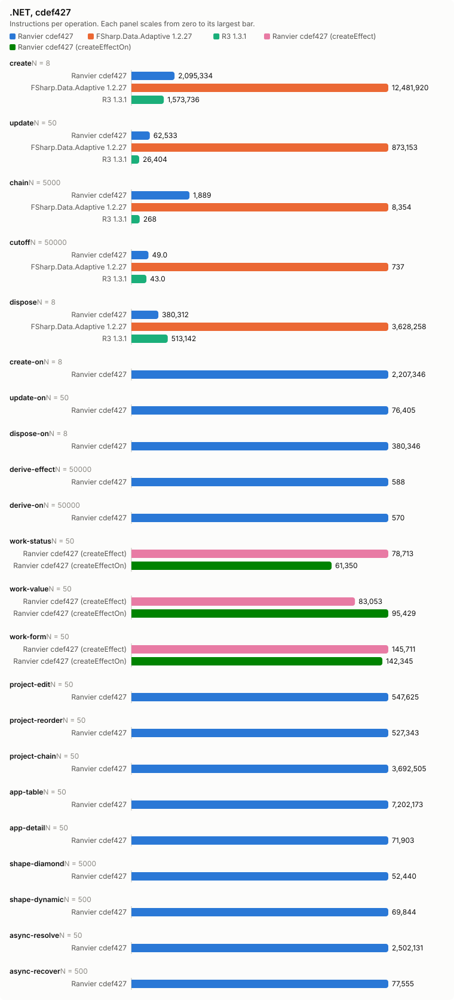
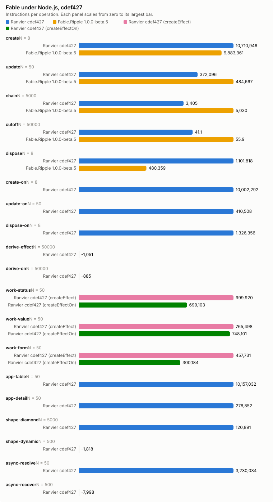

# Counter bench, cdef427

- Date: 2026-09-28 10:57:35Z
- Machine: AMD64 Family 26 Model 68 Stepping 0, AuthenticAMD, 24 logical processors, Microsoft Windows 10.0.26200, .NET 10.0.12
- Instructions: per-context-switch PMC counters (InstructionRetired, TotalCycles, BranchMispredictions)
- Library counters: from a separate RanvierCounters build (--counters-worker)
- Versions: .NET 10.0.12, FSharp.Data.Adaptive 1.2.27, R3 1.3.1, Ranvier cdef427
- Worker environment: DOTNET_TieredCompilation=0 DOTNET_TieredPGO=0 DOTNET_ReadyToRun=0 DOTNET_gcServer=0
- RanvierTrace: false
- Every figure is (m(2N) - m(N)) / N. Processor counters are the median over runs.
- Instruction counts differing by under 5 % are within run-to-run noise. Compare only reports taken at the same --scale.

## Engine differences

- R3 pushes each write straight to its subscribers, without batching or glitch-free ordering. Its chain is `Select` operators holding no cached value.
- FSharp.Data.Adaptive dispose removes the callback subscriptions only. The `AVal.map2` nodes stay in the weak output sets of their `cval`s until collected.

## create: one root of 1000 rows (N = 8)

| Engine | instr/op | cycles/op | br-miss/op | intervals N/2N | bytes/op | objects/op | counters/op |
| --- | ---: | ---: | ---: | ---: | ---: | ---: | --- |
| Ranvier cdef427 | 2,095,333.75 | 869,038.88 | 979.12 | 1/1 | 530,416 | 2,002 | SignalsCreated 1,001, EffectsCreated 1,000, OwnersCreated 1, EdgesAdded 2,000, ObserverInserts 2,000, EffectRuns 1,000, Flushes 1,000 |
| FSharp.Data.Adaptive 1.2.27 | 12,481,919.62 | 6,800,265.12 | 8,266.25 | 2/1 | 2,413,717 | n/a | n/a |
| R3 1.3.1 | 1,573,735.75 | 740,403.75 | 469.62 | 1/2 | 584,160 | n/a | n/a |

## update: write every 10th of 1000 rows (N = 50)

| Engine | instr/op | cycles/op | br-miss/op | intervals N/2N | bytes/op | objects/op | counters/op |
| --- | ---: | ---: | ---: | ---: | ---: | ---: | --- |
| Ranvier cdef427 | 62,532.94 | 21,650.24 | 3.84 | 1/1 | 0 | 0 | EffectRuns 100, Flushes 100 |
| FSharp.Data.Adaptive 1.2.27 | 873,153.04 | 358,379.08 | 407.24 | 2/2 | 63,200 | n/a | n/a |
| R3 1.3.1 | 26,403.74 | 12,322.72 | -0.58 | 1/1 | 0 | n/a | n/a |

## chain: write the source of 4 memos, read the tail (N = 5000)

| Engine | instr/op | cycles/op | br-miss/op | intervals N/2N | bytes/op | objects/op | counters/op |
| --- | ---: | ---: | ---: | ---: | ---: | ---: | --- |
| Ranvier cdef427 | 1,889.31 | 790.77 | 0.05 | 1/2 | 0 | 0 | MemoRecomputes 4 |
| FSharp.Data.Adaptive 1.2.27 | 8,354.15 | 3,079.19 | 1.49 | 1/3 | 472 | n/a | n/a |
| R3 1.3.1 | 268.34 | 139.88 | -0.03 | 1/1 | 0 | n/a | n/a |

## cutoff: write an equal value to an observed source (N = 50000)

| Engine | instr/op | cycles/op | br-miss/op | intervals N/2N | bytes/op | objects/op | counters/op |
| --- | ---: | ---: | ---: | ---: | ---: | ---: | --- |
| Ranvier cdef427 | 48.96 | 19.68 | -0.00 | 1/1 | 0 | 0 | 0 |
| FSharp.Data.Adaptive 1.2.27 | 737.40 | 371.23 | 0.27 | 2/2 | 352 | n/a | n/a |
| R3 1.3.1 | 42.99 | 24.40 | 0.00 | 1/1 | 0 | n/a | n/a |

## dispose: dispose one root of 1000 rows (N = 8)

| Engine | instr/op | cycles/op | br-miss/op | intervals N/2N | bytes/op | objects/op | counters/op |
| --- | ---: | ---: | ---: | ---: | ---: | ---: | --- |
| Ranvier cdef427 | 380,312.25 | 120,189.62 | 19.12 | 1/1 | 56 | 0 | EdgesRemoved 2,000, ObserverRemoves 2,000 |
| FSharp.Data.Adaptive 1.2.27 | 3,628,258 | 2,903,523.38 | 3,398.88 | 1/1 | 0 | n/a | n/a |
| R3 1.3.1 | 513,142.12 | 412,201.62 | 571.25 | 1/1 | 0 | n/a | n/a |

## create-on: one root of 1000 createEffectOn rows (N = 8)

| Engine | instr/op | cycles/op | br-miss/op | intervals N/2N | bytes/op | objects/op | counters/op |
| --- | ---: | ---: | ---: | ---: | ---: | ---: | --- |
| Ranvier cdef427 | 2,207,345.88 | 737,105.38 | 917.50 | 2/2 | 506,456 | 2,002 | SignalsCreated 1,001, EffectsCreated 1,000, OwnersCreated 1, EdgesAdded 2,000, ObserverInserts 2,000, EffectRuns 1,000, Flushes 1,000 |

## update-on: write every 10th of 1000 createEffectOn rows (N = 50)

| Engine | instr/op | cycles/op | br-miss/op | intervals N/2N | bytes/op | objects/op | counters/op |
| --- | ---: | ---: | ---: | ---: | ---: | ---: | --- |
| Ranvier cdef427 | 76,404.64 | 24,442.90 | 1.08 | 1/1 | 0 | 0 | EffectRuns 100, Flushes 100 |

## dispose-on: dispose one root of 1000 createEffectOn rows (N = 8)

| Engine | instr/op | cycles/op | br-miss/op | intervals N/2N | bytes/op | objects/op | counters/op |
| --- | ---: | ---: | ---: | ---: | ---: | ---: | --- |
| Ranvier cdef427 | 380,346.25 | 108,889.25 | 22.25 | 1/1 | 56 | 0 | EdgesRemoved 2,000, ObserverRemoves 2,000 |

## derive-effect: write a new value whose derived value is unchanged, Effect (N = 50000)

| Engine | instr/op | cycles/op | br-miss/op | intervals N/2N | bytes/op | objects/op | counters/op |
| --- | ---: | ---: | ---: | ---: | ---: | ---: | --- |
| Ranvier cdef427 | 588.06 | 193.39 | 0.01 | 2/2 | 0 | 0 | EffectRuns 1, Flushes 1 |

## derive-on: write a new value whose derived value is unchanged, createEffectOn (N = 50000)

| Engine | instr/op | cycles/op | br-miss/op | intervals N/2N | bytes/op | objects/op | counters/op |
| --- | ---: | ---: | ---: | ---: | ---: | ---: | --- |
| Ranvier cdef427 | 570.35 | 186.18 | 0.02 | 1/2 | 0 | 0 | EffectRuns 1, Flushes 1 |

## work-status: write every 10th of 1000 rows; the act formats a label, 1 write in 10 changes it (N = 50)

| Engine | instr/op | cycles/op | br-miss/op | intervals N/2N | bytes/op | objects/op | counters/op |
| --- | ---: | ---: | ---: | ---: | ---: | ---: | --- |
| Ranvier cdef427 (createEffect) | 78,713 | 28,873.60 | 1.90 | 1/1 | 3,980 | 0 | EffectRuns 100, Flushes 100 |
| Ranvier cdef427 (createEffectOn) | 61,350.28 | 24,457.22 | 3.84 | 1/2 | 398.40 | 0 | EffectRuns 100, Flushes 100 |

## work-value: write every 10th of 1000 rows; the act formats a label, every write changes it (N = 50)

| Engine | instr/op | cycles/op | br-miss/op | intervals N/2N | bytes/op | objects/op | counters/op |
| --- | ---: | ---: | ---: | ---: | ---: | ---: | --- |
| Ranvier cdef427 (createEffect) | 83,053.30 | 29,322.56 | 5.30 | 1/1 | 6,467.20 | 0 | EffectRuns 100, Flushes 100 |
| Ranvier cdef427 (createEffectOn) | 95,428.54 | 27,740.20 | 4.50 | 1/1 | 6,467.20 | 0 | EffectRuns 100, Flushes 100 |

## work-form: write one field of each of 125 8-field forms; validity feeds a signal and an effect (N = 50)

| Engine | instr/op | cycles/op | br-miss/op | intervals N/2N | bytes/op | objects/op | counters/op |
| --- | ---: | ---: | ---: | ---: | ---: | ---: | --- |
| Ranvier cdef427 (createEffect) | 145,711.38 | 40,505.76 | 13.32 | 1/1 | 0 | 0 | EffectRuns 126.02, Flushes 125 |
| Ranvier cdef427 (createEffectOn) | 142,345.22 | 33,141.60 | 4.78 | 2/1 | 0 | 0 | EffectRuns 126.02, Flushes 125 |

## project-edit: change one row of a 1000-row projection (N = 50)

| Engine | instr/op | cycles/op | br-miss/op | intervals N/2N | bytes/op | objects/op | counters/op |
| --- | ---: | ---: | ---: | ---: | ---: | ---: | --- |
| Ranvier cdef427 | 547,625.20 | 187,101.30 | 22.76 | 2/2 | 80 | 0 | MemoRecomputes 1, EffectRuns 1, Flushes 1 |

## project-reorder: reverse a 1000-row projection (N = 50)

| Engine | instr/op | cycles/op | br-miss/op | intervals N/2N | bytes/op | objects/op | counters/op |
| --- | ---: | ---: | ---: | ---: | ---: | ---: | --- |
| Ranvier cdef427 | 527,342.90 | 185,735.16 | 22.24 | 1/2 | 4,104 | 0 | Flushes 1 |

## project-chain: change one row of a 1000-row filter, sortBy, map chain (N = 50)

| Engine | instr/op | cycles/op | br-miss/op | intervals N/2N | bytes/op | objects/op | counters/op |
| --- | ---: | ---: | ---: | ---: | ---: | ---: | --- |
| Ranvier cdef427 | 3,692,504.96 | 971,047.02 | 293.74 | 1/2 | 206,664 | 0 | MemoRecomputes 6, EffectRuns 2, Flushes 1 |

## app-table: alternate a filter query and a sort direction over 1000 rows (N = 50)

| Engine | instr/op | cycles/op | br-miss/op | intervals N/2N | bytes/op | objects/op | counters/op |
| --- | ---: | ---: | ---: | ---: | ---: | ---: | --- |
| Ranvier cdef427 | 7,202,173.20 | 2,163,474.78 | 1,210.78 | 2/1 | 420,680.80 | 240 | SignalsCreated 120, MemosCreated 120, EdgesAdded 760.50, EdgesRemoved 760.50, ObserverInserts 760.50, ObserverRemoves 760.50, MemoRecomputes 980, EffectRuns 1, Flushes 1 |

## app-detail: move the selection over 1000 rows; the detail rebuilds 20 memo and effect pairs (N = 50)

| Engine | instr/op | cycles/op | br-miss/op | intervals N/2N | bytes/op | objects/op | counters/op |
| --- | ---: | ---: | ---: | ---: | ---: | ---: | --- |
| Ranvier cdef427 | 71,903.48 | 26,251.44 | 34.80 | 2/1 | 12,960 | 40 | MemosCreated 20, EffectsCreated 20, EdgesAdded 41, EdgesRemoved 41, ObserverInserts 41, ObserverRemoves 41, MemoRecomputes 21, EffectRuns 24, Flushes 1 |

## shape-diamond: write a source read by 100 memos joined by one (N = 5000)

| Engine | instr/op | cycles/op | br-miss/op | intervals N/2N | bytes/op | objects/op | counters/op |
| --- | ---: | ---: | ---: | ---: | ---: | ---: | --- |
| Ranvier cdef427 | 52,439.90 | 17,121.64 | 2.04 | 3/2 | 0 | 0 | MemoRecomputes 101, EffectRuns 1, Flushes 1 |

## shape-dynamic: alternate a branch flip and a write of every active source of 100 effects (N = 500)

| Engine | instr/op | cycles/op | br-miss/op | intervals N/2N | bytes/op | objects/op | counters/op |
| --- | ---: | ---: | ---: | ---: | ---: | ---: | --- |
| Ranvier cdef427 | 69,843.69 | 21,470.72 | 3.13 | 1/2 | 0 | 0 | EdgesAdded 50, EdgesRemoved 50, ObserverInserts 50, ObserverRemoves 50, EffectRuns 100, Flushes 50.50 |

## async-resolve: reload 10 suspense widgets of 10 sources, then settle each (N = 50)

| Engine | instr/op | cycles/op | br-miss/op | intervals N/2N | bytes/op | objects/op | counters/op |
| --- | ---: | ---: | ---: | ---: | ---: | ---: | --- |
| Ranvier cdef427 | 2,502,130.98 | 901,309.88 | 1,242.34 | 2/3 | 69,160 | 0 | EdgesAdded 190, EdgesRemoved 190, ObserverInserts 190, ObserverRemoves 190, EffectRuns 20, Flushes 101 |

## async-recover: fail one source of one error-boundary widget, then settle a replacement (N = 500)

| Engine | instr/op | cycles/op | br-miss/op | intervals N/2N | bytes/op | objects/op | counters/op |
| --- | ---: | ---: | ---: | ---: | ---: | ---: | --- |
| Ranvier cdef427 | 77,554.73 | 26,773.07 | 44.87 | 2/2 | 1,784 | 0 | EdgesAdded 20, EdgesRemoved 20, ObserverInserts 20, ObserverRemoves 20, EffectRuns 4, Flushes 4 |

## Calibration, 3 run(s)

Allocations and library counters identical in every run.

| Scenario | Engine | Source | Median/op | Min/op | Max/op | Spread |
| --- | --- | --- | ---: | ---: | ---: | ---: |
| create | Ranvier | InstructionRetired | 2,095,333.75 | 2,064,566.12 | 2,124,337.62 | 2.90 % |
| create | Ranvier | TotalCycles | 869,038.88 | 833,494.50 | 1,018,887.50 | 22.24 % |
| create | Ranvier | BranchMispredictions | 979.12 | 928.50 | 1,368.62 | 47.40 % |
| create | FSharp.Data.Adaptive | InstructionRetired | 12,481,919.62 | 12,459,329.38 | 12,946,616.62 | 3.91 % |
| create | FSharp.Data.Adaptive | TotalCycles | 6,800,265.12 | 6,529,527.38 | 7,227,867.38 | 10.70 % |
| create | FSharp.Data.Adaptive | BranchMispredictions | 8,266.25 | 7,877.62 | 9,110.25 | 15.65 % |
| create | R3 | InstructionRetired | 1,573,735.75 | 1,572,171.88 | 1,574,353.12 | 0.14 % |
| create | R3 | TotalCycles | 740,403.75 | 726,419.38 | 1,000,809.38 | 37.77 % |
| create | R3 | BranchMispredictions | 469.62 | 246 | 579.62 | 135.62 % |
| update | Ranvier | InstructionRetired | 62,532.94 | 62,284.78 | 62,714.42 | 0.69 % |
| update | Ranvier | TotalCycles | 21,650.24 | 16,076.62 | 47,291 | 194.16 % |
| update | Ranvier | BranchMispredictions | 3.84 | -0.26 | 20.78 | -8,092.31 % |
| update | FSharp.Data.Adaptive | InstructionRetired | 873,153.04 | 872,157.84 | 874,198.64 | 0.23 % |
| update | FSharp.Data.Adaptive | TotalCycles | 358,379.08 | 353,354.28 | 366,497.14 | 3.72 % |
| update | FSharp.Data.Adaptive | BranchMispredictions | 407.24 | 356.02 | 412.06 | 15.74 % |
| update | R3 | InstructionRetired | 26,403.74 | 26,294.24 | 26,517.62 | 0.85 % |
| update | R3 | TotalCycles | 12,322.72 | 10,345.94 | 13,243.02 | 28.00 % |
| update | R3 | BranchMispredictions | -0.58 | -0.84 | 2.46 | -392.86 % |
| chain | Ranvier | InstructionRetired | 1,889.31 | 1,888.33 | 1,903.75 | 0.82 % |
| chain | Ranvier | TotalCycles | 790.77 | 723.60 | 821.88 | 13.58 % |
| chain | Ranvier | BranchMispredictions | 0.05 | -0.03 | 0.29 | -967.47 % |
| chain | FSharp.Data.Adaptive | InstructionRetired | 8,354.15 | 8,354.04 | 8,378.16 | 0.29 % |
| chain | FSharp.Data.Adaptive | TotalCycles | 3,079.19 | 3,062.89 | 3,230.12 | 5.46 % |
| chain | FSharp.Data.Adaptive | BranchMispredictions | 1.49 | 1.34 | 1.69 | 25.91 % |
| chain | R3 | InstructionRetired | 268.34 | 265.44 | 268.43 | 1.13 % |
| chain | R3 | TotalCycles | 139.88 | 131.47 | 153.11 | 16.46 % |
| chain | R3 | BranchMispredictions | -0.03 | -0.05 | 0.03 | -151.98 % |
| cutoff | Ranvier | InstructionRetired | 48.96 | 48.93 | 49.00 | 0.13 % |
| cutoff | Ranvier | TotalCycles | 19.68 | 8.76 | 19.90 | 127.08 % |
| cutoff | Ranvier | BranchMispredictions | -0.00 | -0.00 | -0.00 | -92.24 % |
| cutoff | FSharp.Data.Adaptive | InstructionRetired | 737.40 | 736.58 | 745.71 | 1.24 % |
| cutoff | FSharp.Data.Adaptive | TotalCycles | 371.23 | 370.91 | 377.44 | 1.76 % |
| cutoff | FSharp.Data.Adaptive | BranchMispredictions | 0.27 | 0.27 | 0.34 | 24.88 % |
| cutoff | R3 | InstructionRetired | 42.99 | 42.99 | 43.04 | 0.13 % |
| cutoff | R3 | TotalCycles | 24.40 | 24.24 | 25.80 | 6.43 % |
| cutoff | R3 | BranchMispredictions | 0.00 | 0.00 | 0.00 | 2,150.00 % |
| dispose | Ranvier | InstructionRetired | 380,312.25 | 380,311.62 | 381,922.50 | 0.42 % |
| dispose | Ranvier | TotalCycles | 120,189.62 | 118,628.25 | 134,725.50 | 13.57 % |
| dispose | Ranvier | BranchMispredictions | 19.12 | 15.75 | 77.75 | 393.65 % |
| dispose | FSharp.Data.Adaptive | InstructionRetired | 3,628,258 | 3,618,997.75 | 3,640,047.25 | 0.58 % |
| dispose | FSharp.Data.Adaptive | TotalCycles | 2,903,523.38 | 2,807,977.50 | 3,086,960.50 | 9.94 % |
| dispose | FSharp.Data.Adaptive | BranchMispredictions | 3,398.88 | 3,342.88 | 3,421.25 | 2.34 % |
| dispose | R3 | InstructionRetired | 513,142.12 | 511,584.25 | 523,238.88 | 2.28 % |
| dispose | R3 | TotalCycles | 412,201.62 | 394,658.62 | 416,108.88 | 5.44 % |
| dispose | R3 | BranchMispredictions | 571.25 | 509.88 | 627.75 | 23.12 % |
| create-on | Ranvier | InstructionRetired | 2,207,345.88 | 2,206,914.25 | 2,207,968.75 | 0.05 % |
| create-on | Ranvier | TotalCycles | 737,105.38 | 620,210.88 | 773,764.88 | 24.76 % |
| create-on | Ranvier | BranchMispredictions | 917.50 | 894 | 988.50 | 10.57 % |
| update-on | Ranvier | InstructionRetired | 76,404.64 | 76,403.90 | 76,467.22 | 0.08 % |
| update-on | Ranvier | TotalCycles | 24,442.90 | 22,823.20 | 45,339.58 | 98.66 % |
| update-on | Ranvier | BranchMispredictions | 1.08 | 0.62 | 5.18 | 735.48 % |
| dispose-on | Ranvier | InstructionRetired | 380,346.25 | 380,322.38 | 385,907.75 | 1.47 % |
| dispose-on | Ranvier | TotalCycles | 108,889.25 | 107,172.12 | 166,508.62 | 55.37 % |
| dispose-on | Ranvier | BranchMispredictions | 22.25 | 9.38 | 65.75 | 601.33 % |
| derive-effect | Ranvier | InstructionRetired | 588.06 | 588.05 | 588.80 | 0.13 % |
| derive-effect | Ranvier | TotalCycles | 193.39 | 193.31 | 195.17 | 0.96 % |
| derive-effect | Ranvier | BranchMispredictions | 0.01 | 0.00 | 0.02 | 2,030.95 % |
| derive-on | Ranvier | InstructionRetired | 570.35 | 570.26 | 572.45 | 0.38 % |
| derive-on | Ranvier | TotalCycles | 186.18 | 185.64 | 190.40 | 2.56 % |
| derive-on | Ranvier | BranchMispredictions | 0.02 | 0.00 | 0.04 | 736.92 % |
| work-status | Ranvier (createEffect) | InstructionRetired | 78,713 | 78,711.42 | 78,713.48 | 0.00 % |
| work-status | Ranvier (createEffect) | TotalCycles | 28,873.60 | 21,395.12 | 31,729.86 | 48.30 % |
| work-status | Ranvier (createEffect) | BranchMispredictions | 1.90 | 0.62 | 2.62 | 322.58 % |
| work-status | Ranvier (createEffectOn) | InstructionRetired | 61,350.28 | 61,274.68 | 61,485.40 | 0.34 % |
| work-status | Ranvier (createEffectOn) | TotalCycles | 24,457.22 | 17,336.08 | 24,847.64 | 43.33 % |
| work-status | Ranvier (createEffectOn) | BranchMispredictions | 3.84 | -4.86 | 4.88 | -200.41 % |
| work-value | Ranvier (createEffect) | InstructionRetired | 83,053.30 | 83,053.20 | 83,053.32 | 0.00 % |
| work-value | Ranvier (createEffect) | TotalCycles | 29,322.56 | 27,491.72 | 34,680.24 | 26.15 % |
| work-value | Ranvier (createEffect) | BranchMispredictions | 5.30 | 1.12 | 8.78 | 683.93 % |
| work-value | Ranvier (createEffectOn) | InstructionRetired | 95,428.54 | 95,267.74 | 95,453 | 0.19 % |
| work-value | Ranvier (createEffectOn) | TotalCycles | 27,740.20 | 21,972.38 | 32,248.02 | 46.77 % |
| work-value | Ranvier (createEffectOn) | BranchMispredictions | 4.50 | -3.84 | 5.34 | -239.06 % |
| work-form | Ranvier (createEffect) | InstructionRetired | 145,711.38 | 145,705.16 | 145,798.14 | 0.06 % |
| work-form | Ranvier (createEffect) | TotalCycles | 40,505.76 | 40,133.86 | 42,240.84 | 5.25 % |
| work-form | Ranvier (createEffect) | BranchMispredictions | 13.32 | 12.98 | 23.16 | 78.43 % |
| work-form | Ranvier (createEffectOn) | InstructionRetired | 142,345.22 | 142,194.60 | 143,326.16 | 0.80 % |
| work-form | Ranvier (createEffectOn) | TotalCycles | 33,141.60 | 32,249.98 | 40,728.92 | 26.29 % |
| work-form | Ranvier (createEffectOn) | BranchMispredictions | 4.78 | -5.62 | 24.52 | -536.30 % |
| project-edit | Ranvier | InstructionRetired | 547,625.20 | 545,957.16 | 548,848.02 | 0.53 % |
| project-edit | Ranvier | TotalCycles | 187,101.30 | 185,286.28 | 193,965.50 | 4.68 % |
| project-edit | Ranvier | BranchMispredictions | 22.76 | -10.28 | 45.40 | -541.63 % |
| project-reorder | Ranvier | InstructionRetired | 527,342.90 | 527,052.72 | 527,533.82 | 0.09 % |
| project-reorder | Ranvier | TotalCycles | 185,735.16 | 184,735.14 | 187,514.06 | 1.50 % |
| project-reorder | Ranvier | BranchMispredictions | 22.24 | 21.76 | 34.70 | 59.47 % |
| project-chain | Ranvier | InstructionRetired | 3,692,504.96 | 3,690,423.64 | 3,699,301.78 | 0.24 % |
| project-chain | Ranvier | TotalCycles | 971,047.02 | 957,068.54 | 1,214,594.16 | 26.91 % |
| project-chain | Ranvier | BranchMispredictions | 293.74 | 266.84 | 577.54 | 116.44 % |
| app-table | Ranvier | InstructionRetired | 7,202,173.20 | 7,189,910.66 | 7,212,997.62 | 0.32 % |
| app-table | Ranvier | TotalCycles | 2,163,474.78 | 2,155,321 | 2,297,582.70 | 6.60 % |
| app-table | Ranvier | BranchMispredictions | 1,210.78 | 1,199.26 | 1,315.86 | 9.72 % |
| app-detail | Ranvier | InstructionRetired | 71,903.48 | 71,610.12 | 72,944.78 | 1.86 % |
| app-detail | Ranvier | TotalCycles | 26,251.44 | 18,549.46 | 32,456.80 | 74.97 % |
| app-detail | Ranvier | BranchMispredictions | 34.80 | 22.34 | 63.38 | 183.71 % |
| shape-diamond | Ranvier | InstructionRetired | 52,439.90 | 52,434.58 | 52,458.11 | 0.04 % |
| shape-diamond | Ranvier | TotalCycles | 17,121.64 | 16,980.04 | 17,141.15 | 0.95 % |
| shape-diamond | Ranvier | BranchMispredictions | 2.04 | 1.85 | 2.19 | 17.87 % |
| shape-dynamic | Ranvier | InstructionRetired | 69,843.69 | 69,832.26 | 69,852.94 | 0.03 % |
| shape-dynamic | Ranvier | TotalCycles | 21,470.72 | 20,484.35 | 21,869.18 | 6.76 % |
| shape-dynamic | Ranvier | BranchMispredictions | 3.13 | 2.52 | 3.88 | 53.65 % |
| async-resolve | Ranvier | InstructionRetired | 2,502,130.98 | 2,500,119.14 | 2,505,909.08 | 0.23 % |
| async-resolve | Ranvier | TotalCycles | 901,309.88 | 890,668.68 | 913,428.76 | 2.56 % |
| async-resolve | Ranvier | BranchMispredictions | 1,242.34 | 1,188.88 | 1,326.26 | 11.56 % |
| async-recover | Ranvier | InstructionRetired | 77,554.73 | 77,183.32 | 77,761.96 | 0.75 % |
| async-recover | Ranvier | TotalCycles | 26,773.07 | 24,105.16 | 27,250.57 | 13.05 % |
| async-recover | Ranvier | BranchMispredictions | 44.87 | 36.83 | 52.08 | 41.41 % |

# Fable under Node.js v26.7.0

- Versions: Fable.Ripple 1.0.0-beta.5, Node.js v26.7.0, Ranvier cdef427, fable-library-js 5.18.0
- node flags: --expose-gc --single-threaded
- Instructions: per-context-switch PMC counters (InstructionRetired, TotalCycles, BranchMispredictions); main: the main thread, all: every thread of the process
- bytes/op: growth of the new, old and large-object heap spaces; median of 3 processes. bytes range: minimum..maximum, 0 when every process agreed.
- heapUsed/op: growth of `process.memoryUsage().heapUsed`, which adds the code and trusted spaces.
- Every figure is (m(2N) - m(N)) / N. A figure followed by a bracketed range differed between processes.

## create: one root of 1000 rows (N = 8)

| Engine | instr/op main | instr/op all | cycles/op main | cycles/op all | br-miss/op main | br-miss/op all | bytes/op | bytes range | heapUsed/op | objects/op | counters/op |
| --- | ---: | ---: | ---: | ---: | ---: | ---: | ---: | ---: | ---: | ---: | --- |
| Ranvier cdef427 | 10,710,946 (10,703,043.25..10,717,508.50) | 10,710,946 (10,703,043.25..10,717,508.50) | 3,720,397.75 (3,618,641.12..3,754,909.62) | 3,720,397.75 (3,618,641.12..3,754,909.62) | 17,919.62 (17,270.25..17,925.88) | 17,919.62 (17,270.25..17,925.88) | 1,137,638 | 0 | 1,138,960 | 2,002 | SignalsCreated 1,001, EffectsCreated 1,000, OwnersCreated 1, EdgesAdded 2,000, ObserverInserts 2,000, EffectRuns 1,000, Flushes 1,000 |
| Fable.Ripple 1.0.0-beta.5 | 9,883,361.38 (9,859,308.50..9,943,545.38) | 9,883,361.38 (9,859,308.50..9,943,545.38) | 5,607,989.12 (4,219,779..6,105,260.62) | 5,607,989.12 (4,219,779..6,105,260.62) | 66,517.25 (66,111.88..67,915) | 66,517.25 (66,111.88..67,915) | 1,346,356 | 0 | 1,353,033 | n/a | n/a |

## update: write every 10th of 1000 rows (N = 50)

| Engine | instr/op main | instr/op all | cycles/op main | cycles/op all | br-miss/op main | br-miss/op all | bytes/op | bytes range | heapUsed/op | objects/op | counters/op |
| --- | ---: | ---: | ---: | ---: | ---: | ---: | ---: | ---: | ---: | ---: | --- |
| Ranvier cdef427 | 372,096.30 (371,183.90..372,365.98) | 372,096.30 (371,183.90..372,365.98) | 67,511.62 (30,224.14..69,579.10) | 67,511.62 (30,224.14..69,579.10) | -82.36 (-161.84..-55.88) | -82.36 (-161.84..-55.88) | 8,807.36 | 0 | 8,694.88 | 0 | EffectRuns 100, Flushes 100 |
| Fable.Ripple 1.0.0-beta.5 | 484,666.80 (484,465.98..485,100.98) | 484,666.80 (484,465.98..485,100.98) | 102,375.12 (11,904.10..123,570.98) | 102,375.12 (11,904.10..123,570.98) | -39.12 (-126.94..14.72) | -39.12 (-126.94..14.72) | 24,021.12 | 0 | 24,001.60 | n/a | n/a |

## chain: write the source of 4 memos, read the tail (N = 5000)

| Engine | instr/op main | instr/op all | cycles/op main | cycles/op all | br-miss/op main | br-miss/op all | bytes/op | bytes range | heapUsed/op | objects/op | counters/op |
| --- | ---: | ---: | ---: | ---: | ---: | ---: | ---: | ---: | ---: | ---: | --- |
| Ranvier cdef427 | 3,404.65 (3,402.96..3,405.67) | 3,404.65 (3,402.96..3,405.67) | 553.64 (113.00..622.01) | 553.64 (113.00..622.01) | -0.03 (-0.22..0.04) | -0.03 (-0.22..0.04) | 0.07 | 0 | 1.92 (1.91..1.92) | 0 | MemoRecomputes 4 |
| Fable.Ripple 1.0.0-beta.5 | 5,030.21 (5,028.62..5,033.27) | 5,030.21 (5,028.62..5,033.27) | 741.54 (442.25..743.84) | 741.54 (442.25..743.84) | 0.11 (-0.12..0.13) | 0.11 (-0.12..0.13) | 0 | 0 | 0 | n/a | n/a |

## cutoff: write an equal value to an observed source (N = 50000)

| Engine | instr/op main | instr/op all | cycles/op main | cycles/op all | br-miss/op main | br-miss/op all | bytes/op | bytes range | heapUsed/op | objects/op | counters/op |
| --- | ---: | ---: | ---: | ---: | ---: | ---: | ---: | ---: | ---: | ---: | --- |
| Ranvier cdef427 | 41.11 (41.02..41.15) | 41.11 (41.02..41.15) | 1.43 (-2.52..3.81) | 1.43 (-2.52..3.81) | 0.00 (-0.00..0.01) | 0.00 (-0.00..0.01) | 0 | 0 | 0 | 0 | 0 |
| Fable.Ripple 1.0.0-beta.5 | 55.89 (55.47..55.92) | 55.89 (55.47..55.92) | 8.65 (2.89..14.57) | 8.65 (2.89..14.57) | 0.00 (-0.01..0.00) | 0.00 (-0.01..0.00) | 0 | 0 | 0.03 | n/a | n/a |

## dispose: dispose one root of 1000 rows (N = 8)

| Engine | instr/op main | instr/op all | cycles/op main | cycles/op all | br-miss/op main | br-miss/op all | bytes/op | bytes range | heapUsed/op | objects/op | counters/op |
| --- | ---: | ---: | ---: | ---: | ---: | ---: | ---: | ---: | ---: | ---: | --- |
| Ranvier cdef427 | 1,101,817.62 (1,094,543.25..1,108,423.12) | 1,101,817.62 (1,094,543.25..1,108,423.12) | 985,353.75 (942,587.25..1,152,956.25) | 985,353.75 (942,587.25..1,152,956.25) | 1,340.50 (1,337.62..1,355) | 1,340.50 (1,337.62..1,355) | 29,234 | 0 | 29,328 | 0 | EdgesRemoved 2,000, ObserverRemoves 2,000 |
| Fable.Ripple 1.0.0-beta.5 | 480,358.88 (478,891..480,410.50) | 480,358.88 (478,891..480,410.50) | 187,925 (105,148.12..461,101.62) | 187,925 (105,148.12..461,101.62) | 36.75 (-28.88..50.50) | 36.75 (-28.88..50.50) | 28,672 | 0 | 28,672 | n/a | n/a |

## create-on: one root of 1000 createEffectOn rows (N = 8)

| Engine | instr/op main | instr/op all | cycles/op main | cycles/op all | br-miss/op main | br-miss/op all | bytes/op | bytes range | heapUsed/op | objects/op | counters/op |
| --- | ---: | ---: | ---: | ---: | ---: | ---: | ---: | ---: | ---: | ---: | --- |
| Ranvier cdef427 | 10,002,292.38 (9,917,842.38..10,014,699.50) | 10,002,292.38 (9,917,842.38..10,014,699.50) | 4,345,805.62 (3,987,975.12..4,458,665.88) | 4,345,805.62 (3,987,975.12..4,458,665.88) | 28,342.50 (26,938..28,453.38) | 28,342.50 (26,938..28,453.38) | 1,023,016 | 0 | 1,027,369 | 2,002 | SignalsCreated 1,001, EffectsCreated 1,000, OwnersCreated 1, EdgesAdded 2,000, ObserverInserts 2,000, EffectRuns 1,000, Flushes 1,000 |

## update-on: write every 10th of 1000 createEffectOn rows (N = 50)

| Engine | instr/op main | instr/op all | cycles/op main | cycles/op all | br-miss/op main | br-miss/op all | bytes/op | bytes range | heapUsed/op | objects/op | counters/op |
| --- | ---: | ---: | ---: | ---: | ---: | ---: | ---: | ---: | ---: | ---: | --- |
| Ranvier cdef427 | 410,507.82 (410,392.42..411,359.94) | 410,507.82 (410,392.42..411,359.94) | 71,186.26 (65,499.24..100,133.18) | 71,186.26 (65,499.24..100,133.18) | 149.62 (143.66..164.64) | 149.62 (143.66..164.64) | 8,790.40 | 0 | 9,014.24 | 0 | EffectRuns 100, Flushes 100 |

## dispose-on: dispose one root of 1000 createEffectOn rows (N = 8)

| Engine | instr/op main | instr/op all | cycles/op main | cycles/op all | br-miss/op main | br-miss/op all | bytes/op | bytes range | heapUsed/op | objects/op | counters/op |
| --- | ---: | ---: | ---: | ---: | ---: | ---: | ---: | ---: | ---: | ---: | --- |
| Ranvier cdef427 | 1,326,355.62 (1,307,497.88..1,331,965.12) | 1,326,355.62 (1,307,497.88..1,331,965.12) | 852,359 (441,095.75..924,086.75) | 852,359 (441,095.75..924,086.75) | 879.25 (846.50..959.50) | 879.25 (846.50..959.50) | 29,232 | 0 | 29,232 | 0 | EdgesRemoved 2,000, ObserverRemoves 2,000 |

## derive-effect: write a new value whose derived value is unchanged, Effect (N = 50000)

| Engine | instr/op main | instr/op all | cycles/op main | cycles/op all | br-miss/op main | br-miss/op all | bytes/op | bytes range | heapUsed/op | objects/op | counters/op |
| --- | ---: | ---: | ---: | ---: | ---: | ---: | ---: | ---: | ---: | ---: | --- |
| Ranvier cdef427 | -1,050.76 (-1,068.86..-1,040.53) | -1,050.76 (-1,068.86..-1,040.53) | -945.25 (-946.88..-853.46) | -945.25 (-946.88..-853.46) | -10.18 (-10.18..-10.16) | -10.18 (-10.18..-10.16) | -0.03 | 0 | -0.86 | 0 | EffectRuns 1, Flushes 1 |

## derive-on: write a new value whose derived value is unchanged, createEffectOn (N = 50000)

| Engine | instr/op main | instr/op all | cycles/op main | cycles/op all | br-miss/op main | br-miss/op all | bytes/op | bytes range | heapUsed/op | objects/op | counters/op |
| --- | ---: | ---: | ---: | ---: | ---: | ---: | ---: | ---: | ---: | ---: | --- |
| Ranvier cdef427 | -884.92 (-924.44..-877.12) | -884.92 (-924.44..-877.12) | -851.21 (-1,040.71..-667.70) | -851.21 (-1,040.71..-667.70) | -9.22 (-9.53..-9.08) | -9.22 (-9.53..-9.08) | -0.01 | 0 | -0.76 | 0 | EffectRuns 1, Flushes 1 |

## work-status: write every 10th of 1000 rows; the act formats a label, 1 write in 10 changes it (N = 50)

| Engine | instr/op main | instr/op all | cycles/op main | cycles/op all | br-miss/op main | br-miss/op all | bytes/op | bytes range | heapUsed/op | objects/op | counters/op |
| --- | ---: | ---: | ---: | ---: | ---: | ---: | ---: | ---: | ---: | ---: | --- |
| Ranvier cdef427 (createEffect) | 999,920.40 (997,918.72..1,002,117.74) | 999,920.40 (997,918.72..1,002,117.74) | 457,885.20 (434,631.04..481,127.22) | 457,885.20 (434,631.04..481,127.22) | 3,570.04 (3,523.28..3,580.80) | 3,570.04 (3,523.28..3,580.80) | 34,324 | 0 | 34,590.24 | 0 | EffectRuns 100, Flushes 100 |
| Ranvier cdef427 (createEffectOn) | 699,103.28 (694,596.04..700,224.54) | 699,103.28 (694,596.04..700,224.54) | 287,039.20 (267,700.18..299,852.36) | 287,039.20 (267,700.18..299,852.36) | 1,610.26 (1,602.52..1,646.88) | 1,610.26 (1,602.52..1,646.88) | 10,995.52 | 0 | 11,128 | 0 | EffectRuns 100, Flushes 100 |

## work-value: write every 10th of 1000 rows; the act formats a label, every write changes it (N = 50)

| Engine | instr/op main | instr/op all | cycles/op main | cycles/op all | br-miss/op main | br-miss/op all | bytes/op | bytes range | heapUsed/op | objects/op | counters/op |
| --- | ---: | ---: | ---: | ---: | ---: | ---: | ---: | ---: | ---: | ---: | --- |
| Ranvier cdef427 (createEffect) | 765,497.78 (761,689.80..766,492.82) | 765,497.78 (761,689.80..766,492.82) | 286,410.28 (221,409.82..319,918.68) | 286,410.28 (221,409.82..319,918.68) | 1,537.44 (1,452.74..1,628.84) | 1,537.44 (1,452.74..1,628.84) | 33,157.92 | 0 | 33,231.84 | 0 | EffectRuns 100, Flushes 100 |
| Ranvier cdef427 (createEffectOn) | 748,100.90 (739,121.12..748,979.38) | 748,100.90 (739,121.12..748,979.38) | 243,998.30 (123,399.92..278,935.40) | 243,998.30 (123,399.92..278,935.40) | 1,104.32 (932.76..1,197.42) | 1,104.32 (932.76..1,197.42) | 33,026.72 | 0 | 33,146.40 | 0 | EffectRuns 100, Flushes 100 |

## work-form: write one field of each of 125 8-field forms; validity feeds a signal and an effect (N = 50)

| Engine | instr/op main | instr/op all | cycles/op main | cycles/op all | br-miss/op main | br-miss/op all | bytes/op | bytes range | heapUsed/op | objects/op | counters/op |
| --- | ---: | ---: | ---: | ---: | ---: | ---: | ---: | ---: | ---: | ---: | --- |
| Ranvier cdef427 (createEffect) | 457,730.56 (456,881.76..458,494.96) | 457,730.56 (456,881.76..458,494.96) | 258,148.70 (227,000.14..290,597.20) | 258,148.70 (227,000.14..290,597.20) | 3,038.70 (2,997.80..3,155.80) | 3,038.70 (2,997.80..3,155.80) | -15.84 | 0 | 236.80 | 0 | EffectRuns 126.02, Flushes 125 |
| Ranvier cdef427 (createEffectOn) | 300,183.88 (299,821.16..300,376.02) | 300,183.88 (299,821.16..300,376.02) | 43,770.72 (43,480.62..61,621.14) | 43,770.72 (43,480.62..61,621.14) | 39.32 (10.18..45.76) | 39.32 (10.18..45.76) | 0 | 0 | 0 | 0 | EffectRuns 126.02, Flushes 125 |

## app-table: alternate a filter query and a sort direction over 1000 rows (N = 50)

| Engine | instr/op main | instr/op all | cycles/op main | cycles/op all | br-miss/op main | br-miss/op all | bytes/op | bytes range | heapUsed/op | objects/op | counters/op |
| --- | ---: | ---: | ---: | ---: | ---: | ---: | ---: | ---: | ---: | ---: | --- |
| Ranvier cdef427 | 10,157,031.70 (9,668,409.94..10,169,012.96) | 10,597,479.90 (10,089,529.22..10,606,268.48) | 4,346,646.68 (2,593,509.20..6,972,937.08) | 4,597,392.98 (2,802,995.28..7,284,473.04) | 6,943.26 (6,732.32..7,594.66) | 7,498.48 (7,224.86..8,212.30) | 356,478.40 (GC in region) | 356,324.48..356,478.40 | 355,932.48 (355,782.08..355,932.48) | 240 | SignalsCreated 120, MemosCreated 120, EdgesAdded 760.50, EdgesRemoved 760.50, ObserverInserts 760.50, ObserverRemoves 760.50, MemoRecomputes 980, EffectRuns 1, Flushes 1 |

## app-detail: move the selection over 1000 rows; the detail rebuilds 20 memo and effect pairs (N = 50)

| Engine | instr/op main | instr/op all | cycles/op main | cycles/op all | br-miss/op main | br-miss/op all | bytes/op | bytes range | heapUsed/op | objects/op | counters/op |
| --- | ---: | ---: | ---: | ---: | ---: | ---: | ---: | ---: | ---: | ---: | --- |
| Ranvier cdef427 | 278,851.66 (278,592.62..279,885.72) | 278,851.66 (278,592.62..279,885.72) | 101,432.82 (81,945.34..158,697.46) | 101,432.82 (81,945.34..158,697.46) | 296.86 (59.70..493.20) | 296.86 (59.70..493.20) | 31,760.96 | 0 | 31,795.04 | 40 | MemosCreated 20, EffectsCreated 20, EdgesAdded 41, EdgesRemoved 41, ObserverInserts 41, ObserverRemoves 41, MemoRecomputes 21, EffectRuns 24, Flushes 1 |

## shape-diamond: write a source read by 100 memos joined by one (N = 5000)

| Engine | instr/op main | instr/op all | cycles/op main | cycles/op all | br-miss/op main | br-miss/op all | bytes/op | bytes range | heapUsed/op | objects/op | counters/op |
| --- | ---: | ---: | ---: | ---: | ---: | ---: | ---: | ---: | ---: | ---: | --- |
| Ranvier cdef427 | 120,891.29 (120,835.02..121,139.36) | 120,891.29 (120,835.02..121,139.36) | 30,267.70 (16,039.63..36,957.54) | 30,267.70 (16,039.63..36,957.54) | -28.60 (-28.77..-25.97) | -28.60 (-28.77..-25.97) | -0.35 | 0 | -3.97 | 0 | MemoRecomputes 101, EffectRuns 1, Flushes 1 |

## shape-dynamic: alternate a branch flip and a write of every active source of 100 effects (N = 500)

| Engine | instr/op main | instr/op all | cycles/op main | cycles/op all | br-miss/op main | br-miss/op all | bytes/op | bytes range | heapUsed/op | objects/op | counters/op |
| --- | ---: | ---: | ---: | ---: | ---: | ---: | ---: | ---: | ---: | ---: | --- |
| Ranvier cdef427 | -1,818.09 (-7,363.82..453.22) | -1,818.09 (-7,363.82..453.22) | -73,495.76 (-89,926.62..-43,004.53) | -73,495.76 (-89,926.62..-43,004.53) | -1,019.36 (-1,041.37..-980.89) | -1,019.36 (-1,041.37..-980.89) | 3,189.57 | 3,189.57..3,192.06 | 3,090.93 (3,090.88..3,093.38) | 0 | EdgesAdded 50, EdgesRemoved 50, ObserverInserts 50, ObserverRemoves 50, EffectRuns 100, Flushes 50.50 |

## async-resolve: reload 10 suspense widgets of 10 sources, then settle each (N = 50)

| Engine | instr/op main | instr/op all | cycles/op main | cycles/op all | br-miss/op main | br-miss/op all | bytes/op | bytes range | heapUsed/op | objects/op | counters/op |
| --- | ---: | ---: | ---: | ---: | ---: | ---: | ---: | ---: | ---: | ---: | --- |
| Ranvier cdef427 | 3,230,034.42 (3,215,539.10..3,249,203.06) | 3,230,034.42 (3,215,539.10..3,249,203.06) | 1,580,058.92 (1,563,801.46..2,073,449.50) | 1,580,058.92 (1,563,801.46..2,073,449.50) | 9,227.32 (8,291.66..9,274.14) | 9,227.32 (8,291.66..9,274.14) | 178,084.64 | 0 | 178,620.32 (178,616.80..178,620.48) | 0 | EdgesAdded 190, EdgesRemoved 190, ObserverInserts 190, ObserverRemoves 190, EffectRuns 20, Flushes 101 |

## async-recover: fail one source of one error-boundary widget, then settle a replacement (N = 500)

| Engine | instr/op main | instr/op all | cycles/op main | cycles/op all | br-miss/op main | br-miss/op all | bytes/op | bytes range | heapUsed/op | objects/op | counters/op |
| --- | ---: | ---: | ---: | ---: | ---: | ---: | ---: | ---: | ---: | ---: | --- |
| Ranvier cdef427 | -7,997.66 (-10,754.99..-7,248.94) | -7,997.66 (-10,754.99..-7,248.94) | -58,093.81 (-62,725.93..-36,768.61) | -58,093.81 (-62,725.93..-36,768.61) | -833.72 (-883.42..-828.59) | -833.72 (-883.42..-828.59) | 6,491.09 | 0 | 6,429.23 (6,428.96..6,429.23) | 0 | EdgesAdded 20, EdgesRemoved 20, ObserverInserts 20, ObserverRemoves 20, EffectRuns 4, Flushes 4 |

# Appendix: instructions per operation

The instr/op medians from the tables above; Node.js bars are main-thread figures. Each panel has its own scale.

## .NET

## Fable under Node.js

