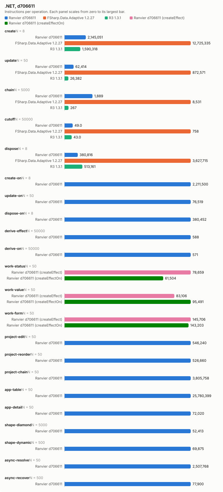
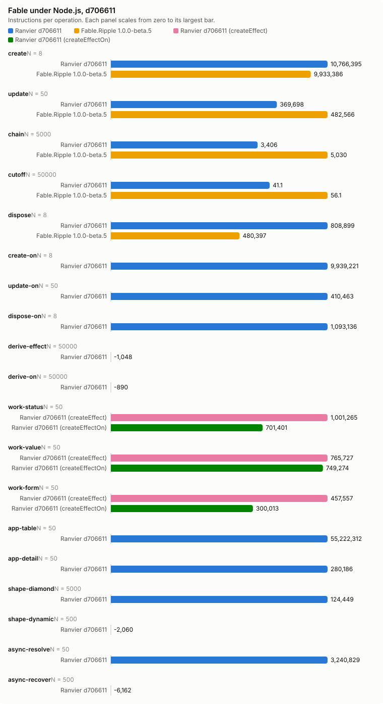

# Counter bench, d706611

- Date: 2026-09-27 17:16:27Z
- Machine: AMD64 Family 26 Model 68 Stepping 0, AuthenticAMD, 24 logical processors, Microsoft Windows 10.0.26200, .NET 10.0.12
- Instructions: per-context-switch PMC counters (InstructionRetired, TotalCycles, BranchMispredictions)
- Library counters: from a separate RanvierCounters build (--counters-worker)
- Versions: .NET 10.0.12, FSharp.Data.Adaptive 1.2.27, R3 1.3.1, Ranvier d706611
- Worker environment: DOTNET_TieredCompilation=0 DOTNET_TieredPGO=0 DOTNET_ReadyToRun=0 DOTNET_gcServer=0
- Every figure is (m(2N) - m(N)) / N. Processor counters are the median over runs.
- Instruction counts differing by under 5 % are within run-to-run noise. Compare only reports taken at the same --scale.

## Engine differences

- R3 pushes each write straight to its subscribers, without batching or glitch-free ordering. Its chain is `Select` operators holding no cached value.
- FSharp.Data.Adaptive dispose removes the callback subscriptions only. The `AVal.map2` nodes stay in the weak output sets of their `cval`s until collected.

## create: one root of 1000 rows (N = 8)

| Engine | instr/op | cycles/op | br-miss/op | intervals N/2N | bytes/op | objects/op | counters/op |
| --- | ---: | ---: | ---: | ---: | ---: | ---: | --- |
| Ranvier d706611 | 2,145,051.25 | 985,797.12 | 1,106.50 | 2/4 | 530,416 | 2,002 | SignalsCreated 1,001, EffectsCreated 1,000, OwnersCreated 1, EdgesAdded 2,000, ObserverInserts 2,000, EffectRuns 1,000, Flushes 1,000 |
| FSharp.Data.Adaptive 1.2.27 | 12,725,335.25 | 7,601,028.12 | 9,184.88 | 11/8 | 2,413,717 | n/a | n/a |
| R3 1.3.1 | 1,590,317.75 | 927,817.88 | 506.50 | 1/7 | 584,160 | n/a | n/a |

## update: write every 10th of 1000 rows (N = 50)

| Engine | instr/op | cycles/op | br-miss/op | intervals N/2N | bytes/op | objects/op | counters/op |
| --- | ---: | ---: | ---: | ---: | ---: | ---: | --- |
| Ranvier d706611 | 62,414.44 | 25,279.26 | 0.78 | 2/1 | 0 | 0 | EffectRuns 100, Flushes 100 |
| FSharp.Data.Adaptive 1.2.27 | 872,570.98 | 382,298.52 | 415.68 | 1/1 | 63,200 | n/a | n/a |
| R3 1.3.1 | 26,381.90 | 15,715.52 | 0.88 | 1/1 | 0 | n/a | n/a |

## chain: write the source of 4 memos, read the tail (N = 5000)

| Engine | instr/op | cycles/op | br-miss/op | intervals N/2N | bytes/op | objects/op | counters/op |
| --- | ---: | ---: | ---: | ---: | ---: | ---: | --- |
| Ranvier d706611 | 1,888.72 | 847.65 | 1.25 | 2/2 | 0 | 0 | MemoRecomputes 4 |
| FSharp.Data.Adaptive 1.2.27 | 8,531.22 | 3,399.94 | 1.79 | 2/3 | 472 | n/a | n/a |
| R3 1.3.1 | 267.01 | 180.75 | 0.02 | 1/4 | 0 | n/a | n/a |

## cutoff: write an equal value to an observed source (N = 50000)

| Engine | instr/op | cycles/op | br-miss/op | intervals N/2N | bytes/op | objects/op | counters/op |
| --- | ---: | ---: | ---: | ---: | ---: | ---: | --- |
| Ranvier d706611 | 49.00 | 21.10 | 0.00 | 1/1 | 0 | 0 | 0 |
| FSharp.Data.Adaptive 1.2.27 | 758.37 | 466.53 | 0.33 | 8/4 | 352 | n/a | n/a |
| R3 1.3.1 | 43.00 | 22.23 | -0.00 | 1/1 | 0 | n/a | n/a |

## dispose: dispose one root of 1000 rows (N = 8)

| Engine | instr/op | cycles/op | br-miss/op | intervals N/2N | bytes/op | objects/op | counters/op |
| --- | ---: | ---: | ---: | ---: | ---: | ---: | --- |
| Ranvier d706611 | 380,815.62 | 152,082.62 | 39.62 | 1/1 | 56 | 0 | EdgesRemoved 2,000, ObserverRemoves 2,000 |
| FSharp.Data.Adaptive 1.2.27 | 3,627,715.25 | 3,600,409.88 | 3,766.88 | 2/10 | 0 | n/a | n/a |
| R3 1.3.1 | 513,160.62 | 492,834.88 | 585.50 | 1/1 | 0 | n/a | n/a |

## create-on: one root of 1000 createEffectOn rows (N = 8)

| Engine | instr/op | cycles/op | br-miss/op | intervals N/2N | bytes/op | objects/op | counters/op |
| --- | ---: | ---: | ---: | ---: | ---: | ---: | --- |
| Ranvier d706611 | 2,211,500.50 | 818,755.88 | 1,088.62 | 1/2 | 506,456 | 2,002 | SignalsCreated 1,001, EffectsCreated 1,000, OwnersCreated 1, EdgesAdded 2,000, ObserverInserts 2,000, EffectRuns 1,000, Flushes 1,000 |

## update-on: write every 10th of 1000 createEffectOn rows (N = 50)

| Engine | instr/op | cycles/op | br-miss/op | intervals N/2N | bytes/op | objects/op | counters/op |
| --- | ---: | ---: | ---: | ---: | ---: | ---: | --- |
| Ranvier d706611 | 76,518.96 | 22,932.06 | 1.20 | 1/1 | 0 | 0 | EffectRuns 100, Flushes 100 |

## dispose-on: dispose one root of 1000 createEffectOn rows (N = 8)

| Engine | instr/op | cycles/op | br-miss/op | intervals N/2N | bytes/op | objects/op | counters/op |
| --- | ---: | ---: | ---: | ---: | ---: | ---: | --- |
| Ranvier d706611 | 380,452 | 180,717.62 | 19.25 | 2/2 | 56 | 0 | EdgesRemoved 2,000, ObserverRemoves 2,000 |

## derive-effect: write a new value whose derived value is unchanged, Effect (N = 50000)

| Engine | instr/op | cycles/op | br-miss/op | intervals N/2N | bytes/op | objects/op | counters/op |
| --- | ---: | ---: | ---: | ---: | ---: | ---: | --- |
| Ranvier d706611 | 587.97 | 221.61 | 0.01 | 1/1 | 0 | 0 | EffectRuns 1, Flushes 1 |

## derive-on: write a new value whose derived value is unchanged, createEffectOn (N = 50000)

| Engine | instr/op | cycles/op | br-miss/op | intervals N/2N | bytes/op | objects/op | counters/op |
| --- | ---: | ---: | ---: | ---: | ---: | ---: | --- |
| Ranvier d706611 | 570.50 | 213.54 | 0.01 | 2/7 | 0 | 0 | EffectRuns 1, Flushes 1 |

## work-status: write every 10th of 1000 rows; the act formats a label, 1 write in 10 changes it (N = 50)

| Engine | instr/op | cycles/op | br-miss/op | intervals N/2N | bytes/op | objects/op | counters/op |
| --- | ---: | ---: | ---: | ---: | ---: | ---: | --- |
| Ranvier d706611 (createEffect) | 78,659.24 | 21,959.42 | 2.86 | 2/1 | 3,980 | 0 | EffectRuns 100, Flushes 100 |
| Ranvier d706611 (createEffectOn) | 61,504.30 | 20,074.62 | 0.46 | 1/1 | 398.40 | 0 | EffectRuns 100, Flushes 100 |

## work-value: write every 10th of 1000 rows; the act formats a label, every write changes it (N = 50)

| Engine | instr/op | cycles/op | br-miss/op | intervals N/2N | bytes/op | objects/op | counters/op |
| --- | ---: | ---: | ---: | ---: | ---: | ---: | --- |
| Ranvier d706611 (createEffect) | 83,106.40 | 27,010.54 | 6.40 | 1/1 | 6,467.20 | 0 | EffectRuns 100, Flushes 100 |
| Ranvier d706611 (createEffectOn) | 95,490.56 | 33,369.02 | 4.06 | 1/2 | 6,467.20 | 0 | EffectRuns 100, Flushes 100 |

## work-form: write one field of each of 125 8-field forms; validity feeds a signal and an effect (N = 50)

| Engine | instr/op | cycles/op | br-miss/op | intervals N/2N | bytes/op | objects/op | counters/op |
| --- | ---: | ---: | ---: | ---: | ---: | ---: | --- |
| Ranvier d706611 (createEffect) | 145,705.80 | 50,281.16 | 18.16 | 1/1 | 0 | 0 | EffectRuns 126.02, Flushes 125 |
| Ranvier d706611 (createEffectOn) | 143,202.76 | 40,371.16 | 14.62 | 1/1 | 0 | 0 | EffectRuns 126.02, Flushes 125 |

## project-edit: change one row of a 1000-row projection (N = 50)

| Engine | instr/op | cycles/op | br-miss/op | intervals N/2N | bytes/op | objects/op | counters/op |
| --- | ---: | ---: | ---: | ---: | ---: | ---: | --- |
| Ranvier d706611 | 546,240.06 | 200,833.24 | -28.30 | 2/1 | 80 | 0 | MemoRecomputes 1, EffectRuns 1, Flushes 1 |

## project-reorder: reverse a 1000-row projection (N = 50)

| Engine | instr/op | cycles/op | br-miss/op | intervals N/2N | bytes/op | objects/op | counters/op |
| --- | ---: | ---: | ---: | ---: | ---: | ---: | --- |
| Ranvier d706611 | 526,660.14 | 209,905.94 | 19.54 | 2/3 | 4,104 | 0 | Flushes 1 |

## project-chain: change one row of a 1000-row filter, sortBy, map chain (N = 50)

| Engine | instr/op | cycles/op | br-miss/op | intervals N/2N | bytes/op | objects/op | counters/op |
| --- | ---: | ---: | ---: | ---: | ---: | ---: | --- |
| Ranvier d706611 | 3,805,758.42 | 1,167,264.52 | 564.32 | 2/21 | 206,664 | 0 | MemoRecomputes 6, EffectRuns 2, Flushes 1 |

## app-table: alternate a filter query and a sort direction over 1000 rows (N = 50)

| Engine | instr/op | cycles/op | br-miss/op | intervals N/2N | bytes/op | objects/op | counters/op |
| --- | ---: | ---: | ---: | ---: | ---: | ---: | --- |
| Ranvier d706611 | 25,780,398.78 | 10,038,169.98 | 3,001.48 | 38/61 | 420,680.80 | 240 | SignalsCreated 120, MemosCreated 120, EdgesAdded 760.50, EdgesRemoved 760.50, ObserverInserts 760.50, ObserverRemoves 760.50, MemoRecomputes 980, EffectRuns 1, Flushes 1 |

## app-detail: move the selection over 1000 rows; the detail rebuilds 20 memo and effect pairs (N = 50)

| Engine | instr/op | cycles/op | br-miss/op | intervals N/2N | bytes/op | objects/op | counters/op |
| --- | ---: | ---: | ---: | ---: | ---: | ---: | --- |
| Ranvier d706611 | 72,019.98 | 47,911.58 | 42.16 | 1/1 | 12,960 | 40 | MemosCreated 20, EffectsCreated 20, EdgesAdded 41, EdgesRemoved 41, ObserverInserts 41, ObserverRemoves 41, MemoRecomputes 21, EffectRuns 24, Flushes 1 |

## shape-diamond: write a source read by 100 memos joined by one (N = 5000)

| Engine | instr/op | cycles/op | br-miss/op | intervals N/2N | bytes/op | objects/op | counters/op |
| --- | ---: | ---: | ---: | ---: | ---: | ---: | --- |
| Ranvier d706611 | 52,413.19 | 21,034.60 | 2.93 | 3/13 | 0 | 0 | MemoRecomputes 101, EffectRuns 1, Flushes 1 |

## shape-dynamic: alternate a branch flip and a write of every active source of 100 effects (N = 500)

| Engine | instr/op | cycles/op | br-miss/op | intervals N/2N | bytes/op | objects/op | counters/op |
| --- | ---: | ---: | ---: | ---: | ---: | ---: | --- |
| Ranvier d706611 | 69,875.05 | 30,880.29 | 5.28 | 2/4 | 0 | 0 | EdgesAdded 50, EdgesRemoved 50, ObserverInserts 50, ObserverRemoves 50, EffectRuns 100, Flushes 50.50 |

## async-resolve: reload 10 suspense widgets of 10 sources, then settle each (N = 50)

| Engine | instr/op | cycles/op | br-miss/op | intervals N/2N | bytes/op | objects/op | counters/op |
| --- | ---: | ---: | ---: | ---: | ---: | ---: | --- |
| Ranvier d706611 | 2,507,767.74 | 1,297,445.08 | 1,545.52 | 3/5 | 69,160 | 0 | EdgesAdded 190, EdgesRemoved 190, ObserverInserts 190, ObserverRemoves 190, EffectRuns 20, Flushes 101 |

## async-recover: fail one source of one error-boundary widget, then settle a replacement (N = 500)

| Engine | instr/op | cycles/op | br-miss/op | intervals N/2N | bytes/op | objects/op | counters/op |
| --- | ---: | ---: | ---: | ---: | ---: | ---: | --- |
| Ranvier d706611 | 77,900.14 | 34,441.13 | 57.52 | 2/4 | 1,784 | 0 | EdgesAdded 20, EdgesRemoved 20, ObserverInserts 20, ObserverRemoves 20, EffectRuns 4, Flushes 4 |

## Calibration, 5 run(s)

Allocations and library counters identical in every run.

| Scenario | Engine | Source | Median/op | Min/op | Max/op | Spread |
| --- | --- | --- | ---: | ---: | ---: | ---: |
| create | Ranvier | InstructionRetired | 2,145,051.25 | 2,091,221.75 | 2,226,557.12 | 6.47 % |
| create | Ranvier | TotalCycles | 985,797.12 | 957,352.75 | 1,205,641.62 | 25.93 % |
| create | Ranvier | BranchMispredictions | 1,106.50 | 791.50 | 1,583 | 100.00 % |
| create | FSharp.Data.Adaptive | InstructionRetired | 12,725,335.25 | 12,468,619 | 12,876,228 | 3.27 % |
| create | FSharp.Data.Adaptive | TotalCycles | 7,601,028.12 | 7,202,590.88 | 7,829,278.62 | 8.70 % |
| create | FSharp.Data.Adaptive | BranchMispredictions | 9,184.88 | 8,069.25 | 10,209.12 | 26.52 % |
| create | R3 | InstructionRetired | 1,590,317.75 | 1,569,907.88 | 1,591,830.88 | 1.40 % |
| create | R3 | TotalCycles | 927,817.88 | 587,554.62 | 1,109,841.88 | 88.89 % |
| create | R3 | BranchMispredictions | 506.50 | 225.62 | 751.50 | 233.07 % |
| update | Ranvier | InstructionRetired | 62,414.44 | 62,067.96 | 63,395.16 | 2.14 % |
| update | Ranvier | TotalCycles | 25,279.26 | 17,684.18 | 28,934.82 | 63.62 % |
| update | Ranvier | BranchMispredictions | 0.78 | -4.84 | 24.18 | -599.59 % |
| update | FSharp.Data.Adaptive | InstructionRetired | 872,570.98 | 872,382.42 | 880,306.40 | 0.91 % |
| update | FSharp.Data.Adaptive | TotalCycles | 382,298.52 | 373,502.30 | 482,779.58 | 29.26 % |
| update | FSharp.Data.Adaptive | BranchMispredictions | 415.68 | 334.72 | 499.28 | 49.16 % |
| update | R3 | InstructionRetired | 26,381.90 | 25,317.22 | 26,490.08 | 4.63 % |
| update | R3 | TotalCycles | 15,715.52 | 11,519.94 | 24,314.42 | 111.06 % |
| update | R3 | BranchMispredictions | 0.88 | -22.18 | 7.28 | -132.82 % |
| chain | Ranvier | InstructionRetired | 1,888.72 | 1,881.05 | 1,994.08 | 6.01 % |
| chain | Ranvier | TotalCycles | 847.65 | 540.07 | 1,421.89 | 163.28 % |
| chain | Ranvier | BranchMispredictions | 1.25 | -0.95 | 2.05 | -316.01 % |
| chain | FSharp.Data.Adaptive | InstructionRetired | 8,531.22 | 8,370.34 | 8,614.00 | 2.91 % |
| chain | FSharp.Data.Adaptive | TotalCycles | 3,399.94 | 2,783.84 | 4,241.86 | 52.37 % |
| chain | FSharp.Data.Adaptive | BranchMispredictions | 1.79 | 1.02 | 3.14 | 207.92 % |
| chain | R3 | InstructionRetired | 267.01 | 266.70 | 269.23 | 0.95 % |
| chain | R3 | TotalCycles | 180.75 | 136.68 | 278.68 | 103.89 % |
| chain | R3 | BranchMispredictions | 0.02 | -0.02 | 0.11 | -551.64 % |
| cutoff | Ranvier | InstructionRetired | 49.00 | 49.00 | 49.25 | 0.51 % |
| cutoff | Ranvier | TotalCycles | 21.10 | 19.63 | 22.17 | 12.97 % |
| cutoff | Ranvier | BranchMispredictions | 0.00 | -0.00 | 0.01 | -1,452.63 % |
| cutoff | FSharp.Data.Adaptive | InstructionRetired | 758.37 | 737.76 | 791.98 | 7.35 % |
| cutoff | FSharp.Data.Adaptive | TotalCycles | 466.53 | 325.78 | 479.29 | 47.12 % |
| cutoff | FSharp.Data.Adaptive | BranchMispredictions | 0.33 | 0.25 | 0.34 | 36.59 % |
| cutoff | R3 | InstructionRetired | 43.00 | 42.72 | 43.10 | 0.89 % |
| cutoff | R3 | TotalCycles | 22.23 | 16.49 | 23.81 | 44.36 % |
| cutoff | R3 | BranchMispredictions | -0.00 | -0.01 | 0.01 | -173.61 % |
| dispose | Ranvier | InstructionRetired | 380,815.62 | 379,978.50 | 382,295.75 | 0.61 % |
| dispose | Ranvier | TotalCycles | 152,082.62 | 126,642.75 | 234,959.12 | 85.53 % |
| dispose | Ranvier | BranchMispredictions | 39.62 | 5.50 | 42.38 | 670.45 % |
| dispose | FSharp.Data.Adaptive | InstructionRetired | 3,627,715.25 | 3,614,310.38 | 3,648,064 | 0.93 % |
| dispose | FSharp.Data.Adaptive | TotalCycles | 3,600,409.88 | 3,191,431.25 | 4,565,834.25 | 43.07 % |
| dispose | FSharp.Data.Adaptive | BranchMispredictions | 3,766.88 | 3,158.88 | 3,934.50 | 24.55 % |
| dispose | R3 | InstructionRetired | 513,160.62 | 512,582.25 | 519,800.25 | 1.41 % |
| dispose | R3 | TotalCycles | 492,834.88 | 441,536.88 | 661,482.62 | 49.81 % |
| dispose | R3 | BranchMispredictions | 585.50 | 549.50 | 754.50 | 37.31 % |
| create-on | Ranvier | InstructionRetired | 2,211,500.50 | 2,202,917.62 | 2,214,445.38 | 0.52 % |
| create-on | Ranvier | TotalCycles | 818,755.88 | 659,663.50 | 915,089.12 | 38.72 % |
| create-on | Ranvier | BranchMispredictions | 1,088.62 | 744.38 | 1,166.75 | 56.74 % |
| update-on | Ranvier | InstructionRetired | 76,518.96 | 76,340.78 | 77,229.70 | 1.16 % |
| update-on | Ranvier | TotalCycles | 22,932.06 | 17,872.96 | 29,078.16 | 62.69 % |
| update-on | Ranvier | BranchMispredictions | 1.20 | 0 | 12.70 | n/a |
| dispose-on | Ranvier | InstructionRetired | 380,452 | 380,288.12 | 381,334.50 | 0.28 % |
| dispose-on | Ranvier | TotalCycles | 180,717.62 | 145,295.25 | 196,519.25 | 35.26 % |
| dispose-on | Ranvier | BranchMispredictions | 19.25 | -5.38 | 38.88 | -823.26 % |
| derive-effect | Ranvier | InstructionRetired | 587.97 | 587.02 | 589.30 | 0.39 % |
| derive-effect | Ranvier | TotalCycles | 221.61 | 197.85 | 333.10 | 68.36 % |
| derive-effect | Ranvier | BranchMispredictions | 0.01 | -0.01 | 0.04 | -535.59 % |
| derive-on | Ranvier | InstructionRetired | 570.50 | 566.37 | 571.34 | 0.88 % |
| derive-on | Ranvier | TotalCycles | 213.54 | 166.93 | 242.40 | 45.21 % |
| derive-on | Ranvier | BranchMispredictions | 0.01 | -0.05 | 0.04 | -191.72 % |
| work-status | Ranvier (createEffect) | InstructionRetired | 78,659.24 | 78,411.20 | 78,725.82 | 0.40 % |
| work-status | Ranvier (createEffect) | TotalCycles | 21,959.42 | 19,334.48 | 32,439.48 | 67.78 % |
| work-status | Ranvier (createEffect) | BranchMispredictions | 2.86 | -16.32 | 6.98 | -142.77 % |
| work-status | Ranvier (createEffectOn) | InstructionRetired | 61,504.30 | 61,417.10 | 61,583.38 | 0.27 % |
| work-status | Ranvier (createEffectOn) | TotalCycles | 20,074.62 | 6,362.34 | 22,782.28 | 258.08 % |
| work-status | Ranvier (createEffectOn) | BranchMispredictions | 0.46 | -2.46 | 3.20 | -230.08 % |
| work-value | Ranvier (createEffect) | InstructionRetired | 83,106.40 | 83,055.24 | 83,362.22 | 0.37 % |
| work-value | Ranvier (createEffect) | TotalCycles | 27,010.54 | 15,075.96 | 36,372.52 | 141.26 % |
| work-value | Ranvier (createEffect) | BranchMispredictions | 6.40 | 1.68 | 10.02 | 496.43 % |
| work-value | Ranvier (createEffectOn) | InstructionRetired | 95,490.56 | 94,923.04 | 95,569.76 | 0.68 % |
| work-value | Ranvier (createEffectOn) | TotalCycles | 33,369.02 | 18,444.70 | 42,953.06 | 132.87 % |
| work-value | Ranvier (createEffectOn) | BranchMispredictions | 4.06 | -13.44 | 15.04 | -211.90 % |
| work-form | Ranvier (createEffect) | InstructionRetired | 145,705.80 | 145,667.56 | 145,781.40 | 0.08 % |
| work-form | Ranvier (createEffect) | TotalCycles | 50,281.16 | 13,921.52 | 58,637.02 | 321.20 % |
| work-form | Ranvier (createEffect) | BranchMispredictions | 18.16 | 11.38 | 20.30 | 78.38 % |
| work-form | Ranvier (createEffectOn) | InstructionRetired | 143,202.76 | 142,977.44 | 147,240.78 | 2.98 % |
| work-form | Ranvier (createEffectOn) | TotalCycles | 40,371.16 | 35,249.12 | 51,822.72 | 47.02 % |
| work-form | Ranvier (createEffectOn) | BranchMispredictions | 14.62 | 3.10 | 20.64 | 565.81 % |
| project-edit | Ranvier | InstructionRetired | 546,240.06 | 545,554.08 | 546,493.98 | 0.17 % |
| project-edit | Ranvier | TotalCycles | 200,833.24 | 171,048.76 | 220,920.42 | 29.16 % |
| project-edit | Ranvier | BranchMispredictions | -28.30 | -76.56 | 19.52 | -125.50 % |
| project-reorder | Ranvier | InstructionRetired | 526,660.14 | 526,409.94 | 527,336.68 | 0.18 % |
| project-reorder | Ranvier | TotalCycles | 209,905.94 | 180,937.82 | 218,134.60 | 20.56 % |
| project-reorder | Ranvier | BranchMispredictions | 19.54 | 6.64 | 38.20 | 475.30 % |
| project-chain | Ranvier | InstructionRetired | 3,805,758.42 | 3,790,348.92 | 3,810,984.32 | 0.54 % |
| project-chain | Ranvier | TotalCycles | 1,167,264.52 | 1,028,002.88 | 1,185,155.82 | 15.29 % |
| project-chain | Ranvier | BranchMispredictions | 564.32 | 187.68 | 793.40 | 322.74 % |
| app-table | Ranvier | InstructionRetired | 25,780,398.78 | 25,668,017.46 | 25,810,721.94 | 0.56 % |
| app-table | Ranvier | TotalCycles | 10,038,169.98 | 9,326,775 | 11,153,948.66 | 19.59 % |
| app-table | Ranvier | BranchMispredictions | 3,001.48 | 2,810.98 | 3,215.46 | 14.39 % |
| app-detail | Ranvier | InstructionRetired | 72,019.98 | 71,117.22 | 72,189.34 | 1.51 % |
| app-detail | Ranvier | TotalCycles | 47,911.58 | 24,526.30 | 64,118.78 | 161.43 % |
| app-detail | Ranvier | BranchMispredictions | 42.16 | 7.24 | 101.54 | 1,302.49 % |
| shape-diamond | Ranvier | InstructionRetired | 52,413.19 | 52,350.02 | 52,474.57 | 0.24 % |
| shape-diamond | Ranvier | TotalCycles | 21,034.60 | 18,018.02 | 21,859.60 | 21.32 % |
| shape-diamond | Ranvier | BranchMispredictions | 2.93 | 1.09 | 4.30 | 295.88 % |
| shape-dynamic | Ranvier | InstructionRetired | 69,875.05 | 68,838.51 | 70,087.95 | 1.82 % |
| shape-dynamic | Ranvier | TotalCycles | 30,880.29 | 11,814.61 | 39,349.18 | 233.06 % |
| shape-dynamic | Ranvier | BranchMispredictions | 5.28 | -14.65 | 12.34 | -184.25 % |
| async-resolve | Ranvier | InstructionRetired | 2,507,767.74 | 2,502,634.02 | 2,515,405.48 | 0.51 % |
| async-resolve | Ranvier | TotalCycles | 1,297,445.08 | 1,061,509.98 | 1,432,756.92 | 34.97 % |
| async-resolve | Ranvier | BranchMispredictions | 1,545.52 | 1,217.14 | 1,953.02 | 60.46 % |
| async-recover | Ranvier | InstructionRetired | 77,900.14 | 77,816.25 | 77,954 | 0.18 % |
| async-recover | Ranvier | TotalCycles | 34,441.13 | 19,399.69 | 45,094.12 | 132.45 % |
| async-recover | Ranvier | BranchMispredictions | 57.52 | 47.86 | 60.31 | 26.03 % |

# Fable under Node.js v26.7.0

- Versions: Fable.Ripple 1.0.0-beta.5, Node.js v26.7.0, Ranvier d706611, fable-library-js 5.18.0
- node flags: --expose-gc --single-threaded
- Instructions: per-context-switch PMC counters (InstructionRetired, TotalCycles, BranchMispredictions); main: the main thread, all: every thread of the process
- bytes/op: growth of the new, old and large-object heap spaces; median of 5 processes. bytes range: minimum..maximum, 0 when every process agreed.
- heapUsed/op: growth of `process.memoryUsage().heapUsed`, which adds the code and trusted spaces.
- Every figure is (m(2N) - m(N)) / N. A figure followed by a bracketed range differed between processes.

## create: one root of 1000 rows (N = 8)

| Engine | instr/op main | instr/op all | cycles/op main | cycles/op all | br-miss/op main | br-miss/op all | bytes/op | bytes range | heapUsed/op | objects/op | counters/op |
| --- | ---: | ---: | ---: | ---: | ---: | ---: | ---: | ---: | ---: | ---: | --- |
| Ranvier d706611 | 10,766,394.62 (10,761,676.12..10,795,288) | 10,766,394.62 (10,761,676.12..10,795,288) | 4,735,574 (4,431,872.50..5,582,669.88) | 4,735,574 (4,431,872.50..5,582,669.88) | 19,310.88 (18,861.12..20,500.25) | 19,310.88 (18,861.12..20,500.25) | 1,137,638 | 0 | 1,138,960 | 2,002 | SignalsCreated 1,001, EffectsCreated 1,000, OwnersCreated 1, EdgesAdded 2,000, ObserverInserts 2,000, EffectRuns 1,000, Flushes 1,000 |
| Fable.Ripple 1.0.0-beta.5 | 9,933,386.50 (9,879,364.88..9,984,540.38) | 9,933,386.50 (9,879,364.88..9,984,540.38) | 7,910,586.88 (7,203,528.12..8,872,687.38) | 7,910,586.88 (7,203,528.12..8,872,687.38) | 73,414.88 (69,809.75..73,817.25) | 73,414.88 (69,809.75..73,817.25) | 1,346,356 | 0 | 1,353,033 (1,353,025..1,353,033) | n/a | n/a |

## update: write every 10th of 1000 rows (N = 50)

| Engine | instr/op main | instr/op all | cycles/op main | cycles/op all | br-miss/op main | br-miss/op all | bytes/op | bytes range | heapUsed/op | objects/op | counters/op |
| --- | ---: | ---: | ---: | ---: | ---: | ---: | ---: | ---: | ---: | ---: | --- |
| Ranvier d706611 | 369,697.60 (368,769.14..373,676.36) | 369,697.60 (368,769.14..373,676.36) | 56,336.34 (24,000..85,874.36) | 56,336.34 (24,000..85,874.36) | -75.42 (-102..-16.32) | -75.42 (-102..-16.32) | 8,807.36 | 0 | 8,694.88 | 0 | EffectRuns 100, Flushes 100 |
| Fable.Ripple 1.0.0-beta.5 | 482,566.42 (481,475.20..485,635.28) | 482,566.42 (481,475.20..485,635.28) | 78,723.20 (23,669.30..136,876.84) | 78,723.20 (23,669.30..136,876.84) | -38.70 (-96.42..133.78) | -38.70 (-96.42..133.78) | 24,021.12 | 0 | 24,001.60 | n/a | n/a |

## chain: write the source of 4 memos, read the tail (N = 5000)

| Engine | instr/op main | instr/op all | cycles/op main | cycles/op all | br-miss/op main | br-miss/op all | bytes/op | bytes range | heapUsed/op | objects/op | counters/op |
| --- | ---: | ---: | ---: | ---: | ---: | ---: | ---: | ---: | ---: | ---: | --- |
| Ranvier d706611 | 3,406.42 (3,403.30..3,418.12) | 3,406.42 (3,403.30..3,418.12) | 644.84 (543.96..1,123.45) | 644.84 (543.96..1,123.45) | 0.04 (-0.02..0.43) | 0.04 (-0.02..0.43) | 0.07 | 0 | 1.92 | 0 | MemoRecomputes 4 |
| Fable.Ripple 1.0.0-beta.5 | 5,030.05 (5,025.61..5,046.39) | 5,030.05 (5,025.61..5,046.39) | 800.35 (714.70..1,339.85) | 800.35 (714.70..1,339.85) | 0.03 (-0.09..0.41) | 0.03 (-0.09..0.41) | 0 | 0 | 0 | n/a | n/a |

## cutoff: write an equal value to an observed source (N = 50000)

| Engine | instr/op main | instr/op all | cycles/op main | cycles/op all | br-miss/op main | br-miss/op all | bytes/op | bytes range | heapUsed/op | objects/op | counters/op |
| --- | ---: | ---: | ---: | ---: | ---: | ---: | ---: | ---: | ---: | ---: | --- |
| Ranvier d706611 | 41.10 (40.92..156.58) | 41.10 (40.92..156.58) | 8.29 (5.85..152.18) | 8.29 (5.85..152.18) | 0.01 (0.00..1.03) | 0.01 (0.00..1.03) | 0 | 0 | 0 | 0 | 0 |
| Fable.Ripple 1.0.0-beta.5 | 56.08 (56.02..56.21) | 56.08 (56.02..56.21) | 3.90 (0.54..8.98) | 3.90 (0.54..8.98) | 0.00 (-0.00..0.01) | 0.00 (-0.00..0.01) | 0 | 0 | 0.03 | n/a | n/a |

## dispose: dispose one root of 1000 rows (N = 8)

| Engine | instr/op main | instr/op all | cycles/op main | cycles/op all | br-miss/op main | br-miss/op all | bytes/op | bytes range | heapUsed/op | objects/op | counters/op |
| --- | ---: | ---: | ---: | ---: | ---: | ---: | ---: | ---: | ---: | ---: | --- |
| Ranvier d706611 | 808,898.88 (758,517.12..1,101,517.62) | 808,898.88 (758,517.12..1,101,517.62) | 1,301,873.75 (736,966.62..1,449,799.88) | 1,301,873.75 (736,966.62..1,449,799.88) | 1,212.38 (848.62..1,622.50) | 1,212.38 (848.62..1,622.50) | 29,234 | 0 | 29,328 | 0 | EdgesRemoved 2,000, ObserverRemoves 2,000 |
| Fable.Ripple 1.0.0-beta.5 | 480,397.25 (479,910.50..482,314.38) | 480,397.25 (479,910.50..482,314.38) | 409,839 (308,676.62..481,896.62) | 409,839 (308,676.62..481,896.62) | 74.88 (23.38..104.12) | 74.88 (23.38..104.12) | 28,672 | 0 | 28,672 | n/a | n/a |

## create-on: one root of 1000 createEffectOn rows (N = 8)

| Engine | instr/op main | instr/op all | cycles/op main | cycles/op all | br-miss/op main | br-miss/op all | bytes/op | bytes range | heapUsed/op | objects/op | counters/op |
| --- | ---: | ---: | ---: | ---: | ---: | ---: | ---: | ---: | ---: | ---: | --- |
| Ranvier d706611 | 9,939,221.38 (9,900,264.38..9,949,403.88) | 9,939,221.38 (9,900,264.38..9,949,403.88) | 4,942,181.88 (4,067,808.38..5,534,332) | 4,942,181.88 (4,067,808.38..5,534,332) | 28,853.25 (26,927.75..29,940.25) | 28,853.25 (26,927.75..29,940.25) | 1,023,016 | 0 | 1,027,369 | 2,002 | SignalsCreated 1,001, EffectsCreated 1,000, OwnersCreated 1, EdgesAdded 2,000, ObserverInserts 2,000, EffectRuns 1,000, Flushes 1,000 |

## update-on: write every 10th of 1000 createEffectOn rows (N = 50)

| Engine | instr/op main | instr/op all | cycles/op main | cycles/op all | br-miss/op main | br-miss/op all | bytes/op | bytes range | heapUsed/op | objects/op | counters/op |
| --- | ---: | ---: | ---: | ---: | ---: | ---: | ---: | ---: | ---: | ---: | --- |
| Ranvier d706611 | 410,462.52 (410,353.98..410,694.14) | 410,462.52 (410,353.98..410,694.14) | 120,291.86 (92,231.18..129,783.84) | 120,291.86 (92,231.18..129,783.84) | 167.14 (130.04..419.02) | 167.14 (130.04..419.02) | 8,790.40 | 0 | 9,014.24 | 0 | EffectRuns 100, Flushes 100 |

## dispose-on: dispose one root of 1000 createEffectOn rows (N = 8)

| Engine | instr/op main | instr/op all | cycles/op main | cycles/op all | br-miss/op main | br-miss/op all | bytes/op | bytes range | heapUsed/op | objects/op | counters/op |
| --- | ---: | ---: | ---: | ---: | ---: | ---: | ---: | ---: | ---: | ---: | --- |
| Ranvier d706611 | 1,093,136.12 (1,066,318.25..1,348,058.88) | 1,093,136.12 (1,066,318.25..1,348,058.88) | 1,036,785.75 (654,388..1,269,465.75) | 1,036,785.75 (654,388..1,269,465.75) | 737.38 (699..1,355.62) | 737.38 (699..1,355.62) | 29,232 | 0 | 29,232 | 0 | EdgesRemoved 2,000, ObserverRemoves 2,000 |

## derive-effect: write a new value whose derived value is unchanged, Effect (N = 50000)

| Engine | instr/op main | instr/op all | cycles/op main | cycles/op all | br-miss/op main | br-miss/op all | bytes/op | bytes range | heapUsed/op | objects/op | counters/op |
| --- | ---: | ---: | ---: | ---: | ---: | ---: | ---: | ---: | ---: | ---: | --- |
| Ranvier d706611 | -1,048.13 (-1,063.26..-1,032.22) | -1,048.13 (-1,063.26..-1,032.22) | -979.75 (-1,132.21..-952.94) | -979.75 (-1,132.21..-952.94) | -10.46 (-10.49..-10.13) | -10.46 (-10.49..-10.13) | -0.03 | 0 | -0.86 | 0 | EffectRuns 1, Flushes 1 |

## derive-on: write a new value whose derived value is unchanged, createEffectOn (N = 50000)

| Engine | instr/op main | instr/op all | cycles/op main | cycles/op all | br-miss/op main | br-miss/op all | bytes/op | bytes range | heapUsed/op | objects/op | counters/op |
| --- | ---: | ---: | ---: | ---: | ---: | ---: | ---: | ---: | ---: | ---: | --- |
| Ranvier d706611 | -890.10 (-893.36..-879.10) | -890.10 (-893.36..-879.10) | -1,028.24 (-1,059.55..-970.85) | -1,028.24 (-1,059.55..-970.85) | -9.58 (-9.65..-9.44) | -9.58 (-9.65..-9.44) | -0.01 | 0 | -0.76 | 0 | EffectRuns 1, Flushes 1 |

## work-status: write every 10th of 1000 rows; the act formats a label, 1 write in 10 changes it (N = 50)

| Engine | instr/op main | instr/op all | cycles/op main | cycles/op all | br-miss/op main | br-miss/op all | bytes/op | bytes range | heapUsed/op | objects/op | counters/op |
| --- | ---: | ---: | ---: | ---: | ---: | ---: | ---: | ---: | ---: | ---: | --- |
| Ranvier d706611 (createEffect) | 1,001,265.10 (996,845.68..1,007,357.42) | 1,001,265.10 (996,845.68..1,007,357.42) | 563,509.44 (501,873.60..642,412.78) | 563,509.44 (501,873.60..642,412.78) | 3,669.84 (3,596.52..3,923.26) | 3,669.84 (3,596.52..3,923.26) | 34,324 | 0 | 34,590.08 | 0 | EffectRuns 100, Flushes 100 |
| Ranvier d706611 (createEffectOn) | 701,401.40 (697,367.24..703,695.92) | 701,401.40 (697,367.24..703,695.92) | 287,760.40 (247,439.72..413,528.28) | 287,760.40 (247,439.72..413,528.28) | 1,764.94 (1,695.38..1,804.84) | 1,764.94 (1,695.38..1,804.84) | 10,995.52 | 0 | 11,127.84 | 0 | EffectRuns 100, Flushes 100 |

## work-value: write every 10th of 1000 rows; the act formats a label, every write changes it (N = 50)

| Engine | instr/op main | instr/op all | cycles/op main | cycles/op all | br-miss/op main | br-miss/op all | bytes/op | bytes range | heapUsed/op | objects/op | counters/op |
| --- | ---: | ---: | ---: | ---: | ---: | ---: | ---: | ---: | ---: | ---: | --- |
| Ranvier d706611 (createEffect) | 765,726.70 (751,060.76..767,296.90) | 765,726.70 (751,060.76..767,296.90) | 333,266.28 (193,701.84..439,515.80) | 333,266.28 (193,701.84..439,515.80) | 1,607.32 (1,402.44..1,718.02) | 1,607.32 (1,402.44..1,718.02) | 33,157.92 | 0 | 33,231.68 | 0 | EffectRuns 100, Flushes 100 |
| Ranvier d706611 (createEffectOn) | 749,273.54 (748,932.56..753,779.08) | 749,273.54 (748,932.56..753,779.08) | 313,631.88 (255,912.94..551,457.80) | 313,631.88 (255,912.94..551,457.80) | 1,164.10 (1,123.70..1,276.42) | 1,164.10 (1,123.70..1,276.42) | 33,026.72 | 0 | 33,146.24 | 0 | EffectRuns 100, Flushes 100 |

## work-form: write one field of each of 125 8-field forms; validity feeds a signal and an effect (N = 50)

| Engine | instr/op main | instr/op all | cycles/op main | cycles/op all | br-miss/op main | br-miss/op all | bytes/op | bytes range | heapUsed/op | objects/op | counters/op |
| --- | ---: | ---: | ---: | ---: | ---: | ---: | ---: | ---: | ---: | ---: | --- |
| Ranvier d706611 (createEffect) | 457,556.90 (454,841.38..467,397.48) | 457,556.90 (454,841.38..467,397.48) | 337,757.66 (300,438.28..432,497.74) | 337,757.66 (300,438.28..432,497.74) | 3,205.56 (2,997.42..3,292.18) | 3,205.56 (2,997.42..3,292.18) | -15.84 | 0 | 236.64 | 0 | EffectRuns 126.02, Flushes 125 |
| Ranvier d706611 (createEffectOn) | 300,012.94 (299,409.18..399,829.42) | 300,012.94 (299,409.18..399,829.42) | 38,635.60 (24,509.42..259,255.24) | 38,635.60 (24,509.42..259,255.24) | 20.44 (12.58..668.62) | 20.44 (12.58..668.62) | 0 | 0 | 0 | 0 | EffectRuns 126.02, Flushes 125 |

## app-table: alternate a filter query and a sort direction over 1000 rows (N = 50)

| Engine | instr/op main | instr/op all | cycles/op main | cycles/op all | br-miss/op main | br-miss/op all | bytes/op | bytes range | heapUsed/op | objects/op | counters/op |
| --- | ---: | ---: | ---: | ---: | ---: | ---: | ---: | ---: | ---: | ---: | --- |
| Ranvier d706611 | 55,222,311.92 (55,167,014.84..55,258,526.86) | 55,645,440.74 (55,576,973.90..55,683,162.86) | 21,175,348.82 (20,013,663.42..21,729,385.20) | 21,537,137.12 (20,383,401.86..22,064,701.06) | 7,855.90 (6,477.10..8,266.30) | 8,411.16 (6,949.88..8,851.10) | 356,258.08 (GC in region) | 356,258.08..356,273.92 | 355,715.68 (355,712.16..355,731.52) | 240 | SignalsCreated 120, MemosCreated 120, EdgesAdded 760.50, EdgesRemoved 760.50, ObserverInserts 760.50, ObserverRemoves 760.50, MemoRecomputes 980, EffectRuns 1, Flushes 1 |

## app-detail: move the selection over 1000 rows; the detail rebuilds 20 memo and effect pairs (N = 50)

| Engine | instr/op main | instr/op all | cycles/op main | cycles/op all | br-miss/op main | br-miss/op all | bytes/op | bytes range | heapUsed/op | objects/op | counters/op |
| --- | ---: | ---: | ---: | ---: | ---: | ---: | ---: | ---: | ---: | ---: | --- |
| Ranvier d706611 | 280,185.90 (279,739..280,944.42) | 280,185.90 (279,739..280,944.42) | 112,921.70 (87,239.96..153,984.74) | 112,921.70 (87,239.96..153,984.74) | 183.20 (107.28..262.86) | 183.20 (107.28..262.86) | 31,760.96 | 0 | 31,795.04 | 40 | MemosCreated 20, EffectsCreated 20, EdgesAdded 41, EdgesRemoved 41, ObserverInserts 41, ObserverRemoves 41, MemoRecomputes 21, EffectRuns 24, Flushes 1 |

## shape-diamond: write a source read by 100 memos joined by one (N = 5000)

| Engine | instr/op main | instr/op all | cycles/op main | cycles/op all | br-miss/op main | br-miss/op all | bytes/op | bytes range | heapUsed/op | objects/op | counters/op |
| --- | ---: | ---: | ---: | ---: | ---: | ---: | ---: | ---: | ---: | ---: | --- |
| Ranvier d706611 | 124,448.66 (124,348.60..124,983.09) | 124,448.66 (124,348.60..124,983.09) | 28,579.70 (20,382.27..33,178.12) | 28,579.70 (20,382.27..33,178.12) | -27.47 (-29.35..-26.56) | -27.47 (-29.35..-26.56) | -0.01 | 0 | -3.62 | 0 | MemoRecomputes 101, EffectRuns 1, Flushes 1 |

## shape-dynamic: alternate a branch flip and a write of every active source of 100 effects (N = 500)

| Engine | instr/op main | instr/op all | cycles/op main | cycles/op all | br-miss/op main | br-miss/op all | bytes/op | bytes range | heapUsed/op | objects/op | counters/op |
| --- | ---: | ---: | ---: | ---: | ---: | ---: | ---: | ---: | ---: | ---: | --- |
| Ranvier d706611 | -2,059.98 (-2,930.45..153.80) | -2,059.98 (-2,930.45..153.80) | -80,380.15 (-82,385.91..-61,642.95) | -80,380.15 (-82,385.91..-61,642.95) | -993.63 (-998.61..-986.23) | -993.63 (-998.61..-986.23) | 3,188.61 | 3,188.61..3,189.57 | 3,089.92 (3,089.92..3,090.88) | 0 | EdgesAdded 50, EdgesRemoved 50, ObserverInserts 50, ObserverRemoves 50, EffectRuns 100, Flushes 50.50 |

## async-resolve: reload 10 suspense widgets of 10 sources, then settle each (N = 50)

| Engine | instr/op main | instr/op all | cycles/op main | cycles/op all | br-miss/op main | br-miss/op all | bytes/op | bytes range | heapUsed/op | objects/op | counters/op |
| --- | ---: | ---: | ---: | ---: | ---: | ---: | ---: | ---: | ---: | ---: | --- |
| Ranvier d706611 | 3,240,828.98 (3,232,397.38..3,507,953.98) | 3,240,828.98 (3,232,397.38..3,507,953.98) | 1,798,770.74 (1,455,035.14..2,251,047.60) | 1,798,770.74 (1,455,035.14..2,251,047.60) | 8,640.26 (8,218.40..10,422.42) | 8,640.26 (8,218.40..10,422.42) | 178,084.64 | 0 | 178,617.60 (178,616.80..178,620.32) | 0 | EdgesAdded 190, EdgesRemoved 190, ObserverInserts 190, ObserverRemoves 190, EffectRuns 20, Flushes 101 |

## async-recover: fail one source of one error-boundary widget, then settle a replacement (N = 500)

| Engine | instr/op main | instr/op all | cycles/op main | cycles/op all | br-miss/op main | br-miss/op all | bytes/op | bytes range | heapUsed/op | objects/op | counters/op |
| --- | ---: | ---: | ---: | ---: | ---: | ---: | ---: | ---: | ---: | ---: | --- |
| Ranvier d706611 | -6,161.89 (-9,442.74..-5,664.41) | -6,161.89 (-9,442.74..-5,664.41) | -55,301.48 (-65,851.23..-52,002.51) | -55,301.48 (-65,851.23..-52,002.51) | -841.47 (-855.87..-816.29) | -841.47 (-855.87..-816.29) | 6,491.09 | 0 | 6,429.23 | 0 | EdgesAdded 20, EdgesRemoved 20, ObserverInserts 20, ObserverRemoves 20, EffectRuns 4, Flushes 4 |

# Appendix: instructions per operation

The instr/op medians from the tables above; Node.js bars are main-thread figures. Each panel has its own scale.

## .NET

## Fable under Node.js

