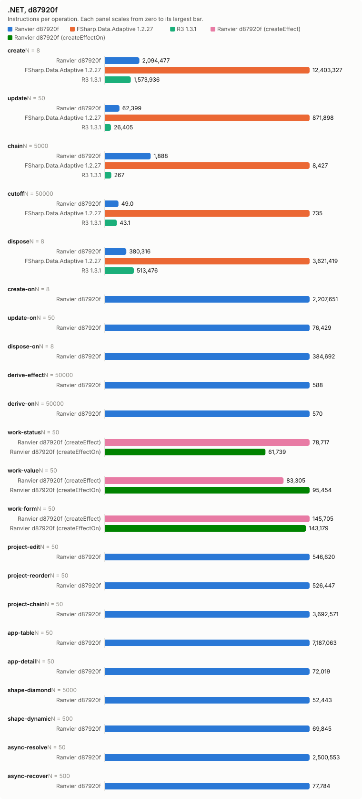
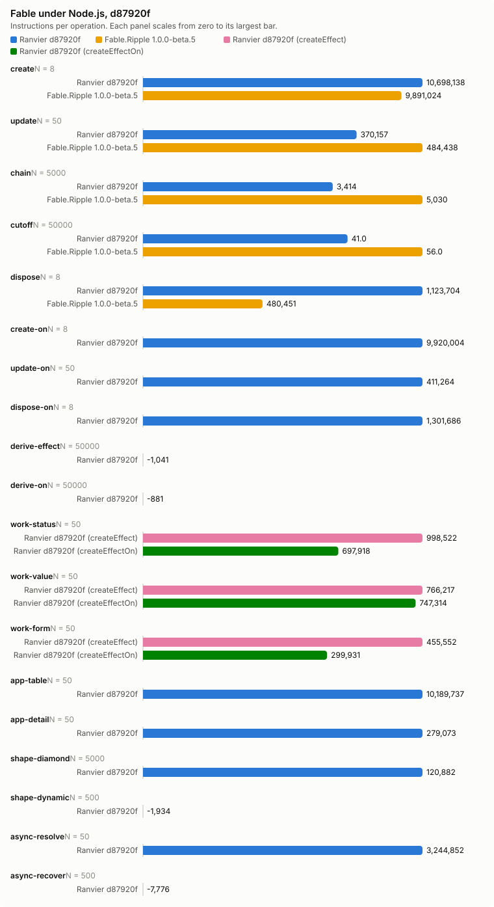

# Counter bench, d87920f

- Date: 2026-09-27 20:20:41Z
- Machine: AMD64 Family 26 Model 68 Stepping 0, AuthenticAMD, 24 logical processors, Microsoft Windows 10.0.26200, .NET 10.0.12
- Instructions: per-context-switch PMC counters (InstructionRetired, TotalCycles, BranchMispredictions)
- Library counters: from a separate RanvierCounters build (--counters-worker)
- Versions: .NET 10.0.12, FSharp.Data.Adaptive 1.2.27, R3 1.3.1, Ranvier d87920f
- Worker environment: DOTNET_TieredCompilation=0 DOTNET_TieredPGO=0 DOTNET_ReadyToRun=0 DOTNET_gcServer=0
- Every figure is (m(2N) - m(N)) / N. Processor counters are the median over runs.
- Instruction counts differing by under 5 % are within run-to-run noise. Compare only reports taken at the same --scale.

## Engine differences

- R3 pushes each write straight to its subscribers, without batching or glitch-free ordering. Its chain is `Select` operators holding no cached value.
- FSharp.Data.Adaptive dispose removes the callback subscriptions only. The `AVal.map2` nodes stay in the weak output sets of their `cval`s until collected.

## create: one root of 1000 rows (N = 8)

| Engine | instr/op | cycles/op | br-miss/op | intervals N/2N | bytes/op | objects/op | counters/op |
| --- | ---: | ---: | ---: | ---: | ---: | ---: | --- |
| Ranvier d87920f | 2,094,477.38 | 851,656.50 | 801.62 | 1/1 | 530,416 | 2,002 | SignalsCreated 1,001, EffectsCreated 1,000, OwnersCreated 1, EdgesAdded 2,000, ObserverInserts 2,000, EffectRuns 1,000, Flushes 1,000 |
| FSharp.Data.Adaptive 1.2.27 | 12,403,326.75 | 6,049,748.25 | 7,887.62 | 2/2 | 2,413,717 | n/a | n/a |
| R3 1.3.1 | 1,573,936.50 | 776,506.88 | 387.38 | 2/2 | 584,160 | n/a | n/a |

## update: write every 10th of 1000 rows (N = 50)

| Engine | instr/op | cycles/op | br-miss/op | intervals N/2N | bytes/op | objects/op | counters/op |
| --- | ---: | ---: | ---: | ---: | ---: | ---: | --- |
| Ranvier d87920f | 62,399 | 19,362.80 | 1.60 | 1/1 | 0 | 0 | EffectRuns 100, Flushes 100 |
| FSharp.Data.Adaptive 1.2.27 | 871,898.04 | 364,931.96 | 433.36 | 2/2 | 63,200 | n/a | n/a |
| R3 1.3.1 | 26,404.76 | 12,995.64 | 0.46 | 1/1 | 0 | n/a | n/a |

## chain: write the source of 4 memos, read the tail (N = 5000)

| Engine | instr/op | cycles/op | br-miss/op | intervals N/2N | bytes/op | objects/op | counters/op |
| --- | ---: | ---: | ---: | ---: | ---: | ---: | --- |
| Ranvier d87920f | 1,888.05 | 721.43 | -0.02 | 1/1 | 0 | 0 | MemoRecomputes 4 |
| FSharp.Data.Adaptive 1.2.27 | 8,426.66 | 3,015.35 | 1.49 | 2/2 | 472 | n/a | n/a |
| R3 1.3.1 | 267.00 | 141.27 | -0.01 | 1/1 | 0 | n/a | n/a |

## cutoff: write an equal value to an observed source (N = 50000)

| Engine | instr/op | cycles/op | br-miss/op | intervals N/2N | bytes/op | objects/op | counters/op |
| --- | ---: | ---: | ---: | ---: | ---: | ---: | --- |
| Ranvier d87920f | 49.01 | 20.05 | 0.00 | 1/2 | 0 | 0 | 0 |
| FSharp.Data.Adaptive 1.2.27 | 735.43 | 363.17 | 0.27 | 2/2 | 352 | n/a | n/a |
| R3 1.3.1 | 43.14 | 24.96 | 0.01 | 1/1 | 0 | n/a | n/a |

## dispose: dispose one root of 1000 rows (N = 8)

| Engine | instr/op | cycles/op | br-miss/op | intervals N/2N | bytes/op | objects/op | counters/op |
| --- | ---: | ---: | ---: | ---: | ---: | ---: | --- |
| Ranvier d87920f | 380,316.50 | 116,555.38 | -9.50 | 1/1 | 56 | 0 | EdgesRemoved 2,000, ObserverRemoves 2,000 |
| FSharp.Data.Adaptive 1.2.27 | 3,621,419 | 2,661,333.62 | 3,129.12 | 2/1 | 0 | n/a | n/a |
| R3 1.3.1 | 513,476.12 | 366,574.75 | 575.75 | 2/1 | 0 | n/a | n/a |

## create-on: one root of 1000 createEffectOn rows (N = 8)

| Engine | instr/op | cycles/op | br-miss/op | intervals N/2N | bytes/op | objects/op | counters/op |
| --- | ---: | ---: | ---: | ---: | ---: | ---: | --- |
| Ranvier d87920f | 2,207,651.25 | 738,801.12 | 946.88 | 1/1 | 506,456 | 2,002 | SignalsCreated 1,001, EffectsCreated 1,000, OwnersCreated 1, EdgesAdded 2,000, ObserverInserts 2,000, EffectRuns 1,000, Flushes 1,000 |

## update-on: write every 10th of 1000 createEffectOn rows (N = 50)

| Engine | instr/op | cycles/op | br-miss/op | intervals N/2N | bytes/op | objects/op | counters/op |
| --- | ---: | ---: | ---: | ---: | ---: | ---: | --- |
| Ranvier d87920f | 76,428.90 | 24,665.50 | 0.96 | 1/1 | 0 | 0 | EffectRuns 100, Flushes 100 |

## dispose-on: dispose one root of 1000 createEffectOn rows (N = 8)

| Engine | instr/op | cycles/op | br-miss/op | intervals N/2N | bytes/op | objects/op | counters/op |
| --- | ---: | ---: | ---: | ---: | ---: | ---: | --- |
| Ranvier d87920f | 384,692 | 133,610.75 | 52.62 | 1/2 | 56 | 0 | EdgesRemoved 2,000, ObserverRemoves 2,000 |

## derive-effect: write a new value whose derived value is unchanged, Effect (N = 50000)

| Engine | instr/op | cycles/op | br-miss/op | intervals N/2N | bytes/op | objects/op | counters/op |
| --- | ---: | ---: | ---: | ---: | ---: | ---: | --- |
| Ranvier d87920f | 587.84 | 196.72 | -0.00 | 2/1 | 0 | 0 | EffectRuns 1, Flushes 1 |

## derive-on: write a new value whose derived value is unchanged, createEffectOn (N = 50000)

| Engine | instr/op | cycles/op | br-miss/op | intervals N/2N | bytes/op | objects/op | counters/op |
| --- | ---: | ---: | ---: | ---: | ---: | ---: | --- |
| Ranvier d87920f | 570.21 | 187.24 | 0.01 | 2/2 | 0 | 0 | EffectRuns 1, Flushes 1 |

## work-status: write every 10th of 1000 rows; the act formats a label, 1 write in 10 changes it (N = 50)

| Engine | instr/op | cycles/op | br-miss/op | intervals N/2N | bytes/op | objects/op | counters/op |
| --- | ---: | ---: | ---: | ---: | ---: | ---: | --- |
| Ranvier d87920f (createEffect) | 78,716.78 | 29,064.64 | 3.08 | 1/2 | 3,980 | 0 | EffectRuns 100, Flushes 100 |
| Ranvier d87920f (createEffectOn) | 61,738.80 | 21,938.36 | 3.18 | 1/1 | 398.40 | 0 | EffectRuns 100, Flushes 100 |

## work-value: write every 10th of 1000 rows; the act formats a label, every write changes it (N = 50)

| Engine | instr/op | cycles/op | br-miss/op | intervals N/2N | bytes/op | objects/op | counters/op |
| --- | ---: | ---: | ---: | ---: | ---: | ---: | --- |
| Ranvier d87920f (createEffect) | 83,304.82 | 26,955.28 | 13.12 | 1/1 | 6,467.20 | 0 | EffectRuns 100, Flushes 100 |
| Ranvier d87920f (createEffectOn) | 95,453.58 | 28,883.80 | 4.10 | 2/1 | 6,467.20 | 0 | EffectRuns 100, Flushes 100 |

## work-form: write one field of each of 125 8-field forms; validity feeds a signal and an effect (N = 50)

| Engine | instr/op | cycles/op | br-miss/op | intervals N/2N | bytes/op | objects/op | counters/op |
| --- | ---: | ---: | ---: | ---: | ---: | ---: | --- |
| Ranvier d87920f (createEffect) | 145,704.78 | 42,763.80 | 13.82 | 1/2 | 0 | 0 | EffectRuns 126.02, Flushes 125 |
| Ranvier d87920f (createEffectOn) | 143,178.64 | 40,617.44 | 15.86 | 2/1 | 0 | 0 | EffectRuns 126.02, Flushes 125 |

## project-edit: change one row of a 1000-row projection (N = 50)

| Engine | instr/op | cycles/op | br-miss/op | intervals N/2N | bytes/op | objects/op | counters/op |
| --- | ---: | ---: | ---: | ---: | ---: | ---: | --- |
| Ranvier d87920f | 546,620.24 | 187,270.60 | 40.04 | 2/2 | 80 | 0 | MemoRecomputes 1, EffectRuns 1, Flushes 1 |

## project-reorder: reverse a 1000-row projection (N = 50)

| Engine | instr/op | cycles/op | br-miss/op | intervals N/2N | bytes/op | objects/op | counters/op |
| --- | ---: | ---: | ---: | ---: | ---: | ---: | --- |
| Ranvier d87920f | 526,446.84 | 184,740.68 | 5.96 | 2/2 | 4,104 | 0 | Flushes 1 |

## project-chain: change one row of a 1000-row filter, sortBy, map chain (N = 50)

| Engine | instr/op | cycles/op | br-miss/op | intervals N/2N | bytes/op | objects/op | counters/op |
| --- | ---: | ---: | ---: | ---: | ---: | ---: | --- |
| Ranvier d87920f | 3,692,570.86 | 972,857.34 | 288.88 | 2/1 | 206,664 | 0 | MemoRecomputes 6, EffectRuns 2, Flushes 1 |

## app-table: alternate a filter query and a sort direction over 1000 rows (N = 50)

| Engine | instr/op | cycles/op | br-miss/op | intervals N/2N | bytes/op | objects/op | counters/op |
| --- | ---: | ---: | ---: | ---: | ---: | ---: | --- |
| Ranvier d87920f | 7,187,063.48 | 2,226,481.88 | 1,316.34 | 2/2 | 420,680.80 | 240 | SignalsCreated 120, MemosCreated 120, EdgesAdded 760.50, EdgesRemoved 760.50, ObserverInserts 760.50, ObserverRemoves 760.50, MemoRecomputes 980, EffectRuns 1, Flushes 1 |

## app-detail: move the selection over 1000 rows; the detail rebuilds 20 memo and effect pairs (N = 50)

| Engine | instr/op | cycles/op | br-miss/op | intervals N/2N | bytes/op | objects/op | counters/op |
| --- | ---: | ---: | ---: | ---: | ---: | ---: | --- |
| Ranvier d87920f | 72,019 | 29,452.60 | 35.84 | 1/2 | 12,960 | 40 | MemosCreated 20, EffectsCreated 20, EdgesAdded 41, EdgesRemoved 41, ObserverInserts 41, ObserverRemoves 41, MemoRecomputes 21, EffectRuns 24, Flushes 1 |

## shape-diamond: write a source read by 100 memos joined by one (N = 5000)

| Engine | instr/op | cycles/op | br-miss/op | intervals N/2N | bytes/op | objects/op | counters/op |
| --- | ---: | ---: | ---: | ---: | ---: | ---: | --- |
| Ranvier d87920f | 52,442.93 | 17,031.24 | 2.06 | 2/2 | 0 | 0 | MemoRecomputes 101, EffectRuns 1, Flushes 1 |

## shape-dynamic: alternate a branch flip and a write of every active source of 100 effects (N = 500)

| Engine | instr/op | cycles/op | br-miss/op | intervals N/2N | bytes/op | objects/op | counters/op |
| --- | ---: | ---: | ---: | ---: | ---: | ---: | --- |
| Ranvier d87920f | 69,844.98 | 20,659.59 | 2.49 | 2/1 | 0 | 0 | EdgesAdded 50, EdgesRemoved 50, ObserverInserts 50, ObserverRemoves 50, EffectRuns 100, Flushes 50.50 |

## async-resolve: reload 10 suspense widgets of 10 sources, then settle each (N = 50)

| Engine | instr/op | cycles/op | br-miss/op | intervals N/2N | bytes/op | objects/op | counters/op |
| --- | ---: | ---: | ---: | ---: | ---: | ---: | --- |
| Ranvier d87920f | 2,500,552.76 | 886,957 | 1,513.60 | 2/2 | 69,160 | 0 | EdgesAdded 190, EdgesRemoved 190, ObserverInserts 190, ObserverRemoves 190, EffectRuns 20, Flushes 101 |

## async-recover: fail one source of one error-boundary widget, then settle a replacement (N = 500)

| Engine | instr/op | cycles/op | br-miss/op | intervals N/2N | bytes/op | objects/op | counters/op |
| --- | ---: | ---: | ---: | ---: | ---: | ---: | --- |
| Ranvier d87920f | 77,783.67 | 26,890.84 | 39.64 | 2/2 | 1,784 | 0 | EdgesAdded 20, EdgesRemoved 20, ObserverInserts 20, ObserverRemoves 20, EffectRuns 4, Flushes 4 |

## Calibration, 5 run(s)

Allocations and library counters identical in every run.

| Scenario | Engine | Source | Median/op | Min/op | Max/op | Spread |
| --- | --- | --- | ---: | ---: | ---: | ---: |
| create | Ranvier | InstructionRetired | 2,094,477.38 | 2,090,442.62 | 2,106,668.25 | 0.78 % |
| create | Ranvier | TotalCycles | 851,656.50 | 816,118.75 | 861,706.38 | 5.59 % |
| create | Ranvier | BranchMispredictions | 801.62 | 704.25 | 994.62 | 41.23 % |
| create | FSharp.Data.Adaptive | InstructionRetired | 12,403,326.75 | 12,338,422.75 | 12,576,621.88 | 1.93 % |
| create | FSharp.Data.Adaptive | TotalCycles | 6,049,748.25 | 5,836,156.50 | 6,289,204.88 | 7.76 % |
| create | FSharp.Data.Adaptive | BranchMispredictions | 7,887.62 | 6,801.38 | 8,643.88 | 27.09 % |
| create | R3 | InstructionRetired | 1,573,936.50 | 1,568,625.50 | 1,591,112.75 | 1.43 % |
| create | R3 | TotalCycles | 776,506.88 | 714,985.50 | 908,024.75 | 27.00 % |
| create | R3 | BranchMispredictions | 387.38 | 342.62 | 478.50 | 39.66 % |
| update | Ranvier | InstructionRetired | 62,399 | 62,199.26 | 62,482.72 | 0.46 % |
| update | Ranvier | TotalCycles | 19,362.80 | 12,627.10 | 38,230.50 | 202.77 % |
| update | Ranvier | BranchMispredictions | 1.60 | -13.42 | 5.46 | -140.69 % |
| update | FSharp.Data.Adaptive | InstructionRetired | 871,898.04 | 870,657.98 | 873,619.34 | 0.34 % |
| update | FSharp.Data.Adaptive | TotalCycles | 364,931.96 | 333,292.58 | 373,379.10 | 12.03 % |
| update | FSharp.Data.Adaptive | BranchMispredictions | 433.36 | 406.54 | 498.84 | 22.70 % |
| update | R3 | InstructionRetired | 26,404.76 | 26,289 | 26,664.66 | 1.43 % |
| update | R3 | TotalCycles | 12,995.64 | 11,926.58 | 16,208.02 | 35.90 % |
| update | R3 | BranchMispredictions | 0.46 | -5.34 | 7.80 | -246.07 % |
| chain | Ranvier | InstructionRetired | 1,888.05 | 1,887.28 | 1,891.64 | 0.23 % |
| chain | Ranvier | TotalCycles | 721.43 | 679.52 | 906.49 | 33.40 % |
| chain | Ranvier | BranchMispredictions | -0.02 | -0.11 | 1.34 | -1,317.79 % |
| chain | FSharp.Data.Adaptive | InstructionRetired | 8,426.66 | 8,347.51 | 8,547.00 | 2.39 % |
| chain | FSharp.Data.Adaptive | TotalCycles | 3,015.35 | 2,890.44 | 3,060.50 | 5.88 % |
| chain | FSharp.Data.Adaptive | BranchMispredictions | 1.49 | 1.43 | 3.41 | 138.18 % |
| chain | R3 | InstructionRetired | 267.00 | 266.33 | 275.02 | 3.26 % |
| chain | R3 | TotalCycles | 141.27 | 133.69 | 161.55 | 20.84 % |
| chain | R3 | BranchMispredictions | -0.01 | -0.03 | 0.09 | -425.18 % |
| cutoff | Ranvier | InstructionRetired | 49.01 | 48.84 | 49.79 | 1.94 % |
| cutoff | Ranvier | TotalCycles | 20.05 | 18.13 | 21.14 | 16.63 % |
| cutoff | Ranvier | BranchMispredictions | 0.00 | -0.01 | 0.00 | -145.08 % |
| cutoff | FSharp.Data.Adaptive | InstructionRetired | 735.43 | 734.68 | 736.94 | 0.31 % |
| cutoff | FSharp.Data.Adaptive | TotalCycles | 363.17 | 361.03 | 421.77 | 16.83 % |
| cutoff | FSharp.Data.Adaptive | BranchMispredictions | 0.27 | 0.25 | 0.28 | 11.27 % |
| cutoff | R3 | InstructionRetired | 43.14 | 42.81 | 44.04 | 2.87 % |
| cutoff | R3 | TotalCycles | 24.96 | 22.49 | 27.48 | 22.18 % |
| cutoff | R3 | BranchMispredictions | 0.01 | -0.01 | 0.01 | -234.10 % |
| dispose | Ranvier | InstructionRetired | 380,316.50 | 378,838.75 | 380,343.25 | 0.40 % |
| dispose | Ranvier | TotalCycles | 116,555.38 | 90,185.62 | 130,354 | 44.54 % |
| dispose | Ranvier | BranchMispredictions | -9.50 | -20.62 | 10.50 | -150.91 % |
| dispose | FSharp.Data.Adaptive | InstructionRetired | 3,621,419 | 3,618,028.25 | 3,635,183.25 | 0.47 % |
| dispose | FSharp.Data.Adaptive | TotalCycles | 2,661,333.62 | 2,563,757.12 | 2,812,109 | 9.69 % |
| dispose | FSharp.Data.Adaptive | BranchMispredictions | 3,129.12 | 2,964.75 | 3,454.62 | 16.52 % |
| dispose | R3 | InstructionRetired | 513,476.12 | 507,024.38 | 516,478.75 | 1.86 % |
| dispose | R3 | TotalCycles | 366,574.75 | 337,925.50 | 406,811 | 20.38 % |
| dispose | R3 | BranchMispredictions | 575.75 | 457.62 | 596.12 | 30.26 % |
| create-on | Ranvier | InstructionRetired | 2,207,651.25 | 2,202,066.12 | 2,214,764.75 | 0.58 % |
| create-on | Ranvier | TotalCycles | 738,801.12 | 652,501.12 | 847,422.38 | 29.87 % |
| create-on | Ranvier | BranchMispredictions | 946.88 | 742.38 | 1,021.62 | 37.62 % |
| update-on | Ranvier | InstructionRetired | 76,428.90 | 76,235.04 | 77,218.68 | 1.29 % |
| update-on | Ranvier | TotalCycles | 24,665.50 | 21,102.60 | 26,401.04 | 25.11 % |
| update-on | Ranvier | BranchMispredictions | 0.96 | -4.40 | 11.36 | -358.18 % |
| dispose-on | Ranvier | InstructionRetired | 384,692 | 380,858.25 | 391,796.25 | 2.87 % |
| dispose-on | Ranvier | TotalCycles | 133,610.75 | 83,173.88 | 165,345.62 | 98.80 % |
| dispose-on | Ranvier | BranchMispredictions | 52.62 | 18.88 | 131.75 | 598.01 % |
| derive-effect | Ranvier | InstructionRetired | 587.84 | 586.88 | 588.22 | 0.23 % |
| derive-effect | Ranvier | TotalCycles | 196.72 | 189.78 | 202.06 | 6.47 % |
| derive-effect | Ranvier | BranchMispredictions | -0.00 | -0.01 | 0.01 | -166.87 % |
| derive-on | Ranvier | InstructionRetired | 570.21 | 570.05 | 570.30 | 0.04 % |
| derive-on | Ranvier | TotalCycles | 187.24 | 186.29 | 188.37 | 1.12 % |
| derive-on | Ranvier | BranchMispredictions | 0.01 | -0.00 | 0.01 | -921.95 % |
| work-status | Ranvier (createEffect) | InstructionRetired | 78,716.78 | 78,586.46 | 79,519.54 | 1.19 % |
| work-status | Ranvier (createEffect) | TotalCycles | 29,064.64 | 25,023.38 | 31,710.10 | 26.72 % |
| work-status | Ranvier (createEffect) | BranchMispredictions | 3.08 | -3.64 | 11.88 | -426.37 % |
| work-status | Ranvier (createEffectOn) | InstructionRetired | 61,738.80 | 61,462.44 | 62,305.94 | 1.37 % |
| work-status | Ranvier (createEffectOn) | TotalCycles | 21,938.36 | 17,418.36 | 23,243.60 | 33.44 % |
| work-status | Ranvier (createEffectOn) | BranchMispredictions | 3.18 | 0.38 | 13.42 | 3,431.58 % |
| work-value | Ranvier (createEffect) | InstructionRetired | 83,304.82 | 82,984.84 | 83,868.16 | 1.06 % |
| work-value | Ranvier (createEffect) | TotalCycles | 26,955.28 | 26,273.92 | 29,886.32 | 13.75 % |
| work-value | Ranvier (createEffect) | BranchMispredictions | 13.12 | 5.44 | 21.66 | 298.16 % |
| work-value | Ranvier (createEffectOn) | InstructionRetired | 95,453.58 | 95,342.76 | 95,666.14 | 0.34 % |
| work-value | Ranvier (createEffectOn) | TotalCycles | 28,883.80 | 20,223.12 | 35,381.62 | 74.96 % |
| work-value | Ranvier (createEffectOn) | BranchMispredictions | 4.10 | -10.62 | 13.54 | -227.50 % |
| work-form | Ranvier (createEffect) | InstructionRetired | 145,704.78 | 142,739.32 | 148,274.04 | 3.88 % |
| work-form | Ranvier (createEffect) | TotalCycles | 42,763.80 | 19,596.94 | 58,587.56 | 198.96 % |
| work-form | Ranvier (createEffect) | BranchMispredictions | 13.82 | -12.84 | 57.60 | -548.60 % |
| work-form | Ranvier (createEffectOn) | InstructionRetired | 143,178.64 | 142,845.42 | 143,989.82 | 0.80 % |
| work-form | Ranvier (createEffectOn) | TotalCycles | 40,617.44 | 19,622 | 44,491.38 | 126.74 % |
| work-form | Ranvier (createEffectOn) | BranchMispredictions | 15.86 | -3.56 | 29.14 | -918.54 % |
| project-edit | Ranvier | InstructionRetired | 546,620.24 | 544,664.74 | 548,662.90 | 0.73 % |
| project-edit | Ranvier | TotalCycles | 187,270.60 | 174,032.12 | 191,305.24 | 9.93 % |
| project-edit | Ranvier | BranchMispredictions | 40.04 | -7.44 | 57.12 | -867.74 % |
| project-reorder | Ranvier | InstructionRetired | 526,446.84 | 525,699.24 | 526,524.30 | 0.16 % |
| project-reorder | Ranvier | TotalCycles | 184,740.68 | 173,596.16 | 186,104.36 | 7.21 % |
| project-reorder | Ranvier | BranchMispredictions | 5.96 | -7.08 | 19.44 | -374.58 % |
| project-chain | Ranvier | InstructionRetired | 3,692,570.86 | 3,690,990.80 | 3,698,534.84 | 0.20 % |
| project-chain | Ranvier | TotalCycles | 972,857.34 | 958,386.22 | 993,572.78 | 3.67 % |
| project-chain | Ranvier | BranchMispredictions | 288.88 | 261.28 | 393.72 | 50.69 % |
| app-table | Ranvier | InstructionRetired | 7,187,063.48 | 7,186,585.34 | 7,190,009.42 | 0.05 % |
| app-table | Ranvier | TotalCycles | 2,226,481.88 | 2,158,110.14 | 2,289,647.70 | 6.10 % |
| app-table | Ranvier | BranchMispredictions | 1,316.34 | 1,141.14 | 1,346.42 | 17.99 % |
| app-detail | Ranvier | InstructionRetired | 72,019 | 71,680.70 | 72,950.56 | 1.77 % |
| app-detail | Ranvier | TotalCycles | 29,452.60 | 25,284.22 | 37,133.04 | 46.86 % |
| app-detail | Ranvier | BranchMispredictions | 35.84 | 11.54 | 68.06 | 489.77 % |
| shape-diamond | Ranvier | InstructionRetired | 52,442.93 | 52,438.65 | 52,456.89 | 0.03 % |
| shape-diamond | Ranvier | TotalCycles | 17,031.24 | 16,841.20 | 17,153.86 | 1.86 % |
| shape-diamond | Ranvier | BranchMispredictions | 2.06 | 1.79 | 3.18 | 77.34 % |
| shape-dynamic | Ranvier | InstructionRetired | 69,844.98 | 69,836.89 | 69,884.59 | 0.07 % |
| shape-dynamic | Ranvier | TotalCycles | 20,659.59 | 20,263.55 | 21,295.41 | 5.09 % |
| shape-dynamic | Ranvier | BranchMispredictions | 2.49 | 1.07 | 3.34 | 213.13 % |
| async-resolve | Ranvier | InstructionRetired | 2,500,552.76 | 2,499,995.16 | 2,500,850.94 | 0.03 % |
| async-resolve | Ranvier | TotalCycles | 886,957 | 873,588.38 | 924,124.50 | 5.78 % |
| async-resolve | Ranvier | BranchMispredictions | 1,513.60 | 1,138.96 | 1,577.38 | 38.49 % |
| async-recover | Ranvier | InstructionRetired | 77,783.67 | 77,759.37 | 77,855.65 | 0.12 % |
| async-recover | Ranvier | TotalCycles | 26,890.84 | 26,213.23 | 27,500.37 | 4.91 % |
| async-recover | Ranvier | BranchMispredictions | 39.64 | 37.31 | 50.47 | 35.27 % |

# Fable under Node.js v26.7.0

- Versions: Fable.Ripple 1.0.0-beta.5, Node.js v26.7.0, Ranvier d87920f, fable-library-js 5.18.0
- node flags: --expose-gc --single-threaded
- Instructions: per-context-switch PMC counters (InstructionRetired, TotalCycles, BranchMispredictions); main: the main thread, all: every thread of the process
- bytes/op: growth of the new, old and large-object heap spaces; median of 5 processes. bytes range: minimum..maximum, 0 when every process agreed.
- heapUsed/op: growth of `process.memoryUsage().heapUsed`, which adds the code and trusted spaces.
- Every figure is (m(2N) - m(N)) / N. A figure followed by a bracketed range differed between processes.

## create: one root of 1000 rows (N = 8)

| Engine | instr/op main | instr/op all | cycles/op main | cycles/op all | br-miss/op main | br-miss/op all | bytes/op | bytes range | heapUsed/op | objects/op | counters/op |
| --- | ---: | ---: | ---: | ---: | ---: | ---: | ---: | ---: | ---: | ---: | --- |
| Ranvier d87920f | 10,698,137.88 (10,687,350.88..10,722,349.88) | 10,698,137.88 (10,687,350.88..10,722,349.88) | 3,491,449.12 (3,429,012.50..3,724,107) | 3,491,449.12 (3,429,012.50..3,724,107) | 17,337.25 (16,451.75..17,695.62) | 17,337.25 (16,451.75..17,695.62) | 1,137,638 | 0 | 1,138,960 | 2,002 | SignalsCreated 1,001, EffectsCreated 1,000, OwnersCreated 1, EdgesAdded 2,000, ObserverInserts 2,000, EffectRuns 1,000, Flushes 1,000 |
| Fable.Ripple 1.0.0-beta.5 | 9,891,024.12 (9,851,220.25..9,904,527.62) | 9,891,024.12 (9,851,220.25..9,904,527.62) | 5,207,734.25 (5,001,355.50..5,421,710.38) | 5,207,734.25 (5,001,355.50..5,421,710.38) | 67,208.88 (65,715.38..70,023.25) | 67,208.88 (65,715.38..70,023.25) | 1,346,356 | 0 | 1,353,033 (1,353,025..1,353,033) | n/a | n/a |

## update: write every 10th of 1000 rows (N = 50)

| Engine | instr/op main | instr/op all | cycles/op main | cycles/op all | br-miss/op main | br-miss/op all | bytes/op | bytes range | heapUsed/op | objects/op | counters/op |
| --- | ---: | ---: | ---: | ---: | ---: | ---: | ---: | ---: | ---: | ---: | --- |
| Ranvier d87920f | 370,157.46 (368,774.90..378,414.94) | 370,157.46 (368,774.90..378,414.94) | 50,405.96 (38,968.10..56,014.14) | 50,405.96 (38,968.10..56,014.14) | -95.52 (-149.64..-30.36) | -95.52 (-149.64..-30.36) | 8,807.36 | 0 | 8,694.88 | 0 | EffectRuns 100, Flushes 100 |
| Fable.Ripple 1.0.0-beta.5 | 484,437.80 (477,455.56..484,636.16) | 484,437.80 (477,455.56..484,636.16) | 85,171.62 (71,634.98..94,383.68) | 85,171.62 (71,634.98..94,383.68) | -68.82 (-131.64..-45.54) | -68.82 (-131.64..-45.54) | 24,021.12 | 0 | 24,001.60 | n/a | n/a |

## chain: write the source of 4 memos, read the tail (N = 5000)

| Engine | instr/op main | instr/op all | cycles/op main | cycles/op all | br-miss/op main | br-miss/op all | bytes/op | bytes range | heapUsed/op | objects/op | counters/op |
| --- | ---: | ---: | ---: | ---: | ---: | ---: | ---: | ---: | ---: | ---: | --- |
| Ranvier d87920f | 3,413.92 (2,194.29..3,414.63) | 3,413.92 (2,194.29..3,414.63) | 608.43 (-166.02..675.33) | 608.43 (-166.02..675.33) | 0.13 (-3.75..0.25) | 0.13 (-3.75..0.25) | 0.07 | 0 | 1.92 (1.91..1.92) | 0 | MemoRecomputes 4 |
| Fable.Ripple 1.0.0-beta.5 | 5,029.87 (5,029.12..5,033.61) | 5,029.87 (5,029.12..5,033.61) | 797.17 (773.05..949.37) | 797.17 (773.05..949.37) | 0.03 (0.01..0.24) | 0.03 (0.01..0.24) | 0 | 0 | 0 | n/a | n/a |

## cutoff: write an equal value to an observed source (N = 50000)

| Engine | instr/op main | instr/op all | cycles/op main | cycles/op all | br-miss/op main | br-miss/op all | bytes/op | bytes range | heapUsed/op | objects/op | counters/op |
| --- | ---: | ---: | ---: | ---: | ---: | ---: | ---: | ---: | ---: | ---: | --- |
| Ranvier d87920f | 41.01 (40.91..41.13) | 41.01 (40.91..41.13) | 7.34 (3.52..9.65) | 7.34 (3.52..9.65) | -0.00 (-0.00..0.00) | -0.00 (-0.00..0.00) | 0 | 0 | 0 | 0 | 0 |
| Fable.Ripple 1.0.0-beta.5 | 56.03 (55.83..56.08) | 56.03 (55.83..56.08) | 9.39 (6.71..10.91) | 9.39 (6.71..10.91) | -0.00 (-0.01..0.01) | -0.00 (-0.01..0.01) | 0 | 0 | 0.03 | n/a | n/a |

## dispose: dispose one root of 1000 rows (N = 8)

| Engine | instr/op main | instr/op all | cycles/op main | cycles/op all | br-miss/op main | br-miss/op all | bytes/op | bytes range | heapUsed/op | objects/op | counters/op |
| --- | ---: | ---: | ---: | ---: | ---: | ---: | ---: | ---: | ---: | ---: | --- |
| Ranvier d87920f | 1,123,704.50 (1,097,464.12..66,890,992.62) | 1,123,704.50 (1,097,464.12..66,890,992.62) | 914,267.88 (477,828.25..27,610,191.50) | 914,267.88 (477,828.25..27,610,191.50) | 1,290.38 (1,061.25..187,452.62) | 1,290.38 (1,061.25..187,452.62) | 29,234 | 0 | 29,328 | 0 | EdgesRemoved 2,000, ObserverRemoves 2,000 |
| Fable.Ripple 1.0.0-beta.5 | 480,451.12 (477,308.50..481,708.75) | 480,451.12 (477,308.50..481,708.75) | 194,460.62 (85,125.12..352,772.88) | 194,460.62 (85,125.12..352,772.88) | 93.25 (51.38..121) | 93.25 (51.38..121) | 28,672 | 0 | 28,672 | n/a | n/a |

## create-on: one root of 1000 createEffectOn rows (N = 8)

| Engine | instr/op main | instr/op all | cycles/op main | cycles/op all | br-miss/op main | br-miss/op all | bytes/op | bytes range | heapUsed/op | objects/op | counters/op |
| --- | ---: | ---: | ---: | ---: | ---: | ---: | ---: | ---: | ---: | ---: | --- |
| Ranvier d87920f | 9,920,003.75 (9,895,384.62..9,941,277.25) | 9,920,003.75 (9,895,384.62..9,941,277.25) | 3,729,323 (3,704,284.75..4,001,664.12) | 3,729,323 (3,704,284.75..4,001,664.12) | 27,149 (26,903.25..27,843.25) | 27,149 (26,903.25..27,843.25) | 1,023,016 | 0 | 1,027,369 | 2,002 | SignalsCreated 1,001, EffectsCreated 1,000, OwnersCreated 1, EdgesAdded 2,000, ObserverInserts 2,000, EffectRuns 1,000, Flushes 1,000 |

## update-on: write every 10th of 1000 createEffectOn rows (N = 50)

| Engine | instr/op main | instr/op all | cycles/op main | cycles/op all | br-miss/op main | br-miss/op all | bytes/op | bytes range | heapUsed/op | objects/op | counters/op |
| --- | ---: | ---: | ---: | ---: | ---: | ---: | ---: | ---: | ---: | ---: | --- |
| Ranvier d87920f | 411,264.26 (409,664.46..411,742.40) | 411,264.26 (409,664.46..411,742.40) | 91,767.96 (71,872.58..97,273) | 91,767.96 (71,872.58..97,273) | 140.74 (97.14..160.16) | 140.74 (97.14..160.16) | 8,790.40 | 0 | 9,014.24 | 0 | EffectRuns 100, Flushes 100 |

## dispose-on: dispose one root of 1000 createEffectOn rows (N = 8)

| Engine | instr/op main | instr/op all | cycles/op main | cycles/op all | br-miss/op main | br-miss/op all | bytes/op | bytes range | heapUsed/op | objects/op | counters/op |
| --- | ---: | ---: | ---: | ---: | ---: | ---: | ---: | ---: | ---: | ---: | --- |
| Ranvier d87920f | 1,301,686.50 (1,281,691.25..1,320,609.62) | 1,301,686.50 (1,281,691.25..1,320,609.62) | 800,129.88 (623,491..901,836.38) | 800,129.88 (623,491..901,836.38) | 767.62 (692.38..1,000.62) | 767.62 (692.38..1,000.62) | 29,232 | 0 | 29,232 | 0 | EdgesRemoved 2,000, ObserverRemoves 2,000 |

## derive-effect: write a new value whose derived value is unchanged, Effect (N = 50000)

| Engine | instr/op main | instr/op all | cycles/op main | cycles/op all | br-miss/op main | br-miss/op all | bytes/op | bytes range | heapUsed/op | objects/op | counters/op |
| --- | ---: | ---: | ---: | ---: | ---: | ---: | ---: | ---: | ---: | ---: | --- |
| Ranvier d87920f | -1,041.49 (-1,044.65..-1,035.04) | -1,041.49 (-1,044.65..-1,035.04) | -780.60 (-852.77..-762.62) | -780.60 (-852.77..-762.62) | -9.97 (-10.04..-9.93) | -9.97 (-10.04..-9.93) | -0.03 | 0 | -0.86 | 0 | EffectRuns 1, Flushes 1 |

## derive-on: write a new value whose derived value is unchanged, createEffectOn (N = 50000)

| Engine | instr/op main | instr/op all | cycles/op main | cycles/op all | br-miss/op main | br-miss/op all | bytes/op | bytes range | heapUsed/op | objects/op | counters/op |
| --- | ---: | ---: | ---: | ---: | ---: | ---: | ---: | ---: | ---: | ---: | --- |
| Ranvier d87920f | -880.58 (-883.36..-874.67) | -880.58 (-883.36..-874.67) | -677.76 (-748.72..-664.13) | -677.76 (-748.72..-664.13) | -9.10 (-9.23..-9.09) | -9.10 (-9.23..-9.09) | -0.01 | 0 | -0.76 | 0 | EffectRuns 1, Flushes 1 |

## work-status: write every 10th of 1000 rows; the act formats a label, 1 write in 10 changes it (N = 50)

| Engine | instr/op main | instr/op all | cycles/op main | cycles/op all | br-miss/op main | br-miss/op all | bytes/op | bytes range | heapUsed/op | objects/op | counters/op |
| --- | ---: | ---: | ---: | ---: | ---: | ---: | ---: | ---: | ---: | ---: | --- |
| Ranvier d87920f (createEffect) | 998,522.20 (995,865.06..999,829.30) | 998,522.20 (995,865.06..999,829.30) | 467,254.58 (413,456.70..474,519.82) | 467,254.58 (413,456.70..474,519.82) | 3,511.22 (3,464.70..3,576.04) | 3,511.22 (3,464.70..3,576.04) | 34,324 | 0 | 34,590.08 | 0 | EffectRuns 100, Flushes 100 |
| Ranvier d87920f (createEffectOn) | 697,917.64 (696,834.46..699,710.08) | 697,917.64 (696,834.46..699,710.08) | 232,576.52 (215,303.90..501,870.56) | 232,576.52 (215,303.90..501,870.56) | 1,568.20 (1,548.26..1,803.14) | 1,568.20 (1,548.26..1,803.14) | 10,995.52 | 0 | 11,127.84 | 0 | EffectRuns 100, Flushes 100 |

## work-value: write every 10th of 1000 rows; the act formats a label, every write changes it (N = 50)

| Engine | instr/op main | instr/op all | cycles/op main | cycles/op all | br-miss/op main | br-miss/op all | bytes/op | bytes range | heapUsed/op | objects/op | counters/op |
| --- | ---: | ---: | ---: | ---: | ---: | ---: | ---: | ---: | ---: | ---: | --- |
| Ranvier d87920f (createEffect) | 766,217.10 (765,695.72..766,623.22) | 766,217.10 (765,695.72..766,623.22) | 253,012.30 (234,714.94..263,618.36) | 253,012.30 (234,714.94..263,618.36) | 1,555.74 (1,500.88..1,584.98) | 1,555.74 (1,500.88..1,584.98) | 33,157.92 | 0 | 33,231.68 | 0 | EffectRuns 100, Flushes 100 |
| Ranvier d87920f (createEffectOn) | 747,314.28 (746,874.14..757,264.60) | 747,314.28 (746,874.14..757,264.60) | 221,374.44 (200,884.22..239,654.26) | 221,374.44 (200,884.22..239,654.26) | 1,103.56 (994.16..1,114.04) | 1,103.56 (994.16..1,114.04) | 33,026.72 | 0 | 33,146.24 | 0 | EffectRuns 100, Flushes 100 |

## work-form: write one field of each of 125 8-field forms; validity feeds a signal and an effect (N = 50)

| Engine | instr/op main | instr/op all | cycles/op main | cycles/op all | br-miss/op main | br-miss/op all | bytes/op | bytes range | heapUsed/op | objects/op | counters/op |
| --- | ---: | ---: | ---: | ---: | ---: | ---: | ---: | ---: | ---: | ---: | --- |
| Ranvier d87920f (createEffect) | 455,551.98 (453,831.92..456,681.92) | 455,551.98 (453,831.92..456,681.92) | 231,231.22 (212,694.76..236,036.50) | 231,231.22 (212,694.76..236,036.50) | 2,957.82 (2,912.84..3,016.20) | 2,957.82 (2,912.84..3,016.20) | -15.84 | 0 | 236.64 | 0 | EffectRuns 126.02, Flushes 125 |
| Ranvier d87920f (createEffectOn) | 299,931.04 (298,943.86..300,752.38) | 299,931.04 (298,943.86..300,752.38) | 48,881.64 (38,816.60..51,988.80) | 48,881.64 (38,816.60..51,988.80) | 29.40 (6.40..51.24) | 29.40 (6.40..51.24) | 0 | 0 | 0 | 0 | EffectRuns 126.02, Flushes 125 |

## app-table: alternate a filter query and a sort direction over 1000 rows (N = 50)

| Engine | instr/op main | instr/op all | cycles/op main | cycles/op all | br-miss/op main | br-miss/op all | bytes/op | bytes range | heapUsed/op | objects/op | counters/op |
| --- | ---: | ---: | ---: | ---: | ---: | ---: | ---: | ---: | ---: | ---: | --- |
| Ranvier d87920f | 10,189,737.18 (10,164,199.48..10,210,817.58) | 10,625,263.56 (10,599,605.06..10,643,062.32) | 2,965,083.02 (2,820,444.94..3,404,248.48) | 3,166,681.62 (3,024,765.56..3,597,456.44) | 6,724.18 (6,314.22..7,049.72) | 7,327.76 (6,828.44..7,601.62) | 356,478.40 (GC in region) | 356,464..356,478.40 | 355,936 (355,921.60..355,936) | 240 | SignalsCreated 120, MemosCreated 120, EdgesAdded 760.50, EdgesRemoved 760.50, ObserverInserts 760.50, ObserverRemoves 760.50, MemoRecomputes 980, EffectRuns 1, Flushes 1 |

## app-detail: move the selection over 1000 rows; the detail rebuilds 20 memo and effect pairs (N = 50)

| Engine | instr/op main | instr/op all | cycles/op main | cycles/op all | br-miss/op main | br-miss/op all | bytes/op | bytes range | heapUsed/op | objects/op | counters/op |
| --- | ---: | ---: | ---: | ---: | ---: | ---: | ---: | ---: | ---: | ---: | --- |
| Ranvier d87920f | 279,073.42 (273,912.82..280,139.22) | 279,073.42 (273,912.82..280,139.22) | 70,104.04 (53,993.90..88,829.26) | 70,104.04 (53,993.90..88,829.26) | 172.42 (133.26..211.88) | 172.42 (133.26..211.88) | 31,760.96 | 0 | 31,795.04 | 40 | MemosCreated 20, EffectsCreated 20, EdgesAdded 41, EdgesRemoved 41, ObserverInserts 41, ObserverRemoves 41, MemoRecomputes 21, EffectRuns 24, Flushes 1 |

## shape-diamond: write a source read by 100 memos joined by one (N = 5000)

| Engine | instr/op main | instr/op all | cycles/op main | cycles/op all | br-miss/op main | br-miss/op all | bytes/op | bytes range | heapUsed/op | objects/op | counters/op |
| --- | ---: | ---: | ---: | ---: | ---: | ---: | ---: | ---: | ---: | ---: | --- |
| Ranvier d87920f | 120,882.41 (120,797.45..120,944.43) | 120,882.41 (120,797.45..120,944.43) | 22,161.69 (2,393.72..33,442.00) | 22,161.69 (2,393.72..33,442.00) | -30.31 (-32.41..-29.69) | -30.31 (-32.41..-29.69) | -0.35 | 0 | -3.96 | 0 | MemoRecomputes 101, EffectRuns 1, Flushes 1 |

## shape-dynamic: alternate a branch flip and a write of every active source of 100 effects (N = 500)

| Engine | instr/op main | instr/op all | cycles/op main | cycles/op all | br-miss/op main | br-miss/op all | bytes/op | bytes range | heapUsed/op | objects/op | counters/op |
| --- | ---: | ---: | ---: | ---: | ---: | ---: | ---: | ---: | ---: | ---: | --- |
| Ranvier d87920f | -1,933.97 (-2,694.19..-297.22) | -1,933.97 (-2,694.19..-297.22) | -61,296.86 (-62,087.32..-27,074.21) | -61,296.86 (-62,087.32..-27,074.21) | -957.57 (-967.25..-953.66) | -957.57 (-967.25..-953.66) | 3,189.57 | 3,189.57..3,192.06 | 3,090.88 (3,090.88..3,093.38) | 0 | EdgesAdded 50, EdgesRemoved 50, ObserverInserts 50, ObserverRemoves 50, EffectRuns 100, Flushes 50.50 |

## async-resolve: reload 10 suspense widgets of 10 sources, then settle each (N = 50)

| Engine | instr/op main | instr/op all | cycles/op main | cycles/op all | br-miss/op main | br-miss/op all | bytes/op | bytes range | heapUsed/op | objects/op | counters/op |
| --- | ---: | ---: | ---: | ---: | ---: | ---: | ---: | ---: | ---: | ---: | --- |
| Ranvier d87920f | 3,244,851.50 (3,234,387.76..3,255,315.10) | 3,244,851.50 (3,234,387.76..3,255,315.10) | 1,295,525.24 (1,196,731.54..1,536,327.08) | 1,295,525.24 (1,196,731.54..1,536,327.08) | 8,659.34 (8,507.66..8,799.40) | 8,659.34 (8,507.66..8,799.40) | 178,084.64 | 0 | 178,620.32 (178,619.52..178,623.20) | 0 | EdgesAdded 190, EdgesRemoved 190, ObserverInserts 190, ObserverRemoves 190, EffectRuns 20, Flushes 101 |

## async-recover: fail one source of one error-boundary widget, then settle a replacement (N = 500)

| Engine | instr/op main | instr/op all | cycles/op main | cycles/op all | br-miss/op main | br-miss/op all | bytes/op | bytes range | heapUsed/op | objects/op | counters/op |
| --- | ---: | ---: | ---: | ---: | ---: | ---: | ---: | ---: | ---: | ---: | --- |
| Ranvier d87920f | -7,776.00 (-8,217.14..-7,188.11) | -7,776.00 (-8,217.14..-7,188.11) | -39,132.49 (-41,344.05..-22,525.53) | -39,132.49 (-41,344.05..-22,525.53) | -824.16 (-831.19..-810.16) | -824.16 (-831.19..-810.16) | 6,491.09 | 0 | 6,429.23 | 0 | EdgesAdded 20, EdgesRemoved 20, ObserverInserts 20, ObserverRemoves 20, EffectRuns 4, Flushes 4 |

# Appendix: instructions per operation

The instr/op medians from the tables above; Node.js bars are main-thread figures. Each panel has its own scale.

## .NET

## Fable under Node.js

