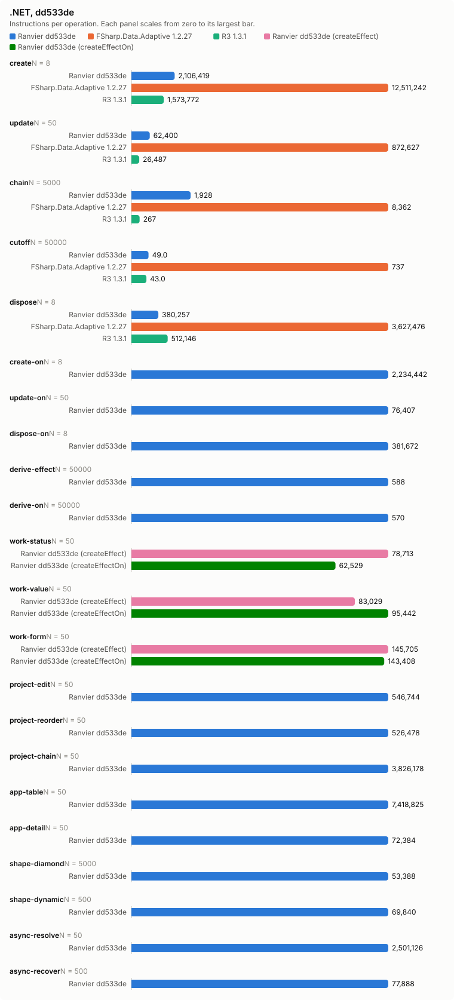
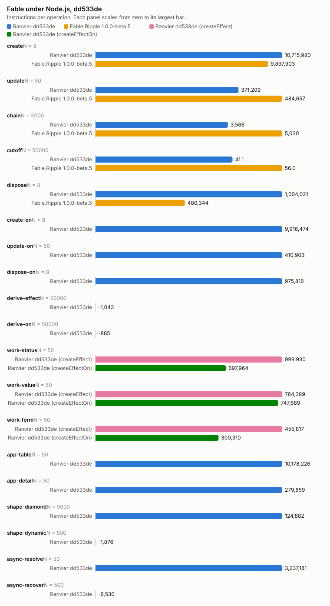

# Counter bench, dd533de

- Date: 2026-09-28 11:45:15Z
- Machine: AMD64 Family 26 Model 68 Stepping 0, AuthenticAMD, 24 logical processors, Microsoft Windows 10.0.26200, .NET 10.0.12
- Instructions: per-context-switch PMC counters (InstructionRetired, TotalCycles, BranchMispredictions)
- Library counters: from a separate RanvierCounters build (--counters-worker)
- Versions: .NET 10.0.12, FSharp.Data.Adaptive 1.2.27, R3 1.3.1, Ranvier dd533de
- Worker environment: DOTNET_TieredCompilation=0 DOTNET_TieredPGO=0 DOTNET_ReadyToRun=0 DOTNET_gcServer=0
- RanvierTrace: false
- Every figure is (m(2N) - m(N)) / N. Processor counters are the median over runs.
- Instruction counts differing by under 5 % are within run-to-run noise. Compare only reports taken at the same --scale.

## Engine differences

- R3 pushes each write straight to its subscribers, without batching or glitch-free ordering. Its chain is `Select` operators holding no cached value.
- FSharp.Data.Adaptive dispose removes the callback subscriptions only. The `AVal.map2` nodes stay in the weak output sets of their `cval`s until collected.

## create: one root of 1000 rows (N = 8)

| Engine | instr/op | cycles/op | br-miss/op | intervals N/2N | bytes/op | objects/op | counters/op |
| --- | ---: | ---: | ---: | ---: | ---: | ---: | --- |
| Ranvier dd533de | 2,106,419.25 | 888,051.50 | 1,128.62 | 1/2 | 530,416 | 2,002 | SignalsCreated 1,001, EffectsCreated 1,000, OwnersCreated 1, EdgesAdded 2,000, ObserverInserts 2,000, EffectRuns 1,000, Flushes 1,000 |
| FSharp.Data.Adaptive 1.2.27 | 12,511,241.88 | 6,344,743.88 | 7,677.88 | 2/3 | 2,413,717 | n/a | n/a |
| R3 1.3.1 | 1,573,771.88 | 774,649.62 | 451.88 | 1/2 | 584,160 | n/a | n/a |

## update: write every 10th of 1000 rows (N = 50)

| Engine | instr/op | cycles/op | br-miss/op | intervals N/2N | bytes/op | objects/op | counters/op |
| --- | ---: | ---: | ---: | ---: | ---: | ---: | --- |
| Ranvier dd533de | 62,400.46 | 22,493.08 | -0.52 | 1/1 | 0 | 0 | EffectRuns 100, Flushes 100 |
| FSharp.Data.Adaptive 1.2.27 | 872,627 | 363,374.72 | 458.56 | 2/2 | 63,200 | n/a | n/a |
| R3 1.3.1 | 26,487.46 | 13,069.90 | 5.82 | 1/1 | 0 | n/a | n/a |

## chain: write the source of 4 memos, read the tail (N = 5000)

| Engine | instr/op | cycles/op | br-miss/op | intervals N/2N | bytes/op | objects/op | counters/op |
| --- | ---: | ---: | ---: | ---: | ---: | ---: | --- |
| Ranvier dd533de | 1,928.01 | 857.21 | 1.51 | 1/2 | 0 | 0 | MemoRecomputes 4 |
| FSharp.Data.Adaptive 1.2.27 | 8,361.67 | 3,026.79 | 1.45 | 1/2 | 472 | n/a | n/a |
| R3 1.3.1 | 267.00 | 156.70 | 0.00 | 1/1 | 0 | n/a | n/a |

## cutoff: write an equal value to an observed source (N = 50000)

| Engine | instr/op | cycles/op | br-miss/op | intervals N/2N | bytes/op | objects/op | counters/op |
| --- | ---: | ---: | ---: | ---: | ---: | ---: | --- |
| Ranvier dd533de | 49.01 | 18.18 | 0.00 | 1/1 | 0 | 0 | 0 |
| FSharp.Data.Adaptive 1.2.27 | 736.90 | 394.58 | 0.28 | 2/2 | 352 | n/a | n/a |
| R3 1.3.1 | 43.03 | 24.03 | -0.00 | 1/1 | 0 | n/a | n/a |

## dispose: dispose one root of 1000 rows (N = 8)

| Engine | instr/op | cycles/op | br-miss/op | intervals N/2N | bytes/op | objects/op | counters/op |
| --- | ---: | ---: | ---: | ---: | ---: | ---: | --- |
| Ranvier dd533de | 380,257 | 106,665.88 | 3.38 | 1/2 | 56 | 0 | EdgesRemoved 2,000, ObserverRemoves 2,000 |
| FSharp.Data.Adaptive 1.2.27 | 3,627,475.75 | 2,941,155.50 | 3,555.62 | 2/2 | 0 | n/a | n/a |
| R3 1.3.1 | 512,146.25 | 410,263.25 | 546.50 | 1/2 | 0 | n/a | n/a |

## create-on: one root of 1000 createEffectOn rows (N = 8)

| Engine | instr/op | cycles/op | br-miss/op | intervals N/2N | bytes/op | objects/op | counters/op |
| --- | ---: | ---: | ---: | ---: | ---: | ---: | --- |
| Ranvier dd533de | 2,234,442.25 | 767,631.12 | 1,301 | 2/2 | 506,456 | 2,002 | SignalsCreated 1,001, EffectsCreated 1,000, OwnersCreated 1, EdgesAdded 2,000, ObserverInserts 2,000, EffectRuns 1,000, Flushes 1,000 |

## update-on: write every 10th of 1000 createEffectOn rows (N = 50)

| Engine | instr/op | cycles/op | br-miss/op | intervals N/2N | bytes/op | objects/op | counters/op |
| --- | ---: | ---: | ---: | ---: | ---: | ---: | --- |
| Ranvier dd533de | 76,407.06 | 24,677.52 | 9.92 | 1/1 | 0 | 0 | EffectRuns 100, Flushes 100 |

## dispose-on: dispose one root of 1000 createEffectOn rows (N = 8)

| Engine | instr/op | cycles/op | br-miss/op | intervals N/2N | bytes/op | objects/op | counters/op |
| --- | ---: | ---: | ---: | ---: | ---: | ---: | --- |
| Ranvier dd533de | 381,672.25 | 139,711.25 | 39.38 | 1/1 | 56 | 0 | EdgesRemoved 2,000, ObserverRemoves 2,000 |

## derive-effect: write a new value whose derived value is unchanged, Effect (N = 50000)

| Engine | instr/op | cycles/op | br-miss/op | intervals N/2N | bytes/op | objects/op | counters/op |
| --- | ---: | ---: | ---: | ---: | ---: | ---: | --- |
| Ranvier dd533de | 588.05 | 196.11 | 0.00 | 3/1 | 0 | 0 | EffectRuns 1, Flushes 1 |

## derive-on: write a new value whose derived value is unchanged, createEffectOn (N = 50000)

| Engine | instr/op | cycles/op | br-miss/op | intervals N/2N | bytes/op | objects/op | counters/op |
| --- | ---: | ---: | ---: | ---: | ---: | ---: | --- |
| Ranvier dd533de | 570.34 | 186.94 | 0.01 | 1/2 | 0 | 0 | EffectRuns 1, Flushes 1 |

## work-status: write every 10th of 1000 rows; the act formats a label, 1 write in 10 changes it (N = 50)

| Engine | instr/op | cycles/op | br-miss/op | intervals N/2N | bytes/op | objects/op | counters/op |
| --- | ---: | ---: | ---: | ---: | ---: | ---: | --- |
| Ranvier dd533de (createEffect) | 78,713.06 | 27,375.28 | 0.92 | 1/1 | 3,980 | 0 | EffectRuns 100, Flushes 100 |
| Ranvier dd533de (createEffectOn) | 62,528.80 | 18,561.56 | 2.40 | 2/1 | 398.40 | 0 | EffectRuns 100, Flushes 100 |

## work-value: write every 10th of 1000 rows; the act formats a label, every write changes it (N = 50)

| Engine | instr/op | cycles/op | br-miss/op | intervals N/2N | bytes/op | objects/op | counters/op |
| --- | ---: | ---: | ---: | ---: | ---: | ---: | --- |
| Ranvier dd533de (createEffect) | 83,029.38 | 32,692.68 | 11.08 | 1/1 | 6,467.20 | 0 | EffectRuns 100, Flushes 100 |
| Ranvier dd533de (createEffectOn) | 95,441.64 | 29,997.70 | -0.52 | 1/1 | 6,467.20 | 0 | EffectRuns 100, Flushes 100 |

## work-form: write one field of each of 125 8-field forms; validity feeds a signal and an effect (N = 50)

| Engine | instr/op | cycles/op | br-miss/op | intervals N/2N | bytes/op | objects/op | counters/op |
| --- | ---: | ---: | ---: | ---: | ---: | ---: | --- |
| Ranvier dd533de (createEffect) | 145,704.98 | 40,733.62 | 19.08 | 2/2 | 0 | 0 | EffectRuns 126.02, Flushes 125 |
| Ranvier dd533de (createEffectOn) | 143,408.12 | 40,616.84 | 20.50 | 2/1 | 0 | 0 | EffectRuns 126.02, Flushes 125 |

## project-edit: change one row of a 1000-row projection (N = 50)

| Engine | instr/op | cycles/op | br-miss/op | intervals N/2N | bytes/op | objects/op | counters/op |
| --- | ---: | ---: | ---: | ---: | ---: | ---: | --- |
| Ranvier dd533de | 546,744.28 | 186,160.04 | 21.56 | 2/2 | 80 | 0 | MemoRecomputes 1, EffectRuns 1, Flushes 1 |

## project-reorder: reverse a 1000-row projection (N = 50)

| Engine | instr/op | cycles/op | br-miss/op | intervals N/2N | bytes/op | objects/op | counters/op |
| --- | ---: | ---: | ---: | ---: | ---: | ---: | --- |
| Ranvier dd533de | 526,478.16 | 188,941.14 | 21.34 | 2/1 | 4,104 | 0 | Flushes 1 |

## project-chain: change one row of a 1000-row filter, sortBy, map chain (N = 50)

| Engine | instr/op | cycles/op | br-miss/op | intervals N/2N | bytes/op | objects/op | counters/op |
| --- | ---: | ---: | ---: | ---: | ---: | ---: | --- |
| Ranvier dd533de | 3,826,178.28 | 978,021.54 | 321.64 | 2/3 | 206,664 | 0 | MemoRecomputes 6, EffectRuns 2, Flushes 1 |

## app-table: alternate a filter query and a sort direction over 1000 rows (N = 50)

| Engine | instr/op | cycles/op | br-miss/op | intervals N/2N | bytes/op | objects/op | counters/op |
| --- | ---: | ---: | ---: | ---: | ---: | ---: | --- |
| Ranvier dd533de | 7,418,825 | 2,222,559.78 | 1,218.14 | 2/5 | 420,680.80 | 240 | SignalsCreated 120, MemosCreated 120, EdgesAdded 760.50, EdgesRemoved 760.50, ObserverInserts 760.50, ObserverRemoves 760.50, MemoRecomputes 980, EffectRuns 1, Flushes 1 |

## app-detail: move the selection over 1000 rows; the detail rebuilds 20 memo and effect pairs (N = 50)

| Engine | instr/op | cycles/op | br-miss/op | intervals N/2N | bytes/op | objects/op | counters/op |
| --- | ---: | ---: | ---: | ---: | ---: | ---: | --- |
| Ranvier dd533de | 72,383.52 | 29,923.82 | 37 | 1/2 | 12,960 | 40 | MemosCreated 20, EffectsCreated 20, EdgesAdded 41, EdgesRemoved 41, ObserverInserts 41, ObserverRemoves 41, MemoRecomputes 21, EffectRuns 24, Flushes 1 |

## shape-diamond: write a source read by 100 memos joined by one (N = 5000)

| Engine | instr/op | cycles/op | br-miss/op | intervals N/2N | bytes/op | objects/op | counters/op |
| --- | ---: | ---: | ---: | ---: | ---: | ---: | --- |
| Ranvier dd533de | 53,388.46 | 17,282.39 | 1.75 | 3/2 | 0 | 0 | MemoRecomputes 101, EffectRuns 1, Flushes 1 |

## shape-dynamic: alternate a branch flip and a write of every active source of 100 effects (N = 500)

| Engine | instr/op | cycles/op | br-miss/op | intervals N/2N | bytes/op | objects/op | counters/op |
| --- | ---: | ---: | ---: | ---: | ---: | ---: | --- |
| Ranvier dd533de | 69,839.53 | 20,408.95 | 2.46 | 2/2 | 0 | 0 | EdgesAdded 50, EdgesRemoved 50, ObserverInserts 50, ObserverRemoves 50, EffectRuns 100, Flushes 50.50 |

## async-resolve: reload 10 suspense widgets of 10 sources, then settle each (N = 50)

| Engine | instr/op | cycles/op | br-miss/op | intervals N/2N | bytes/op | objects/op | counters/op |
| --- | ---: | ---: | ---: | ---: | ---: | ---: | --- |
| Ranvier dd533de | 2,501,125.54 | 888,648.76 | 1,210.28 | 2/2 | 69,160 | 0 | EdgesAdded 190, EdgesRemoved 190, ObserverInserts 190, ObserverRemoves 190, EffectRuns 20, Flushes 101 |

## async-recover: fail one source of one error-boundary widget, then settle a replacement (N = 500)

| Engine | instr/op | cycles/op | br-miss/op | intervals N/2N | bytes/op | objects/op | counters/op |
| --- | ---: | ---: | ---: | ---: | ---: | ---: | --- |
| Ranvier dd533de | 77,887.76 | 27,200.39 | 46.15 | 2/1 | 1,784 | 0 | EdgesAdded 20, EdgesRemoved 20, ObserverInserts 20, ObserverRemoves 20, EffectRuns 4, Flushes 4 |

## Calibration, 3 run(s)

Allocations and library counters identical in every run.

| Scenario | Engine | Source | Median/op | Min/op | Max/op | Spread |
| --- | --- | --- | ---: | ---: | ---: | ---: |
| create | Ranvier | InstructionRetired | 2,106,419.25 | 2,102,705.50 | 2,107,922.88 | 0.25 % |
| create | Ranvier | TotalCycles | 888,051.50 | 752,537 | 944,546.38 | 25.51 % |
| create | Ranvier | BranchMispredictions | 1,128.62 | 810.75 | 1,190.38 | 46.82 % |
| create | FSharp.Data.Adaptive | InstructionRetired | 12,511,241.88 | 12,428,283.62 | 12,561,843.50 | 1.07 % |
| create | FSharp.Data.Adaptive | TotalCycles | 6,344,743.88 | 6,152,646.50 | 6,575,386 | 6.87 % |
| create | FSharp.Data.Adaptive | BranchMispredictions | 7,677.88 | 7,568.38 | 8,656.25 | 14.37 % |
| create | R3 | InstructionRetired | 1,573,771.88 | 1,573,072 | 1,576,175.88 | 0.20 % |
| create | R3 | TotalCycles | 774,649.62 | 745,348.62 | 853,798.62 | 14.55 % |
| create | R3 | BranchMispredictions | 451.88 | 410.50 | 464 | 13.03 % |
| update | Ranvier | InstructionRetired | 62,400.46 | 62,340.50 | 63,922.20 | 2.54 % |
| update | Ranvier | TotalCycles | 22,493.08 | 17,377.48 | 22,605.66 | 30.09 % |
| update | Ranvier | BranchMispredictions | -0.52 | -1.04 | 27.66 | -2,759.62 % |
| update | FSharp.Data.Adaptive | InstructionRetired | 872,627 | 871,771.86 | 873,364.50 | 0.18 % |
| update | FSharp.Data.Adaptive | TotalCycles | 363,374.72 | 359,347.08 | 385,686.02 | 7.33 % |
| update | FSharp.Data.Adaptive | BranchMispredictions | 458.56 | 390.12 | 495.32 | 26.97 % |
| update | R3 | InstructionRetired | 26,487.46 | 26,231.98 | 26,520.72 | 1.10 % |
| update | R3 | TotalCycles | 13,069.90 | 12,943.36 | 14,929.12 | 15.34 % |
| update | R3 | BranchMispredictions | 5.82 | -4.46 | 5.90 | -232.29 % |
| chain | Ranvier | InstructionRetired | 1,928.01 | 1,927.69 | 1,930.42 | 0.14 % |
| chain | Ranvier | TotalCycles | 857.21 | 756.51 | 1,115.77 | 47.49 % |
| chain | Ranvier | BranchMispredictions | 1.51 | 1.04 | 2.92 | 180.27 % |
| chain | FSharp.Data.Adaptive | InstructionRetired | 8,361.67 | 8,354.82 | 8,362.97 | 0.10 % |
| chain | FSharp.Data.Adaptive | TotalCycles | 3,026.79 | 2,873.55 | 3,200.35 | 11.37 % |
| chain | FSharp.Data.Adaptive | BranchMispredictions | 1.45 | 1.35 | 1.72 | 27.31 % |
| chain | R3 | InstructionRetired | 267.00 | 266.99 | 267.05 | 0.02 % |
| chain | R3 | TotalCycles | 156.70 | 150.23 | 178.54 | 18.84 % |
| chain | R3 | BranchMispredictions | 0.00 | -0.00 | 0.01 | -3,050.00 % |
| cutoff | Ranvier | InstructionRetired | 49.01 | 48.74 | 49.07 | 0.68 % |
| cutoff | Ranvier | TotalCycles | 18.18 | 12.33 | 19.54 | 58.47 % |
| cutoff | Ranvier | BranchMispredictions | 0.00 | -0.01 | 0.00 | -121.04 % |
| cutoff | FSharp.Data.Adaptive | InstructionRetired | 736.90 | 735.29 | 758.73 | 3.19 % |
| cutoff | FSharp.Data.Adaptive | TotalCycles | 394.58 | 359.80 | 437.87 | 21.70 % |
| cutoff | FSharp.Data.Adaptive | BranchMispredictions | 0.28 | 0.26 | 0.32 | 21.97 % |
| cutoff | R3 | InstructionRetired | 43.03 | 43.00 | 43.27 | 0.63 % |
| cutoff | R3 | TotalCycles | 24.03 | 23.85 | 25.58 | 7.23 % |
| cutoff | R3 | BranchMispredictions | -0.00 | -0.00 | 0.00 | -319.79 % |
| dispose | Ranvier | InstructionRetired | 380,257 | 379,916.62 | 385,537.62 | 1.48 % |
| dispose | Ranvier | TotalCycles | 106,665.88 | 103,316.50 | 160,584.50 | 55.43 % |
| dispose | Ranvier | BranchMispredictions | 3.38 | -7.88 | 86.12 | -1,193.65 % |
| dispose | FSharp.Data.Adaptive | InstructionRetired | 3,627,475.75 | 3,624,063.75 | 3,629,808.75 | 0.16 % |
| dispose | FSharp.Data.Adaptive | TotalCycles | 2,941,155.50 | 2,571,470 | 3,157,641.75 | 22.80 % |
| dispose | FSharp.Data.Adaptive | BranchMispredictions | 3,555.62 | 3,223 | 3,656.12 | 13.44 % |
| dispose | R3 | InstructionRetired | 512,146.25 | 510,841.50 | 521,554.38 | 2.10 % |
| dispose | R3 | TotalCycles | 410,263.25 | 375,749.75 | 440,130.75 | 17.13 % |
| dispose | R3 | BranchMispredictions | 546.50 | 500.62 | 665.50 | 32.93 % |
| create-on | Ranvier | InstructionRetired | 2,234,442.25 | 2,203,490.38 | 2,238,213.62 | 1.58 % |
| create-on | Ranvier | TotalCycles | 767,631.12 | 712,657.12 | 1,053,569.50 | 47.84 % |
| create-on | Ranvier | BranchMispredictions | 1,301 | 833 | 1,333.75 | 60.11 % |
| update-on | Ranvier | InstructionRetired | 76,407.06 | 76,396.52 | 79,994.98 | 4.71 % |
| update-on | Ranvier | TotalCycles | 24,677.52 | 21,655.54 | 26,683.54 | 23.22 % |
| update-on | Ranvier | BranchMispredictions | 9.92 | -0.24 | 11.94 | -5,075.00 % |
| dispose-on | Ranvier | InstructionRetired | 381,672.25 | 380,370.38 | 385,638 | 1.38 % |
| dispose-on | Ranvier | TotalCycles | 139,711.25 | 126,025.38 | 171,441.25 | 36.04 % |
| dispose-on | Ranvier | BranchMispredictions | 39.38 | 13.12 | 100.75 | 667.62 % |
| derive-effect | Ranvier | InstructionRetired | 588.05 | 587.06 | 588.58 | 0.26 % |
| derive-effect | Ranvier | TotalCycles | 196.11 | 193.84 | 203.75 | 5.11 % |
| derive-effect | Ranvier | BranchMispredictions | 0.00 | -0.00 | 0.01 | -672.16 % |
| derive-on | Ranvier | InstructionRetired | 570.34 | 569.99 | 602.22 | 5.65 % |
| derive-on | Ranvier | TotalCycles | 186.94 | 186.77 | 243.50 | 30.37 % |
| derive-on | Ranvier | BranchMispredictions | 0.01 | 0.00 | 0.03 | 4,373.53 % |
| work-status | Ranvier (createEffect) | InstructionRetired | 78,713.06 | 78,511.88 | 78,914.40 | 0.51 % |
| work-status | Ranvier (createEffect) | TotalCycles | 27,375.28 | 22,110.28 | 34,253 | 54.92 % |
| work-status | Ranvier (createEffect) | BranchMispredictions | 0.92 | -5.16 | 15.20 | -394.57 % |
| work-status | Ranvier (createEffectOn) | InstructionRetired | 62,528.80 | 61,459.10 | 64,540.58 | 5.01 % |
| work-status | Ranvier (createEffectOn) | TotalCycles | 18,561.56 | 13,366.58 | 18,903.40 | 41.42 % |
| work-status | Ranvier (createEffectOn) | BranchMispredictions | 2.40 | -2.38 | 13.24 | -656.30 % |
| work-value | Ranvier (createEffect) | InstructionRetired | 83,029.38 | 82,976.22 | 83,169.42 | 0.23 % |
| work-value | Ranvier (createEffect) | TotalCycles | 32,692.68 | 27,025.82 | 37,862.40 | 40.10 % |
| work-value | Ranvier (createEffect) | BranchMispredictions | 11.08 | 4.50 | 11.20 | 148.89 % |
| work-value | Ranvier (createEffectOn) | InstructionRetired | 95,441.64 | 95,253.48 | 98,655.12 | 3.57 % |
| work-value | Ranvier (createEffectOn) | TotalCycles | 29,997.70 | 27,780.60 | 39,461.54 | 42.05 % |
| work-value | Ranvier (createEffectOn) | BranchMispredictions | -0.52 | -2.26 | 2.68 | -218.58 % |
| work-form | Ranvier (createEffect) | InstructionRetired | 145,704.98 | 144,915 | 145,818.60 | 0.62 % |
| work-form | Ranvier (createEffect) | TotalCycles | 40,733.62 | 37,544 | 42,096.36 | 12.13 % |
| work-form | Ranvier (createEffect) | BranchMispredictions | 19.08 | 16.12 | 19.26 | 19.48 % |
| work-form | Ranvier (createEffectOn) | InstructionRetired | 143,408.12 | 142,346.10 | 144,092.50 | 1.23 % |
| work-form | Ranvier (createEffectOn) | TotalCycles | 40,616.84 | 35,664.82 | 41,467.18 | 16.27 % |
| work-form | Ranvier (createEffectOn) | BranchMispredictions | 20.50 | 0.78 | 26.90 | 3,348.72 % |
| project-edit | Ranvier | InstructionRetired | 546,744.28 | 545,116.66 | 546,797.86 | 0.31 % |
| project-edit | Ranvier | TotalCycles | 186,160.04 | 179,557.42 | 189,396.04 | 5.48 % |
| project-edit | Ranvier | BranchMispredictions | 21.56 | 2.72 | 32.24 | 1,085.29 % |
| project-reorder | Ranvier | InstructionRetired | 526,478.16 | 526,377.60 | 526,657.76 | 0.05 % |
| project-reorder | Ranvier | TotalCycles | 188,941.14 | 185,028.56 | 299,248.28 | 61.73 % |
| project-reorder | Ranvier | BranchMispredictions | 21.34 | 16.62 | 22.72 | 36.70 % |
| project-chain | Ranvier | InstructionRetired | 3,826,178.28 | 3,692,443.52 | 3,828,009.18 | 3.67 % |
| project-chain | Ranvier | TotalCycles | 978,021.54 | 977,511.80 | 982,291.50 | 0.49 % |
| project-chain | Ranvier | BranchMispredictions | 321.64 | 313.96 | 419.54 | 33.63 % |
| app-table | Ranvier | InstructionRetired | 7,418,825 | 7,199,768.20 | 7,429,071.30 | 3.18 % |
| app-table | Ranvier | TotalCycles | 2,222,559.78 | 2,177,845.86 | 2,233,423.06 | 2.55 % |
| app-table | Ranvier | BranchMispredictions | 1,218.14 | 1,174.98 | 1,306.08 | 11.16 % |
| app-detail | Ranvier | InstructionRetired | 72,383.52 | 72,371.02 | 73,494.82 | 1.55 % |
| app-detail | Ranvier | TotalCycles | 29,923.82 | 24,610.40 | 30,105.60 | 22.33 % |
| app-detail | Ranvier | BranchMispredictions | 37 | 32.76 | 47.62 | 45.36 % |
| shape-diamond | Ranvier | InstructionRetired | 53,388.46 | 53,381.53 | 53,456.64 | 0.14 % |
| shape-diamond | Ranvier | TotalCycles | 17,282.39 | 17,144.21 | 17,430.15 | 1.67 % |
| shape-diamond | Ranvier | BranchMispredictions | 1.75 | 1.38 | 1.77 | 28.61 % |
| shape-dynamic | Ranvier | InstructionRetired | 69,839.53 | 69,777.94 | 69,967.86 | 0.27 % |
| shape-dynamic | Ranvier | TotalCycles | 20,408.95 | 16,293.18 | 20,781.91 | 27.55 % |
| shape-dynamic | Ranvier | BranchMispredictions | 2.46 | 2.31 | 3.38 | 46.37 % |
| async-resolve | Ranvier | InstructionRetired | 2,501,125.54 | 2,500,810.62 | 2,508,889.96 | 0.32 % |
| async-resolve | Ranvier | TotalCycles | 888,648.76 | 877,538.98 | 919,788.16 | 4.81 % |
| async-resolve | Ranvier | BranchMispredictions | 1,210.28 | 1,204.28 | 1,276.50 | 6.00 % |
| async-recover | Ranvier | InstructionRetired | 77,887.76 | 77,811.22 | 77,940.33 | 0.17 % |
| async-recover | Ranvier | TotalCycles | 27,200.39 | 26,686.65 | 31,264.64 | 17.15 % |
| async-recover | Ranvier | BranchMispredictions | 46.15 | 39.74 | 58.18 | 46.40 % |

# Fable under Node.js v26.7.0

- Versions: Fable.Ripple 1.0.0-beta.5, Node.js v26.7.0, Ranvier dd533de, fable-library-js 5.18.0
- node flags: --expose-gc --single-threaded
- Instructions: per-context-switch PMC counters (InstructionRetired, TotalCycles, BranchMispredictions); main: the main thread, all: every thread of the process
- bytes/op: growth of the new, old and large-object heap spaces; median of 3 processes. bytes range: minimum..maximum, 0 when every process agreed.
- heapUsed/op: growth of `process.memoryUsage().heapUsed`, which adds the code and trusted spaces.
- Every figure is (m(2N) - m(N)) / N. A figure followed by a bracketed range differed between processes.

## create: one root of 1000 rows (N = 8)

| Engine | instr/op main | instr/op all | cycles/op main | cycles/op all | br-miss/op main | br-miss/op all | bytes/op | bytes range | heapUsed/op | objects/op | counters/op |
| --- | ---: | ---: | ---: | ---: | ---: | ---: | ---: | ---: | ---: | ---: | --- |
| Ranvier dd533de | 10,715,980 (10,712,525.38..10,721,666.25) | 10,715,980 (10,712,525.38..10,721,666.25) | 3,700,463 (3,622,987.12..3,720,817.38) | 3,700,463 (3,622,987.12..3,720,817.38) | 17,293.75 (17,212.38..17,350.62) | 17,293.75 (17,212.38..17,350.62) | 1,137,638 | 0 | 1,138,960 | 2,002 | SignalsCreated 1,001, EffectsCreated 1,000, OwnersCreated 1, EdgesAdded 2,000, ObserverInserts 2,000, EffectRuns 1,000, Flushes 1,000 |
| Fable.Ripple 1.0.0-beta.5 | 9,897,903.38 (9,891,164.62..9,926,329.12) | 9,897,903.38 (9,891,164.62..9,926,329.12) | 5,467,404.12 (5,191,449.88..5,511,960.12) | 5,467,404.12 (5,191,449.88..5,511,960.12) | 66,289.25 (65,916.75..67,534.38) | 66,289.25 (65,916.75..67,534.38) | 1,346,356 | 0 | 1,353,025 (1,353,025..1,353,033) | n/a | n/a |

## update: write every 10th of 1000 rows (N = 50)

| Engine | instr/op main | instr/op all | cycles/op main | cycles/op all | br-miss/op main | br-miss/op all | bytes/op | bytes range | heapUsed/op | objects/op | counters/op |
| --- | ---: | ---: | ---: | ---: | ---: | ---: | ---: | ---: | ---: | ---: | --- |
| Ranvier dd533de | 371,208.86 (369,422.18..371,492) | 371,208.86 (369,422.18..371,492) | 76,190 (65,333.26..77,933.18) | 76,190 (65,333.26..77,933.18) | -94.14 (-121.94..-55.32) | -94.14 (-121.94..-55.32) | 8,807.36 | 0 | 8,694.88 | 0 | EffectRuns 100, Flushes 100 |
| Fable.Ripple 1.0.0-beta.5 | 484,657.40 (484,540.56..484,890.62) | 484,657.40 (484,540.56..484,890.62) | 95,245.52 (94,306.40..102,982.56) | 95,245.52 (94,306.40..102,982.56) | -32.54 (-42.36..-31.30) | -32.54 (-42.36..-31.30) | 24,021.12 | 0 | 24,001.60 | n/a | n/a |

## chain: write the source of 4 memos, read the tail (N = 5000)

| Engine | instr/op main | instr/op all | cycles/op main | cycles/op all | br-miss/op main | br-miss/op all | bytes/op | bytes range | heapUsed/op | objects/op | counters/op |
| --- | ---: | ---: | ---: | ---: | ---: | ---: | ---: | ---: | ---: | ---: | --- |
| Ranvier dd533de | 3,565.96 (3,565.78..3,569.39) | 3,565.96 (3,565.78..3,569.39) | 565.03 (467.30..653.85) | 565.03 (467.30..653.85) | 0.07 (0.02..0.18) | 0.07 (0.02..0.18) | 0.07 | 0 | 1.91 (1.91..1.92) | 0 | MemoRecomputes 4 |
| Fable.Ripple 1.0.0-beta.5 | 5,030.04 (5,027.70..5,032.58) | 5,030.04 (5,027.70..5,032.58) | 609.21 (255.44..746.83) | 609.21 (255.44..746.83) | 0.14 (-0.03..0.15) | 0.14 (-0.03..0.15) | 0 | 0 | 0 | n/a | n/a |

## cutoff: write an equal value to an observed source (N = 50000)

| Engine | instr/op main | instr/op all | cycles/op main | cycles/op all | br-miss/op main | br-miss/op all | bytes/op | bytes range | heapUsed/op | objects/op | counters/op |
| --- | ---: | ---: | ---: | ---: | ---: | ---: | ---: | ---: | ---: | ---: | --- |
| Ranvier dd533de | 41.06 (40.96..44.55) | 41.06 (40.96..44.55) | 7.25 (5.46..30.53) | 7.25 (5.46..30.53) | 0.00 (-0.00..0.05) | 0.00 (-0.00..0.05) | 0 | 0 | 0 | 0 | 0 |
| Fable.Ripple 1.0.0-beta.5 | 55.97 (55.79..56.21) | 55.97 (55.79..56.21) | 9.04 (8.49..12.63) | 9.04 (8.49..12.63) | -0.01 (-0.01..0.01) | -0.01 (-0.01..0.01) | 0 | 0 | 0.03 | n/a | n/a |

## dispose: dispose one root of 1000 rows (N = 8)

| Engine | instr/op main | instr/op all | cycles/op main | cycles/op all | br-miss/op main | br-miss/op all | bytes/op | bytes range | heapUsed/op | objects/op | counters/op |
| --- | ---: | ---: | ---: | ---: | ---: | ---: | ---: | ---: | ---: | ---: | --- |
| Ranvier dd533de | 1,004,021.12 (959,704.75..1,004,700.50) | 1,004,021.12 (959,704.75..1,004,700.50) | 904,246 (599,745..1,314,850.12) | 904,246 (599,745..1,314,850.12) | 1,204 (1,145.62..1,243.75) | 1,204 (1,145.62..1,243.75) | 29,234 | 0 | 29,328 | 0 | EdgesRemoved 2,000, ObserverRemoves 2,000 |
| Fable.Ripple 1.0.0-beta.5 | 480,343.88 (475,258.88..480,378.25) | 480,343.88 (475,258.88..480,378.25) | 131,561.50 (124,963.75..262,527.25) | 131,561.50 (124,963.75..262,527.25) | 13.12 (2.38..51.12) | 13.12 (2.38..51.12) | 28,672 | 0 | 28,672 | n/a | n/a |

## create-on: one root of 1000 createEffectOn rows (N = 8)

| Engine | instr/op main | instr/op all | cycles/op main | cycles/op all | br-miss/op main | br-miss/op all | bytes/op | bytes range | heapUsed/op | objects/op | counters/op |
| --- | ---: | ---: | ---: | ---: | ---: | ---: | ---: | ---: | ---: | ---: | --- |
| Ranvier dd533de | 9,916,474.38 (9,912,497.62..9,961,910.62) | 9,916,474.38 (9,912,497.62..9,961,910.62) | 4,002,245.50 (3,954,414.75..4,266,107.25) | 4,002,245.50 (3,954,414.75..4,266,107.25) | 27,513 (27,378.88..30,436.75) | 27,513 (27,378.88..30,436.75) | 1,023,016 | 0 | 1,027,369 | 2,002 | SignalsCreated 1,001, EffectsCreated 1,000, OwnersCreated 1, EdgesAdded 2,000, ObserverInserts 2,000, EffectRuns 1,000, Flushes 1,000 |

## update-on: write every 10th of 1000 createEffectOn rows (N = 50)

| Engine | instr/op main | instr/op all | cycles/op main | cycles/op all | br-miss/op main | br-miss/op all | bytes/op | bytes range | heapUsed/op | objects/op | counters/op |
| --- | ---: | ---: | ---: | ---: | ---: | ---: | ---: | ---: | ---: | ---: | --- |
| Ranvier dd533de | 410,903.16 (410,234.78..411,073.98) | 410,903.16 (410,234.78..411,073.98) | 99,971.12 (92,636.62..100,754.02) | 99,971.12 (92,636.62..100,754.02) | 146.46 (144.72..169.22) | 146.46 (144.72..169.22) | 8,790.40 | 0 | 9,014.24 | 0 | EffectRuns 100, Flushes 100 |

## dispose-on: dispose one root of 1000 createEffectOn rows (N = 8)

| Engine | instr/op main | instr/op all | cycles/op main | cycles/op all | br-miss/op main | br-miss/op all | bytes/op | bytes range | heapUsed/op | objects/op | counters/op |
| --- | ---: | ---: | ---: | ---: | ---: | ---: | ---: | ---: | ---: | ---: | --- |
| Ranvier dd533de | 975,816.50 (966,145.88..986,456.62) | 975,816.50 (966,145.88..986,456.62) | 777,115.38 (637,867.75..905,167.62) | 777,115.38 (637,867.75..905,167.62) | 819.75 (773.38..920) | 819.75 (773.38..920) | 29,232 | 0 | 29,232 | 0 | EdgesRemoved 2,000, ObserverRemoves 2,000 |

## derive-effect: write a new value whose derived value is unchanged, Effect (N = 50000)

| Engine | instr/op main | instr/op all | cycles/op main | cycles/op all | br-miss/op main | br-miss/op all | bytes/op | bytes range | heapUsed/op | objects/op | counters/op |
| --- | ---: | ---: | ---: | ---: | ---: | ---: | ---: | ---: | ---: | ---: | --- |
| Ranvier dd533de | -1,042.58 (-1,046.67..-1,041.66) | -1,042.58 (-1,046.67..-1,041.66) | -813.92 (-845.59..-808.42) | -813.92 (-845.59..-808.42) | -10.04 (-10.18..-9.94) | -10.04 (-10.18..-9.94) | -0.03 | 0 | -0.86 (-0.86..-0.86) | 0 | EffectRuns 1, Flushes 1 |

## derive-on: write a new value whose derived value is unchanged, createEffectOn (N = 50000)

| Engine | instr/op main | instr/op all | cycles/op main | cycles/op all | br-miss/op main | br-miss/op all | bytes/op | bytes range | heapUsed/op | objects/op | counters/op |
| --- | ---: | ---: | ---: | ---: | ---: | ---: | ---: | ---: | ---: | ---: | --- |
| Ranvier dd533de | -884.68 (-885.02..-879.14) | -884.68 (-885.02..-879.14) | -737.27 (-760.36..-659.80) | -737.27 (-760.36..-659.80) | -9.09 (-9.23..-9.07) | -9.09 (-9.23..-9.07) | -0.01 | 0 | -0.76 (-0.76..-0.76) | 0 | EffectRuns 1, Flushes 1 |

## work-status: write every 10th of 1000 rows; the act formats a label, 1 write in 10 changes it (N = 50)

| Engine | instr/op main | instr/op all | cycles/op main | cycles/op all | br-miss/op main | br-miss/op all | bytes/op | bytes range | heapUsed/op | objects/op | counters/op |
| --- | ---: | ---: | ---: | ---: | ---: | ---: | ---: | ---: | ---: | ---: | --- |
| Ranvier dd533de (createEffect) | 999,930.12 (998,634.78..999,974.46) | 999,930.12 (998,634.78..999,974.46) | 459,944.04 (403,907.86..504,050.56) | 459,944.04 (403,907.86..504,050.56) | 3,642.08 (3,494.84..3,642.96) | 3,642.08 (3,494.84..3,642.96) | 34,324 | 0 | 34,590.24 (34,589.76..34,590.24) | 0 | EffectRuns 100, Flushes 100 |
| Ranvier dd533de (createEffectOn) | 697,964.06 (697,847.86..697,999.60) | 697,964.06 (697,847.86..697,999.60) | 227,834.30 (218,022.46..235,455.80) | 227,834.30 (218,022.46..235,455.80) | 1,611.82 (1,593.24..1,624.54) | 1,611.82 (1,593.24..1,624.54) | 10,995.52 | 0 | 11,128 (11,127.52..11,128) | 0 | EffectRuns 100, Flushes 100 |

## work-value: write every 10th of 1000 rows; the act formats a label, every write changes it (N = 50)

| Engine | instr/op main | instr/op all | cycles/op main | cycles/op all | br-miss/op main | br-miss/op all | bytes/op | bytes range | heapUsed/op | objects/op | counters/op |
| --- | ---: | ---: | ---: | ---: | ---: | ---: | ---: | ---: | ---: | ---: | --- |
| Ranvier dd533de (createEffect) | 764,389.24 (759,513.20..764,833.16) | 764,389.24 (759,513.20..764,833.16) | 229,379.48 (208,472.12..276,273.48) | 229,379.48 (208,472.12..276,273.48) | 1,532.52 (1,505.06..1,597.98) | 1,532.52 (1,505.06..1,597.98) | 33,157.92 | 0 | 33,231.84 (33,231.36..33,231.84) | 0 | EffectRuns 100, Flushes 100 |
| Ranvier dd533de (createEffectOn) | 747,688.96 (745,602.88..754,424.12) | 747,688.96 (745,602.88..754,424.12) | 217,675.62 (217,448.46..228,597.02) | 217,675.62 (217,448.46..228,597.02) | 1,027.66 (985.24..1,104.58) | 1,027.66 (985.24..1,104.58) | 33,026.72 | 0 | 33,146.40 (33,145.92..33,146.40) | 0 | EffectRuns 100, Flushes 100 |

## work-form: write one field of each of 125 8-field forms; validity feeds a signal and an effect (N = 50)

| Engine | instr/op main | instr/op all | cycles/op main | cycles/op all | br-miss/op main | br-miss/op all | bytes/op | bytes range | heapUsed/op | objects/op | counters/op |
| --- | ---: | ---: | ---: | ---: | ---: | ---: | ---: | ---: | ---: | ---: | --- |
| Ranvier dd533de (createEffect) | 455,817.32 (453,755.32..457,008.18) | 455,817.32 (453,755.32..457,008.18) | 270,228.50 (220,518.54..279,446.40) | 270,228.50 (220,518.54..279,446.40) | 2,989.34 (2,944.18..3,136) | 2,989.34 (2,944.18..3,136) | -15.84 | 0 | 236.80 (236.32..236.80) | 0 | EffectRuns 126.02, Flushes 125 |
| Ranvier dd533de (createEffectOn) | 300,309.54 (300,206.44..301,143.86) | 300,309.54 (300,206.44..301,143.86) | 60,856.30 (48,052.36..64,683.16) | 60,856.30 (48,052.36..64,683.16) | 37.60 (29.92..47.18) | 37.60 (29.92..47.18) | 0 | 0 | 0 | 0 | EffectRuns 126.02, Flushes 125 |

## app-table: alternate a filter query and a sort direction over 1000 rows (N = 50)

| Engine | instr/op main | instr/op all | cycles/op main | cycles/op all | br-miss/op main | br-miss/op all | bytes/op | bytes range | heapUsed/op | objects/op | counters/op |
| --- | ---: | ---: | ---: | ---: | ---: | ---: | ---: | ---: | ---: | ---: | --- |
| Ranvier dd533de | 10,178,225.98 (10,176,529.20..10,183,713.08) | 10,646,849.80 (10,635,352.32..10,657,073.10) | 3,052,201.18 (2,825,378.30..3,815,133.52) | 3,254,323.68 (3,068,888.30..4,037,567.98) | 7,223.36 (7,210.22..7,382.70) | 7,840.38 (7,735.12..7,879.76) | 360,086.24 (GC in region) | 0 | 359,543.84 (359,540.32..359,543.84) | 240 | SignalsCreated 120, MemosCreated 120, EdgesAdded 760.50, EdgesRemoved 760.50, ObserverInserts 760.50, ObserverRemoves 760.50, MemoRecomputes 980, EffectRuns 1, Flushes 1 |

## app-detail: move the selection over 1000 rows; the detail rebuilds 20 memo and effect pairs (N = 50)

| Engine | instr/op main | instr/op all | cycles/op main | cycles/op all | br-miss/op main | br-miss/op all | bytes/op | bytes range | heapUsed/op | objects/op | counters/op |
| --- | ---: | ---: | ---: | ---: | ---: | ---: | ---: | ---: | ---: | ---: | --- |
| Ranvier dd533de | 279,858.56 (279,739.12..280,319.08) | 279,858.56 (279,739.12..280,319.08) | 86,835.92 (73,020.74..105,499.24) | 86,835.92 (73,020.74..105,499.24) | 215.64 (139.82..269.96) | 215.64 (139.82..269.96) | 31,928 | 0 | 31,962.08 | 40 | MemosCreated 20, EffectsCreated 20, EdgesAdded 41, EdgesRemoved 41, ObserverInserts 41, ObserverRemoves 41, MemoRecomputes 21, EffectRuns 24, Flushes 1 |

## shape-diamond: write a source read by 100 memos joined by one (N = 5000)

| Engine | instr/op main | instr/op all | cycles/op main | cycles/op all | br-miss/op main | br-miss/op all | bytes/op | bytes range | heapUsed/op | objects/op | counters/op |
| --- | ---: | ---: | ---: | ---: | ---: | ---: | ---: | ---: | ---: | ---: | --- |
| Ranvier dd533de | 124,881.62 (124,798.49..125,503.23) | 124,881.62 (124,798.49..125,503.23) | 19,528.78 (17,676.32..20,396.39) | 19,528.78 (17,676.32..20,396.39) | -30.68 (-30.96..-30.05) | -30.68 (-30.96..-30.05) | -0.35 | 0 | -3.97 | 0 | MemoRecomputes 101, EffectRuns 1, Flushes 1 |

## shape-dynamic: alternate a branch flip and a write of every active source of 100 effects (N = 500)

| Engine | instr/op main | instr/op all | cycles/op main | cycles/op all | br-miss/op main | br-miss/op all | bytes/op | bytes range | heapUsed/op | objects/op | counters/op |
| --- | ---: | ---: | ---: | ---: | ---: | ---: | ---: | ---: | ---: | ---: | --- |
| Ranvier dd533de | -1,876.29 (-2,631.46..213.10) | -1,876.29 (-2,631.46..213.10) | -52,131.21 (-63,617.03..-32,431.17) | -52,131.21 (-63,617.03..-32,431.17) | -970.82 (-995.08..-962.12) | -970.82 (-995.08..-962.12) | 3,189.57 | 0 | 3,090.88 (3,090.88..3,090.93) | 0 | EdgesAdded 50, EdgesRemoved 50, ObserverInserts 50, ObserverRemoves 50, EffectRuns 100, Flushes 50.50 |

## async-resolve: reload 10 suspense widgets of 10 sources, then settle each (N = 50)

| Engine | instr/op main | instr/op all | cycles/op main | cycles/op all | br-miss/op main | br-miss/op all | bytes/op | bytes range | heapUsed/op | objects/op | counters/op |
| --- | ---: | ---: | ---: | ---: | ---: | ---: | ---: | ---: | ---: | ---: | --- |
| Ranvier dd533de | 3,237,181.08 (3,231,390.06..3,243,636.34) | 3,237,181.08 (3,231,390.06..3,243,636.34) | 1,768,615.56 (1,239,225.96..1,881,723.20) | 1,768,615.56 (1,239,225.96..1,881,723.20) | 8,504.90 (8,127.42..8,852.76) | 8,504.90 (8,127.42..8,852.76) | 178,034.88 | 0 | 178,567.04 (178,567.04..178,570.56) | 0 | EdgesAdded 190, EdgesRemoved 190, ObserverInserts 190, ObserverRemoves 190, EffectRuns 20, Flushes 101 |

## async-recover: fail one source of one error-boundary widget, then settle a replacement (N = 500)

| Engine | instr/op main | instr/op all | cycles/op main | cycles/op all | br-miss/op main | br-miss/op all | bytes/op | bytes range | heapUsed/op | objects/op | counters/op |
| --- | ---: | ---: | ---: | ---: | ---: | ---: | ---: | ---: | ---: | ---: | --- |
| Ranvier dd533de | -6,530.17 (-7,091.34..-5,284.10) | -6,530.17 (-7,091.34..-5,284.10) | -36,983.02 (-42,686.92..-36,567.11) | -36,983.02 (-42,686.92..-36,567.11) | -819.58 (-820.45..-815.41) | -819.58 (-820.45..-815.41) | 6,491.09 | 0 | 6,429.23 | 0 | EdgesAdded 20, EdgesRemoved 20, ObserverInserts 20, ObserverRemoves 20, EffectRuns 4, Flushes 4 |

# Appendix: instructions per operation

The instr/op medians from the tables above; Node.js bars are main-thread figures. Each panel has its own scale.

## .NET

## Fable under Node.js

