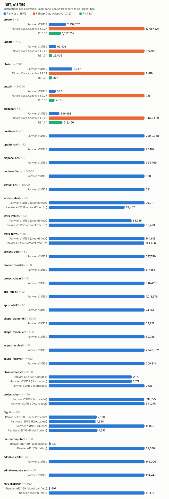
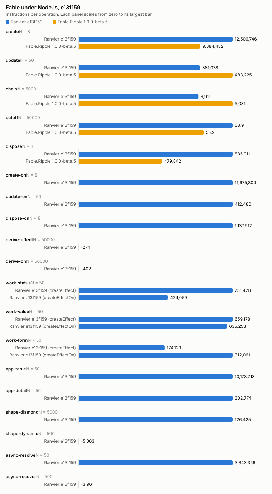

# Counter bench, e13f159

- Date: 2026-09-30 09:10:32Z
- Machine: AMD64 Family 26 Model 68 Stepping 0, AuthenticAMD, 24 logical processors, Microsoft Windows 10.0.26200, .NET 10.0.12
- Instructions: per-context-switch PMC counters (InstructionRetired, TotalCycles, BranchMispredictions)
- Library counters: from a separate RanvierCounters build (--counters-worker)
- Versions: .NET 10.0.12, FSharp.Data.Adaptive 1.2.27, R3 1.3.1, Ranvier e13f159
- Worker environment: DOTNET_TieredCompilation=0 DOTNET_TieredPGO=0 DOTNET_ReadyToRun=0 DOTNET_gcServer=0
- RanvierTrace: false
- Every figure is (m(2N) - m(N)) / N. Processor counters are the median over runs.
- Instruction counts differing by under 5 % are within run-to-run noise. Compare only reports taken at the same --scale.

## Engine differences

- R3 pushes each write straight to its subscribers, without batching or glitch-free ordering. Its chain is `Select` operators holding no cached value.
- FSharp.Data.Adaptive dispose removes the callback subscriptions only. The `AVal.map2` nodes stay in the weak output sets of their `cval`s until collected.

## create: one root of 1000 rows (N = 8)

| Engine | instr/op | cycles/op | br-miss/op | intervals N/2N | bytes/op | objects/op | counters/op |
| --- | ---: | ---: | ---: | ---: | ---: | ---: | --- |
| Ranvier e13f159 | 2,239,732.50 | 929,953.12 | 964.50 | 1/2 | 594,504 | 2,002 | SignalsCreated 1,001, EffectsCreated 1,000, OwnersCreated 1, EdgesAdded 2,000, ObserverInserts 2,000, EffectRuns 1,000, Flushes 1,000 |
| FSharp.Data.Adaptive 1.2.27 | 12,687,324.38 | 6,479,148.75 | 7,867.75 | 2/2 | 2,413,717 | n/a | n/a |
| R3 1.3.1 | 1,572,256.75 | 845,602.88 | 638.50 | 1/1 | 584,160 | n/a | n/a |

## update: write every 10th of 1000 rows (N = 50)

| Engine | instr/op | cycles/op | br-miss/op | intervals N/2N | bytes/op | objects/op | counters/op |
| --- | ---: | ---: | ---: | ---: | ---: | ---: | --- |
| Ranvier e13f159 | 63,407.98 | 16,511.42 | 2.12 | 1/4 | 0 | 0 | EffectRuns 100, Flushes 100 |
| FSharp.Data.Adaptive 1.2.27 | 874,969.38 | 361,650.02 | 411.44 | 1/1 | 63,200 | n/a | n/a |
| R3 1.3.1 | 26,405.66 | 10,779.58 | 0.34 | 1/1 | 0 | n/a | n/a |

## chain: write the source of 4 memos, read the tail (N = 5000)

| Engine | instr/op | cycles/op | br-miss/op | intervals N/2N | bytes/op | objects/op | counters/op |
| --- | ---: | ---: | ---: | ---: | ---: | ---: | --- |
| Ranvier e13f159 | 2,047.23 | 843.73 | 1.16 | 1/2 | 0 | 0 | MemoRecomputes 4 |
| FSharp.Data.Adaptive 1.2.27 | 8,419.45 | 3,076.48 | 1.55 | 2/2 | 472 | n/a | n/a |
| R3 1.3.1 | 267.00 | 151.61 | 0.00 | 1/1 | 0 | n/a | n/a |

## cutoff: write an equal value to an observed source (N = 50000)

| Engine | instr/op | cycles/op | br-miss/op | intervals N/2N | bytes/op | objects/op | counters/op |
| --- | ---: | ---: | ---: | ---: | ---: | ---: | --- |
| Ranvier e13f159 | 51.91 | 17.43 | -0.00 | 1/1 | 0 | 0 | 0 |
| FSharp.Data.Adaptive 1.2.27 | 736.46 | 391.04 | 0.28 | 2/1 | 352 | n/a | n/a |
| R3 1.3.1 | 42.98 | 23.74 | -0.00 | 1/1 | 0 | n/a | n/a |

## dispose: dispose one root of 1000 rows (N = 8)

| Engine | instr/op | cycles/op | br-miss/op | intervals N/2N | bytes/op | objects/op | counters/op |
| --- | ---: | ---: | ---: | ---: | ---: | ---: | --- |
| Ranvier e13f159 | 396,897.62 | 114,696.88 | -0.88 | 1/1 | 56 | 0 | EdgesRemoved 2,000, ObserverRemoves 2,000 |
| FSharp.Data.Adaptive 1.2.27 | 3,625,428.88 | 2,876,521.62 | 3,313.75 | 3/4 | 0 | n/a | n/a |
| R3 1.3.1 | 512,466 | 437,771.12 | 554.62 | 1/2 | 0 | n/a | n/a |

## create-on: one root of 1000 createEffectOn rows (N = 8)

| Engine | instr/op | cycles/op | br-miss/op | intervals N/2N | bytes/op | objects/op | counters/op |
| --- | ---: | ---: | ---: | ---: | ---: | ---: | --- |
| Ranvier e13f159 | 2,349,068.50 | 830,636 | 1,021.50 | 1/2 | 506,648 | 2,002 | SignalsCreated 1,001, EffectsCreated 1,000, OwnersCreated 1, EdgesAdded 2,000, ObserverInserts 2,000, EffectRuns 1,000, Flushes 1,000 |

## update-on: write every 10th of 1000 createEffectOn rows (N = 50)

| Engine | instr/op | cycles/op | br-miss/op | intervals N/2N | bytes/op | objects/op | counters/op |
| --- | ---: | ---: | ---: | ---: | ---: | ---: | --- |
| Ranvier e13f159 | 77,462.28 | 24,764.32 | 5.18 | 1/2 | 0 | 0 | EffectRuns 100, Flushes 100 |

## dispose-on: dispose one root of 1000 createEffectOn rows (N = 8)

| Engine | instr/op | cycles/op | br-miss/op | intervals N/2N | bytes/op | objects/op | counters/op |
| --- | ---: | ---: | ---: | ---: | ---: | ---: | --- |
| Ranvier e13f159 | 394,469.25 | 133,867.75 | 23.25 | 1/1 | 56 | 0 | EdgesRemoved 2,000, ObserverRemoves 2,000 |

## derive-effect: write a new value whose derived value is unchanged, Effect (N = 50000)

| Engine | instr/op | cycles/op | br-miss/op | intervals N/2N | bytes/op | objects/op | counters/op |
| --- | ---: | ---: | ---: | ---: | ---: | ---: | --- |
| Ranvier e13f159 | 598.11 | 186.30 | -0.00 | 1/3 | 0 | 0 | EffectRuns 1, Flushes 1 |

## derive-on: write a new value whose derived value is unchanged, createEffectOn (N = 50000)

| Engine | instr/op | cycles/op | br-miss/op | intervals N/2N | bytes/op | objects/op | counters/op |
| --- | ---: | ---: | ---: | ---: | ---: | ---: | --- |
| Ranvier e13f159 | 580.96 | 174.27 | 0.01 | 2/2 | 0 | 0 | EffectRuns 1, Flushes 1 |

## work-status: write every 10th of 1000 rows; the act formats a label, 1 write in 10 changes it (N = 50)

| Engine | instr/op | cycles/op | br-miss/op | intervals N/2N | bytes/op | objects/op | counters/op |
| --- | ---: | ---: | ---: | ---: | ---: | ---: | --- |
| Ranvier e13f159 (createEffect) | 79,011.34 | 21,830.48 | 5.20 | 2/1 | 3,980 | 0 | EffectRuns 100, Flushes 100 |
| Ranvier e13f159 (createEffectOn) | 62,486.90 | 17,764.10 | 0.52 | 1/1 | 398.40 | 0 | EffectRuns 100, Flushes 100 |

## work-value: write every 10th of 1000 rows; the act formats a label, every write changes it (N = 50)

| Engine | instr/op | cycles/op | br-miss/op | intervals N/2N | bytes/op | objects/op | counters/op |
| --- | ---: | ---: | ---: | ---: | ---: | ---: | --- |
| Ranvier e13f159 (createEffect) | 83,335.28 | 23,050.30 | 2.68 | 1/1 | 6,467.20 | 0 | EffectRuns 100, Flushes 100 |
| Ranvier e13f159 (createEffectOn) | 96,428.70 | 34,908.34 | 6.50 | 1/2 | 6,467.20 | 0 | EffectRuns 100, Flushes 100 |

## work-form: write one field of each of 125 8-field forms; validity feeds a signal and an effect (N = 50)

| Engine | instr/op | cycles/op | br-miss/op | intervals N/2N | bytes/op | objects/op | counters/op |
| --- | ---: | ---: | ---: | ---: | ---: | ---: | --- |
| Ranvier e13f159 (createEffect) | 144,813.36 | 37,236.78 | 15.38 | 1/1 | 0 | 0 | EffectRuns 126.02, Flushes 125 |
| Ranvier e13f159 (createEffectOn) | 144,425.92 | 37,978.68 | 27.10 | 1/3 | 0 | 0 | EffectRuns 126.02, Flushes 125 |

## project-edit: change one row of a 1000-row projection (N = 50)

| Engine | instr/op | cycles/op | br-miss/op | intervals N/2N | bytes/op | objects/op | counters/op |
| --- | ---: | ---: | ---: | ---: | ---: | ---: | --- |
| Ranvier e13f159 | 537,749.38 | 183,664.60 | 2.84 | 2/1 | 104 | 0 | MemoRecomputes 1, EffectRuns 1, Flushes 1 |

## project-reorder: reverse a 1000-row projection (N = 50)

| Engine | instr/op | cycles/op | br-miss/op | intervals N/2N | bytes/op | objects/op | counters/op |
| --- | ---: | ---: | ---: | ---: | ---: | ---: | --- |
| Ranvier e13f159 | 517,856.20 | 178,860.76 | 14.62 | 3/2 | 4,128 | 0 | Flushes 1 |

## project-chain: change one row of a 1000-row filter, sortBy, map chain (N = 50)

| Engine | instr/op | cycles/op | br-miss/op | intervals N/2N | bytes/op | objects/op | counters/op |
| --- | ---: | ---: | ---: | ---: | ---: | ---: | --- |
| Ranvier e13f159 | 3,674,116.70 | 993,703.16 | 275.98 | 3/2 | 206,736 | 0 | MemoRecomputes 6, EffectRuns 2, Flushes 1 |

## app-table: alternate a filter query and a sort direction over 1000 rows (N = 50)

| Engine | instr/op | cycles/op | br-miss/op | intervals N/2N | bytes/op | objects/op | counters/op |
| --- | ---: | ---: | ---: | ---: | ---: | ---: | --- |
| Ranvier e13f159 | 7,213,579.10 | 2,253,884.56 | 1,238.52 | 1/1 | 420,728.80 | 240 | SignalsCreated 120, MemosCreated 120, EdgesAdded 760.50, EdgesRemoved 760.50, ObserverInserts 760.50, ObserverRemoves 760.50, MemoRecomputes 980, EffectRuns 1, Flushes 1 |

## app-detail: move the selection over 1000 rows; the detail rebuilds 20 memo and effect pairs (N = 50)

| Engine | instr/op | cycles/op | br-miss/op | intervals N/2N | bytes/op | objects/op | counters/op |
| --- | ---: | ---: | ---: | ---: | ---: | ---: | --- |
| Ranvier e13f159 | 74,551.48 | 32,525.66 | 45.62 | 1/1 | 12,960 | 40 | MemosCreated 20, EffectsCreated 20, EdgesAdded 41, EdgesRemoved 41, ObserverInserts 41, ObserverRemoves 41, MemoRecomputes 21, EffectRuns 24, Flushes 1 |

## shape-diamond: write a source read by 100 memos joined by one (N = 5000)

| Engine | instr/op | cycles/op | br-miss/op | intervals N/2N | bytes/op | objects/op | counters/op |
| --- | ---: | ---: | ---: | ---: | ---: | ---: | --- |
| Ranvier e13f159 | 54,720.63 | 18,253.64 | 2.49 | 2/2 | 0 | 0 | MemoRecomputes 101, EffectRuns 1, Flushes 1 |

## shape-dynamic: alternate a branch flip and a write of every active source of 100 effects (N = 500)

| Engine | instr/op | cycles/op | br-miss/op | intervals N/2N | bytes/op | objects/op | counters/op |
| --- | ---: | ---: | ---: | ---: | ---: | ---: | --- |
| Ranvier e13f159 | 69,728.15 | 19,372.69 | 2.80 | 2/2 | 0 | 0 | EdgesAdded 50, EdgesRemoved 50, ObserverInserts 50, ObserverRemoves 50, EffectRuns 100, Flushes 50.50 |

## async-resolve: reload 10 suspense widgets of 10 sources, then settle each (N = 50)

| Engine | instr/op | cycles/op | br-miss/op | intervals N/2N | bytes/op | objects/op | counters/op |
| --- | ---: | ---: | ---: | ---: | ---: | ---: | --- |
| Ranvier e13f159 | 2,520,901.78 | 927,443.40 | 1,502.74 | 1/2 | 71,008 | 0 | EdgesAdded 190, EdgesRemoved 190, ObserverInserts 190, ObserverRemoves 190, EffectRuns 20, Flushes 101 |

## async-recover: fail one source of one error-boundary widget, then settle a replacement (N = 500)

| Engine | instr/op | cycles/op | br-miss/op | intervals N/2N | bytes/op | objects/op | counters/op |
| --- | ---: | ---: | ---: | ---: | ---: | ---: | --- |
| Ranvier e13f159 | 209,812.57 | 176,192.37 | 128.43 | 1/2 | 180,422.29 | 0 | EdgesAdded 20, EdgesRemoved 20, ObserverInserts 20, ObserverRemoves 20, EffectRuns 4, Flushes 4 |

## chain-affinity: write the source of 4 memos, read the tail, per thread affinity (N = 5000)

| Engine | instr/op | cycles/op | br-miss/op | intervals N/2N | bytes/op | objects/op | counters/op |
| --- | ---: | ---: | ---: | ---: | ---: | ---: | --- |
| Ranvier e13f159 (Guarded) | 2,179.00 | 781.33 | 1.08 | 1/2 | 0 | 0 | MemoRecomputes 4 |
| Ranvier e13f159 (Unchecked) | 2,176.79 | 818.60 | 1.04 | 1/3 | 0 | 0 | MemoRecomputes 4 |
| Ranvier e13f159 (Serialised) | 2,515.55 | 945.21 | 1.10 | 2/2 | 0 | 0 | MemoRecomputes 4 |

## project-churn: replace the last key of a 1000-row projection (N = 50)

| Engine | instr/op | cycles/op | br-miss/op | intervals N/2N | bytes/op | objects/op | counters/op |
| --- | ---: | ---: | ---: | ---: | ---: | ---: | --- |
| Ranvier e13f159 (no reader) | 539,775.30 | 185,488.56 | 26.78 | 1/1 | 4,592 | 2 | SignalsCreated 1, MemosCreated 1, EffectRuns 1, Flushes 1 |
| Ranvier e13f159 (key reader) | 541,275.96 | 187,687.60 | 16.06 | 2/1 | 4,992 | 2 | SignalsCreated 1, MemosCreated 1, EffectRuns 2, Flushes 1 |

## flight: write an async memo's trigger twice, then settle every flight the writes started (N = 500)

| Engine | instr/op | cycles/op | br-miss/op | intervals N/2N | bytes/op | objects/op | counters/op |
| --- | ---: | ---: | ---: | ---: | ---: | ---: | --- |
| Ranvier e13f159 (CancelPrevious) | 7,519.92 | 2,446.77 | 1.24 | 1/1 | 1,720 | 0 | 0 |
| Ranvier e13f159 (KeepLatest) | 7,348.47 | 2,694.91 | 0.86 | 1/1 | 1,672 | 0 | 0 |
| Ranvier e13f159 (Queue) | 15,065.07 | 6,840.67 | 9.61 | 1/1 | 3,184 | 0 | 0 |
| Ranvier e13f159 (FinishCurrent) | 7,655.24 | 2,484.52 | 1.14 | 1/2 | 1,744 | 0 | 0 |

## fail-recompute: re-run a memo and its one reader, then read the reader's failure origin (N = 500)

| Engine | instr/op | cycles/op | br-miss/op | intervals N/2N | bytes/op | objects/op | counters/op |
| --- | ---: | ---: | ---: | ---: | ---: | ---: | --- |
| Ranvier e13f159 (succeeding) | 1,131.00 | 506.32 | 0.32 | 1/1 | 0 | 0 | MemoRecomputes 2 |
| Ranvier e13f159 (failing) | 62,685.58 | 21,491.91 | 29.73 | 2/2 | 1,576 | 0 | MemoRecomputes 2 |

## editable-edit: edit every 10th of 1000 editables (N = 50)

| Engine | instr/op | cycles/op | br-miss/op | intervals N/2N | bytes/op | objects/op | counters/op |
| --- | ---: | ---: | ---: | ---: | ---: | ---: | --- |
| Ranvier e13f159 | 145,006.40 | 44,005.14 | -0.96 | 1/1 | 0 | 0 | MemoRecomputes 100, EffectRuns 100, Flushes 100 |

## editable-upstream: write the seed source of every 10th of 1000 editables (N = 50)

| Engine | instr/op | cycles/op | br-miss/op | intervals N/2N | bytes/op | objects/op | counters/op |
| --- | ---: | ---: | ---: | ---: | ---: | ---: | --- |
| Ranvier e13f159 | 194,448.68 | 60,803.56 | -1.96 | 1/1 | 2,400 | 0 | MemoRecomputes 200, EffectRuns 100, Flushes 100 |

## mvu-dispatch: change one field of a 64-field model, one reader per field (N = 500)

| Engine | instr/op | cycles/op | br-miss/op | intervals N/2N | bytes/op | objects/op | counters/op |
| --- | ---: | ---: | ---: | ---: | ---: | ---: | --- |
| Ranvier e13f159 (signal per field) | 606.75 | 93.18 | 0.05 | 1/1 | 0 | 0 | EffectRuns 1, Flushes 1 |
| Ranvier e13f159 (Mvu) | 48,133.38 | 15,321.13 | 5.83 | 1/3 | 400 | 0 | MemoRecomputes 64, EffectRuns 1, Flushes 1 |

## Calibration, 5 run(s)

Allocations and library counters identical in every run.

| Scenario | Engine | Source | Median/op | Min/op | Max/op | Spread |
| --- | --- | --- | ---: | ---: | ---: | ---: |
| create | Ranvier | InstructionRetired | 2,239,732.50 | 2,232,424.25 | 2,242,365.88 | 0.45 % |
| create | Ranvier | TotalCycles | 929,953.12 | 676,599.62 | 940,439.88 | 39.00 % |
| create | Ranvier | BranchMispredictions | 964.50 | 803.75 | 1,131.12 | 40.73 % |
| create | FSharp.Data.Adaptive | InstructionRetired | 12,687,324.38 | 12,451,239.50 | 12,780,241.75 | 2.64 % |
| create | FSharp.Data.Adaptive | TotalCycles | 6,479,148.75 | 6,320,446.25 | 6,694,958.12 | 5.93 % |
| create | FSharp.Data.Adaptive | BranchMispredictions | 7,867.75 | 6,963.50 | 8,617.62 | 23.75 % |
| create | R3 | InstructionRetired | 1,572,256.75 | 1,569,401.62 | 1,577,071.75 | 0.49 % |
| create | R3 | TotalCycles | 845,602.88 | 727,079.88 | 1,029,476.12 | 41.59 % |
| create | R3 | BranchMispredictions | 638.50 | 91.88 | 791.12 | 761.09 % |
| update | Ranvier | InstructionRetired | 63,407.98 | 63,221.38 | 63,942 | 1.14 % |
| update | Ranvier | TotalCycles | 16,511.42 | 13,925.56 | 25,884.58 | 85.88 % |
| update | Ranvier | BranchMispredictions | 2.12 | -7.16 | 9.92 | -238.55 % |
| update | FSharp.Data.Adaptive | InstructionRetired | 874,969.38 | 871,831.42 | 877,064.26 | 0.60 % |
| update | FSharp.Data.Adaptive | TotalCycles | 361,650.02 | 349,862.36 | 393,304.66 | 12.42 % |
| update | FSharp.Data.Adaptive | BranchMispredictions | 411.44 | 378.48 | 607.44 | 60.49 % |
| update | R3 | InstructionRetired | 26,405.66 | 26,255.56 | 26,447.08 | 0.73 % |
| update | R3 | TotalCycles | 10,779.58 | 9,368.66 | 17,414.42 | 85.88 % |
| update | R3 | BranchMispredictions | 0.34 | -5.64 | 3.08 | -154.61 % |
| chain | Ranvier | InstructionRetired | 2,047.23 | 2,046.67 | 2,055.51 | 0.43 % |
| chain | Ranvier | TotalCycles | 843.73 | 711.71 | 1,073.81 | 50.88 % |
| chain | Ranvier | BranchMispredictions | 1.16 | 1.10 | 1.49 | 34.84 % |
| chain | FSharp.Data.Adaptive | InstructionRetired | 8,419.45 | 8,355.49 | 8,610.72 | 3.05 % |
| chain | FSharp.Data.Adaptive | TotalCycles | 3,076.48 | 2,848.01 | 3,553.85 | 24.78 % |
| chain | FSharp.Data.Adaptive | BranchMispredictions | 1.55 | 1.40 | 1.86 | 33.35 % |
| chain | R3 | InstructionRetired | 267.00 | 266.70 | 267.06 | 0.13 % |
| chain | R3 | TotalCycles | 151.61 | 144.63 | 158.83 | 9.82 % |
| chain | R3 | BranchMispredictions | 0.00 | -0.01 | 0.01 | -145.59 % |
| cutoff | Ranvier | InstructionRetired | 51.91 | 51.85 | 52.25 | 0.77 % |
| cutoff | Ranvier | TotalCycles | 17.43 | 14.41 | 24.79 | 72.05 % |
| cutoff | Ranvier | BranchMispredictions | -0.00 | -0.00 | 0.01 | -243.56 % |
| cutoff | FSharp.Data.Adaptive | InstructionRetired | 736.46 | 735.83 | 737.40 | 0.21 % |
| cutoff | FSharp.Data.Adaptive | TotalCycles | 391.04 | 336.04 | 408.45 | 21.55 % |
| cutoff | FSharp.Data.Adaptive | BranchMispredictions | 0.28 | 0.27 | 0.30 | 8.47 % |
| cutoff | R3 | InstructionRetired | 42.98 | 42.68 | 43.23 | 1.28 % |
| cutoff | R3 | TotalCycles | 23.74 | 22.40 | 26.56 | 18.57 % |
| cutoff | R3 | BranchMispredictions | -0.00 | -0.01 | 0.01 | -208.65 % |
| dispose | Ranvier | InstructionRetired | 396,897.62 | 395,274.88 | 397,339.12 | 0.52 % |
| dispose | Ranvier | TotalCycles | 114,696.88 | 83,527.62 | 405,371.12 | 385.31 % |
| dispose | Ranvier | BranchMispredictions | -0.88 | -21.38 | 36.38 | -270.18 % |
| dispose | FSharp.Data.Adaptive | InstructionRetired | 3,625,428.88 | 3,619,978 | 3,635,178.62 | 0.42 % |
| dispose | FSharp.Data.Adaptive | TotalCycles | 2,876,521.62 | 2,806,570 | 3,753,180.88 | 33.73 % |
| dispose | FSharp.Data.Adaptive | BranchMispredictions | 3,313.75 | 3,094.25 | 3,523.75 | 13.88 % |
| dispose | R3 | InstructionRetired | 512,466 | 512,065 | 515,544.12 | 0.68 % |
| dispose | R3 | TotalCycles | 437,771.12 | 375,855.38 | 458,685.62 | 22.04 % |
| dispose | R3 | BranchMispredictions | 554.62 | 530.38 | 672.50 | 26.80 % |
| create-on | Ranvier | InstructionRetired | 2,349,068.50 | 2,347,159.75 | 2,353,348.75 | 0.26 % |
| create-on | Ranvier | TotalCycles | 830,636 | 602,286.12 | 916,921.88 | 52.24 % |
| create-on | Ranvier | BranchMispredictions | 1,021.50 | 841.25 | 1,240 | 47.40 % |
| update-on | Ranvier | InstructionRetired | 77,462.28 | 77,283.60 | 77,651.50 | 0.48 % |
| update-on | Ranvier | TotalCycles | 24,764.32 | 16,959.40 | 34,725.60 | 104.76 % |
| update-on | Ranvier | BranchMispredictions | 5.18 | -2.30 | 8 | -447.83 % |
| dispose-on | Ranvier | InstructionRetired | 394,469.25 | 394,301.62 | 396,816.50 | 0.64 % |
| dispose-on | Ranvier | TotalCycles | 133,867.75 | 110,691.50 | 249,260.75 | 125.19 % |
| dispose-on | Ranvier | BranchMispredictions | 23.25 | 1.12 | 87.25 | 7,655.56 % |
| derive-effect | Ranvier | InstructionRetired | 598.11 | 597.91 | 598.66 | 0.13 % |
| derive-effect | Ranvier | TotalCycles | 186.30 | 152.29 | 190.31 | 24.96 % |
| derive-effect | Ranvier | BranchMispredictions | -0.00 | -0.00 | 0.03 | -702.94 % |
| derive-on | Ranvier | InstructionRetired | 580.96 | 580.38 | 581.08 | 0.12 % |
| derive-on | Ranvier | TotalCycles | 174.27 | 161.28 | 198.52 | 23.09 % |
| derive-on | Ranvier | BranchMispredictions | 0.01 | 0.01 | 0.02 | 229.36 % |
| work-status | Ranvier (createEffect) | InstructionRetired | 79,011.34 | 76,707.44 | 79,252.96 | 3.32 % |
| work-status | Ranvier (createEffect) | TotalCycles | 21,830.48 | 21,002.94 | 26,868.96 | 27.93 % |
| work-status | Ranvier (createEffect) | BranchMispredictions | 5.20 | -21.38 | 10.78 | -150.42 % |
| work-status | Ranvier (createEffectOn) | InstructionRetired | 62,486.90 | 62,395.60 | 62,537.02 | 0.23 % |
| work-status | Ranvier (createEffectOn) | TotalCycles | 17,764.10 | 5,463.48 | 20,513.26 | 275.46 % |
| work-status | Ranvier (createEffectOn) | BranchMispredictions | 0.52 | -2 | 3.04 | -252.00 % |
| work-value | Ranvier (createEffect) | InstructionRetired | 83,335.28 | 83,254.72 | 85,780.52 | 3.03 % |
| work-value | Ranvier (createEffect) | TotalCycles | 23,050.30 | 21,699.52 | 39,932.74 | 84.03 % |
| work-value | Ranvier (createEffect) | BranchMispredictions | 2.68 | -2.50 | 35.20 | -1,508.00 % |
| work-value | Ranvier (createEffectOn) | InstructionRetired | 96,428.70 | 96,123.48 | 96,509.88 | 0.40 % |
| work-value | Ranvier (createEffectOn) | TotalCycles | 34,908.34 | 29,082.90 | 37,331.42 | 28.36 % |
| work-value | Ranvier (createEffectOn) | BranchMispredictions | 6.50 | -3.82 | 11.18 | -392.67 % |
| work-form | Ranvier (createEffect) | InstructionRetired | 144,813.36 | 144,775.92 | 145,291.18 | 0.36 % |
| work-form | Ranvier (createEffect) | TotalCycles | 37,236.78 | 34,418.80 | 48,576.20 | 41.13 % |
| work-form | Ranvier (createEffect) | BranchMispredictions | 15.38 | 10.20 | 26.66 | 161.37 % |
| work-form | Ranvier (createEffectOn) | InstructionRetired | 144,425.92 | 144,271.30 | 145,002.18 | 0.51 % |
| work-form | Ranvier (createEffectOn) | TotalCycles | 37,978.68 | 31,871.38 | 57,786.32 | 81.31 % |
| work-form | Ranvier (createEffectOn) | BranchMispredictions | 27.10 | 11.90 | 35.72 | 200.17 % |
| project-edit | Ranvier | InstructionRetired | 537,749.38 | 537,585.34 | 538,001.54 | 0.08 % |
| project-edit | Ranvier | TotalCycles | 183,664.60 | 181,110.02 | 226,718.04 | 25.18 % |
| project-edit | Ranvier | BranchMispredictions | 2.84 | -0.36 | 24.68 | -6,955.56 % |
| project-reorder | Ranvier | InstructionRetired | 517,856.20 | 517,434.76 | 518,712.88 | 0.25 % |
| project-reorder | Ranvier | TotalCycles | 178,860.76 | 175,001.88 | 197,287.26 | 12.73 % |
| project-reorder | Ranvier | BranchMispredictions | 14.62 | 0.70 | 34.78 | 4,868.57 % |
| project-chain | Ranvier | InstructionRetired | 3,674,116.70 | 3,673,321.78 | 3,674,604.16 | 0.03 % |
| project-chain | Ranvier | TotalCycles | 993,703.16 | 936,801.76 | 1,018,846.98 | 8.76 % |
| project-chain | Ranvier | BranchMispredictions | 275.98 | 203.44 | 340.98 | 67.61 % |
| app-table | Ranvier | InstructionRetired | 7,213,579.10 | 7,211,609.44 | 7,215,688.56 | 0.06 % |
| app-table | Ranvier | TotalCycles | 2,253,884.56 | 2,114,328.40 | 2,588,046.14 | 22.41 % |
| app-table | Ranvier | BranchMispredictions | 1,238.52 | 1,212.58 | 1,432.18 | 18.11 % |
| app-detail | Ranvier | InstructionRetired | 74,551.48 | 73,919.72 | 74,695.02 | 1.05 % |
| app-detail | Ranvier | TotalCycles | 32,525.66 | 26,239.02 | 52,684.88 | 100.79 % |
| app-detail | Ranvier | BranchMispredictions | 45.62 | 33.70 | 71.64 | 112.58 % |
| shape-diamond | Ranvier | InstructionRetired | 54,720.63 | 54,703.07 | 54,745.24 | 0.08 % |
| shape-diamond | Ranvier | TotalCycles | 18,253.64 | 17,764.28 | 21,378.58 | 20.35 % |
| shape-diamond | Ranvier | BranchMispredictions | 2.49 | 2.33 | 3.01 | 29.10 % |
| shape-dynamic | Ranvier | InstructionRetired | 69,728.15 | 69,677.83 | 69,814.19 | 0.20 % |
| shape-dynamic | Ranvier | TotalCycles | 19,372.69 | 19,040.74 | 19,969.49 | 4.88 % |
| shape-dynamic | Ranvier | BranchMispredictions | 2.80 | 1.70 | 3.83 | 124.91 % |
| async-resolve | Ranvier | InstructionRetired | 2,520,901.78 | 2,520,504.30 | 2,522,410.04 | 0.08 % |
| async-resolve | Ranvier | TotalCycles | 927,443.40 | 902,916.60 | 984,965.54 | 9.09 % |
| async-resolve | Ranvier | BranchMispredictions | 1,502.74 | 1,284.22 | 1,533.44 | 19.41 % |
| async-recover | Ranvier | InstructionRetired | 209,812.57 | 209,435.24 | 210,116.95 | 0.33 % |
| async-recover | Ranvier | TotalCycles | 176,192.37 | 173,383.99 | 185,845.07 | 7.19 % |
| async-recover | Ranvier | BranchMispredictions | 128.43 | 110.08 | 135.89 | 23.44 % |
| chain-affinity | Ranvier (Guarded) | InstructionRetired | 2,179.00 | 2,173.91 | 2,180.31 | 0.29 % |
| chain-affinity | Ranvier (Guarded) | TotalCycles | 781.33 | 767.74 | 865.28 | 12.70 % |
| chain-affinity | Ranvier (Guarded) | BranchMispredictions | 1.08 | 0.87 | 2.78 | 217.65 % |
| chain-affinity | Ranvier (Unchecked) | InstructionRetired | 2,176.79 | 2,175.13 | 2,182.09 | 0.32 % |
| chain-affinity | Ranvier (Unchecked) | TotalCycles | 818.60 | 753.84 | 897.16 | 19.01 % |
| chain-affinity | Ranvier (Unchecked) | BranchMispredictions | 1.04 | 0.86 | 2.65 | 209.66 % |
| chain-affinity | Ranvier (Serialised) | InstructionRetired | 2,515.55 | 2,508.00 | 2,517.55 | 0.38 % |
| chain-affinity | Ranvier (Serialised) | TotalCycles | 945.21 | 914.56 | 955.66 | 4.49 % |
| chain-affinity | Ranvier (Serialised) | BranchMispredictions | 1.10 | 1.01 | 2.58 | 156.35 % |
| project-churn | Ranvier (no reader) | InstructionRetired | 539,775.30 | 539,614.74 | 539,941.56 | 0.06 % |
| project-churn | Ranvier (no reader) | TotalCycles | 185,488.56 | 181,190.20 | 188,297.82 | 3.92 % |
| project-churn | Ranvier (no reader) | BranchMispredictions | 26.78 | 9.34 | 31.02 | 232.12 % |
| project-churn | Ranvier (key reader) | InstructionRetired | 541,275.96 | 540,949.82 | 541,897.38 | 0.18 % |
| project-churn | Ranvier (key reader) | TotalCycles | 187,687.60 | 175,700.32 | 191,439.88 | 8.96 % |
| project-churn | Ranvier (key reader) | BranchMispredictions | 16.06 | -15.30 | 32.44 | -312.03 % |
| flight | Ranvier (CancelPrevious) | InstructionRetired | 7,519.92 | 7,501.94 | 7,557.54 | 0.74 % |
| flight | Ranvier (CancelPrevious) | TotalCycles | 2,446.77 | 2,264.04 | 2,983.39 | 31.77 % |
| flight | Ranvier (CancelPrevious) | BranchMispredictions | 1.24 | -0.29 | 3.41 | -1,293.71 % |
| flight | Ranvier (KeepLatest) | InstructionRetired | 7,348.47 | 7,282.64 | 7,367.54 | 1.17 % |
| flight | Ranvier (KeepLatest) | TotalCycles | 2,694.91 | 2,504.04 | 5,323.36 | 112.59 % |
| flight | Ranvier (KeepLatest) | BranchMispredictions | 0.86 | -0.36 | 6.80 | -2,000.00 % |
| flight | Ranvier (Queue) | InstructionRetired | 15,065.07 | 15,059.32 | 15,168.81 | 0.73 % |
| flight | Ranvier (Queue) | TotalCycles | 6,840.67 | 3,041.11 | 11,185.95 | 267.82 % |
| flight | Ranvier (Queue) | BranchMispredictions | 9.61 | 6.78 | 13.84 | 104.13 % |
| flight | Ranvier (FinishCurrent) | InstructionRetired | 7,655.24 | 7,642.96 | 7,700.39 | 0.75 % |
| flight | Ranvier (FinishCurrent) | TotalCycles | 2,484.52 | 469.66 | 3,240.51 | 589.97 % |
| flight | Ranvier (FinishCurrent) | BranchMispredictions | 1.14 | 0.72 | 3.47 | 379.56 % |
| fail-recompute | Ranvier (succeeding) | InstructionRetired | 1,131.00 | 1,124.79 | 1,143.40 | 1.65 % |
| fail-recompute | Ranvier (succeeding) | TotalCycles | 506.32 | 395.96 | 674.46 | 70.34 % |
| fail-recompute | Ranvier (succeeding) | BranchMispredictions | 0.32 | -0.05 | 0.39 | -920.83 % |
| fail-recompute | Ranvier (failing) | InstructionRetired | 62,685.58 | 62,639.78 | 62,709.35 | 0.11 % |
| fail-recompute | Ranvier (failing) | TotalCycles | 21,491.91 | 16,920.23 | 22,845.11 | 35.02 % |
| fail-recompute | Ranvier (failing) | BranchMispredictions | 29.73 | 23.97 | 31.54 | 31.55 % |
| editable-edit | Ranvier | InstructionRetired | 145,006.40 | 144,844.58 | 145,212.50 | 0.25 % |
| editable-edit | Ranvier | TotalCycles | 44,005.14 | 19,366.70 | 49,644.68 | 156.34 % |
| editable-edit | Ranvier | BranchMispredictions | -0.96 | -5.24 | 1.58 | -130.15 % |
| editable-upstream | Ranvier | InstructionRetired | 194,448.68 | 194,408.02 | 194,670.40 | 0.13 % |
| editable-upstream | Ranvier | TotalCycles | 60,803.56 | 57,511.64 | 88,260.96 | 53.47 % |
| editable-upstream | Ranvier | BranchMispredictions | -1.96 | -22.62 | 16.78 | -174.18 % |
| mvu-dispatch | Ranvier (signal per field) | InstructionRetired | 606.75 | 590.12 | 616.18 | 4.42 % |
| mvu-dispatch | Ranvier (signal per field) | TotalCycles | 93.18 | 19.97 | 368.99 | 1,747.70 % |
| mvu-dispatch | Ranvier (signal per field) | BranchMispredictions | 0.05 | -0.95 | 0.27 | -128.72 % |
| mvu-dispatch | Ranvier (Mvu) | InstructionRetired | 48,133.38 | 48,047.80 | 48,167.57 | 0.25 % |
| mvu-dispatch | Ranvier (Mvu) | TotalCycles | 15,321.13 | 14,649.62 | 18,098.44 | 23.54 % |
| mvu-dispatch | Ranvier (Mvu) | BranchMispredictions | 5.83 | 1.40 | 7.47 | 434.81 % |

# Fable under Node.js v26.7.0

- Versions: Fable.Ripple 1.0.0-beta.5, Node.js v26.7.0, Ranvier e13f159, fable-library-js 5.18.0
- node flags: --expose-gc --single-threaded
- Instructions: per-context-switch PMC counters (InstructionRetired, TotalCycles, BranchMispredictions); main: the main thread, all: every thread of the process
- bytes/op: growth of the new, old and large-object heap spaces; median of 5 processes. bytes range: minimum..maximum, 0 when every process agreed.
- heapUsed/op: growth of `process.memoryUsage().heapUsed`, which adds the code and trusted spaces.
- Every figure is (m(2N) - m(N)) / N. A figure followed by a bracketed range differed between processes.

## create: one root of 1000 rows (N = 8)

| Engine | instr/op main | instr/op all | cycles/op main | cycles/op all | br-miss/op main | br-miss/op all | bytes/op | bytes range | heapUsed/op | objects/op | counters/op |
| --- | ---: | ---: | ---: | ---: | ---: | ---: | ---: | ---: | ---: | ---: | --- |
| Ranvier e13f159 | 12,506,745.50 (12,470,628.75..12,574,117.75) | 12,506,745.50 (12,470,628.75..12,574,117.75) | 5,929,106.50 (5,693,746.75..6,259,443) | 5,929,106.50 (5,693,746.75..6,259,443) | 45,006.38 (44,309..45,770.50) | 45,006.38 (44,309..45,770.50) | 1,137,626 | 0 | 1,140,893 | 2,002 | SignalsCreated 1,001, EffectsCreated 1,000, OwnersCreated 1, EdgesAdded 2,000, ObserverInserts 2,000, EffectRuns 1,000, Flushes 1,000 |
| Fable.Ripple 1.0.0-beta.5 | 9,884,432.25 (9,847,464.62..9,928,324.50) | 9,884,432.25 (9,847,464.62..9,928,324.50) | 5,717,678.38 (5,046,464.88..6,034,082.12) | 5,717,678.38 (5,046,464.88..6,034,082.12) | 67,347.25 (64,759.50..67,811.25) | 67,347.25 (64,759.50..67,811.25) | 1,346,356 | 0 | 1,353,025 (1,353,025..1,353,033) | n/a | n/a |

## update: write every 10th of 1000 rows (N = 50)

| Engine | instr/op main | instr/op all | cycles/op main | cycles/op all | br-miss/op main | br-miss/op all | bytes/op | bytes range | heapUsed/op | objects/op | counters/op |
| --- | ---: | ---: | ---: | ---: | ---: | ---: | ---: | ---: | ---: | ---: | --- |
| Ranvier e13f159 | 381,077.88 (380,791.82..381,698.76) | 381,077.88 (380,791.82..381,698.76) | 55,635.32 (51,021.30..82,349.64) | 55,635.32 (51,021.30..82,349.64) | -58.26 (-75.50..-53.16) | -58.26 (-75.50..-53.16) | 8,809.60 | 0 | 8,545.60 | 0 | EffectRuns 100, Flushes 100 |
| Fable.Ripple 1.0.0-beta.5 | 483,225.46 (483,201.86..483,427.22) | 483,225.46 (483,201.86..483,427.22) | 78,594.88 (52,197.58..90,495.30) | 78,594.88 (52,197.58..90,495.30) | -72.98 (-92.86..-43.06) | -72.98 (-92.86..-43.06) | 24,021.12 | 0 | 24,001.60 | n/a | n/a |

## chain: write the source of 4 memos, read the tail (N = 5000)

| Engine | instr/op main | instr/op all | cycles/op main | cycles/op all | br-miss/op main | br-miss/op all | bytes/op | bytes range | heapUsed/op | objects/op | counters/op |
| --- | ---: | ---: | ---: | ---: | ---: | ---: | ---: | ---: | ---: | ---: | --- |
| Ranvier e13f159 | 3,910.84 (3,907.68..3,912.81) | 3,910.84 (3,907.68..3,912.81) | 662.15 (307.17..707.18) | 662.15 (307.17..707.18) | 0.13 (-0.06..0.14) | 0.13 (-0.06..0.14) | 0.07 | 0 | 1.92 (1.91..1.92) | 0 | MemoRecomputes 4 |
| Fable.Ripple 1.0.0-beta.5 | 5,030.55 (5,027.49..5,052.56) | 5,030.55 (5,027.49..5,052.56) | 777.03 (691.86..922.61) | 777.03 (691.86..922.61) | 0.00 (-0.77..0.18) | 0.00 (-0.77..0.18) | 0 | 0 | 0 | n/a | n/a |

## cutoff: write an equal value to an observed source (N = 50000)

| Engine | instr/op main | instr/op all | cycles/op main | cycles/op all | br-miss/op main | br-miss/op all | bytes/op | bytes range | heapUsed/op | objects/op | counters/op |
| --- | ---: | ---: | ---: | ---: | ---: | ---: | ---: | ---: | ---: | ---: | --- |
| Ranvier e13f159 | 68.91 (68.85..69.03) | 68.91 (68.85..69.03) | 8.13 (4.48..14.04) | 8.13 (4.48..14.04) | -0.00 (-0.01..0.01) | -0.00 (-0.01..0.01) | 0 | 0 | 0 | 0 | 0 |
| Fable.Ripple 1.0.0-beta.5 | 55.92 (55.78..324.33) | 55.92 (55.78..324.33) | 8.70 (7.11..132.06) | 8.70 (7.11..132.06) | -0.00 (-0.01..0.42) | -0.00 (-0.01..0.42) | 0 | 0 | 0.03 | n/a | n/a |

## dispose: dispose one root of 1000 rows (N = 8)

| Engine | instr/op main | instr/op all | cycles/op main | cycles/op all | br-miss/op main | br-miss/op all | bytes/op | bytes range | heapUsed/op | objects/op | counters/op |
| --- | ---: | ---: | ---: | ---: | ---: | ---: | ---: | ---: | ---: | ---: | --- |
| Ranvier e13f159 | 885,910.62 (842,164.25..1,216,345.50) | 885,910.62 (842,164.25..1,216,345.50) | 761,151.12 (548,698.75..1,185,743) | 761,151.12 (548,698.75..1,185,743) | 1,086.62 (1,028.38..1,453.25) | 1,086.62 (1,028.38..1,453.25) | 29,234 | 0 | 29,328 | 0 | EdgesRemoved 2,000, ObserverRemoves 2,000 |
| Fable.Ripple 1.0.0-beta.5 | 479,842 (473,915.50..481,006.12) | 479,842 (473,915.50..481,006.12) | 200,971.88 (104,469.75..355,763.25) | 200,971.88 (104,469.75..355,763.25) | 23.50 (-57.88..73.88) | 23.50 (-57.88..73.88) | 28,672 | 0 | 28,672 | n/a | n/a |

## create-on: one root of 1000 createEffectOn rows (N = 8)

| Engine | instr/op main | instr/op all | cycles/op main | cycles/op all | br-miss/op main | br-miss/op all | bytes/op | bytes range | heapUsed/op | objects/op | counters/op |
| --- | ---: | ---: | ---: | ---: | ---: | ---: | ---: | ---: | ---: | ---: | --- |
| Ranvier e13f159 | 11,975,304.38 (11,904,229.12..11,981,167.88) | 11,975,304.38 (11,904,229.12..11,981,167.88) | 5,447,263.12 (5,183,004.62..5,502,320.62) | 5,447,263.12 (5,183,004.62..5,502,320.62) | 47,075.75 (46,607.25..47,176.88) | 47,075.75 (46,607.25..47,176.88) | 1,026,557 | 0 | 1,031,764 | 2,002 | SignalsCreated 1,001, EffectsCreated 1,000, OwnersCreated 1, EdgesAdded 2,000, ObserverInserts 2,000, EffectRuns 1,000, Flushes 1,000 |

## update-on: write every 10th of 1000 createEffectOn rows (N = 50)

| Engine | instr/op main | instr/op all | cycles/op main | cycles/op all | br-miss/op main | br-miss/op all | bytes/op | bytes range | heapUsed/op | objects/op | counters/op |
| --- | ---: | ---: | ---: | ---: | ---: | ---: | ---: | ---: | ---: | ---: | --- |
| Ranvier e13f159 | 412,479.90 (411,822.78..412,742.42) | 412,479.90 (411,822.78..412,742.42) | 81,922.90 (69,616.80..136,603.10) | 81,922.90 (69,616.80..136,603.10) | 124.62 (97.56..140.16) | 124.62 (97.56..140.16) | 8,790.40 | 0 | 9,014.24 | 0 | EffectRuns 100, Flushes 100 |

## dispose-on: dispose one root of 1000 createEffectOn rows (N = 8)

| Engine | instr/op main | instr/op all | cycles/op main | cycles/op all | br-miss/op main | br-miss/op all | bytes/op | bytes range | heapUsed/op | objects/op | counters/op |
| --- | ---: | ---: | ---: | ---: | ---: | ---: | ---: | ---: | ---: | ---: | --- |
| Ranvier e13f159 | 1,137,912.25 (1,130,508.38..1,153,872.25) | 1,137,912.25 (1,130,508.38..1,153,872.25) | 832,156.38 (348,059.25..906,795.88) | 832,156.38 (348,059.25..906,795.88) | 786 (504.62..833.38) | 786 (504.62..833.38) | 29,232 | 0 | 29,232 | 0 | EdgesRemoved 2,000, ObserverRemoves 2,000 |

## derive-effect: write a new value whose derived value is unchanged, Effect (N = 50000)

| Engine | instr/op main | instr/op all | cycles/op main | cycles/op all | br-miss/op main | br-miss/op all | bytes/op | bytes range | heapUsed/op | objects/op | counters/op |
| --- | ---: | ---: | ---: | ---: | ---: | ---: | ---: | ---: | ---: | ---: | --- |
| Ranvier e13f159 | -273.77 (-281.69..-272.53) | -273.77 (-281.69..-272.53) | -553.19 (-605.47..-548.47) | -553.19 (-605.47..-548.47) | -7.33 (-7.34..-7.28) | -7.33 (-7.34..-7.28) | -0.03 | 0 | -0.69 | 0 | EffectRuns 1, Flushes 1 |

## derive-on: write a new value whose derived value is unchanged, createEffectOn (N = 50000)

| Engine | instr/op main | instr/op all | cycles/op main | cycles/op all | br-miss/op main | br-miss/op all | bytes/op | bytes range | heapUsed/op | objects/op | counters/op |
| --- | ---: | ---: | ---: | ---: | ---: | ---: | ---: | ---: | ---: | ---: | --- |
| Ranvier e13f159 | -401.60 (-403.62..-399.08) | -401.60 (-403.62..-399.08) | -576.76 (-642.23..-555.96) | -576.76 (-642.23..-555.96) | -7.28 (-7.44..-7.23) | -7.28 (-7.44..-7.23) | -0.02 | 0 | -0.65 | 0 | EffectRuns 1, Flushes 1 |

## work-status: write every 10th of 1000 rows; the act formats a label, 1 write in 10 changes it (N = 50)

| Engine | instr/op main | instr/op all | cycles/op main | cycles/op all | br-miss/op main | br-miss/op all | bytes/op | bytes range | heapUsed/op | objects/op | counters/op |
| --- | ---: | ---: | ---: | ---: | ---: | ---: | ---: | ---: | ---: | ---: | --- |
| Ranvier e13f159 (createEffect) | 731,427.60 (730,758.02..741,751.10) | 731,427.60 (730,758.02..741,751.10) | 259,600.24 (223,982.26..278,376.58) | 259,600.24 (223,982.26..278,376.58) | 1,429.62 (1,367.88..1,476.92) | 1,429.62 (1,367.88..1,476.92) | 33,427.36 | 0 | 33,672.32 | 0 | EffectRuns 100, Flushes 100 |
| Ranvier e13f159 (createEffectOn) | 424,059.04 (423,810.56..424,593.16) | 424,059.04 (423,810.56..424,593.16) | 12,960.04 (-165,141.82..29,012.78) | 12,960.04 (-165,141.82..29,012.78) | -895.66 (-1,026.24..-876) | -895.66 (-1,026.24..-876) | 10,954.24 | 0 | 11,059.04 | 0 | EffectRuns 100, Flushes 100 |

## work-value: write every 10th of 1000 rows; the act formats a label, every write changes it (N = 50)

| Engine | instr/op main | instr/op all | cycles/op main | cycles/op all | br-miss/op main | br-miss/op all | bytes/op | bytes range | heapUsed/op | objects/op | counters/op |
| --- | ---: | ---: | ---: | ---: | ---: | ---: | ---: | ---: | ---: | ---: | --- |
| Ranvier e13f159 (createEffect) | 659,178.28 (658,936.48..660,194.50) | 659,178.28 (658,936.48..660,194.50) | 228,239.64 (203,871.66..269,440.60) | 228,239.64 (203,871.66..269,440.60) | 898.74 (845.30..956.24) | 898.74 (845.30..956.24) | 33,080 | 0 | 33,266.40 | 0 | EffectRuns 100, Flushes 100 |
| Ranvier e13f159 (createEffectOn) | 635,252.98 (630,790.62..636,059.22) | 635,252.98 (630,790.62..636,059.22) | 172,172.42 (159,766.32..214,087.70) | 172,172.42 (159,766.32..214,087.70) | 412.50 (304.90..553.02) | 412.50 (304.90..553.02) | 33,029.44 | 0 | 33,214.56 | 0 | EffectRuns 100, Flushes 100 |

## work-form: write one field of each of 125 8-field forms; validity feeds a signal and an effect (N = 50)

| Engine | instr/op main | instr/op all | cycles/op main | cycles/op all | br-miss/op main | br-miss/op all | bytes/op | bytes range | heapUsed/op | objects/op | counters/op |
| --- | ---: | ---: | ---: | ---: | ---: | ---: | ---: | ---: | ---: | ---: | --- |
| Ranvier e13f159 (createEffect) | 174,129.06 (173,038.44..175,973.90) | 174,129.06 (173,038.44..175,973.90) | 1,110.58 (-24,722.90..17,754.76) | 1,110.58 (-24,722.90..17,754.76) | -219.28 (-307.68..-36.16) | -219.28 (-307.68..-36.16) | -11.84 | 0 | 152.48 | 0 | EffectRuns 126.02, Flushes 125 |
| Ranvier e13f159 (createEffectOn) | 312,061.30 (176,691.52..312,278.66) | 312,061.30 (176,691.52..312,278.66) | 46,454.80 (-30,837.88..52,976.80) | 46,454.80 (-30,837.88..52,976.80) | 21.58 (-457.68..42.02) | 21.58 (-457.68..42.02) | 0 | 0 | 0 | 0 | EffectRuns 126.02, Flushes 125 |

## app-table: alternate a filter query and a sort direction over 1000 rows (N = 50)

| Engine | instr/op main | instr/op all | cycles/op main | cycles/op all | br-miss/op main | br-miss/op all | bytes/op | bytes range | heapUsed/op | objects/op | counters/op |
| --- | ---: | ---: | ---: | ---: | ---: | ---: | ---: | ---: | ---: | ---: | --- |
| Ranvier e13f159 | 10,173,713.14 (10,160,004.80..10,186,619.44) | 10,625,327.54 (10,605,110.24..10,643,588.48) | 3,233,215.82 (2,710,439.06..3,536,958.94) | 3,528,920.38 (2,901,873.10..3,785,125.68) | 7,154 (7,044.10..7,895.16) | 7,641.88 (7,575.90..8,457.92) | 360,046.40 (GC in region) | 0 | 359,464 | 240 | SignalsCreated 120, MemosCreated 120, EdgesAdded 760.50, EdgesRemoved 760.50, ObserverInserts 760.50, ObserverRemoves 760.50, MemoRecomputes 980, EffectRuns 1, Flushes 1 |

## app-detail: move the selection over 1000 rows; the detail rebuilds 20 memo and effect pairs (N = 50)

| Engine | instr/op main | instr/op all | cycles/op main | cycles/op all | br-miss/op main | br-miss/op all | bytes/op | bytes range | heapUsed/op | objects/op | counters/op |
| --- | ---: | ---: | ---: | ---: | ---: | ---: | ---: | ---: | ---: | ---: | --- |
| Ranvier e13f159 | 302,773.90 (301,443.36..307,909.28) | 302,773.90 (301,443.36..307,909.28) | 108,079.10 (50,979.98..133,378.66) | 108,079.10 (50,979.98..133,378.66) | 232.34 (42.80..375.42) | 232.34 (42.80..375.42) | 31,934.08 | 31,934.08..31,934.40 | 31,940.32 (31,940.32..32,004.16) | 40 | MemosCreated 20, EffectsCreated 20, EdgesAdded 41, EdgesRemoved 41, ObserverInserts 41, ObserverRemoves 41, MemoRecomputes 21, EffectRuns 24, Flushes 1 |

## shape-diamond: write a source read by 100 memos joined by one (N = 5000)

| Engine | instr/op main | instr/op all | cycles/op main | cycles/op all | br-miss/op main | br-miss/op all | bytes/op | bytes range | heapUsed/op | objects/op | counters/op |
| --- | ---: | ---: | ---: | ---: | ---: | ---: | ---: | ---: | ---: | ---: | --- |
| Ranvier e13f159 | 126,425.50 (125,875.48..251,637.21) | 126,425.50 (125,875.48..251,637.21) | 19,792.65 (19,711.85..51,077.74) | 19,792.65 (19,711.85..51,077.74) | -29.53 (-30.18..59.55) | -29.53 (-30.18..59.55) | -0.01 | 0 | -3.62 | 0 | MemoRecomputes 101, EffectRuns 1, Flushes 1 |

## shape-dynamic: alternate a branch flip and a write of every active source of 100 effects (N = 500)

| Engine | instr/op main | instr/op all | cycles/op main | cycles/op all | br-miss/op main | br-miss/op all | bytes/op | bytes range | heapUsed/op | objects/op | counters/op |
| --- | ---: | ---: | ---: | ---: | ---: | ---: | ---: | ---: | ---: | ---: | --- |
| Ranvier e13f159 | -5,063.33 (-5,289.65..-3,973.81) | -5,063.33 (-5,289.65..-3,973.81) | -54,284.98 (-72,072.00..-51,787.84) | -54,284.98 (-72,072.00..-51,787.84) | -789.77 (-801.89..-776.76) | -789.77 (-801.89..-776.76) | 3,211.14 | 0 | 3,138.54 (3,138.37..3,138.54) | 0 | EdgesAdded 50, EdgesRemoved 50, ObserverInserts 50, ObserverRemoves 50, EffectRuns 100, Flushes 50.50 |

## async-resolve: reload 10 suspense widgets of 10 sources, then settle each (N = 50)

| Engine | instr/op main | instr/op all | cycles/op main | cycles/op all | br-miss/op main | br-miss/op all | bytes/op | bytes range | heapUsed/op | objects/op | counters/op |
| --- | ---: | ---: | ---: | ---: | ---: | ---: | ---: | ---: | ---: | ---: | --- |
| Ranvier e13f159 | 3,343,356 (3,260,117.64..3,358,091.90) | 3,343,356 (3,260,117.64..3,358,091.90) | 1,525,458.90 (1,419,240.96..1,674,188.52) | 1,525,458.90 (1,419,240.96..1,674,188.52) | 10,059.78 (8,177.88..10,267.40) | 10,059.78 (8,177.88..10,267.40) | 172,158.08 | 0 | 172,762.72 (172,762.72..172,765.44) | 0 | EdgesAdded 190, EdgesRemoved 190, ObserverInserts 190, ObserverRemoves 190, EffectRuns 20, Flushes 101 |

## async-recover: fail one source of one error-boundary widget, then settle a replacement (N = 500)

| Engine | instr/op main | instr/op all | cycles/op main | cycles/op all | br-miss/op main | br-miss/op all | bytes/op | bytes range | heapUsed/op | objects/op | counters/op |
| --- | ---: | ---: | ---: | ---: | ---: | ---: | ---: | ---: | ---: | ---: | --- |
| Ranvier e13f159 | -3,960.66 (-5,448.36..-3,645.11) | -3,960.66 (-5,448.36..-3,645.11) | -40,739.74 (-56,369.73..-37,085.76) | -40,739.74 (-56,369.73..-37,085.76) | -822.57 (-884.66..-804.24) | -822.57 (-884.66..-804.24) | 6,599.92 | 0 | 6,540.77 | 0 | EdgesAdded 20, EdgesRemoved 20, ObserverInserts 20, ObserverRemoves 20, EffectRuns 4, Flushes 4 |

# Appendix: instructions per operation

The instr/op medians from the tables above; Node.js bars are main-thread figures. Each panel has its own scale.

## .NET

## Fable under Node.js

