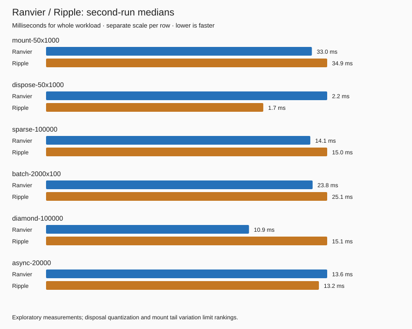

# Ranvier / Fable.Ripple browser comparison

Measured 2026-10-02. This is an exploratory comparison of Ranvier's DOM PoC and published Ripple packages, not a renderer completeness or production performance ranking. No product implementation was changed and no Ripple workaround was added. [API and first-party source research](../../RESEARCH-fable-ripple-comparison.md).

## Findings

Both implementations produced correct final values for the common performance workloads. Async request-to-DOM times were close. Ranvier consistently took less time on the diamond graph; the static DOM workloads were much closer. Ripple's exported fixture bundle was approximately half the size.

The correctness probes exposed Ripple cleanup and scheduler failures. They also exposed capabilities that its documented async recipe does not provide. These are reported separately: a missing resource contract is not evidence that Ripple violated a resource contract it promised.

## Measured times

All values below are milliseconds for the **entire named workload**, not per operation. Each pair gives Ranvier then Ripple. Values are rounded to one decimal. Two independent runs each used five warmups and 25 measured samples per library/workload, alternating library order. Median is the middle sorted sample; p95 is sorted sample 24 of 25.

- **Mount 50 × 1,000 cells:** run 1 medians **32.2 / 33.8**, p95 **53.6 / 40.8**; run 2 medians **33.0 / 34.9**, p95 **51.2 / 71.6**. Tail variation prevents a confident mount winner.
- **Dispose 50 × 1,000 cells:** run 1 medians **2.1 / 1.6**, p95 **2.8 / 2.2**; run 2 medians **2.2 / 1.7**, p95 **2.9 / 2.4**. Each tiny disposal was timed separately and summed; timer quantization is substantial. This does not establish a dependable disposal-speed advantage.
- **100,000 individual cell writes:** run 1 medians **13.8 / 16.0**, p95 **14.5 / 16.9**; run 2 medians **14.1 / 15.0**, p95 **14.9 / 15.9**. Ranvier took roughly 6–14% less time in these runs.
- **2,000 batches × 100 cell writes:** run 1 medians **24.5 / 25.3**, p95 **30.7 / 31.9**; run 2 medians **23.8 / 25.1**, p95 **25.1 / 29.3**. A small descriptive difference, not a general batching claim.
- **100,000 diamond graph writes:** run 1 medians **10.7 / 15.1**, p95 **11.3 / 15.9**; run 2 medians **10.9 / 15.1**, p95 **11.5 / 15.8**. Ranvier took approximately **28–29% less time**, about **1.4× throughput**, for this particular graph.
- **20,000 sequential async request-to-DOM roundtrips:** run 1 medians **13.7 / 13.7**, p95 **15.1 / 14.8**; run 2 medians **13.6 / 13.2**, p95 **15.8 / 14.5**. These results support similar cost for this fixture, not an async speed ranking.



[Run 1 raw data](2026-10-02-run-1.json), [run 2 raw data](2026-10-02-run-2.json), [latest correctness rerun](2026-10-02-checks.json). The initial shorter run produced sub-millisecond samples, so workload sizes were increased; [preliminary raw data](2026-10-02-preliminary.json) is retained but excluded from the conclusions above.

## Workloads and timing boundaries

- Static dashboard: 1,000 independent integer sources, one doubling memo and one persistent span/text binding per source. Same HTML depth, arithmetic, string conversion and write sequence. Individual writes cycle through the cells; batches change 100 cells. Final values of all 1,000 cells are checked outside timing.
- Mount/dispose: 50 fresh dashboards, accumulating the separately measured mount or disposal intervals. DOM checks occur outside those intervals.
- Diamond graph: `x + 1` and `2 * x` feed a merged value and one effect. Final value and effect count are checked. This is a graph workload, not DOM throughput.
- Async: controlled promises with immediate transport completion, followed by waiting for the expected DOM text. Timing includes `Load`, state transitions, promise creation/resolution, microtask waits and repeated `host.textContent` reads. It excludes artificial I/O/network delay and painting. It is **not isolated accepted-completion propagation latency**.

All DOM timing ends at state changes, without forced layout or paint. Headless Chromium, a shared developer machine and short absolute durations limit extrapolation. No statistical significance or production regression claim is made.

## Async correctness

Ranvier uses its native `createAsync` resource, including previous-value/loading/error state and cancellation tokens. Ripple uses the documented `RemoteData` plus generation-counter recipe, with `Promise.map` / `Promise.catch` and generation checks for both success and rejection. Only the transport is replaced with controlled promises; no disposed guard, abort shim or extra exception wrapper is added.

Both passed:

- Initial/loading state, retaining previous data while refreshing, and a successful accepted result.
- An outer transport promise waiting for an inner pending promise; no premature loaded state.
- Inner rejection and an exception thrown in the transport's success mapping becoming visible error state.
- A newer success winning over an older success or rejection.
- Recovery to a later successful result after an error.
- Detached DOM bindings stopping after mount disposal.

The nesting and mapping exception originate in a **shared JavaScript transport chain**, flattened by normal JavaScript promise assimilation before the adapter receives it. Passing demonstrates that each adapter consumes that chain correctly; it does not demonstrate library-native flattening of a raw promise-of-promise or a library's own mapping-exception behavior.

Ripple's recipe failed these stronger behavior probes:

- **Synchronous request setup throws:** the exception escapes and the UI stays `loading`; Ranvier displays `failed:request setup failed`. The recipe's downstream `Promise.catch` cannot catch a failure occurring before a promise is returned. This is an application error-handling gap, not a failed promise-rejection contract.
- **Dispose between outer and inner completion:** Ripple's application state changes from `loading` to `loaded:too late`, although its detached DOM correctly stays unchanged. Ranvier prevents the disposed resource publishing a new value. Ripple's documented recipe does not promise a disposal guard.
- **Superseding/disposal cancellation:** Ranvier signals its flight cancellation tokens; Ripple has no native equivalent in this recipe. The controlled transport deliberately keeps running, so this measures cancellation notification, not physical promise abortion or network cancellation.

Neither fixture establishes reactive tracking or owner context across `await`. Inputs are read synchronously before awaiting. Late cleanup registration and reads occurring only after await were discussed in the research but were not runtime-probed here.

## Lifecycle and synchronous error findings

- **Retained detached button:** after disposal, clicking a retained Ripple button still increments the counter from 1 to 2. Ranvier removes its listener. This establishes an active detached listener, not an unbounded memory leak by itself.
- **Failed mount factory:** after creating an effect and button listener, the factory throws. A later source write reruns Ripple's orphaned effect (writes 1 → 2), and the retained button still invokes its handler (calls 0 → 1). Ranvier cleans both. The test later disposes the directly captured effect handle solely to clean up the probe; it does not alter the observed failure.
- **Throwing effect strands a healthy sibling:** both effects observe the same source. The first throws when the value becomes 2. Ripple's healthy sibling stays at 1, including subsequent writes 3, 4 and 5. Ranvier's healthy effect continues. Throwing versus recording the original exception is a policy difference; permanently missing later healthy updates is the scheduler failure. Source inspection explains it: the unvisited effect remains dirty while its queued flag is cleared; later invalidation does not queue an already-dirty node. [Pinned Ripple scheduler](https://github.com/fable-hub/Fable.Ripple/blob/83e49254be753343b1dd3838df58e83dd39cdeb1/src/Fable.Ripple/Internal/Scheduler.fs).
- **Externally moved root:** moving the root to another parent before disposal causes Ripple to throw `NotFoundError` and leave it attached. Ranvier removes it from its current parent. This is a robustness stress probe; Ripple's support for external root relocation is not established.

Both passed the ordinary counter/derived text, stable node identity, focused input/caret roundtrip, programmatic input change, repeated disposal, diamond results, equal-write cutoff and batched final value probes. Latest rerun: Ranvier 32/32 assertions; Ripple 23/32, plus two error-policy observations each. **Do not treat this as a product-quality score:** the nine differences include three assertions about the same stranded sibling, edge cases and capabilities Ripple does not promise.

No uncaught errors were captured on the correctness pages via Playwright `pageerror`. This does not cover `console.error` / warnings or uncaught errors on benchmark pages.

## Fixture bundle size

Separately built minified ES library bundles export all fixture cases, including async and error probes. Same Vite options; no common comparison runner included. Ranvier **75,324 bytes**, Ripple **34,764 bytes**; gzip level 9 **17,712 / 8,818 bytes**. Ripple is about half the size for this exported fixture. This is not a minimal counter app, NuGet package size or a renderer breadth comparison. [Size metadata](2026-10-02-bundles.json).

## Follow-up: size by exported workload

A subsequent build-only inspection re-exported either the whole fixture or one fixture constructor at a time, with the same Vite minified ES library settings and unchanged generated implementations. Minified bytes, Ranvier / Ripple:

- Entire fixture: **75,324 / 34,764**.
- Synchronous diamond graph only: **48,236 / 19,442**.
- Synchronous dashboard only: **53,866 / 30,561**.
- Async view only: **62,853 / 24,106**.

The dashboard export reduces Ranvier's measured fixture output by approximately 28%, without editing the engine or weakening the dashboard's implemented guarantees. It remains larger than Ripple. These exports still return the benchmark's control handles: they are not minimum-size application entry points. The inspection compiles bundles; it is not another runtime benchmark or a guarantee-specific attribution experiment.

The bundler's retained-module report identifies `Core.js` as the largest Ranvier contribution, with additional Fable runtime collections/utilities. Those module `renderedLength` values are intermediate bundler metrics, not additive final gzip costs. Trace modules are not retained in the dashboard output. This supports investigating core representation, generated JavaScript and tree-shaking boundaries; it does not establish a recoverable byte budget or show that any particular guarantee accounts for the size difference.

[Inspection data](2026-10-02-size-inspection.json) and [inspection script](2026-10-02-inspect-size.mjs). Copy the script into the extracted probe directory, then run `rtk proxy node inspect-size.mjs` there. The JSON's gzip values use Node `gzipSync` level 9; original bundle metadata above used Python gzip level 9, whose byte output differs slightly. Compare minified bytes across the two measurements directly.

## Environment and reproduction

Windows; AMD Ryzen 9 9900X 12-Core; Node 26.7.0; Chromium 153.0.8010.12; .NET SDK 10.0.401; Fable 5.18.0; Release compilation; Vite 8.3.2. Pinned Ripple core 1.0.0-beta.6 / DOM 1.0.0-beta.7; Fable.Promise 3.2.0. Both fixtures resolve FSharp.Core 10.1.401 and Fable.Core 5.3.0. Ranvier is the local DOM PoC on `poc/fable-ranvier-dom`; no production source was modified during this experiment.

The [source archive](2026-10-02-harness.zip) contains only the experimental fixture and runner, excluding generated code, packages and build output. Restore the repository's .NET tools and install the existing playground npm dependencies/browser first if absent. From the repository root:

```powershell
rtk proxy powershell -NoProfile -ExecutionPolicy Bypass -File docs/.ai/benchmarks/ripple/reproduce.ps1
```

The script extracts into `.superpowers/ripple-comparison/probe`, builds Release Fable output and a production Vite bundle, runs checks/timings, and stops its own preview server in `finally`. Port 5181 must be free. Results are written there to `results.json`. Add `--checks-only` to run just correctness. Assertion differences are recorded findings; the runner does not silently repair them or treat their presence as an infrastructure crash.

An independent read-only review found no critical fixture defect. Its requested corrections—async timing boundary, capability classification, transport nesting, page-error coverage and disposal quantization—are incorporated above. The reviewer did not independently rerun the browser experiment. No whole-solution acceptance claim is made: this experiment compiled and ran its own fixture; unrelated workspace diagnostics were not repaired.
